# Technical Specification

# 1. Introduction

## 1.1 Executive Summary

### 1.1.1 Project Overview

GrandLineApex (mod ID: `grandlineapex`) is a comprehensive One Piece–themed total conversion mod for Minecraft Java Edition 1.20.1, built on the MinecraftForge 47.4.10 modding framework. The project, internally maintained under the repository name "OnePine," consolidates the best-in-class features from three leading One Piece community mods—**MinePiece**, **Mine Mine no Mi**, and **True Prime Piece Two**—into a single, cohesive, survival-focused adventure experience. The mod's primary entry point is defined in `com.grandlineapex.GrandLineApex`, annotated with the Forge `@Mod(GrandLineApex.MODID)` marker, and orchestrates initialization of all subsystems through the Forge event bus.

The project targets Minecraft 1.20.1 with a version compatibility range of `[1.20.1, 1.21)`, leveraging Java 17 (enforced via the Gradle toolchain), Gradle 8.8, and ForgeGradle `[6.0, 6.2)` for its build pipeline. Mojang official mappings (version 1.20.1) are used for deobfuscation. The mod is currently at version 1.0.0, representing its foundational release phase with core systems implemented and additional subsystems architecturally scaffolded.

### 1.1.2 Core Problem Statement

The Minecraft One Piece modding community is fragmented across multiple independent projects, each excelling in specific domains but lacking a unified, balanced, and performance-optimized experience. Players seeking a comprehensive One Piece adventure must currently navigate incompatible mod stacks, duplicated features, conflicting systems, and version mismatches (notably, Mine Mine no Mi remains on Minecraft 1.16.5 while MinePiece and True Prime Piece Two target 1.20.1). GrandLineApex addresses this fragmentation by:

- **Unifying feature domains**: Combining MinePiece's world-building, raids, and bounty systems with True Prime Piece Two's mastery-driven combat and progression, and Mine Mine no Mi's extensive Devil Fruit roster.
- **Eliminating version barriers**: Bringing all features forward to a single, modern Minecraft 1.20.1 Forge platform.
- **Ensuring performance cohesion**: Architecting all systems under a shared capability, event, and networking framework optimized for small-scale multiplayer (4–6 players).

### 1.1.3 Key Stakeholders and Users

| Stakeholder | Role | Primary Interest |
|---|---|---|
| **Mod Developers** | Core development team | System architecture, code extensibility, implementation quality |
| **Content Creators** | Devil Fruit and ability designers | Registry APIs, ability interface contracts, balancing parameters |
| **Players (Single-Player)** | Primary end users | Survival progression, exploration, Devil Fruit mastery |
| **Players (Co-op)** | Small group users (4–6) | Multiplayer stability, PvP/PvE balance, raid coordination |
| **Server Operators** | Small server hosts | Performance overhead, configuration, network efficiency |

### 1.1.4 Value Proposition and Expected Impact

GrandLineApex delivers a definitive One Piece Minecraft experience by consolidating fragmented community efforts into a technically coherent product. The expected impacts include:

- **Reduced Mod Conflict**: A single mod replaces the need for multiple overlapping One Piece mods, eliminating compatibility issues and reducing load-order complexity.
- **Modern Platform Consistency**: All systems target Minecraft 1.20.1 Forge, ensuring access to the latest Forge API capabilities, Mojang mappings, and Java 17 language features.
- **Extensible Architecture**: Interface-driven design (`DevilFruit`, `Ability`) and registry patterns (`FruitRegistry`, `AbilityRegistry`) allow new content to be added without modifying core systems.
- **Balanced Multiplayer Performance**: Stamina synchronization occurs every 10 ticks (0.5 seconds) via efficient packet-based networking (`SyncStaminaS2C`), and cooldown management uses lightweight server-side `HashMap` structures, minimizing overhead for small-group play.

---

## 1.2 System Overview

### 1.2.1 Project Context

#### Business Context and Market Positioning

GrandLineApex positions itself as the premier unified One Piece mod for Minecraft 1.20.1, targeting the intersection of three established community projects:

| Reference Mod | Version | MC Version | Key Contribution to GrandLineApex |
|---|---|---|---|
| **MinePiece** | ver13 (v12 declared) | Forge 1.20.1 | World-building, dynamic raids, bounty system, PvP, fighting styles |
| **Mine Mine no Mi** | 0.10.10 | 1.16.5 | Comprehensive Devil Fruit roster, mixin-based systems |
| **True Prime Piece Two** | 1.0.0 | Forge 1.20.1 | Mastery & progression, combat & Haki, boss encounters, GeckoLib animations |

These reference distributions are maintained in the `references/` directory of the repository for design and implementation guidance. Each brings mandatory and optional dependencies that inform GrandLineApex's planned library integrations:

- **MinePiece** requires `kleiders_custom_renderer`, `geckolib`, and `playeranimator`.
- **True Prime Piece Two** optionally depends on `kleidersplayerrenderer`, `pehkui`, `geckolib`, and `playeranimator`.
- **Mine Mine no Mi** optionally depends on `cloth_config` and `curios`.

#### Current Landscape Limitations

The existing One Piece mod ecosystem presents several limitations that GrandLineApex is designed to overcome:

1. **Version Fragmentation**: Mine Mine no Mi's extensive Devil Fruit roster is locked to Minecraft 1.16.5 (Forge 36.2.39+), incompatible with 1.20.1 mods without a complete port.
2. **Feature Siloing**: No single mod combines world-building structures, tiered Devil Fruit progression, Haki combat, dynamic raids, and bounty-driven quests in a coherent gameplay loop.
3. **Performance Divergence**: Running multiple One Piece mods concurrently introduces redundant systems, event listeners, and network packets, degrading small-server performance.
4. **Inconsistent Progression Models**: Each mod implements its own progression mechanics (mastery, bounty, skill trees) without cross-system integration.

#### Integration with Existing Ecosystem

GrandLineApex is built on the MinecraftForge modding API and targets integration with the following external libraries:

| Library | Purpose | Integration Status |
|---|---|---|
| **GeckoLib** | 3D keyframe animation engine for entities, abilities, and Haki effects | Planned (dependency from reference mods) |
| **Pehkui** | Entity scaling for fruit transformations and visual effects | Planned |
| **PlayerAnimator** | Smooth custom player animations for combat and abilities | Planned |
| **Kleiders Custom Renderer** | Custom player model rendering | Planned |
| **Valkyrien Skies + Eureka!** | Ship physics and naval travel systems | Planned |

The project uses MinecraftForge 47.4.10, which is the recommended Forge version for Minecraft 1.20.1. GeckoLib, a planned dependency, is described as "an animation and rendering engine for Minecraft Mods, with support for complex 3D keyframe-based animations, 30+ easings, concurrent animation support."

### 1.2.2 High-Level Description

#### Primary System Capabilities

GrandLineApex provides the following core gameplay systems, organized by implementation maturity:

**Implemented Core Systems:**
- **Devil Fruit System**: Interface-based (`DevilFruit.java`) fruit definitions with type classification (`PARAMECIA`, `ZOAN`, `LOGIA`, `MYTHICAL_ZOAN`), water/seastone weakness defaults, and mastery-gated awakening (threshold: mastery ≥ 200).
- **Ability System**: Tiered ability framework (`Ability.java`) with five progression tiers (`PASSIVE`, `T1`, `T2`, `T3`, `AWAKENING`), stamina costs, cooldown management, and mastery requirements.
- **Stamina System**: Server-authoritative stamina with default 100-point pool, 5/second regeneration, NBT persistence via Forge capabilities, and client synchronization through dedicated network packets.
- **Cooldown Management**: Per-player, per-ability cooldown tracking (`CooldownHandler`) with server-tick-driven decrement.
- **Client-Server Networking**: Forge `SimpleChannel` (`grandlineapex:main`) with bidirectional packet flow for stamina sync (S2C) and ability activation (C2S).
- **HUD Overlays**: Stamina bar rendering (blue, 92×8 pixels above hotbar) and hold-to-open Ability Wheel screen with keybind support (R and Z keys).

**Architecturally Scaffolded Systems:**
- Bounty system with quest generation
- Haki system (Armament, Observation, Conqueror)
- Dynamic raid system with difficulty scaling
- World structures (Marine Bases, Pirate Ships, Temples)
- Fighting styles (Brawler, Swordsman)
- Forge deferred registries (items, entities, effects, particles, sounds, structures)

#### Major System Components

The following diagram illustrates the high-level component architecture of GrandLineApex:

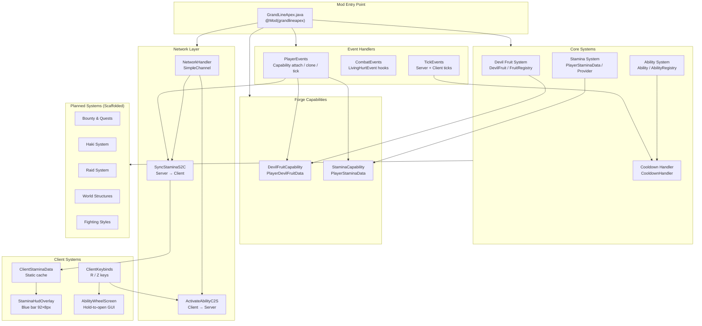

#### Core Technical Approach

GrandLineApex employs the following foundational technical patterns:

| Pattern | Implementation | Evidence |
|---|---|---|
| **Forge Capabilities** | Persistent player data (Devil Fruit state, Stamina) serialized via `CompoundTag` (NBT) | `PlayerDevilFruitProvider.java`, `PlayerStaminaProvider.java` |
| **Interface-Driven Design** | `DevilFruit` and `Ability` Java interfaces enabling extensible registration | `DevilFruit.java`, `Ability.java` |
| **Registry Pattern** | `HashMap<ResourceLocation, T>` singletons with duplicate-prevention | `FruitRegistry.java`, `AbilityRegistry.java` |
| **Event-Driven Architecture** | Forge `@Mod.EventBusSubscriber` for lifecycle and gameplay events | `PlayerEvents.java`, `TickEvents.java` |
| **Client-Server Packet Sync** | Forge `SimpleChannel` with typed S2C/C2S packets | `NetworkHandler.java`, `SyncStaminaS2C.java` |
| **Tiered Progression** | `AbilityTier` enum gating ability access by mastery level | `AbilityTier.java`, `Ability.java` |

### 1.2.3 Success Criteria

#### Measurable Objectives

| Objective | Target | Measurement Method |
|---|---|---|
| Devil Fruit roster completion | All four fruit types with multiple fruits per type registered | `FruitRegistry.all()` count per `FruitType` |
| Ability coverage | Abilities across all five tiers for each fruit | `AbilityRegistry` entries per tier |
| Stamina sync latency | State synchronized within 10 ticks (500ms) | `SyncStaminaS2C` dispatch interval in `PlayerEvents` |
| Cooldown accuracy | Per-ability cooldowns decrement correctly every server tick | `CooldownHandler.tick()` verification |

#### Critical Success Factors

1. **System Cohesion**: All subsystems (Devil Fruits, Haki, bounties, raids) must share a unified player data model through Forge capabilities, avoiding redundant or conflicting state.
2. **Small-Scale Performance**: The mod must maintain stable tick rates for 4–6 concurrent players, requiring efficient event handling, minimal per-tick network traffic, and lightweight data structures.
3. **Extensibility**: New Devil Fruits and abilities must be addable solely through registry calls (`FruitRegistry.register()`, `AbilityRegistry.register()`) without modifying core framework code.
4. **Progression Balance**: Mastery thresholds, stamina costs, cooldown durations, and ability damage values must produce a balanced survival experience across PvE and PvP scenarios.

#### Key Performance Indicators (KPIs)

| KPI | Target Value | Rationale |
|---|---|---|
| Server TPS (4–6 players) | ≥ 18 TPS sustained | Ensures smooth gameplay under target load |
| Stamina sync packet size | ≤ 8 bytes per dispatch | `SyncStaminaS2C` sends two floats (current + max) |
| Ability activation round-trip | < 100ms (client → server → execute) | `ActivateAbilityC2S` processing latency |
| Capability serialization overhead | < 1ms per player per save | NBT `CompoundTag` read/write for Devil Fruit + Stamina |
| Memory footprint (registries) | < 1MB for full fruit/ability registries | `HashMap`-based registries scale linearly |

---

## 1.3 Scope

### 1.3.1 In-Scope

#### Core Features and Functionalities

The following table enumerates all features within the scope of GrandLineApex, organized by system domain and implementation phase:

| Feature Domain | Must-Have Capabilities | Source Inspiration |
|---|---|---|
| **Devil Fruit System** | Interface-based fruit definitions; four fruit types (Paramecia, Zoan, Logia, Mythical Zoan); mastery progression; awakening at mastery ≥ 200; water and seastone weakness | True Prime Piece (system), Mine Mine no Mi (roster) |
| **Ability System** | Five-tier ability hierarchy (Passive → Awakening); stamina costs and cooldown management; mastery gating; AoE and targeted abilities | True Prime Piece |
| **Stamina & Energy** | 100-point stamina pool; 5/sec regeneration; server-authoritative state; client HUD rendering; NBT persistence | Original design |
| **Combat & Haki** | Armament, Observation, and Conqueror Haki types; damage modification hooks via `LivingHurtEvent`; mastery-scaled combat effects | True Prime Piece, MinePiece |
| **Bounty System** | Defeat-based bounty progression; tiered rewards; quest generation tied to exploration and raids; skill/stat unlocks | MinePiece |
| **Dynamic Raids** | Periodic escalating raids (East Blue → New World); difficulty scaling with player bounty and mastery; recruitable pirate crews and Marines | MinePiece |
| **World Structures** | Naturally spawning Marine Bases, Pirate Ships, Temples, villages, sunken ships; sea-based progression with compasses/teleports | MinePiece |
| **Fighting Styles** | Skill Selection Book; Brawler and Swordsman styles; chargeable abilities; energy management; bounty-integrated unlocks | MinePiece |
| **Boss Encounters** | Scripted boss fights with unique mechanics and GeckoLib-driven animations | True Prime Piece |
| **Ships & Naval Travel** | Player-built ships with physics and sea dynamics via Valkyrien Skies + Eureka! | Valkyrien Skies integration |
| **PvP & Crews** | World-border arenas; team mechanics (V key); fruit drops post-match | MinePiece |
| **Visuals & Animations** | Custom 3D animations via GeckoLib; entity scaling via Pehkui; player animations via PlayerAnimator; custom rendering via Kleiders | All reference mods |

#### Primary User Workflows

The core gameplay loop follows a progression-driven path that integrates all major subsystems:

```mermaid
flowchart LR
    subgraph EarlyGame["Early Game"]
        Explore["Explore World<br/>Find Structures"]
        FindFruit["Discover<br/>Devil Fruit"]
        EatFruit["Consume Fruit<br/>Gain Powers"]
    end

    subgraph MidGame["Mid Game"]
        MasterAbilities["Train Abilities<br/>Earn Mastery"]
        BuildBounty["Defeat Enemies<br/>Grow Bounty"]
        UnlockHaki["Unlock Haki<br/>via Bounty"]
    end

    subgraph LateGame["Late Game"]
        Awakening["Achieve<br/>Awakening"]
        Raids["Survive<br/>Escalating Raids"]
        BossEncounters["Challenge<br/>Bosses"]
    end

    Explore --> FindFruit
    FindFruit --> EatFruit
    EatFruit --> MasterAbilities
    MasterAbilities --> BuildBounty
    BuildBounty --> UnlockHaki
    UnlockHaki --> Awakening
    Awakening --> Raids
    Raids --> BossEncounters
```

#### Implementation Boundaries

| Boundary Dimension | Scope Definition |
|---|---|
| **Platform** | Minecraft Java Edition 1.20.1 only; MinecraftForge mod loader (version range `[47,)`) |
| **User Groups** | Single-player users; small cooperative groups of 4–6 players |
| **Language Runtime** | Java 17 (toolchain-enforced via `build.gradle`) |
| **Mapping Channel** | Mojang official mappings, version 1.20.1 |
| **Data Persistence** | Forge Capability system with NBT (`CompoundTag`) serialization |
| **Network Protocol** | Forge `SimpleChannel` with protocol version "1" |
| **Build System** | Gradle 8.8 with ForgeGradle `[6.0, 6.2)` plugin |
| **License** | All Rights Reserved (per `gradle.properties`) |

### 1.3.2 Out-of-Scope

#### Excluded Features and Capabilities

The following elements are explicitly excluded from the current scope of GrandLineApex:

| Exclusion | Rationale |
|---|---|
| **Large-Scale Server Support (>6 players)** | The architecture is optimized for 4–6 players; static `HashMap`-based registries and per-player cooldown maps are not designed for high-concurrency environments |
| **Cross-Mod Compatibility Layer** | No API is provided for third-party mods to extend GrandLineApex systems; integration is limited to declared library dependencies |
| **Full One Piece Storyline/Quest Chains** | The design philosophy emphasizes sandbox freedom with optional bounty-driven quests rather than a linear narrative |
| **Mobile / Console Platform Support** | Targets Minecraft Java Edition exclusively; Bedrock Edition and console ports are not supported |
| **Fabric / NeoForge Loader Support** | Built exclusively for MinecraftForge; no cross-loader abstraction is provided |
| **Mine Mine no Mi 1.16.5 Direct Port** | While inspired by its fruit roster, GrandLineApex does not perform a direct code port from 1.16.5; all systems are reimplemented for 1.20.1 |

#### Future Phase Considerations

The following features are architecturally anticipated (evidenced by stub classes in the codebase) but are reserved for future development phases:

| Future Phase | Scaffolded Evidence | Description |
|---|---|---|
| **Complete Haki Implementation** | `HakiManager.java`, `HakiType.java`, `ArmamentLogic.java`, `ConquerorLogic.java`, `ObservationLogic.java` | Full combat mechanics for three Haki types |
| **Raid System Activation** | `RaidManager.java`, `RaidSpawner.java`, `RaidDifficultyScaler.java`, `RaidType.java` | Dynamic raid events with bounty-scaled difficulty |
| **World Structure Generation** | `MarineBaseStructure.java`, `PirateShipStructure.java`, `TempleStructure.java` | Naturally spawning One Piece–themed locations |
| **Content Registry Population** | `ModItems.java`, `ModEntities.java`, `ModEffects.java`, `ModParticles.java`, `ModSounds.java`, `ModStructures.java` | Full item, entity, and effect registration via Forge deferred registries |
| **Additional Player Data** | `PlayerBountyData.java`, `PlayerCombatData.java`, `PlayerHakiData.java`, `PlayerStatsData.java` | Extended capability data for bounty, combat, Haki, and stat progression |
| **GUI Screens** | `HakiScreen`, `MasteryScreen` (referenced) | Dedicated management interfaces for Haki and mastery progression |
| **Energy System** | `EnergyHandler.java` (stub) | Expanded energy management beyond the current stamina/cooldown framework |

#### Integration Points Not Covered

- **Cloth Config API**: Used by Mine Mine no Mi for configuration; not adopted by GrandLineApex (no configuration GUI framework is currently scoped).
- **Curios API**: Used by Mine Mine no Mi for accessory slots; not integrated in the current design.
- **External Database / Analytics**: No telemetry, analytics, or external data persistence systems are scoped.

---

## 1.4 Document Conventions

Throughout this Technical Specification, the following conventions apply:

| Convention | Description |
|---|---|
| **File paths** | Relative to the repository root (e.g., `forge-1.20.1-47.4.10-mdk/src/main/java/...`) |
| **Package names** | Fully qualified Java package notation (e.g., `com.grandlineapex.devilfruit`) |
| **Implementation status** | "Implemented" = functional code; "Stub/placeholder" = class exists with empty or minimal logic |
| **Version references** | Minecraft versions use Mojang notation; Forge versions use the `major.minor.patch` scheme |

---

## 1.5 References

#### Files Examined

- `forge-1.20.1-47.4.10-mdk/src/main/java/com/grandlineapex/GrandLineApex.java` — Mod entry point; MODID definition and initialization
- `forge-1.20.1-47.4.10-mdk/gradle.properties` — Minecraft/Forge versions, mod metadata, license declaration
- `forge-1.20.1-47.4.10-mdk/build.gradle` — Build configuration; Java 17 toolchain, ForgeGradle plugin, dependency declarations
- `forge-1.20.1-47.4.10-mdk/src/main/resources/META-INF/mods.toml` — Mod loader metadata and dependency declarations
- `forge-1.20.1-47.4.10-mdk/gradle/wrapper/gradle-wrapper.properties` — Gradle 8.8 wrapper configuration
- `forge-1.20.1-47.4.10-mdk/src/main/java/com/grandlineapex/devilfruit/DevilFruit.java` — Devil Fruit interface definition
- `forge-1.20.1-47.4.10-mdk/src/main/java/com/grandlineapex/devilfruit/FruitType.java` — Fruit type enumeration (Paramecia, Zoan, Logia, Mythical Zoan)
- `forge-1.20.1-47.4.10-mdk/src/main/java/com/grandlineapex/devilfruit/FruitRegistry.java` — HashMap-based fruit registration with duplicate prevention
- `forge-1.20.1-47.4.10-mdk/src/main/java/com/grandlineapex/devilfruit/TestFruit.java` — Test Paramecia fruit implementation
- `forge-1.20.1-47.4.10-mdk/src/main/java/com/grandlineapex/devilfruit/abilities/Ability.java` — Ability interface with tier, cooldown, stamina, and mastery contracts
- `forge-1.20.1-47.4.10-mdk/src/main/java/com/grandlineapex/devilfruit/abilities/AbilityTier.java` — Five-tier ability enumeration
- `forge-1.20.1-47.4.10-mdk/src/main/java/com/grandlineapex/devilfruit/abilities/AbilityRegistry.java` — HashMap-based ability registration
- `forge-1.20.1-47.4.10-mdk/src/main/java/com/grandlineapex/devilfruit/abilities/AbilityBootstrap.java` — Bootstrap initialization registering T1_Jab
- `forge-1.20.1-47.4.10-mdk/src/main/java/com/grandlineapex/devilfruit/abilities/impl/T1_Jab.java` — Concrete T1 ability (3-block range, 40-tick cooldown, 8 stamina cost)
- `forge-1.20.1-47.4.10-mdk/src/main/java/com/grandlineapex/network/NetworkHandler.java` — Forge SimpleChannel setup (protocol "1")
- `forge-1.20.1-47.4.10-mdk/src/main/java/com/grandlineapex/network/packets/SyncStaminaS2C.java` — Server-to-client stamina synchronization packet
- `forge-1.20.1-47.4.10-mdk/src/main/java/com/grandlineapex/network/packets/ActivateAbilityC2S.java` — Client-to-server ability activation packet
- `forge-1.20.1-47.4.10-mdk/src/main/java/com/grandlineapex/capability/CapabilityRegistry.java` — Forge capability registration
- `forge-1.20.1-47.4.10-mdk/src/main/java/com/grandlineapex/capability/devilfruit/DevilFruitCapability.java` — Devil Fruit capability token
- `forge-1.20.1-47.4.10-mdk/src/main/java/com/grandlineapex/capability/devilfruit/PlayerDevilFruitData.java` — Devil Fruit player data holder
- `forge-1.20.1-47.4.10-mdk/src/main/java/com/grandlineapex/capability/devilfruit/PlayerDevilFruitProvider.java` — Devil Fruit capability provider with NBT serialization
- `forge-1.20.1-47.4.10-mdk/src/main/java/com/grandlineapex/systems/stamina/PlayerStaminaData.java` — Stamina data (100f default, 5f/sec regen)
- `forge-1.20.1-47.4.10-mdk/src/main/java/com/grandlineapex/systems/stamina/StaminaCapability.java` — Stamina capability token
- `forge-1.20.1-47.4.10-mdk/src/main/java/com/grandlineapex/systems/stamina/PlayerStaminaProvider.java` — Stamina capability provider
- `forge-1.20.1-47.4.10-mdk/src/main/java/com/grandlineapex/combat/energy/CooldownHandler.java` — Static HashMap-based cooldown management
- `forge-1.20.1-47.4.10-mdk/src/main/java/com/grandlineapex/combat/energy/EnergyHandler.java` — Energy management stub
- `forge-1.20.1-47.4.10-mdk/src/main/java/com/grandlineapex/events/PlayerEvents.java` — Player capability attachment, clone, tick, and fruit assignment events
- `forge-1.20.1-47.4.10-mdk/src/main/java/com/grandlineapex/events/CombatEvents.java` — Combat event hooks for damage modification
- `forge-1.20.1-47.4.10-mdk/src/main/java/com/grandlineapex/core/hooks/TickEvents.java` — Server and client tick event handlers
- `forge-1.20.1-47.4.10-mdk/src/main/java/com/grandlineapex/client/ClientSetup.java` — Client overlay registration
- `forge-1.20.1-47.4.10-mdk/src/main/java/com/grandlineapex/client/ClientKeybinds.java` — R and Z key registrations
- `forge-1.20.1-47.4.10-mdk/src/main/java/com/grandlineapex/client/ClientStaminaData.java` — Client-side stamina cache
- `forge-1.20.1-47.4.10-mdk/src/main/java/com/grandlineapex/client/hud/StaminaHudOverlay.java` — Stamina HUD renderer (blue bar, 92×8px)
- `forge-1.20.1-47.4.10-mdk/src/main/java/com/grandlineapex/client/hud/AbilityWheelScreen.java` — Ability wheel GUI screen

#### Folders Examined

- `references/` — Reference mod distributions (MinePiece, Mine Mine no Mi, True Prime Piece Two)
- `forge-1.20.1-47.4.10-mdk/src/main/java/com/grandlineapex/` — Root mod package containing all subsystem packages
- `forge-1.20.1-47.4.10-mdk/src/main/java/com/grandlineapex/bounty/` — Bounty system stubs (BountyManager, BountyRewardHandler, BountyTier, quest/)
- `forge-1.20.1-47.4.10-mdk/src/main/java/com/grandlineapex/haki/` — Haki system stubs (HakiManager, HakiType, logic classes)
- `forge-1.20.1-47.4.10-mdk/src/main/java/com/grandlineapex/raid/` — Raid system stubs (RaidManager, RaidSpawner, RaidDifficultyScaler, RaidType)
- `forge-1.20.1-47.4.10-mdk/src/main/java/com/grandlineapex/world/` — World structure stubs (MarineBase, PirateShip, Temple)
- `forge-1.20.1-47.4.10-mdk/src/main/java/com/grandlineapex/combat/styles/` — Fighting style stubs (BrawlerStyle, SwordsmanStyle)
- `forge-1.20.1-47.4.10-mdk/src/main/java/com/grandlineapex/registry/` — Forge deferred registry stubs (ModItems, ModEntities, ModEffects, ModParticles, ModSounds, ModStructures)

#### External Sources

- [MinecraftForge Downloads for 1.20.1](https://files.minecraftforge.net/net/minecraftforge/forge/index_1.20.1.html) — Confirmed Forge 47.4.10 as recommended version for Minecraft 1.20.1
- [GeckoLib GitHub Repository](https://github.com/bernie-g/geckolib) — Animation and rendering engine documentation and availability for Forge 1.20.1

# 2. Product Requirements

## 2.1 Feature Catalog

### 2.1.1 Feature Summary

The following table provides a consolidated overview of all GrandLineApex features, cataloged from source code packages, technical specification scope (Section 1.3), and build configuration evidence. Each feature is assigned a unique identifier, priority level, and current implementation status based on codebase evidence.

| Feature ID | Feature Name | Priority | Status |
|---|---|---|---|
| F-001 | Devil Fruit System | Critical | In Development |
| F-002 | Ability System | Critical | In Development |
| F-003 | Stamina & Energy System | Critical | In Development |
| F-004 | Combat & Haki System | Critical | Approved |
| F-005 | Bounty System & Quests | High | Approved |
| F-006 | Dynamic Raid System | High | Approved |
| F-007 | World Structures & Generation | High | Approved |
| F-008 | Fighting Styles & Skills | Medium | Approved |
| F-009 | Boss Encounters | Medium | Proposed |
| F-010 | Ships & Naval Travel | Medium | Proposed |
| F-011 | PvP & Crews | Medium | Proposed |
| F-012 | Visuals & Animations | High | Proposed |
| F-013 | Client HUD & GUI System | Critical | In Development |
| F-014 | Client-Server Networking | Critical | In Development |
| F-015 | Forge Registry System | Critical | Approved |

> **Status Definitions** (per Section 1.4 conventions): **In Development** — functional code exists with partial implementation; **Approved** — class scaffolding exists with empty or minimal logic, architecture committed; **Proposed** — design defined in specification, no dedicated code yet.

### 2.1.2 Critical Priority Features

#### Feature F-001: Devil Fruit System

| Attribute | Detail |
|---|---|
| **Feature ID** | F-001 |
| **Feature Name** | Devil Fruit System |
| **Category** | Core Gameplay |
| **Priority** | Critical |
| **Status** | In Development |

**Overview**: The Devil Fruit System forms the central identity mechanic of GrandLineApex, allowing players to discover, consume, and master supernatural abilities drawn from the One Piece universe. The system is architected as an interface-driven, registry-managed framework enabling extensible fruit registration without modifying core code. It draws its systemic architecture from True Prime Piece Two and its fruit roster ambitions from Mine Mine no Mi.

**Business Value**: Serves as the primary differentiating mechanic and the foundational system upon which mastery progression, ability unlocks, awakening, and combat specialization are built. Consolidates fragmented One Piece fruit systems from multiple mods into a single, balanced implementation on Minecraft 1.20.1.

**User Benefits**: Players gain access to a comprehensive roster of Devil Fruits across four types (Paramecia, Zoan, Logia, Mythical Zoan), each with unlockable abilities, persistent mastery tracking, and an awakening system that rewards long-term investment. Fruit state persists across sessions via NBT serialization.

**Technical Context**: Implemented within the `com.grandlineapex.devilfruit` package using `DevilFruit.java` as the interface contract, `FruitType.java` as the four-type enum, and `FruitRegistry.java` as the `HashMap`-based singleton registry with duplicate prevention. Player state is managed through `PlayerDevilFruitData.java` in the capability system, persisted via `DevilFruitStorage.java` using `CompoundTag` keys (`fruitId`, `mastery`, `awakened`), and attached to player entities through `CapabilityAttacher.java` under `ResourceLocation("grandlineapex:devil_fruit_data")`. A `TestFruit.java` class demonstrates Paramecia-type fruit implementation.

| Dependency Type | Details |
|---|---|
| **Prerequisite Features** | F-015 (Registry System for item registration) |
| **System Dependencies** | Forge Capability API, NBT CompoundTag |
| **External Dependencies** | MinecraftForge 47.4.10 |
| **Integration Requirements** | F-002 (Ability System), F-003 (Stamina), F-014 (Networking for state sync) |

---

#### Feature F-002: Ability System

| Attribute | Detail |
|---|---|
| **Feature ID** | F-002 |
| **Feature Name** | Ability System |
| **Category** | Core Gameplay |
| **Priority** | Critical |
| **Status** | In Development |

**Overview**: The Ability System provides the tiered power framework for Devil Fruit abilities, governing how players acquire, activate, and progress through combat techniques. Inspired by True Prime Piece Two's mastery-driven design, it implements a five-tier hierarchy from passive effects to awakened powers.

**Business Value**: Delivers the primary combat engagement loop by ensuring abilities scale with player investment. The tier system creates natural progression milestones and provides content depth across early, mid, and late game phases.

**User Benefits**: Players unlock progressively more powerful abilities as their mastery increases, with each tier offering distinct gameplay mechanics (passive buffs, active attacks, AoE effects, awakened transformations). Stamina costs and cooldowns provide tactical decision-making.

**Technical Context**: Defined within `com.grandlineapex.devilfruit.abilities` using `Ability.java` as the interface (contracts for tier, cooldown, stamina cost, mastery requirement), `AbilityTier.java` as the five-level enum (`PASSIVE`, `T1`, `T2`, `T3`, `AWAKENING`), and `AbilityRegistry.java` for `HashMap`-based registration. `AbilityBootstrap.java` handles initialization, and `T1_Jab.java` provides a concrete implementation (3-block range, 40-tick cooldown, 8 stamina cost). Cooldowns are managed by `CooldownHandler.java` in `combat.energy` using per-player UUID-keyed `HashMap` storage.

| Dependency Type | Details |
|---|---|
| **Prerequisite Features** | F-001 (Devil Fruit System — fruits contain abilities) |
| **System Dependencies** | Forge event bus for tick-driven cooldown decrement |
| **External Dependencies** | MinecraftForge 47.4.10 |
| **Integration Requirements** | F-003 (Stamina for cost deduction), F-014 (Networking for C2S activation) |

---

#### Feature F-003: Stamina & Energy System

| Attribute | Detail |
|---|---|
| **Feature ID** | F-003 |
| **Feature Name** | Stamina & Energy System |
| **Category** | Core Gameplay |
| **Priority** | Critical |
| **Status** | In Development |

**Overview**: The Stamina & Energy System provides the resource management layer that governs ability usage across all combat and power systems. It is an original design, server-authoritative, with client-side HUD rendering and periodic network synchronization.

**Business Value**: Prevents ability spam and creates tactical resource management, balancing PvE and PvP encounters. Server-authoritative design prevents client-side exploitation.

**User Benefits**: Players manage a clearly displayed stamina pool that regenerates naturally, allowing strategic ability usage without permanent resource depletion. The HUD overlay provides real-time feedback.

**Technical Context**: Implemented via `PlayerStaminaData.java` (100-point pool, 5/sec regen), `StaminaCapability.java` token, and `PlayerStaminaProvider.java` with NBT serialization. The `EnergyHandler.java` in `combat.energy` provides complementary management with `MAX_ENERGY = 100`. Synchronization occurs every 10 ticks (500ms) through `SyncStaminaS2C` packets dispatched via `NetworkHandler.java`. Client-side state is cached in `ClientStaminaData.java` and rendered by `StaminaHudOverlay.java` as a blue bar (92×8 pixels) positioned above the hotbar.

| Dependency Type | Details |
|---|---|
| **Prerequisite Features** | F-014 (Networking for S2C sync) |
| **System Dependencies** | Forge Capability API, server tick events |
| **External Dependencies** | MinecraftForge 47.4.10 |
| **Integration Requirements** | F-002 (Ability System consumes stamina), F-013 (HUD displays stamina) |

---

#### Feature F-004: Combat & Haki System

| Attribute | Detail |
|---|---|
| **Feature ID** | F-004 |
| **Feature Name** | Combat & Haki System |
| **Category** | Combat |
| **Priority** | Critical |
| **Status** | Approved |

**Overview**: The Combat & Haki System implements the three canonical Haki types (Armament, Observation, Conqueror) along with a centralized combat management framework. Inspired by both True Prime Piece Two and MinePiece, it integrates damage modification hooks with mastery-scaled combat effects.

**Business Value**: Provides the core combat differentiation beyond Devil Fruit powers, enabling non-fruit-user viability and adding depth to PvE and PvP encounters. Haki progression tied to bounty creates a unified advancement system.

**User Benefits**: Players unlock Haki abilities through bounty progression, adding defensive (Armament), perceptive (Observation), and offensive (Conqueror) capabilities that scale with mastery. Combat feels rewarding as damage output visibly increases with progression.

**Technical Context**: Scaffolded across `com.grandlineapex.haki` with `HakiManager.java` for central management, `HakiType.java` for classification, and dedicated logic classes (`ArmamentLogic.java`, `ConquerorLogic.java`, `ObservationLogic.java`) in sub-packages. Combat foundations reside in `CombatManager.java` and `FightingStyle.java` (both stubs). `CombatEvents.java` is wired to `@Mod.EventBusSubscriber` with an empty `LivingHurtEvent` handler ready for damage modification logic. Player state tracked via `PlayerHakiData.java` and `PlayerCombatData.java` capability stubs, with `SyncHakiPacket.java` prepared for client-server sync. `HakiScreen.java` provides the planned GUI entry point.

| Dependency Type | Details |
|---|---|
| **Prerequisite Features** | F-005 (Bounty for Haki unlock gating) |
| **System Dependencies** | Forge event bus (`LivingHurtEvent`), Capability API |
| **External Dependencies** | MinecraftForge 47.4.10 |
| **Integration Requirements** | F-003 (Stamina for Haki activation cost), F-014 (Networking for Haki sync) |

---

#### Feature F-013: Client HUD & GUI System

| Attribute | Detail |
|---|---|
| **Feature ID** | F-013 |
| **Feature Name** | Client HUD & GUI System |
| **Category** | Client Systems |
| **Priority** | Critical |
| **Status** | In Development |

**Overview**: The Client HUD & GUI System provides all player-facing interface elements, including real-time overlay rendering, ability management screens, and Haki/mastery progression displays. It bridges the gap between server-side state and player-visible feedback.

**Business Value**: Ensures players can effectively monitor and manage all gameplay systems through intuitive visual interfaces, directly impacting player experience quality.

**User Benefits**: Real-time stamina feedback, hold-to-open ability selection, and dedicated management screens for Haki and mastery progression. Keybind-driven interaction (R and Z keys) provides fast, immersive access.

**Technical Context**: `ClientSetup.java` serves as the client-side initialization anchor, registering overlays and keybinds. `StaminaHudOverlay.java` renders the stamina bar (blue, 92×8 pixels above hotbar) using cached state from `ClientStaminaData.java`. `ClientKeybinds.java` registers R and Z key mappings. GUI screens include `AbilityWheelScreen.java` (hold-to-open ability selection), `HakiScreen.java` (Haki management), and `MasteryScreen.java` (mastery progression), the latter two currently stubbed.

| Dependency Type | Details |
|---|---|
| **Prerequisite Features** | F-003 (Stamina data for HUD), F-002 (Ability data for wheel) |
| **System Dependencies** | Forge client overlay registration, Minecraft GUI framework |
| **External Dependencies** | MinecraftForge 47.4.10 client-side APIs |
| **Integration Requirements** | F-014 (receives S2C packets for display), F-004 (Haki screen data) |

---

#### Feature F-014: Client-Server Networking

| Attribute | Detail |
|---|---|
| **Feature ID** | F-014 |
| **Feature Name** | Client-Server Networking |
| **Category** | Infrastructure |
| **Priority** | Critical |
| **Status** | In Development |

**Overview**: The Client-Server Networking layer provides bidirectional packet communication between client and server using Forge's `SimpleChannel` API. It underpins all real-time state synchronization across Devil Fruit, stamina, Haki, and ability systems.

**Business Value**: Enables multiplayer functionality (4–6 player co-op target) by ensuring authoritative server state is consistently reflected on all clients, preventing desynchronization and exploitation.

**User Benefits**: Players experience responsive ability activation and accurate state display in both single-player and multiplayer contexts. The 10-tick sync interval ensures near-real-time stamina feedback.

**Technical Context**: `NetworkHandler.java` initializes a Forge `SimpleChannel` on `grandlineapex:main` with protocol version `"1"`. The `register()` method is invoked from the mod constructor in `GrandLineApex.java`. Packet stubs include `SyncStaminaS2C` (server→client stamina), `ActivateAbilityC2S` (client→server ability activation), `SyncFruitPacket.java` (fruit state sync), and `SyncHakiPacket.java` (Haki state sync) in the `com.grandlineapex.network.packets` package.

| Dependency Type | Details |
|---|---|
| **Prerequisite Features** | None (foundational infrastructure) |
| **System Dependencies** | Forge `SimpleChannel` API, Minecraft netty pipeline |
| **External Dependencies** | MinecraftForge 47.4.10 |
| **Integration Requirements** | F-001, F-003, F-004 (data sources for sync packets) |

---

#### Feature F-015: Forge Registry System

| Attribute | Detail |
|---|---|
| **Feature ID** | F-015 |
| **Feature Name** | Forge Registry System |
| **Category** | Infrastructure |
| **Priority** | Critical |
| **Status** | Approved |

**Overview**: The Forge Registry System provides centralized, deferred registration for all Minecraft game content types (items, entities, effects, particles, sounds, structures). It integrates with Forge's built-in registry events to ensure correct mod loading order.

**Business Value**: Establishes the content registration foundation upon which all gameplay features depend for their items, entities, and effects to exist within the Minecraft runtime.

**User Benefits**: Ensures all mod content (Devil Fruits as items, custom entities, visual effects, sounds) loads reliably and is accessible in-game.

**Technical Context**: Six registry stub classes in `com.grandlineapex.registry`: `ModItems.java`, `ModEntities.java`, `ModEffects.java`, `ModParticles.java`, `ModSounds.java`, and `ModStructures.java`. All are currently empty stubs awaiting content population as features mature.

| Dependency Type | Details |
|---|---|
| **Prerequisite Features** | None (foundational infrastructure) |
| **System Dependencies** | Forge deferred registry API |
| **External Dependencies** | MinecraftForge 47.4.10 |
| **Integration Requirements** | All gameplay features (F-001 through F-012) |

---

### 2.1.3 High Priority Features

#### Feature F-005: Bounty System & Quests

| Attribute | Detail |
|---|---|
| **Feature ID** | F-005 |
| **Feature Name** | Bounty System & Quests |
| **Category** | Progression |
| **Priority** | High |
| **Status** | Approved |

**Overview**: The Bounty System tracks player reputation through defeat-based progression, providing tiered rewards and gating access to advanced mechanics such as Haki unlocks, skill upgrades, and stat increases. Quest generation provides optional structured objectives tied to exploration and raid events. Inspired by MinePiece's bounty-driven gameplay loop.

**Business Value**: Creates the primary long-term progression incentive and ties all combat, exploration, and raid systems into a unified advancement model. Provides "sandbox with goals" design philosophy.

**User Benefits**: Players see tangible progression through increasing bounty tiers, unlocking new abilities, Haki types, and stats as rewards. Optional quests add structured objectives without removing sandbox freedom.

**Technical Context**: Scaffolded in `com.grandlineapex.bounty` with `BountyManager.java`, `BountyRewardHandler.java`, `BountyTier.java`, and a `quest` sub-package containing `BountyQuest.java` and `QuestGenerator.java`. Player state managed via `PlayerBountyData.java` capability stub. All classes are currently empty stubs.

| Dependency Type | Details |
|---|---|
| **Prerequisite Features** | F-015 (Registry for quest items) |
| **System Dependencies** | Forge Capability API for persistence |
| **External Dependencies** | None |
| **Integration Requirements** | F-004 (Haki unlock gating), F-006 (Raid-tied quests), F-008 (Style unlocks) |

---

#### Feature F-006: Dynamic Raid System

| Attribute | Detail |
|---|---|
| **Feature ID** | F-006 |
| **Feature Name** | Dynamic Raid System |
| **Category** | World & Events |
| **Priority** | High |
| **Status** | Approved |

**Overview**: The Dynamic Raid System introduces periodic, escalating combat encounters across sea regions (East Blue through New World), with difficulty that scales based on player bounty and mastery levels. Raids feature recruitable NPC factions (pirate crews and Marines). Inspired by MinePiece's raid mechanics.

**Business Value**: Provides replayable endgame PvE content that dynamically responds to player progression, preventing stagnation and encouraging continued mastery development.

**User Benefits**: Players face increasingly challenging waves of enemies that match their skill level, with opportunities to recruit allies and earn raid-specific rewards.

**Technical Context**: Scaffolded in `com.grandlineapex.raid` with `RaidManager.java` (orchestration), `RaidSpawner.java` (enemy spawning), `RaidDifficultyScaler.java` (scaling logic), and `RaidType.java` (classification). All are currently empty stubs.

| Dependency Type | Details |
|---|---|
| **Prerequisite Features** | F-007 (World Structures for raid locations) |
| **System Dependencies** | Forge entity spawning, world tick events |
| **External Dependencies** | None |
| **Integration Requirements** | F-005 (Bounty for difficulty scaling), F-015 (Entity registration for NPCs) |

---

#### Feature F-007: World Structures & Generation

| Attribute | Detail |
|---|---|
| **Feature ID** | F-007 |
| **Feature Name** | World Structures & Generation |
| **Category** | World & Events |
| **Priority** | High |
| **Status** | Approved |

**Overview**: The World Structures system populates the Minecraft world with naturally spawning One Piece–themed locations including Marine Bases, Pirate Ships, Temples, villages, and sunken ships. Sea-based progression with compasses and teleports enables thematic world navigation. Inspired by MinePiece's world-building.

**Business Value**: Transforms the vanilla Minecraft world into an immersive One Piece environment, providing exploration targets, Devil Fruit discovery locations, and raid staging areas.

**User Benefits**: Players encounter diverse One Piece–themed locations during exploration, each offering unique loot, encounters, and quest opportunities aligned with the early-game progression loop.

**Technical Context**: Scaffolded in `com.grandlineapex.world.structure` with `MarineBaseStructure.java`, `PirateShipStructure.java`, and `TempleStructure.java`. Registration handled via `ModStructures.java` in the registry package. `WorldEvents.java` stub exists in the events package for world generation hooks. All are currently empty stubs.

| Dependency Type | Details |
|---|---|
| **Prerequisite Features** | F-015 (Structure registration via ModStructures) |
| **System Dependencies** | Forge structure generation API |
| **External Dependencies** | None |
| **Integration Requirements** | F-006 (Raid location targets), F-010 (Naval navigation destinations) |

---

#### Feature F-012: Visuals & Animations

| Attribute | Detail |
|---|---|
| **Feature ID** | F-012 |
| **Feature Name** | Visuals & Animations |
| **Category** | Client Systems |
| **Priority** | High |
| **Status** | Proposed |

**Overview**: The Visuals & Animations system provides custom 3D animations, entity scaling, player model rendering, and visual effects for all gameplay systems. It depends entirely on external library integrations derived from the reference mods' dependency graphs.

**Business Value**: Elevates the visual fidelity of fruit transformations, Haki effects, combat techniques, and boss encounters to a level comparable with the reference mods, creating a polished user experience.

**User Benefits**: Players see smooth, high-quality animations for abilities, transformations, and combat effects that bring the One Piece fantasy to life within Minecraft.

**Technical Context**: No dedicated code package exists yet. Integration is planned with four external libraries: GeckoLib (3D keyframe animation engine — mandatory dependency of MinePiece), Pehkui (entity scaling for fruit transformations — optional dependency of True Prime Piece Two), PlayerAnimator (custom player animations — dependency of both reference mods), and Kleiders Custom Renderer (custom player model rendering — dependency of both reference mods).

| Dependency Type | Details |
|---|---|
| **Prerequisite Features** | None |
| **System Dependencies** | Minecraft rendering pipeline |
| **External Dependencies** | GeckoLib, Pehkui, PlayerAnimator, Kleiders Custom Renderer |
| **Integration Requirements** | F-001 (fruit visual effects), F-004 (Haki effects), F-009 (boss animations) |

---

### 2.1.4 Medium Priority Features

#### Feature F-008: Fighting Styles & Skills

| Attribute | Detail |
|---|---|
| **Feature ID** | F-008 |
| **Feature Name** | Fighting Styles & Skills |
| **Category** | Combat |
| **Priority** | Medium |
| **Status** | Approved |

**Overview**: Implements distinct combat archetypes (Brawler, Swordsman) with a Skill Selection Book interface, chargeable abilities, and bounty-integrated unlock progression. Inspired by MinePiece's fighting style system.

**Technical Context**: Scaffolded in `com.grandlineapex.combat.styles` with `BrawlerStyle.java` and `SwordsmanStyle.java`, both empty stubs extending the conceptual `FightingStyle.java` base in `com.grandlineapex.combat`.

| Dependency Type | Details |
|---|---|
| **Prerequisite Features** | F-005 (Bounty for style unlocks) |
| **System Dependencies** | Forge Capability API |
| **External Dependencies** | None |
| **Integration Requirements** | F-003 (Energy management), F-015 (Item registration for Skill Book) |

---

#### Feature F-009: Boss Encounters

| Attribute | Detail |
|---|---|
| **Feature ID** | F-009 |
| **Feature Name** | Boss Encounters |
| **Category** | Combat |
| **Priority** | Medium |
| **Status** | Proposed |

**Overview**: Provides scripted boss fights with unique mechanics and GeckoLib-driven animations. Represents the pinnacle of the late-game progression loop. Inspired by True Prime Piece Two.

**Technical Context**: No dedicated package or stub classes exist. Design intent is defined in the technical specification scope (Section 1.3.1) and user context. Implementation depends on GeckoLib integration (F-012) and entity registration (F-015).

| Dependency Type | Details |
|---|---|
| **Prerequisite Features** | F-012 (GeckoLib animations), F-015 (Entity registration) |
| **System Dependencies** | Forge entity AI, GeckoLib animation controller |
| **External Dependencies** | GeckoLib |
| **Integration Requirements** | F-004 (Combat mechanics), F-006 (Raid-tier boss spawning) |

---

#### Feature F-010: Ships & Naval Travel

| Attribute | Detail |
|---|---|
| **Feature ID** | F-010 |
| **Feature Name** | Ships & Naval Travel |
| **Category** | World & Events |
| **Priority** | Medium |
| **Status** | Proposed |

**Overview**: Enables player-built ships with physics-based navigation and sea dynamics using Valkyrien Skies and Eureka! integration. Connects world structure locations for thematic sea-based progression.

**Technical Context**: No dedicated package exists. Implementation is entirely dependent on Valkyrien Skies + Eureka! external library integration. Planned to be compatible with world progression and structure discovery (F-007).

| Dependency Type | Details |
|---|---|
| **Prerequisite Features** | F-007 (Navigation destinations) |
| **System Dependencies** | Valkyrien Skies physics engine |
| **External Dependencies** | Valkyrien Skies, Eureka! |
| **Integration Requirements** | F-007 (World Structures), F-015 (Ship block registration) |

---

#### Feature F-011: PvP & Crews

| Attribute | Detail |
|---|---|
| **Feature ID** | F-011 |
| **Feature Name** | PvP & Crews |
| **Category** | Player Interaction |
| **Priority** | Medium |
| **Status** | Proposed |

**Overview**: Provides structured PvP through world-border arenas, crew/team mechanics (V key binding), and fruit drops as post-match rewards. Inspired by MinePiece's multiplayer systems, optimized for 4–6 players.

**Technical Context**: No dedicated package or stub classes exist. Design defined in technical specification scope. Depends on the combat framework (F-004), networking (F-014), and Devil Fruit system (F-001) for fruit drop mechanics.

| Dependency Type | Details |
|---|---|
| **Prerequisite Features** | F-004 (Combat mechanics), F-014 (Multiplayer sync) |
| **System Dependencies** | Forge world border API, team management |
| **External Dependencies** | None |
| **Integration Requirements** | F-001 (Fruit drops), F-003 (Stamina in PvP), F-005 (Bounty from PvP) |

---

## 2.2 Functional Requirements

### 2.2.1 Devil Fruit System Requirements (F-001)

#### Requirement Details

| Req ID | Description | Priority | Complexity |
|---|---|---|---|
| F-001-RQ-001 | Provide interface-based fruit definition contract | Must-Have | Medium |
| F-001-RQ-002 | Classify fruits into four types via enum | Must-Have | Low |
| F-001-RQ-003 | Register fruits via HashMap with duplicate prevention | Must-Have | Medium |
| F-001-RQ-004 | Track mastery progression per player per fruit | Must-Have | Medium |
| F-001-RQ-005 | Trigger awakening state when mastery ≥ 200 | Must-Have | Medium |
| F-001-RQ-006 | Apply water and seastone weakness defaults | Should-Have | Medium |
| F-001-RQ-007 | Persist fruit state via NBT CompoundTag | Must-Have | High |
| F-001-RQ-008 | Synchronize fruit state to client via network packet | Must-Have | High |

#### Acceptance Criteria

| Req ID | Acceptance Criteria |
|---|---|
| F-001-RQ-001 | `DevilFruit.java` interface is implemented by fruit classes; `TestFruit.java` demonstrates valid implementation |
| F-001-RQ-002 | `FruitType.java` enum contains exactly PARAMECIA, ZOAN, LOGIA, MYTHICAL_ZOAN values |
| F-001-RQ-003 | `FruitRegistry.register()` accepts a fruit; duplicate `ResourceLocation` keys are rejected |
| F-001-RQ-004 | `PlayerDevilFruitData.addMastery()` increments mastery; `getMastery()` returns current value |
| F-001-RQ-005 | When `mastery ≥ 200`, `awakened` flag transitions to `true`; abilities at `AWAKENING` tier become available |
| F-001-RQ-006 | Players in water or near seastone receive debuffs defined by the fruit's weakness contract |
| F-001-RQ-007 | `DevilFruitStorage.java` writes/reads CompoundTag with keys `fruitId`, `mastery`, `awakened`; data survives save/reload |
| F-001-RQ-008 | `SyncFruitPacket.java` transmits fruit state S2C; client reflects correct fruit ID and mastery |

#### Technical Specifications

| Req ID | Input / Parameters | Output / Response |
|---|---|---|
| F-001-RQ-001 | Implementing class providing type, abilities list, weakness | Registered fruit accessible via registry |
| F-001-RQ-003 | `ResourceLocation` key + `DevilFruit` instance | Boolean success/failure; log on duplicate |
| F-001-RQ-004 | Integer mastery increment value | Updated mastery in `PlayerDevilFruitData` |
| F-001-RQ-005 | Mastery value checked against threshold (200) | Boolean `awakened` state transition |
| F-001-RQ-007 | `CompoundTag` with serialized state | Persisted player data across sessions |
| F-001-RQ-008 | Serialized fruit state (fruitId, mastery, awakened) | Client-side data cache updated |

#### Validation Rules

| Rule Category | Requirement |
|---|---|
| **Business Rules** | A player may hold at most one Devil Fruit at a time; consuming a second fruit is prohibited |
| **Data Validation** | `fruitId` must correspond to a registered entry in `FruitRegistry`; mastery must be non-negative |
| **Security** | Fruit assignment must be server-authoritative; clients cannot directly modify `PlayerDevilFruitData` |
| **Performance** | Capability serialization overhead < 1ms per player per save cycle |

---

### 2.2.2 Ability System Requirements (F-002)

#### Requirement Details

| Req ID | Description | Priority | Complexity |
|---|---|---|---|
| F-002-RQ-001 | Define five-tier ability hierarchy via enum | Must-Have | Low |
| F-002-RQ-002 | Enforce stamina cost per ability activation | Must-Have | Medium |
| F-002-RQ-003 | Manage per-ability cooldowns with tick-based decrement | Must-Have | Medium |
| F-002-RQ-004 | Gate ability access by mastery level | Must-Have | Medium |
| F-002-RQ-005 | Support AoE and targeted ability types | Should-Have | High |
| F-002-RQ-006 | Register abilities via HashMap with unique IDs | Must-Have | Medium |
| F-002-RQ-007 | Activate abilities via C2S network packet | Must-Have | High |

#### Acceptance Criteria

| Req ID | Acceptance Criteria |
|---|---|
| F-002-RQ-001 | `AbilityTier.java` contains PASSIVE, T1, T2, T3, AWAKENING; each tier is queryable |
| F-002-RQ-002 | Ability activation deducts stamina cost (e.g., T1_Jab costs 8 stamina); activation fails if insufficient stamina |
| F-002-RQ-003 | `CooldownHandler.setCooldown()` starts countdown; `isOnCooldown()` returns true until ticks expire; `tickCooldowns()` decrements per server tick |
| F-002-RQ-004 | Abilities with mastery requirements above player's current mastery are locked and cannot be activated |
| F-002-RQ-005 | AoE abilities affect entities within defined radius; targeted abilities require ray-cast or entity targeting |
| F-002-RQ-006 | `AbilityRegistry.register()` stores abilities; `AbilityBootstrap` registers `T1_Jab` at initialization |
| F-002-RQ-007 | `ActivateAbilityC2S` packet sent on keybind; server validates stamina, cooldown, and mastery before execution |

#### Technical Specifications

| Req ID | Input / Parameters | Output / Response |
|---|---|---|
| F-002-RQ-002 | Ability stamina cost (e.g., 8 for T1_Jab) | Stamina pool reduced; activation proceeds or fails |
| F-002-RQ-003 | Ability cooldown ticks (e.g., 40 for T1_Jab) | UUID-keyed HashMap entry; decrements each tick |
| F-002-RQ-005 | Range parameter (e.g., 3 blocks for T1_Jab) | Damage/effect applied to entities in range |
| F-002-RQ-007 | Ability ID sent via packet | Server-side validation + execution; response state sync |

#### Validation Rules

| Rule Category | Requirement |
|---|---|
| **Business Rules** | Ability activation requires: sufficient stamina, cooldown expired, mastery threshold met, valid fruit equipped |
| **Data Validation** | Ability ID must exist in `AbilityRegistry`; cooldown ticks must be positive integers |
| **Security** | Ability execution is server-authoritative; `ActivateAbilityC2S` packet validated before processing |
| **Performance** | Ability activation round-trip < 100ms (client → server → execute) |

---

### 2.2.3 Stamina & Energy System Requirements (F-003)

#### Requirement Details

| Req ID | Description | Priority | Complexity |
|---|---|---|---|
| F-003-RQ-001 | Maintain 100-point default stamina pool per player | Must-Have | Low |
| F-003-RQ-002 | Regenerate stamina at 5 points/second | Must-Have | Low |
| F-003-RQ-003 | Enforce server-authoritative state management | Must-Have | Medium |
| F-003-RQ-004 | Synchronize stamina to client every 10 ticks | Must-Have | Medium |
| F-003-RQ-005 | Persist stamina state via NBT capabilities | Must-Have | Medium |
| F-003-RQ-006 | Render stamina HUD (blue bar, 92×8px) above hotbar | Must-Have | Medium |

#### Acceptance Criteria

| Req ID | Acceptance Criteria |
|---|---|
| F-003-RQ-001 | `PlayerStaminaData` initializes with `maxStamina = 100f`; `getStamina()` returns value in range [0, 100] |
| F-003-RQ-002 | Stamina increases by 5 per second when not at maximum; regen pauses during ability activation |
| F-003-RQ-003 | Only server-side logic modifies stamina values; client reads from sync packets only |
| F-003-RQ-004 | `SyncStaminaS2C` packet dispatched every 10 ticks (500ms); contains current + max stamina (two floats) |
| F-003-RQ-005 | Stamina state survives player death, dimension change, and server restart via capability NBT serialization |
| F-003-RQ-006 | `StaminaHudOverlay.java` renders blue bar at 92×8px above hotbar; bar width proportional to current/max stamina |

#### Technical Specifications

| Req ID | Performance Criteria | Data Requirements |
|---|---|---|
| F-003-RQ-001 | Instantaneous initialization | Float value stored in capability |
| F-003-RQ-002 | 5f/sec regen computed per server tick | Server tick event subscription |
| F-003-RQ-004 | Packet size ≤ 8 bytes (two floats) | `SyncStaminaS2C` serialization |
| F-003-RQ-005 | Serialization overhead < 1ms per player | CompoundTag read/write |
| F-003-RQ-006 | Render within frame budget (< 1ms) | `ClientStaminaData` static cache |

---

### 2.2.4 Combat & Haki System Requirements (F-004)

#### Requirement Details

| Req ID | Description | Priority | Complexity |
|---|---|---|---|
| F-004-RQ-001 | Implement three Haki types: Armament, Observation, Conqueror | Must-Have | High |
| F-004-RQ-002 | Hook damage modification via `LivingHurtEvent` | Must-Have | Medium |
| F-004-RQ-003 | Scale combat effects with Haki mastery level | Must-Have | High |
| F-004-RQ-004 | Persist Haki data via player capabilities | Must-Have | Medium |
| F-004-RQ-005 | Synchronize Haki state via S2C packet | Must-Have | Medium |
| F-004-RQ-006 | Provide centralized combat management | Should-Have | High |

#### Acceptance Criteria

| Req ID | Acceptance Criteria |
|---|---|
| F-004-RQ-001 | `ArmamentLogic`, `ObservationLogic`, `ConquerorLogic` each implement type-specific combat modifiers |
| F-004-RQ-002 | `CombatEvents.java` intercepts `LivingHurtEvent` and applies Haki-based damage scaling before damage is dealt |
| F-004-RQ-003 | Higher Haki mastery produces proportionally stronger effects (e.g., increased damage reduction for Armament) |
| F-004-RQ-004 | `PlayerHakiData.java` persists Haki type, mastery, and active state via CompoundTag |
| F-004-RQ-005 | `SyncHakiPacket.java` transmits Haki state to client; `HakiScreen.java` reflects current values |
| F-004-RQ-006 | `CombatManager.java` coordinates between fighting styles, Haki, and Devil Fruit abilities |

#### Validation Rules

| Rule Category | Requirement |
|---|---|
| **Business Rules** | Haki unlock requires meeting bounty threshold via F-005; Conqueror's Haki is the rarest and has highest unlock tier |
| **Data Validation** | Haki type must be a valid `HakiType` enum value; mastery must be non-negative |
| **Security** | Haki activation and mastery changes are server-authoritative |
| **Performance** | `LivingHurtEvent` processing must not degrade server TPS below 18 target |

---

### 2.2.5 Bounty System & Quests Requirements (F-005)

#### Requirement Details

| Req ID | Description | Priority | Complexity |
|---|---|---|---|
| F-005-RQ-001 | Track defeat-based bounty progression per player | Must-Have | Medium |
| F-005-RQ-002 | Define tiered bounty rewards with unlock thresholds | Must-Have | Medium |
| F-005-RQ-003 | Generate optional quests tied to exploration and raids | Should-Have | High |
| F-005-RQ-004 | Integrate skill and stat unlock gating with bounty tiers | Must-Have | High |
| F-005-RQ-005 | Persist bounty data via player capabilities | Must-Have | Medium |

#### Acceptance Criteria

| Req ID | Acceptance Criteria |
|---|---|
| F-005-RQ-001 | `BountyManager.java` increments player bounty upon defeating entities; bounty value is queryable |
| F-005-RQ-002 | `BountyTier.java` defines tier thresholds; `BountyRewardHandler.java` distributes tier-appropriate rewards |
| F-005-RQ-003 | `QuestGenerator.java` produces quests contextually tied to nearby structures or active raids |
| F-005-RQ-004 | Reaching specific bounty tiers unlocks Haki access (F-004), fighting styles (F-008), and stat increases |
| F-005-RQ-005 | `PlayerBountyData.java` persists bounty value and tier via CompoundTag |

---

### 2.2.6 Dynamic Raid System Requirements (F-006)

#### Requirement Details

| Req ID | Description | Priority | Complexity |
|---|---|---|---|
| F-006-RQ-001 | Trigger periodic escalating raid events | Must-Have | High |
| F-006-RQ-002 | Scale raid difficulty with player bounty and mastery | Must-Have | High |
| F-006-RQ-003 | Spawn recruitable NPC factions | Should-Have | High |
| F-006-RQ-004 | Progress raids across sea regions (East Blue → New World) | Should-Have | High |

#### Acceptance Criteria

| Req ID | Acceptance Criteria |
|---|---|
| F-006-RQ-001 | `RaidManager.java` initiates raid events on configurable intervals; `RaidSpawner.java` spawns enemy waves |
| F-006-RQ-002 | `RaidDifficultyScaler.java` computes difficulty multiplier from player bounty and mastery values |
| F-006-RQ-003 | Pirate crew and Marine NPCs can be recruited during raids to assist the player |
| F-006-RQ-004 | `RaidType.java` classifies raids by sea region; later regions introduce stronger enemies |

---

### 2.2.7 World Structures & Generation Requirements (F-007)

#### Requirement Details

| Req ID | Description | Priority | Complexity |
|---|---|---|---|
| F-007-RQ-001 | Generate Marine Base structures naturally in world | Must-Have | High |
| F-007-RQ-002 | Generate Pirate Ship structures naturally in world | Must-Have | High |
| F-007-RQ-003 | Generate Temple structures naturally in world | Should-Have | High |
| F-007-RQ-004 | Implement sea-based navigation with compasses and teleports | Should-Have | Medium |

#### Acceptance Criteria

| Req ID | Acceptance Criteria |
|---|---|
| F-007-RQ-001 | `MarineBaseStructure.java` generates via Forge structure API; structures contain loot and NPC spawners |
| F-007-RQ-002 | `PirateShipStructure.java` places ship structures in ocean biomes with themed loot |
| F-007-RQ-003 | `TempleStructure.java` generates temple structures with Devil Fruit discovery opportunities |
| F-007-RQ-004 | Compass items guide players to discovered structures; teleport mechanisms connect sea regions |

---

### 2.2.8 Fighting Styles & Skills Requirements (F-008)

#### Requirement Details

| Req ID | Description | Priority | Complexity |
|---|---|---|---|
| F-008-RQ-001 | Implement Brawler combat style | Should-Have | Medium |
| F-008-RQ-002 | Implement Swordsman combat style | Should-Have | Medium |
| F-008-RQ-003 | Provide Skill Selection Book interface | Should-Have | Medium |
| F-008-RQ-004 | Gate style unlocks via bounty progression | Must-Have | Medium |

#### Acceptance Criteria

| Req ID | Acceptance Criteria |
|---|---|
| F-008-RQ-001 | `BrawlerStyle.java` implements melee-focused abilities with chargeable attacks |
| F-008-RQ-002 | `SwordsmanStyle.java` implements weapon-based combat with distinct move sets |
| F-008-RQ-003 | Skill Selection Book item opens GUI for skill/trait selection |
| F-008-RQ-004 | Styles require minimum bounty tier to unlock; validated via `PlayerBountyData` |

---

### 2.2.9 Boss Encounters Requirements (F-009)

#### Requirement Details

| Req ID | Description | Priority | Complexity |
|---|---|---|---|
| F-009-RQ-001 | Implement scripted boss fight mechanics | Should-Have | High |
| F-009-RQ-002 | Integrate GeckoLib-driven boss animations | Should-Have | High |
| F-009-RQ-003 | Define unique mechanics per boss encounter | Could-Have | High |

#### Acceptance Criteria

| Req ID | Acceptance Criteria |
|---|---|
| F-009-RQ-001 | Boss entities follow scripted AI phases with health thresholds triggering phase transitions |
| F-009-RQ-002 | Boss models use GeckoLib animation controllers for attack, idle, and phase-change animations |
| F-009-RQ-003 | Each boss has at least one unique mechanic not shared with regular mobs |

---

### 2.2.10 Ships & Naval Travel Requirements (F-010)

#### Requirement Details

| Req ID | Description | Priority | Complexity |
|---|---|---|---|
| F-010-RQ-001 | Enable player-built ship construction | Should-Have | High |
| F-010-RQ-002 | Provide physics-based ship navigation | Should-Have | High |
| F-010-RQ-003 | Ensure sea dynamics compatibility with world progression | Should-Have | High |

#### Acceptance Criteria

| Req ID | Acceptance Criteria |
|---|---|
| F-010-RQ-001 | Players can assemble ship blocks that form a movable vessel via Valkyrien Skies |
| F-010-RQ-002 | Ships move with physics simulation; player can steer and navigate ocean biomes |
| F-010-RQ-003 | Ships can travel between sea regions used in progression (F-007 structure locations) |

---

### 2.2.11 PvP & Crews Requirements (F-011)

#### Requirement Details

| Req ID | Description | Priority | Complexity |
|---|---|---|---|
| F-011-RQ-001 | Implement world-border arena system | Should-Have | Medium |
| F-011-RQ-002 | Provide crew/team mechanics with V key binding | Should-Have | Medium |
| F-011-RQ-003 | Enable fruit drops as post-match rewards | Could-Have | Medium |

#### Acceptance Criteria

| Req ID | Acceptance Criteria |
|---|---|
| F-011-RQ-001 | PvP arenas use world-border mechanics to constrain fight area; border shrinks over time |
| F-011-RQ-002 | V key toggles crew invitation; crew members share HUD indicators and cannot damage each other |
| F-011-RQ-003 | Defeated players drop their equipped Devil Fruit as a collectible item |

---

### 2.2.12 Visuals & Animations Requirements (F-012)

#### Requirement Details

| Req ID | Description | Priority | Complexity |
|---|---|---|---|
| F-012-RQ-001 | Integrate GeckoLib for 3D keyframe animations | Must-Have | High |
| F-012-RQ-002 | Integrate Pehkui for entity scaling | Should-Have | Medium |
| F-012-RQ-003 | Integrate PlayerAnimator for custom player animations | Should-Have | Medium |
| F-012-RQ-004 | Integrate Kleiders Custom Renderer for model rendering | Should-Have | Medium |

#### Acceptance Criteria

| Req ID | Acceptance Criteria |
|---|---|
| F-012-RQ-001 | GeckoLib animation controllers drive ability, Haki, and boss entity animations |
| F-012-RQ-002 | Pehkui scales player entity during Zoan/Mythical Zoan fruit transformations |
| F-012-RQ-003 | PlayerAnimator provides smooth combat stance and ability cast animations |
| F-012-RQ-004 | Kleiders renders custom player models for fruit-transformed states |

---

### 2.2.13 Client HUD & GUI System Requirements (F-013)

#### Requirement Details

| Req ID | Description | Priority | Complexity |
|---|---|---|---|
| F-013-RQ-001 | Render stamina bar overlay in real-time | Must-Have | Medium |
| F-013-RQ-002 | Implement hold-to-open Ability Wheel screen | Must-Have | Medium |
| F-013-RQ-003 | Provide Haki management screen | Should-Have | Medium |
| F-013-RQ-004 | Provide Mastery progression screen | Should-Have | Medium |
| F-013-RQ-005 | Register and handle R and Z keybinds | Must-Have | Low |

#### Acceptance Criteria

| Req ID | Acceptance Criteria |
|---|---|
| F-013-RQ-001 | Blue bar (92×8px) renders above hotbar; width reflects current/max stamina ratio from `ClientStaminaData` |
| F-013-RQ-002 | `AbilityWheelScreen.java` opens on hold (assigned keybind); displays available abilities; closes on release |
| F-013-RQ-003 | `HakiScreen.java` displays Haki type, mastery level, and available Haki abilities |
| F-013-RQ-004 | `MasteryScreen.java` shows Devil Fruit mastery progress, tier unlocks, and awakening status |
| F-013-RQ-005 | `ClientKeybinds.java` registers R and Z keys; keypresses trigger appropriate screen or ability events |

---

### 2.2.14 Client-Server Networking Requirements (F-014)

#### Requirement Details

| Req ID | Description | Priority | Complexity |
|---|---|---|---|
| F-014-RQ-001 | Initialize SimpleChannel with protocol version "1" | Must-Have | Medium |
| F-014-RQ-002 | Implement S2C stamina synchronization packet | Must-Have | Medium |
| F-014-RQ-003 | Implement C2S ability activation packet | Must-Have | Medium |
| F-014-RQ-004 | Implement S2C fruit state synchronization packet | Must-Have | Medium |
| F-014-RQ-005 | Implement S2C Haki state synchronization packet | Must-Have | Medium |

#### Acceptance Criteria

| Req ID | Acceptance Criteria |
|---|---|
| F-014-RQ-001 | `NetworkHandler.java` registers channel on `grandlineapex:main`; `register()` called from mod constructor |
| F-014-RQ-002 | `SyncStaminaS2C` serializes two floats (current, max); client updates `ClientStaminaData` on receipt |
| F-014-RQ-003 | `ActivateAbilityC2S` sends ability ID; server validates and executes; round-trip < 100ms |
| F-014-RQ-004 | `SyncFruitPacket.java` transmits fruitId, mastery, awakened state to client |
| F-014-RQ-005 | `SyncHakiPacket.java` transmits Haki type, mastery, active state to client |

#### Validation Rules

| Rule Category | Requirement |
|---|---|
| **Business Rules** | All state-modifying packets must be server-processed; clients may only send action requests |
| **Data Validation** | Packet payloads must match expected byte length; malformed packets are silently discarded |
| **Security** | Server validates all C2S packet contents against player capability state before execution |
| **Performance** | Stamina sync packet ≤ 8 bytes; sync interval = 10 ticks (500ms) |

---

### 2.2.15 Forge Registry System Requirements (F-015)

#### Requirement Details

| Req ID | Description | Priority | Complexity |
|---|---|---|---|
| F-015-RQ-001 | Register mod items via Forge deferred registry | Must-Have | Medium |
| F-015-RQ-002 | Register custom entities via Forge deferred registry | Must-Have | Medium |
| F-015-RQ-003 | Register mob effects via Forge deferred registry | Should-Have | Low |
| F-015-RQ-004 | Register particle types via Forge deferred registry | Should-Have | Low |
| F-015-RQ-005 | Register custom sounds via Forge deferred registry | Should-Have | Low |
| F-015-RQ-006 | Register world structures via Forge deferred registry | Must-Have | Medium |

#### Acceptance Criteria

| Req ID | Acceptance Criteria |
|---|---|
| F-015-RQ-001 | `ModItems.java` uses `DeferredRegister<Item>` to register all Devil Fruit items and gameplay items |
| F-015-RQ-002 | `ModEntities.java` uses `DeferredRegister<EntityType<?>>` to register boss, NPC, and raid entities |
| F-015-RQ-003 | `ModEffects.java` registers water weakness, seastone, and Haki-related mob effects |
| F-015-RQ-004 | `ModParticles.java` registers ability visual effect particles |
| F-015-RQ-005 | `ModSounds.java` registers ability activation and ambient sounds |
| F-015-RQ-006 | `ModStructures.java` registers Marine Base, Pirate Ship, and Temple structures |

---

## 2.3 Feature Relationships

### 2.3.1 Feature Dependency Map

The following diagram illustrates the dependency relationships between all features. Solid arrows indicate hard dependencies (prerequisite features), while dashed arrows indicate integration relationships (shared data or coordination).

```mermaid
flowchart TD
    subgraph Infrastructure["Infrastructure Layer"]
        RF015["F-015<br/>Registry System"]
        NF014["F-014<br/>Networking"]
    end

    subgraph CoreGameplay["Core Gameplay Layer"]
        SF003["F-003<br/>Stamina & Energy"]
        DF001["F-001<br/>Devil Fruit"]
        AF002["F-002<br/>Ability System"]
    end

    subgraph CombatLayer["Combat Layer"]
        HF004["F-004<br/>Haki System"]
        FF008["F-008<br/>Fighting Styles"]
        BF009["F-009<br/>Boss Encounters"]
    end

    subgraph ProgressionLayer["Progression Layer"]
        BNF005["F-005<br/>Bounty & Quests"]
    end

    subgraph WorldLayer["World Layer"]
        RDF006["F-006<br/>Dynamic Raids"]
        WF007["F-007<br/>World Structures"]
        SNF010["F-010<br/>Ships & Naval"]
    end

    subgraph ClientLayer["Client Layer"]
        CF013["F-013<br/>Client HUD & GUI"]
        VF012["F-012<br/>Visuals & Animations"]
    end

    subgraph MultiplayerLayer["Multiplayer Layer"]
        PF011["F-011<br/>PvP & Crews"]
    end

    DF001 --> SF003
    DF001 --> AF002
    AF002 --> SF003
    AF002 --> NF014
    HF004 --> BNF005
    FF008 --> BNF005
    RDF006 --> WF007
    RDF006 -.-> BNF005
    SNF010 --> WF007
    BF009 --> VF012
    CF013 --> SF003
    CF013 --> AF002
    NF014 -.-> SF003
    NF014 -.-> DF001
    NF014 -.-> HF004
    PF011 --> HF004
    PF011 --> NF014
    RF015 -.-> DF001
    RF015 -.-> WF007
    RF015 -.-> BF009
end
```

### 2.3.2 Integration Points

The following table documents the key integration points between features, specifying the data flow direction and integration mechanism.

| Source Feature | Target Feature | Integration Mechanism |
|---|---|---|
| F-001 (Devil Fruit) | F-002 (Ability) | Fruit interface exposes ability list; abilities registered per fruit |
| F-002 (Ability) | F-003 (Stamina) | Ability activation deducts from stamina pool via `spendEnergy()` |
| F-002 (Ability) | F-014 (Networking) | `ActivateAbilityC2S` packet triggers server-side ability execution |
| F-003 (Stamina) | F-014 (Networking) | `SyncStaminaS2C` dispatched every 10 ticks to update client cache |
| F-003 (Stamina) | F-013 (Client HUD) | `ClientStaminaData` feeds `StaminaHudOverlay` rendering |
| F-004 (Haki) | F-014 (Networking) | `SyncHakiPacket` transmits Haki state for `HakiScreen` display |
| F-005 (Bounty) | F-004 (Haki) | Bounty tier thresholds gate Haki type unlocks |
| F-005 (Bounty) | F-006 (Raids) | Player bounty feeds `RaidDifficultyScaler` for raid scaling |
| F-005 (Bounty) | F-008 (Styles) | Bounty progression unlocks fighting style access |
| F-006 (Raids) | F-007 (Structures) | Raids target locations defined by world structure generation |
| F-015 (Registry) | All gameplay features | Provides `DeferredRegister` handles for items, entities, effects, structures |

### 2.3.3 Shared Components

The following components are shared across multiple features and represent cross-cutting concerns within the architecture.

| Shared Component | Used By Features | Description |
|---|---|---|
| **Forge Capability System** | F-001, F-003, F-004, F-005 | `CapabilityRegistry.java` and `CapabilityAttacher.java` provide unified player data attachment and NBT persistence |
| **Player Data Classes** | F-001, F-003, F-004, F-005, F-008 | `PlayerDevilFruitData`, `PlayerBountyData`, `PlayerCombatData`, `PlayerHakiData`, `PlayerStatsData` in `capability.player` package |
| **Forge Event Bus** | F-001, F-002, F-003, F-004, F-006 | `@Mod.EventBusSubscriber` classes (`CombatEvents`, `PlayerTickEvents`, `DevilFruitEvents`, `HakiEvents`, `WorldEvents`) |
| **Network Packet Layer** | F-001, F-002, F-003, F-004 | `NetworkHandler.java` SimpleChannel with typed packet classes in `network.packets` |
| **Cooldown Management** | F-002, F-004, F-008 | `CooldownHandler.java` in `combat.energy` provides per-player, per-ability cooldown tracking via static `HashMap<UUID, Integer>` |

### 2.3.4 Common Services

| Service | Description | Consuming Features |
|---|---|---|
| **NBT Serialization** | CompoundTag-based persistence for all player data | F-001, F-003, F-004, F-005 |
| **Tick Event Processing** | Server-tick and client-tick hooks via `TickEvents.java` | F-002 (cooldown decrement), F-003 (stamina regen), F-006 (raid timers) |
| **Deferred Registration** | Forge `DeferredRegister` for content types | F-007 (structures), F-009 (entities), F-015 (all types) |
| **Client Overlay Rendering** | Forge GUI overlay registration via `ClientSetup.java` | F-013 (stamina HUD, ability wheel) |
| **Keybind Management** | `ClientKeybinds.java` registering R and Z keys | F-002 (ability activation), F-013 (screen toggles) |

---

## 2.4 Implementation Considerations

### 2.4.1 Technical Constraints

| Feature | Constraint | Rationale |
|---|---|---|
| F-001 (Devil Fruit) | One fruit per player maximum | Core gameplay balance; enforced by capability contract |
| F-002 (Ability) | Server-authoritative execution only | Prevents client-side exploitation of abilities |
| F-003 (Stamina) | 10-tick sync interval | Balances network overhead vs. HUD responsiveness |
| F-004 (Haki) | Bounty-gated unlock progression | Prevents early-game Haki access; ensures progression pacing |
| F-010 (Ships) | External library dependency | Ship physics entirely dependent on Valkyrien Skies + Eureka! availability for 1.20.1 |
| F-012 (Visuals) | Four external library integrations | GeckoLib, Pehkui, PlayerAnimator, Kleiders all required; version compatibility must be verified |
| F-014 (Networking) | Protocol version "1" lock | SimpleChannel protocol version must match between client and server |
| All features | Minecraft 1.20.1 / Forge 47.4.10 | Platform locked to single version; no cross-version compatibility |
| All features | Java 17 toolchain enforcement | Build fails on other Java versions per `build.gradle` configuration |

### 2.4.2 Performance Requirements

Performance targets are derived from the KPIs established in Section 1.2.3, optimized for the 4–6 player co-op target defined in the project scope.

| Metric | Target | Applicable Features |
|---|---|---|
| Server TPS | ≥ 18 TPS sustained (4–6 players) | All server-side features |
| Stamina sync packet size | ≤ 8 bytes per dispatch | F-003, F-014 |
| Ability activation round-trip | < 100ms (C2S → execute) | F-002, F-014 |
| Capability serialization | < 1ms per player per save | F-001, F-003, F-004, F-005 |
| Registry memory footprint | < 1MB total for fruit + ability registries | F-001, F-002, F-015 |
| HUD render overhead | < 1ms per frame | F-013 |
| Event handler processing | Minimal per-tick overhead | F-004 (`LivingHurtEvent`), F-003 (regen tick) |

### 2.4.3 Scalability Considerations

| Dimension | Current Design | Limitation |
|---|---|---|
| **Player Count** | Optimized for 4–6 concurrent players | Static `HashMap`-based registries and per-player cooldown maps are not designed for high-concurrency environments (>6 players explicitly out of scope) |
| **Content Volume** | `HashMap<ResourceLocation, T>` registries | Linear memory scaling; suitable for expected fruit/ability counts; no upper limit is enforced |
| **Network Traffic** | Per-player sync packets every 10 ticks | Packet count scales linearly with player count; burst scenarios during simultaneous ability use must remain within TPS budget |
| **World Structures** | Forge structure generation API | Generation frequency must not degrade chunk loading performance; density tuning per biome |
| **Raid Events** | Single-instance raid management | Concurrent raids in co-op may require queuing or zone-based isolation |

### 2.4.4 Security and Data Integrity

| Concern | Mitigation | Applicable Features |
|---|---|---|
| **Client State Manipulation** | All state-modifying logic is server-authoritative; clients send action requests only | F-001, F-002, F-003, F-004 |
| **Packet Injection** | C2S packets validated against player capability state before execution | F-014 |
| **Data Persistence Corruption** | NBT CompoundTag serialization with typed keys; missing keys default to safe values | F-001, F-003, F-004, F-005 |
| **Duplicate Registration** | `FruitRegistry` and `AbilityRegistry` reject duplicate `ResourceLocation` keys | F-001, F-002 |
| **Cooldown Bypass** | `CooldownHandler` managed server-side; client cannot skip cooldowns | F-002, F-004, F-008 |

### 2.4.5 Maintenance Requirements

| Area | Requirement | Evidence |
|---|---|---|
| **Extensibility** | New Devil Fruits addable solely via `FruitRegistry.register()` without modifying core code | Interface-driven design in `DevilFruit.java` |
| **Extensibility** | New abilities addable via `AbilityRegistry.register()` following `Ability.java` interface | `AbilityBootstrap.java` demonstrates registration pattern |
| **Modularity** | Each feature domain resides in a dedicated package | 12 distinct packages under `com.grandlineapex` |
| **Event Isolation** | Each subsystem uses dedicated event handler classes | `CombatEvents`, `PlayerTickEvents`, `DevilFruitEvents`, `HakiEvents`, `WorldEvents` |
| **Build Reproducibility** | Gradle wrapper (8.8) and ForgeGradle version range `[6.0, 6.2)` ensure consistent builds | `gradle-wrapper.properties`, `build.gradle` |
| **Dependency Management** | External library statuses tracked (Planned) with clear integration requirements | Section 1.2.1 library table |

---

## 2.5 Traceability Matrix

### 2.5.1 Requirements-to-Feature Mapping

The following matrix traces all functional requirements back to their parent features, source evidence, and current implementation status.

| Requirement ID | Feature | Source Evidence | Status |
|---|---|---|---|
| F-001-RQ-001 | F-001 | `devilfruit/DevilFruit.java` | In Development |
| F-001-RQ-002 | F-001 | `devilfruit/FruitType.java` | In Development |
| F-001-RQ-003 | F-001 | `devilfruit/FruitRegistry.java` | In Development |
| F-001-RQ-004 | F-001 | `capability/player/PlayerDevilFruitData.java` | In Development |
| F-001-RQ-005 | F-001 | Tech Spec Section 1.3.1 (mastery ≥ 200) | In Development |
| F-001-RQ-006 | F-001 | Tech Spec Section 1.3.1 (weakness defaults) | Approved |
| F-001-RQ-007 | F-001 | `capability/DevilFruitStorage.java` | In Development |
| F-001-RQ-008 | F-001 | `network/packets/SyncFruitPacket.java` | Approved |
| F-002-RQ-001 | F-002 | `devilfruit/abilities/AbilityTier.java` | In Development |
| F-002-RQ-002 | F-002 | `devilfruit/abilities/impl/T1_Jab.java` (8 stamina) | In Development |
| F-002-RQ-003 | F-002 | `combat/energy/CooldownHandler.java` | In Development |
| F-002-RQ-004 | F-002 | `devilfruit/abilities/Ability.java` | In Development |
| F-002-RQ-005 | F-002 | Tech Spec Section 1.3.1 | Approved |
| F-002-RQ-006 | F-002 | `devilfruit/abilities/AbilityRegistry.java`, `AbilityBootstrap.java` | In Development |
| F-002-RQ-007 | F-002 | `network/packets/ActivateAbilityC2S.java` | In Development |
| F-003-RQ-001 | F-003 | `systems/stamina/PlayerStaminaData.java` (100f) | In Development |
| F-003-RQ-002 | F-003 | `systems/stamina/PlayerStaminaData.java` (5f/sec) | In Development |
| F-003-RQ-003 | F-003 | Server-authoritative design pattern | In Development |
| F-003-RQ-004 | F-003 | `network/packets/SyncStaminaS2C.java` | In Development |
| F-003-RQ-005 | F-003 | `systems/stamina/PlayerStaminaProvider.java` | In Development |
| F-003-RQ-006 | F-003 | `client/hud/StaminaHudOverlay.java` | In Development |

| Requirement ID | Feature | Source Evidence | Status |
|---|---|---|---|
| F-004-RQ-001 | F-004 | `haki/armament/`, `haki/observation/`, `haki/conqueror/` | Approved |
| F-004-RQ-002 | F-004 | `event/CombatEvents.java` (LivingHurtEvent) | Approved |
| F-004-RQ-003 | F-004 | Tech Spec Section 1.3.1 | Approved |
| F-004-RQ-004 | F-004 | `capability/player/PlayerHakiData.java` | Approved |
| F-004-RQ-005 | F-004 | `network/packets/SyncHakiPacket.java` | Approved |
| F-004-RQ-006 | F-004 | `combat/CombatManager.java` | Approved |
| F-005-RQ-001 | F-005 | `bounty/BountyManager.java` | Approved |
| F-005-RQ-002 | F-005 | `bounty/BountyTier.java`, `BountyRewardHandler.java` | Approved |
| F-005-RQ-003 | F-005 | `bounty/quest/QuestGenerator.java` | Approved |
| F-005-RQ-004 | F-005 | Tech Spec Section 1.3.1 | Approved |
| F-005-RQ-005 | F-005 | `capability/player/PlayerBountyData.java` | Approved |
| F-006-RQ-001 | F-006 | `raid/RaidManager.java`, `RaidSpawner.java` | Approved |
| F-006-RQ-002 | F-006 | `raid/RaidDifficultyScaler.java` | Approved |
| F-006-RQ-003 | F-006 | Tech Spec Section 1.3.1 | Approved |
| F-006-RQ-004 | F-006 | `raid/RaidType.java` | Approved |

| Requirement ID | Feature | Source Evidence | Status |
|---|---|---|---|
| F-007-RQ-001 | F-007 | `world/structure/MarineBaseStructure.java` | Approved |
| F-007-RQ-002 | F-007 | `world/structure/PirateShipStructure.java` | Approved |
| F-007-RQ-003 | F-007 | `world/structure/TempleStructure.java` | Approved |
| F-007-RQ-004 | F-007 | Tech Spec Section 1.3.1 | Approved |
| F-008-RQ-001 | F-008 | `combat/styles/BrawlerStyle.java` | Approved |
| F-008-RQ-002 | F-008 | `combat/styles/SwordsmanStyle.java` | Approved |
| F-008-RQ-003 | F-008 | Tech Spec Section 1.3.1 | Approved |
| F-008-RQ-004 | F-008 | Tech Spec Section 1.3.1 | Approved |
| F-009-RQ-001 | F-009 | Tech Spec Section 1.3.1 | Proposed |
| F-009-RQ-002 | F-009 | Tech Spec Section 1.3.1 | Proposed |
| F-009-RQ-003 | F-009 | Tech Spec Section 1.3.1 | Proposed |
| F-010-RQ-001 | F-010 | Tech Spec Section 1.3.1 | Proposed |
| F-010-RQ-002 | F-010 | Tech Spec Section 1.3.1 | Proposed |
| F-010-RQ-003 | F-010 | Tech Spec Section 1.3.1 | Proposed |

| Requirement ID | Feature | Source Evidence | Status |
|---|---|---|---|
| F-011-RQ-001 | F-011 | Tech Spec Section 1.3.1 | Proposed |
| F-011-RQ-002 | F-011 | Tech Spec Section 1.3.1 | Proposed |
| F-011-RQ-003 | F-011 | Tech Spec Section 1.3.1 | Proposed |
| F-012-RQ-001 | F-012 | Tech Spec Section 1.2.1 | Proposed |
| F-012-RQ-002 | F-012 | Tech Spec Section 1.2.1 | Proposed |
| F-012-RQ-003 | F-012 | Tech Spec Section 1.2.1 | Proposed |
| F-012-RQ-004 | F-012 | Tech Spec Section 1.2.1 | Proposed |
| F-013-RQ-001 | F-013 | `client/hud/StaminaHudOverlay.java` | In Development |
| F-013-RQ-002 | F-013 | `client/hud/AbilityWheelScreen.java` | Approved |
| F-013-RQ-003 | F-013 | `client/gui/HakiScreen.java` | Approved |
| F-013-RQ-004 | F-013 | `client/gui/MasteryScreen.java` | Approved |
| F-013-RQ-005 | F-013 | `client/ClientKeybinds.java` | In Development |
| F-014-RQ-001 | F-014 | `network/NetworkHandler.java` | In Development |
| F-014-RQ-002 | F-014 | `network/packets/SyncStaminaS2C.java` | In Development |
| F-014-RQ-003 | F-014 | `network/packets/ActivateAbilityC2S.java` | In Development |
| F-014-RQ-004 | F-014 | `network/packets/SyncFruitPacket.java` | Approved |
| F-014-RQ-005 | F-014 | `network/packets/SyncHakiPacket.java` | Approved |
| F-015-RQ-001 | F-015 | `registry/ModItems.java` | Approved |
| F-015-RQ-002 | F-015 | `registry/ModEntities.java` | Approved |
| F-015-RQ-003 | F-015 | `registry/ModEffects.java` | Approved |
| F-015-RQ-004 | F-015 | `registry/ModParticles.java` | Approved |
| F-015-RQ-005 | F-015 | `registry/ModSounds.java` | Approved |
| F-015-RQ-006 | F-015 | `registry/ModStructures.java` | Approved |

### 2.5.2 Feature-to-Progression Mapping

This matrix maps each feature to the gameplay progression phase it primarily supports, referencing the user workflow defined in Section 1.3.1.

| Feature ID | Early Game | Mid Game | Late Game |
|---|---|---|---|
| F-001 (Devil Fruit) | ● Discover + Consume | ● Train + Master | ● Awaken (≥ 200) |
| F-002 (Ability) | | ● Unlock T1–T3 | ● Awakening tier |
| F-003 (Stamina) | ● Resource management | ● Increased demand | ● High-cost abilities |
| F-004 (Haki) | | ● Unlock via bounty | ● Mastery scaling |
| F-005 (Bounty) | | ● Defeat-based growth | ● Tier rewards |
| F-006 (Raids) | | | ● Escalating raids |
| F-007 (Structures) | ● Exploration targets | ● Quest locations | ● Raid staging |
| F-008 (Styles) | | ● Bounty-gated unlock | ● Chargeable abilities |
| F-009 (Bosses) | | | ● Endgame challenge |
| F-010 (Ships) | ● Sea exploration | ● Region travel | ● New World access |
| F-011 (PvP) | | ● Arena combat | ● Fruit drops |
| F-012 (Visuals) | ● Fruit effects | ● Haki effects | ● Boss animations |
| F-013 (HUD/GUI) | ● Stamina display | ● Ability wheel | ● All screens |
| F-014 (Networking) | ● Co-op sync | ● Co-op sync | ● Co-op sync |
| F-015 (Registry) | ● Content loading | ● Content loading | ● Content loading |

---

## 2.6 Assumptions and Constraints

### 2.6.1 Assumptions

| ID | Assumption | Impact if Invalid |
|---|---|---|
| A-001 | MinecraftForge 47.4.10 remains stable and receives no breaking API changes for 1.20.1 | Potential build failures; requires version pinning or migration |
| A-002 | GeckoLib, Pehkui, PlayerAnimator, and Kleiders maintain Forge 1.20.1 compatibility | F-009 and F-012 cannot be implemented without alternatives |
| A-003 | Valkyrien Skies + Eureka! provide stable 1.20.1 Forge builds | F-010 (Ships) deferred or removed from scope |
| A-004 | Player count remains within 4–6 for target deployment | Performance optimization assumptions invalid for larger groups |
| A-005 | Single Devil Fruit per player is sufficient for gameplay balance | Multi-fruit mechanics would require significant capability restructuring |

### 2.6.2 Constraints

| ID | Constraint | Source |
|---|---|---|
| C-001 | Platform locked to Minecraft Java Edition 1.20.1, MinecraftForge loader only | `gradle.properties`, `mods.toml` |
| C-002 | Java 17 runtime required; enforced via Gradle toolchain | `build.gradle` line 16 |
| C-003 | All Rights Reserved license; no third-party API exposure | `gradle.properties` license field |
| C-004 | No Fabric, NeoForge, or Bedrock support | Section 1.3.2 exclusions |
| C-005 | No external database, analytics, or telemetry integration | Section 1.3.2 exclusions |
| C-006 | No Cloth Config or Curios API integration | Section 1.3.2 integration exclusions |
| C-007 | No direct code port from Mine Mine no Mi 1.16.5 codebase | Section 1.3.2 exclusions |

---

## 2.7 References

### 2.7.1 Source Files

- `forge-1.20.1-47.4.10-mdk/src/main/java/com/grandlineapex/GrandLineApex.java` — Mod entry point; MODID definition, constructor with NetworkHandler registration and event bus setup
- `forge-1.20.1-47.4.10-mdk/gradle.properties` — Minecraft/Forge versions, mod metadata, license (All Rights Reserved)
- `forge-1.20.1-47.4.10-mdk/build.gradle` — Build configuration; Java 17 toolchain, ForgeGradle plugin, dependency declarations
- `forge-1.20.1-47.4.10-mdk/src/main/resources/META-INF/mods.toml` — Mod loader metadata and Forge/Minecraft dependency declarations
- `forge-1.20.1-47.4.10-mdk/src/main/java/com/grandlineapex/devilfruit/DevilFruit.java` — Devil Fruit interface definition
- `forge-1.20.1-47.4.10-mdk/src/main/java/com/grandlineapex/devilfruit/FruitType.java` — Fruit type enumeration (four types)
- `forge-1.20.1-47.4.10-mdk/src/main/java/com/grandlineapex/devilfruit/FruitRegistry.java` — HashMap-based fruit registration with duplicate prevention
- `forge-1.20.1-47.4.10-mdk/src/main/java/com/grandlineapex/devilfruit/TestFruit.java` — Test Paramecia fruit implementation
- `forge-1.20.1-47.4.10-mdk/src/main/java/com/grandlineapex/devilfruit/abilities/Ability.java` — Ability interface with tier, cooldown, stamina, mastery contracts
- `forge-1.20.1-47.4.10-mdk/src/main/java/com/grandlineapex/devilfruit/abilities/AbilityTier.java` — Five-tier ability enumeration
- `forge-1.20.1-47.4.10-mdk/src/main/java/com/grandlineapex/devilfruit/abilities/AbilityRegistry.java` — HashMap-based ability registration
- `forge-1.20.1-47.4.10-mdk/src/main/java/com/grandlineapex/devilfruit/abilities/AbilityBootstrap.java` — Bootstrap initialization registering T1_Jab
- `forge-1.20.1-47.4.10-mdk/src/main/java/com/grandlineapex/devilfruit/abilities/impl/T1_Jab.java` — Concrete T1 ability (3-block range, 40-tick cooldown, 8 stamina cost)
- `forge-1.20.1-47.4.10-mdk/src/main/java/com/grandlineapex/capability/CapabilityRegistry.java` — Forge capability registration
- `forge-1.20.1-47.4.10-mdk/src/main/java/com/grandlineapex/capability/CapabilityAttacher.java` — Capability attachment via `AttachCapabilitiesEvent<Entity>`
- `forge-1.20.1-47.4.10-mdk/src/main/java/com/grandlineapex/capability/DevilFruitStorage.java` — NBT serialization for Devil Fruit data
- `forge-1.20.1-47.4.10-mdk/src/main/java/com/grandlineapex/capability/player/PlayerDevilFruitData.java` — Devil Fruit player data holder (fruitId, mastery, awakened)
- `forge-1.20.1-47.4.10-mdk/src/main/java/com/grandlineapex/capability/player/PlayerBountyData.java` — Bounty player data stub
- `forge-1.20.1-47.4.10-mdk/src/main/java/com/grandlineapex/capability/player/PlayerCombatData.java` — Combat player data stub
- `forge-1.20.1-47.4.10-mdk/src/main/java/com/grandlineapex/capability/player/PlayerHakiData.java` — Haki player data stub
- `forge-1.20.1-47.4.10-mdk/src/main/java/com/grandlineapex/capability/player/PlayerStatsData.java` — Stats player data stub
- `forge-1.20.1-47.4.10-mdk/src/main/java/com/grandlineapex/network/NetworkHandler.java` — Forge SimpleChannel setup (protocol "1")
- `forge-1.20.1-47.4.10-mdk/src/main/java/com/grandlineapex/network/packets/SyncStaminaS2C.java` — Server-to-client stamina synchronization
- `forge-1.20.1-47.4.10-mdk/src/main/java/com/grandlineapex/network/packets/ActivateAbilityC2S.java` — Client-to-server ability activation
- `forge-1.20.1-47.4.10-mdk/src/main/java/com/grandlineapex/network/packets/SyncFruitPacket.java` — Devil Fruit state synchronization stub
- `forge-1.20.1-47.4.10-mdk/src/main/java/com/grandlineapex/network/packets/SyncHakiPacket.java` — Haki state synchronization stub
- `forge-1.20.1-47.4.10-mdk/src/main/java/com/grandlineapex/combat/energy/CooldownHandler.java` — Static HashMap-based cooldown management
- `forge-1.20.1-47.4.10-mdk/src/main/java/com/grandlineapex/combat/energy/EnergyHandler.java` — Energy management stub (MAX_ENERGY = 100)
- `forge-1.20.1-47.4.10-mdk/src/main/java/com/grandlineapex/systems/stamina/PlayerStaminaData.java` — Stamina data (100f default, 5f/sec regen)
- `forge-1.20.1-47.4.10-mdk/src/main/java/com/grandlineapex/client/ClientSetup.java` — Client-side overlay and keybind registration
- `forge-1.20.1-47.4.10-mdk/src/main/java/com/grandlineapex/client/ClientKeybinds.java` — R and Z key registrations
- `forge-1.20.1-47.4.10-mdk/src/main/java/com/grandlineapex/client/ClientStaminaData.java` — Client-side stamina cache
- `forge-1.20.1-47.4.10-mdk/src/main/java/com/grandlineapex/client/hud/StaminaHudOverlay.java` — Stamina HUD renderer (blue bar, 92×8px)
- `forge-1.20.1-47.4.10-mdk/src/main/java/com/grandlineapex/client/hud/AbilityWheelScreen.java` — Ability wheel GUI screen stub
- `forge-1.20.1-47.4.10-mdk/src/main/java/com/grandlineapex/event/CombatEvents.java` — LivingHurtEvent subscriber
- `forge-1.20.1-47.4.10-mdk/src/main/java/com/grandlineapex/event/PlayerTickEvents.java` — Player tick event handling
- `forge-1.20.1-47.4.10-mdk/src/main/java/com/grandlineapex/event/DevilFruitEvents.java` — Devil Fruit event handling stub
- `forge-1.20.1-47.4.10-mdk/src/main/java/com/grandlineapex/event/HakiEvents.java` — Haki event handling stub
- `forge-1.20.1-47.4.10-mdk/src/main/java/com/grandlineapex/event/WorldEvents.java` — World event handling stub

### 2.7.2 Source Folders

- `forge-1.20.1-47.4.10-mdk/src/main/java/com/grandlineapex/` — Root mod package (12 subsystem packages)
- `forge-1.20.1-47.4.10-mdk/src/main/java/com/grandlineapex/devilfruit/` — Devil Fruit system and abilities sub-package
- `forge-1.20.1-47.4.10-mdk/src/main/java/com/grandlineapex/capability/` — Forge capabilities and player data classes
- `forge-1.20.1-47.4.10-mdk/src/main/java/com/grandlineapex/combat/` — Combat, energy, and fighting styles sub-packages
- `forge-1.20.1-47.4.10-mdk/src/main/java/com/grandlineapex/network/` — Networking and packet sub-package
- `forge-1.20.1-47.4.10-mdk/src/main/java/com/grandlineapex/bounty/` — Bounty system and quest sub-package
- `forge-1.20.1-47.4.10-mdk/src/main/java/com/grandlineapex/haki/` — Haki system with armament, observation, conqueror sub-packages
- `forge-1.20.1-47.4.10-mdk/src/main/java/com/grandlineapex/raid/` — Dynamic raid system stubs
- `forge-1.20.1-47.4.10-mdk/src/main/java/com/grandlineapex/world/` — World structure generation sub-package
- `forge-1.20.1-47.4.10-mdk/src/main/java/com/grandlineapex/registry/` — Forge deferred registry stubs (6 classes)
- `forge-1.20.1-47.4.10-mdk/src/main/java/com/grandlineapex/client/` — Client setup, keybinds, HUD, and GUI screens
- `forge-1.20.1-47.4.10-mdk/src/main/java/com/grandlineapex/event/` — Forge event bus subscriber classes
- `references/` — Reference mod distributions (MinePiece, Mine Mine no Mi, True Prime Piece Two)

### 2.7.3 Technical Specification Cross-References

- Section 1.1 — Executive Summary: Project identity, stakeholders, value proposition
- Section 1.2 — System Overview: Architecture, component diagram, KPIs, success criteria
- Section 1.3 — Scope: In-scope features, user progression workflow, out-of-scope exclusions, future phases
- Section 1.4 — Document Conventions: Status definitions, path conventions
- Section 1.5 — References: Complete file and folder inventory, external source links

# 3. Technology Stack

## 3.1 Technology Stack Overview

GrandLineApex is a Minecraft Java Edition 1.20.1 Forge mod—a self-contained, single-platform gameplay modification that runs entirely within the Minecraft runtime environment. As such, its technology stack diverges fundamentally from conventional web, cloud, or mobile application stacks. There are no web frameworks, cloud platforms, containerization layers, external databases, authentication services, or mobile runtimes involved. Every technology choice is dictated by the Minecraft Forge modding ecosystem, the Java 17 runtime mandate, and the project's design goal of consolidating the best systems from leading One Piece mods (MinePiece, Mine Mine no Mi, and True Prime Piece Two) into a single, performance-optimized experience for 4–6 players.

The following diagram illustrates the complete technology stack and the relationships between its layers:

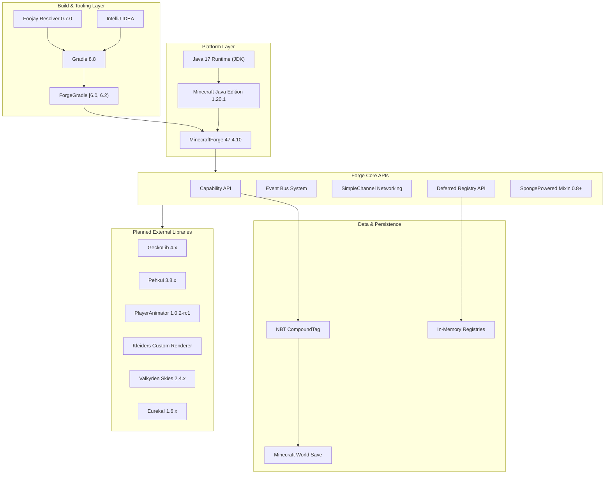

### 3.1.1 Default Stack Non-Applicability

The default technology stack template provided (AWS, Docker, Terraform, GitHub Actions, Python/Flask, Auth0, MongoDB, Langchain, React/TypeScript, TailwindCSS, React-Native, Swift, Kotlin, Objective-C, ElectronJS) is **entirely inapplicable** to this project. GrandLineApex operates as a Minecraft Forge mod, executing within the Minecraft JVM process, with no web server, no cloud infrastructure, no external databases, and no mobile or desktop native application components. Per constraint C-005 documented in Section 2.6, no external database, analytics, or telemetry integration is scoped. The complete technology stack is defined by the Minecraft/Forge modding ecosystem as detailed in the subsections below.

---

## 3.2 Programming Languages

### 3.2.1 Primary Language: Java 17

| Attribute | Detail | Evidence |
|---|---|---|
| **Language** | Java | All source code under `com.grandlineapex` |
| **Version** | Java 17 (LTS) | `build.gradle` line 16: `java.toolchain.languageVersion = JavaLanguageVersion.of(17)` |
| **Enforcement** | Build-time toolchain lock | Gradle toolchain configuration; build fails on non-Java 17 JDKs |
| **SDK** | Microsoft JDK 17 (`ms-17`) | `.idea/misc.xml` ProjectRootManager configuration |
| **Constraint** | C-002 | Java 17 runtime required; enforced via Gradle toolchain |

**Justification:** Java 17 is mandated by Minecraft 1.18+ and is the runtime that Mojang ships to end users. The Gradle toolchain directive in `build.gradle` enforces this at the build level, ensuring all compiled bytecode targets the correct JVM version. Java 17 provides language features such as sealed classes, pattern matching for `instanceof`, and text blocks that improve code clarity and safety for mod development. The `ms-17` SDK reference in the IDE configuration confirms the development environment aligns with this requirement.

### 3.2.2 Build Scripting: Groovy

| Attribute | Detail | Evidence |
|---|---|---|
| **Language** | Groovy | `build.gradle`, `settings.gradle` |
| **Version** | Embedded in Gradle 8.8 | `gradle-wrapper.properties` |
| **Purpose** | Build configuration, dependency declaration, task definition | ForgeGradle plugin configuration, resource filtering, publishing |

**Justification:** Groovy is the default scripting language for Gradle build files. The `build.gradle` file defines critical build behaviors including ForgeGradle plugin application, dependency resolution, Java toolchain enforcement, run configurations, resource property expansion, reobfuscation tasks, and Maven publication. The `settings.gradle` configures plugin management repositories and the Foojay Toolchain Resolver.

### 3.2.3 Data & Configuration Languages

| Language | Purpose | Format Version | Evidence |
|---|---|---|---|
| **JSON** | Asset definitions (animations, models, blockstates), localization files, data packs (recipes, loot tables, worldgen), sound definitions | N/A | `references/` mod assets throughout |
| **TOML** | Mod metadata and dependency declarations | Schema v0.5.0 | `mods.toml` (line 1: `modLoader="javafml"`) |
| **Properties** | Gradle build configuration, version pinning | N/A | `gradle.properties`, `gradle-wrapper.properties` |

**Justification:** JSON is the standard asset format for Minecraft mods, used for everything from block models to animation definitions. GeckoLib animation files in the reference mods use `format_version: "1.8.0"` with `geckolib_format_version: 2`. TOML v0.5.0 is the schema required by the Forge Mod Loader (FML) for `mods.toml` metadata files. Properties files are the standard Gradle mechanism for externalizing build configuration values.

---

## 3.3 Frameworks & Libraries

### 3.3.1 Core Platform Framework

#### Minecraft Java Edition 1.20.1

| Attribute | Detail |
|---|---|
| **Role** | Base game platform providing the runtime environment, rendering engine, world system, entity framework, and networking pipeline |
| **Version** | 1.20.1 |
| **Compatibility Range** | `[1.20.1, 1.21)` (declared in `mods.toml`) |
| **Evidence** | `gradle.properties` line 10: `minecraft_version=1.20.1` |

Minecraft Java Edition 1.20.1 serves as the foundational runtime upon which all mod logic executes. It provides the world simulation loop (20 ticks/second), the entity-component system, the rendering pipeline (client-side), the network transport layer (Netty), and the data serialization framework (NBT). All GrandLineApex systems—from Devil Fruit abilities to stamina management—operate within Minecraft's tick-driven execution model.

#### MinecraftForge 47.4.10

| Attribute | Detail |
|---|---|
| **Role** | Mod loader and API framework providing hooks, events, capabilities, registries, and networking |
| **Version** | 47.4.10 |
| **Dependency Range** | `[47,)` (declared in `mods.toml`) |
| **Evidence** | `gradle.properties` line 16: `forge_version=47.4.10`; `build.gradle` line 131 |
| **Constraint** | C-001: Platform locked to MinecraftForge loader only |

MinecraftForge 47.4.10 is the recommended Forge version for Minecraft 1.20.1, as confirmed by the MinecraftForge downloads page. It provides the complete modding API surface used by GrandLineApex, including:

- **`@Mod` Annotation** (`net.minecraftforge.fml.common.Mod`) — Mod entry point declaration in `GrandLineApex.java`
- **Event Bus System** (`net.minecraftforge.eventbus.api.IEventBus`, `net.minecraftforge.common.MinecraftForge`) — Both mod lifecycle and game runtime event handling
- **Capability API** — Persistent player data attachment (Devil Fruit state, Stamina, Haki, Bounty, Combat) via `CompoundTag`/NBT serialization
- **SimpleChannel Networking** — Bidirectional client-server packet communication (`grandlineapex:main`, protocol version `"1"`)
- **Deferred Registry API** — Content registration for items, entities, effects, particles, sounds, and structures
- **`@Mod.EventBusSubscriber`** — Declarative event handler registration for `LivingHurtEvent`, `TickEvent.PlayerTickEvent`, `AttachCapabilitiesEvent<Entity>`, and other game hooks
- **FML Lifecycle** (`net.minecraftforge.fml.javafmlmod.FMLJavaModLoadingContext`) — Mod loading, initialization, and inter-mod communication

#### Forge Mod Loader (FML)

| Attribute | Detail |
|---|---|
| **Loader ID** | `javafml` |
| **Loader Version Range** | `[47,)` |
| **Evidence** | `mods.toml` lines 1–2 |
| **Purpose** | Mod discovery, class loading, dependency resolution, and lifecycle management |

### 3.3.2 Build Framework

#### ForgeGradle

| Attribute | Detail |
|---|---|
| **Role** | Gradle plugin for Forge mod development |
| **Version Range** | `[6.0, 6.2)` |
| **Evidence** | `build.gradle` line 5 |
| **Capabilities** | Minecraft decompilation, SRG/MCP/Mojang mapping remapping, run configuration generation, reobfuscation |

ForgeGradle transforms the standard Gradle build pipeline into a Forge-aware toolchain. It handles the complex process of decompiling Minecraft source, applying the selected mapping channel (Mojang official mappings for 1.20.1, as specified in `gradle.properties` lines 35–38), and reobfuscating the compiled mod JAR for distribution. The `reobfJar` task is finalized from the `jar` task in `build.gradle` line 183, ensuring production JARs use SRG names compatible with the Forge runtime.

#### Gradle Build Tool

| Attribute | Detail |
|---|---|
| **Version** | 8.8 |
| **Distribution** | Binary (`gradle-8.8-bin.zip`) via wrapper |
| **Evidence** | `gradle-wrapper.properties` |
| **JVM Memory** | `-Xmx3G` (allocated in `gradle.properties` line 3) |
| **Daemon** | Disabled (`org.gradle.daemon=false` in `gradle.properties` line 4) |

### 3.3.3 Planned External Libraries

GrandLineApex targets integration with five external library systems, identified through analysis of reference mod dependency graphs and the project's feature requirements. All are currently at **Planned** integration status, with confirmed Forge 1.20.1 compatibility verified through published releases.

#### GeckoLib — Animation & Rendering Engine

| Attribute | Detail |
|---|---|
| **Purpose** | 3D keyframe animation engine for entities, abilities, Haki effects, and boss encounters |
| **Latest Forge 1.20.1 Version** | 4.8.3 (released January 31, 2026) |
| **License** | MIT |
| **Required By** | MinePiece (mandatory), True Prime Piece Two (optional) |
| **Features Used** | F-009 (Boss Encounters), F-012 (Visuals & Animations) |
| **Evidence** | `references/MinePiece-ver13-forge-1.20.1/META-INF/mods.toml` lines 24–40; `references/trueprimepiecetwo-infusedrocknroll-1.20.1/META-INF/mods.toml` |

GeckoLib is described as "a 3D animation library for entities, blocks, items, armor, and more!" with support for complex 3D keyframe-based animations, 30+ easings, and concurrent animation support. Reference mod animation assets use `geckolib_format_version: 2`. GrandLineApex requires GeckoLib for Devil Fruit transformation animations, Haki visual effects, combat technique animations, and scripted boss encounter sequences.

#### PlayerAnimator — Player Model Animation Library

| Attribute | Detail |
|---|---|
| **Purpose** | Smooth custom player animations for combat moves, ability activations, and cinematics |
| **Forge 1.20.1 Version** | 1.0.2-rc1+1.20 (released June 14, 2023) |
| **License** | MIT |
| **Required By** | MinePiece (mandatory), True Prime Piece Two (optional) |
| **Features Used** | F-012 (Visuals & Animations), F-004 (Combat & Haki) |
| **Evidence** | `references/MinePiece-ver13-forge-1.20.1/META-INF/mods.toml`; `references/trueprimepiecetwo-infusedrocknroll-1.20.1/META-INF/mods.toml` |

PlayerAnimator enables custom keyframe-based player model animations, allowing GrandLineApex to implement smooth combat moves, ability activation sequences, and Haki activation visuals that are synchronized across multiplayer sessions. The reference mods use approximately 150 gesture animations through this library.

#### Kleiders Custom Renderer

| Attribute | Detail |
|---|---|
| **Purpose** | Custom player model rendering for Devil Fruit transformations and Haki visual overlays |
| **Mod IDs** | `kleiders_custom_renderer` (MinePiece), `kleidersplayerrenderer` (True Prime Piece Two) |
| **Required By** | MinePiece (mandatory), True Prime Piece Two (optional) |
| **Features Used** | F-001 (Devil Fruit visual effects), F-004 (Haki overlays), F-012 (Visuals) |
| **Evidence** | `references/MinePiece-ver13-forge-1.20.1/META-INF/mods.toml` lines 24–28; `references/trueprimepiecetwo-infusedrocknroll-1.20.1/META-INF/mods.toml` |

Kleiders Custom Renderer provides the rendering infrastructure needed to replace or overlay the default player model during Zoan transformations, Logia elemental states, and Haki activation visual effects. Both reference mods declare this as a dependency under slightly different mod IDs, requiring verification of the correct artifact for GrandLineApex integration.

#### Pehkui — Entity Scaling

| Attribute | Detail |
|---|---|
| **Purpose** | Entity scaling for Devil Fruit transformations and visual effects (e.g., Zoan forms, giant abilities) |
| **Latest Forge 1.20.1 Version** | 3.8.2+1.20.1-forge (released June 2, 2024) |
| **License** | MIT |
| **Required By** | True Prime Piece Two (optional) |
| **Features Used** | F-001 (Devil Fruit transformations), F-012 (Visual scaling effects) |
| **Evidence** | `references/trueprimepiecetwo-infusedrocknroll-1.20.1/META-INF/mods.toml` lines 24–53 |

Pehkui modifies physical dimensions, hitboxes, reach distance, speed, and perspective of entities based on their scale value. GrandLineApex requires this for Zoan-type Devil Fruit transformations where player size changes are a core visual and gameplay element. The library was last tested on Forge 1.20.1-47.1.3, confirming compatibility with the project's Forge version range.

#### Valkyrien Skies + Eureka! — Ship Physics & Naval Travel

| Attribute | Detail |
|---|---|
| **Purpose** | Ship physics engine and naval travel system for sea-based world progression |
| **Valkyrien Skies Latest Forge 1.20.1** | v2.4.10 (released February 2, 2026) |
| **Eureka! Latest Forge 1.20.1** | v1.6.1 (released January 5, 2026) |
| **Licenses** | LGPLv3 (Valkyrien Skies), Apache 2.0 (Eureka!) |
| **Features Used** | F-010 (Ships & Naval Travel) |
| **Assumption** | A-003: Valkyrien Skies + Eureka! provide stable 1.20.1 Forge builds |
| **Evidence** | Feature catalog Section 2.1; technical constraints Section 2.4 |

Valkyrien Skies is a library mod that adds physics and airship mechanics to Minecraft. Eureka! is the companion add-on that provides the user-facing ship building and sailing experience using ordinary Minecraft blocks with physics. GrandLineApex plans to leverage these for player-built ships with sea dynamics, connecting world structure locations for thematic One Piece sea-based progression (East Blue → Grand Line → New World). Note that Valkyrien Skies requires Kotlin for Forge as a transitive dependency.

### 3.3.4 Explicitly Excluded Libraries

Per constraint C-006 (Section 2.6), the following libraries used by reference mods are explicitly excluded from GrandLineApex:

| Library | Reference Mod | Exclusion Rationale |
|---|---|---|
| **Cloth Config API** (`[4.16.91,)`) | Mine Mine no Mi 0.10.10 (optional, CLIENT only) | No configuration GUI framework scoped; Section 1.3.2 exclusion |
| **Curios API** (`[1.16.5-4.1.0.0,)`) | Mine Mine no Mi 0.10.10 (optional) | No accessory slot system scoped; Section 1.3.2 exclusion |

### 3.3.5 Bytecode Modification Framework

| Component | Version | Evidence | Purpose |
|---|---|---|---|
| **SpongePowered Mixin** | minVersion 0.8 | `references/MinePiece-ver13-forge-1.20.1/mixins.minepiece.json` | Runtime bytecode modification for game class injection |

The Mixin framework is used by the reference mods (MinePiece at Java 17 compatibility level, Mine Mine no Mi at Java 8+ compatibility level with extensive mixin classes for rendering, network, world, and entities). GrandLineApex may require Mixin integration for advanced rendering hooks and game behavior modifications that extend beyond the standard Forge event API surface.

---

## 3.4 Open Source Dependencies

### 3.4.1 Direct Build Dependencies

The following dependencies are explicitly declared in the project's build configuration and are required for compilation and execution:

| Dependency | Artifact Coordinate | Version | Source File | Purpose |
|---|---|---|---|---|
| **MinecraftForge** | `net.minecraftforge:forge` | `1.20.1-47.4.10` | `build.gradle` line 131 | Mod loader, API framework, runtime hooks |
| **ForgeGradle Plugin** | `net.minecraftforge.gradle` | `[6.0, 6.2)` | `build.gradle` line 5 | Build plugin for decompilation, remapping, run configs |
| **Foojay Toolchain Resolver** | `org.gradle.toolchains.foojay-resolver-convention` | `0.7.0` | `settings.gradle` line 12 | Automatic JDK provisioning for Gradle toolchains |
| **Gradle Wrapper** | Gradle distribution | `8.8` | `gradle-wrapper.properties` | Build tool runtime |

### 3.4.2 Maven Repositories

All dependency resolution flows through the following repositories, configured in `build.gradle` and `settings.gradle`:

| Repository | URL | Purpose | Configuration File |
|---|---|---|---|
| **Gradle Plugin Portal** | `gradlePluginPortal()` | Plugin resolution for ForgeGradle and Foojay Resolver | `settings.gradle` |
| **MinecraftForge Maven** | `https://maven.minecraftforge.net/` | Forge artifacts, ForgeGradle plugin, Minecraft dependencies | `settings.gradle`, `build.gradle` |
| **Maven Central** | (implicitly added by ForgeGradle) | Standard Java library resolution | Transitive via ForgeGradle |

### 3.4.3 Planned Library Dependencies (From Reference Mod Analysis)

The following dependency declarations are derived from analysis of reference mod `mods.toml` files and inform GrandLineApex's planned integration roadmap:

**From MinePiece ver13 (Forge 1.20.1) — Mandatory Dependencies:**

| Mod ID | Version Range | Requirement | Evidence |
|---|---|---|---|
| `minecraft` | `[1.20.1]` | Mandatory | `references/MinePiece-ver13-forge-1.20.1/META-INF/mods.toml` |
| `kleiders_custom_renderer` | `[0,)` | Mandatory | `references/MinePiece-ver13-forge-1.20.1/META-INF/mods.toml` |
| `geckolib` | `[0,)` | Mandatory | `references/MinePiece-ver13-forge-1.20.1/META-INF/mods.toml` |
| `playeranimator` | `[0,)` | Mandatory | `references/MinePiece-ver13-forge-1.20.1/META-INF/mods.toml` |

**From True Prime Piece Two 1.0.0 (Forge 1.20.1) — Optional Dependencies:**

| Mod ID | Version Range | Requirement | Evidence |
|---|---|---|---|
| `minecraft` | `[1.20.1]` | Mandatory | `references/trueprimepiecetwo-infusedrocknroll-1.20.1/META-INF/mods.toml` |
| `kleidersplayerrenderer` | `[0,)` | Optional | `references/trueprimepiecetwo-infusedrocknroll-1.20.1/META-INF/mods.toml` |
| `pehkui` | `[0,)` | Optional | `references/trueprimepiecetwo-infusedrocknroll-1.20.1/META-INF/mods.toml` |
| `geckolib` | `[0,)` | Optional | `references/trueprimepiecetwo-infusedrocknroll-1.20.1/META-INF/mods.toml` |
| `playeranimator` | `[0,)` | Optional | `references/trueprimepiecetwo-infusedrocknroll-1.20.1/META-INF/mods.toml` |
| `use_compiled_mods` | `[0,)` | Optional | `references/trueprimepiecetwo-infusedrocknroll-1.20.1/META-INF/mods.toml` |

### 3.4.4 Dependency Compatibility Matrix

The following matrix summarizes the latest confirmed Forge 1.20.1–compatible versions for all planned external dependencies:

| Library | Latest Forge 1.20.1 Version | Release Date | License | Actively Maintained |
|---|---|---|---|---|
| **GeckoLib** | 4.8.3 | Jan 31, 2026 | MIT | ✅ Yes |
| **Pehkui** | 3.8.2+1.20.1-forge | Jun 2, 2024 | MIT | ⚠️ Last Forge 1.20.1 update Jun 2024 |
| **PlayerAnimator** | 1.0.2-rc1+1.20 | Jun 14, 2023 | MIT | ⚠️ Release candidate; last 1.20.1 update Jun 2023 |
| **Kleiders Custom Renderer** | Version TBD | — | TBD | ⚠️ Verification required |
| **Valkyrien Skies** | 2.4.10 | Feb 2, 2026 | LGPLv3 | ✅ Yes |
| **Eureka!** | 1.6.1 | Jan 5, 2026 | Apache 2.0 | ✅ Yes |

> **Risk Note (Assumption A-002):** If GeckoLib, Pehkui, PlayerAnimator, or Kleiders cease to maintain Forge 1.20.1 compatibility, features F-009 (Boss Encounters) and F-012 (Visuals & Animations) cannot be implemented without alternatives. PlayerAnimator's status as a release candidate for 1.20.1 warrants particular attention during integration planning.

---

## 3.5 Third-Party Services

### 3.5.1 Applicability Assessment

**No third-party services are used or required by GrandLineApex.** This is a fundamental architectural characteristic of the project, enforced by constraint C-005 (Section 2.6.2):

> **C-005:** No external database, analytics, or telemetry integration.

GrandLineApex operates as a fully self-contained Minecraft mod with the following service-related exclusions:

| Service Category | Status | Rationale |
|---|---|---|
| **External APIs** | ❌ Not applicable | All game logic executes within the Minecraft JVM process |
| **Authentication Services** | ❌ Not applicable | Player authentication handled by Minecraft/Mojang natively |
| **Monitoring / Analytics** | ❌ Not applicable | Constraint C-005; no telemetry collection |
| **Cloud Services** | ❌ Not applicable | Mod runs on local machines or self-hosted servers |
| **CDN / Content Delivery** | ❌ Not applicable | Mod distributed as a JAR file via standard mod distribution channels |

All inter-process communication occurs exclusively through Forge's `SimpleChannel` networking within the Minecraft client-server architecture, using the `grandlineapex:main` channel with protocol version `"1"`.

---

## 3.6 Databases & Storage

### 3.6.1 Data Persistence Architecture

GrandLineApex uses no external databases. All data persistence flows through Minecraft's native NBT (Named Binary Tag) serialization system and Forge's Capability API, which automatically saves and loads player data with the Minecraft world save. This approach ensures zero external dependencies for data storage while providing reliable, per-player, per-world persistence.

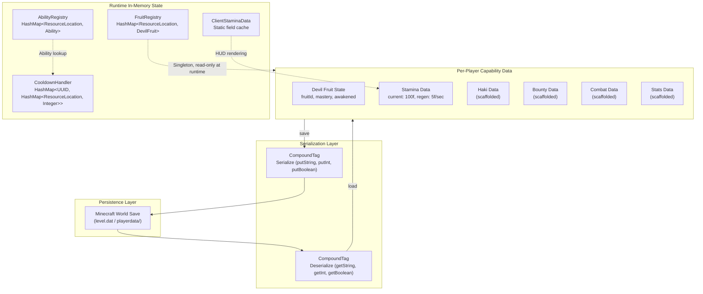

### 3.6.2 Primary Storage: Forge Capability + NBT System

| Storage Mechanism | Technology | Data Stored | Evidence |
|---|---|---|---|
| **Devil Fruit State** | `PlayerDevilFruitData` via Capability API | `fruitId` (String), `mastery` (int), `awakened` (boolean) | `PlayerDevilFruitProvider.java`, `DevilFruitStorage.java` |
| **Stamina Pool** | `PlayerStaminaData` via Capability API | `current` (float, default 100f), `maxStamina` (float), regen rate (5f/sec) | `PlayerStaminaProvider.java` |
| **Haki State** | `PlayerHakiData` via Capability API | Haki type, mastery level (scaffolded) | `PlayerHakiData.java` (stub) |
| **Bounty State** | `PlayerBountyData` via Capability API | Bounty tier, accumulated value (scaffolded) | `PlayerBountyData.java` (stub) |
| **Combat State** | `PlayerCombatData` via Capability API | Fighting style, combat stats (scaffolded) | `PlayerCombatData.java` (stub) |

All capability data is attached to player entities through `CapabilityAttacher.java` using `AttachCapabilitiesEvent<Entity>`. Data serializes to `CompoundTag` (NBT) with typed keys, and missing keys default to safe values to prevent data persistence corruption (Section 2.4.4). The capability serialization target is under 1ms per player per save operation.

### 3.6.3 In-Memory Registries

| Registry | Data Structure | Contents | Lifecycle |
|---|---|---|---|
| **FruitRegistry** | `HashMap<ResourceLocation, DevilFruit>` | All registered Devil Fruits with type, abilities, and properties | Populated at mod initialization; immutable at runtime |
| **AbilityRegistry** | `HashMap<ResourceLocation, Ability>` | All registered abilities with tier, cooldown, stamina cost, and mastery requirements | Populated at mod initialization; immutable at runtime |

Both registries are implemented as singletons with duplicate `ResourceLocation` key prevention. They reside in memory for the lifetime of the game session, with a combined target memory footprint of under 1MB for full fruit and ability registries.

### 3.6.4 Transient Runtime State

| State | Data Structure | Scope | Persistence |
|---|---|---|---|
| **Cooldown Timers** | `HashMap<UUID, HashMap<ResourceLocation, Integer>>` | Per-player, per-ability | Non-persistent; server-tick decremented; reset on server restart |
| **Client Stamina Cache** | Static Java fields in `ClientStaminaData` | Client-side only | Non-persistent; refreshed every 10 ticks via `SyncStaminaS2C` packet |

### 3.6.5 World Data

World-level data (structure placement, entity state, chunk data) persists through Minecraft's native Anvil format world save system. GrandLineApex's planned structures (Marine Bases, Pirate Ships, Temples) will generate using the Forge structure generation API and persist as standard Minecraft world data requiring no additional storage infrastructure.

---

## 3.7 Development & Deployment

### 3.7.1 Development Environment

| Tool | Version / Detail | Purpose | Evidence |
|---|---|---|---|
| **IDE** | IntelliJ IDEA | Primary development environment | `.idea/` folder, `OnePine.iml` |
| **Java SDK** | Microsoft JDK 17 (`ms-17`) | Compilation and runtime | `.idea/misc.xml` |
| **Version Control** | Git | Source code management | `.idea/vcs.xml` (Git mapping) |
| **AI Assistant** | GitHub Copilot | Code assistance (Ask2Agent migration completed) | `.idea/copilot.data.migration.ask2agent.xml` |
| **Deobfuscation Mappings** | Mojang Official Mappings, 1.20.1 | Source-level Minecraft class and method names | `gradle.properties` lines 35–38 |

### 3.7.2 Build System Architecture

The build system centers on Gradle 8.8 with the ForgeGradle plugin, producing a reobfuscated mod JAR suitable for distribution and installation in Forge-based Minecraft environments.

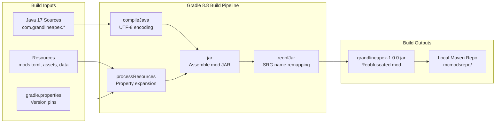

#### Build Configuration Details

| Configuration | Value | Evidence |
|---|---|---|
| **Java Compilation Encoding** | UTF-8 | `build.gradle` line 207 |
| **Resource Filtering** | Property expansion for `${mod_id}`, `${mod_name}`, `${mod_version}`, etc. | `build.gradle` lines 153–166 |
| **Reobfuscation** | `reobfJar` task finalized from `jar` | `build.gradle` line 183 |
| **JVM Build Memory** | `-Xmx3G` | `gradle.properties` line 3 |
| **Gradle Daemon** | Disabled (`org.gradle.daemon=false`) | `gradle.properties` line 4 |
| **Mod Version** | `1.0.0` | `gradle.properties` |
| **Mod Group** | `com.grandlineapex` | `gradle.properties` |

### 3.7.3 Run Configurations

ForgeGradle generates the following run configurations for development and testing, configured in `build.gradle` lines 84–107:

| Configuration | Purpose | Key Arguments | Evidence |
|---|---|---|---|
| `runClient` | Client-side game launch with mod loaded | Default client args | `build.gradle` lines 84–87 |
| `runServer` | Dedicated server launch | `--nogui` | `build.gradle` lines 89–92 |
| `runGameTestServer` | Automated Forge GameTest execution | GameTest framework args | `build.gradle` lines 97–99 |
| `runData` | Data generation (datapacks, recipes, loot tables) | `--mod grandlineapex`, `--all`, output paths | `build.gradle` lines 101–107 |

All run configurations share common properties defined in the `runs.configureEach` block, including mod sources, working directory, and JVM properties.

### 3.7.4 Publishing & Distribution

| Mechanism | Configuration | Evidence |
|---|---|---|
| **Local Maven Repository** | `file://${project.projectDir}/mcmodsrepo` | `build.gradle` lines 192–203 |
| **Maven Publication** | `mavenJava` publication with reobfuscated JAR artifact | `build.gradle` lines 194–196 |
| **License** | All Rights Reserved (C-003) | `gradle.properties` license field |

The mod is published to a local Maven repository for development and testing purposes. No CI/CD pipeline (GitHub Actions or otherwise) is evidenced in the repository. Distribution is handled through the local Maven artifact, with no automated deployment infrastructure currently configured.

### 3.7.5 Logging & Diagnostics

| Marker | Purpose | Evidence |
|---|---|---|
| `REGISTRIES` | Forge registry event monitoring during mod initialization | `GrandLineApex.java` constructor logging |
| Console Level: `debug` | Development-time diagnostic logging | Development run configuration defaults |

### 3.7.6 Deployment Model

GrandLineApex follows the standard Minecraft Forge mod deployment model:

1. **Build**: Gradle produces a reobfuscated JAR via the `reobfJar` task
2. **Distribute**: The JAR file is placed in the target Minecraft installation's `mods/` directory
3. **Load**: ForgeGradle's FML discovers the mod via `mods.toml` metadata during Minecraft launch
4. **Initialize**: The `@Mod(grandlineapex)` entry point is invoked, registering all subsystems with the Forge event bus
5. **Runtime**: The mod operates within the Minecraft JVM process, with no external service dependencies

No containerization (Docker), infrastructure-as-code (Terraform), or cloud deployment is applicable. The mod runs wherever a Minecraft Java Edition 1.20.1 client or server with MinecraftForge 47.4.10+ is installed.

---

## 3.8 Technology Constraints & Security Implications

### 3.8.1 Hard Platform Constraints

The following constraints, derived from Sections 2.4 and 2.6 of this specification, directly govern technology stack decisions:

| Constraint | Impact on Technology Stack | Evidence |
|---|---|---|
| **C-001**: Minecraft 1.20.1, MinecraftForge only | No Fabric, NeoForge, or Bedrock support; all APIs must target Forge 47.x | `gradle.properties`, `mods.toml` |
| **C-002**: Java 17 required | Build fails on Java 16 or earlier; Java 18+ features unavailable | `build.gradle` toolchain |
| **C-003**: All Rights Reserved license | No third-party API exposure; no open-source contribution model | `gradle.properties` |
| **C-004**: No cross-loader support | Eliminates Fabric API, Quilt Loader, and NeoForge as targets | Section 1.3.2 |
| **C-005**: No external services | Eliminates databases, analytics, cloud APIs, and telemetry | Section 1.3.2 |
| **C-006**: No Cloth Config or Curios API | Eliminates two libraries used by Mine Mine no Mi reference mod | Section 1.3.2 |
| **C-007**: No direct code port from Mine Mine no Mi | All systems reimplemented for 1.20.1; cannot reuse 1.16.5 code | Section 1.3.2 |

### 3.8.2 Security Implications of Technology Choices

| Concern | Technology Mitigation | Reference |
|---|---|---|
| **Client state manipulation** | Server-authoritative execution model; all state-modifying logic runs server-side | Section 2.4.4; `NetworkHandler.java` |
| **Packet injection** | C2S packets validated against player capability state before execution | `ActivateAbilityC2S.java` |
| **Data persistence corruption** | Typed NBT `CompoundTag` keys with safe defaults for missing values | `PlayerDevilFruitProvider.java`, `PlayerStaminaProvider.java` |
| **Duplicate registration attacks** | `FruitRegistry` and `AbilityRegistry` reject duplicate `ResourceLocation` keys | `FruitRegistry.java`, `AbilityRegistry.java` |
| **Cooldown bypass** | `CooldownHandler` managed exclusively server-side; clients cannot manipulate cooldown timers | `CooldownHandler.java` |
| **Network protocol mismatch** | SimpleChannel protocol version `"1"` lock ensures client-server compatibility | `NetworkHandler.java` (constraint from Section 2.4.1) |

---

## 3.9 References

#### Files Examined

- `forge-1.20.1-47.4.10-mdk/build.gradle` — ForgeGradle plugin version, Java 17 toolchain, Forge dependency, run configurations, reobfuscation, UTF-8 encoding, Maven publishing
- `forge-1.20.1-47.4.10-mdk/gradle.properties` — Minecraft 1.20.1 version pin, Forge 47.4.10, official Mojang mappings, mod metadata, JVM memory, daemon configuration
- `forge-1.20.1-47.4.10-mdk/settings.gradle` — Plugin management with Forge Maven, Foojay Toolchain Resolver 0.7.0
- `forge-1.20.1-47.4.10-mdk/gradle/wrapper/gradle-wrapper.properties` — Gradle 8.8 wrapper distribution
- `forge-1.20.1-47.4.10-mdk/src/main/java/com/grandlineapex/GrandLineApex.java` — Mod entry point, @Mod annotation, Forge API imports, event bus registration
- `forge-1.20.1-47.4.10-mdk/src/main/resources/META-INF/mods.toml` — Mod loader metadata (javafml), Forge/Minecraft dependency declarations, TOML v0.5.0 schema
- `.idea/misc.xml` — Java 17 SDK configuration (ms-17)
- `.idea/vcs.xml` — Git version control mapping
- `.idea/copilot.data.migration.ask2agent.xml` — GitHub Copilot integration evidence
- `references/MinePiece-ver13-forge-1.20.1/META-INF/mods.toml` — MinePiece mandatory dependencies: geckolib, kleiders_custom_renderer, playeranimator
- `references/trueprimepiecetwo-infusedrocknroll-1.20.1/META-INF/mods.toml` — True Prime Piece Two optional dependencies: pehkui, geckolib, playeranimator, kleidersplayerrenderer
- `references/mine-mine-no-mi-1.16.5-0.10.10/META-INF/mods.toml` — Mine Mine no Mi dependencies: forge [36.2.39,), cloth_config (optional), curios (optional)
- `references/MinePiece-ver13-forge-1.20.1/mixins.minepiece.json` — SpongePowered Mixin configuration (minVersion 0.8)

#### Folders Examined

- `forge-1.20.1-47.4.10-mdk/` — Complete Forge MDK workspace
- `forge-1.20.1-47.4.10-mdk/src/main/java/com/grandlineapex/` — All 12 mod subsystem packages
- `references/` — Three reference mod distributions (MinePiece, Mine Mine no Mi, True Prime Piece Two)
- `.idea/` — IntelliJ IDEA project configuration

#### Tech Spec Sections Referenced

- Section 1.1 (Executive Summary) — Project overview, platform context
- Section 1.2 (System Overview) — Library integration table, component architecture, technical patterns
- Section 1.3 (Scope) — In-scope boundaries, out-of-scope exclusions
- Section 1.5 (References) — Complete file examination list
- Section 2.1 (Feature Catalog) — All 15 features with dependency details
- Section 2.4 (Implementation Considerations) — Technical constraints, performance requirements, security
- Section 2.6 (Assumptions and Constraints) — Platform assumptions (A-001 through A-005), hard constraints (C-001 through C-007)

#### External Sources

- [GeckoLib on CurseForge](https://www.curseforge.com/minecraft/mc-mods/geckolib) — Confirmed latest Forge 1.20.1 version: 4.8.3 (Jan 31, 2026)
- [Pehkui on CurseForge](https://www.curseforge.com/minecraft/mc-mods/pehkui) — Confirmed latest Forge 1.20.1 version: 3.8.2 (Jun 2, 2024)
- [PlayerAnimator on CurseForge](https://www.curseforge.com/minecraft/mc-mods/playeranimator) — Confirmed Forge 1.20.1 version: 1.0.2-rc1+1.20 (Jun 14, 2023)
- [Valkyrien Skies on CurseForge](https://www.curseforge.com/minecraft/mc-mods/valkyrien-skies) — Confirmed latest Forge 1.20.1 version: 2.4.10 (Feb 2, 2026)
- [Eureka! on CurseForge](https://www.curseforge.com/minecraft/mc-mods/eureka-ships) — Confirmed latest Forge 1.20.1 version: 1.6.1 (Jan 5, 2026)

# 4. Process Flowchart

This section documents the end-to-end process workflows, state transitions, integration sequences, and error handling flows that govern the GrandLineApex mod runtime. Each workflow is derived from implemented source code and architecturally scaffolded systems, with clear delineation between active (In Development) and planned (Approved/Proposed) processes. All diagrams are grounded in specific source files and reference requirements established in Sections 2.2 and 2.4 of this specification.

GrandLineApex operates as a Minecraft 1.20.1 Forge mod targeting single-player or small cooperative play (4–6 players). Its process architecture follows a server-authoritative model where the Forge event bus drives tick-based processing, capability-backed persistence, and bidirectional network synchronization via `SimpleChannel`. The workflows documented here reflect this architecture, with swim lanes distinguishing client-side, server-side, and shared processing boundaries.

---

## 4.1 HIGH-LEVEL SYSTEM WORKFLOW

### 4.1.1 Mod Initialization Sequence

The mod initialization workflow begins when MinecraftForge discovers the `@Mod("grandlineapex")` annotation in `GrandLineApex.java` and proceeds through five distinct phases: Forge bootstrap, network and content registration, capability registration, client-side setup, and event bus wiring. This sequence establishes all runtime infrastructure before any gameplay processing occurs.

The constructor in `GrandLineApex.java` serves as the orchestration point, invoking `NetworkHandler.register()` which creates the `SimpleChannel` on `grandlineapex:main` with protocol version `"1"`, registers `SyncStaminaS2C` (packet index 0) and `ActivateAbilityC2S` (packet index 1), and then cascades into `AbilityBootstrap.init()` and `TestFruit.register()` for content population. Capability registration occurs asynchronously via `CapabilityRegistry.java` using the `@Mod.EventBusSubscriber(bus = MOD)` annotation, while client-side setup is handled by `ClientSetup.java` on the MOD bus restricted to `Dist.CLIENT`.

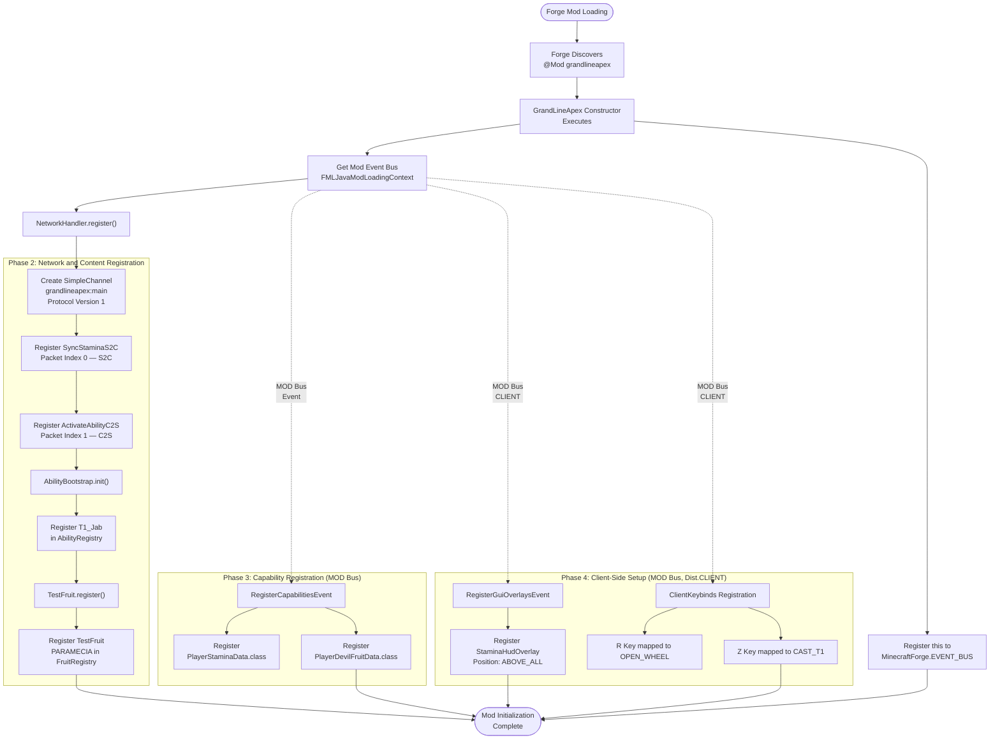

#### Phase Breakdown

| Phase | Trigger | Key Operations | Source Files |
|---|---|---|---|
| **1. Forge Bootstrap** | Mod annotation discovery | Constructor invocation, event bus acquisition | `GrandLineApex.java` |
| **2. Network & Content** | Constructor call to `NetworkHandler.register()` | Channel creation, packet registration, ability/fruit bootstrap | `NetworkHandler.java`, `AbilityBootstrap.java`, `TestFruit.java` |
| **3. Capability Registration** | `RegisterCapabilitiesEvent` on MOD bus | `PlayerStaminaData.class` and `PlayerDevilFruitData.class` registered | `CapabilityRegistry.java` |
| **4. Client Setup** | MOD bus events on `Dist.CLIENT` | HUD overlay registration, keybind mapping (R, Z) | `ClientSetup.java`, `ClientKeybinds.java` |
| **5. Event Bus Wiring** | Constructor registers `this` to FORGE bus | `PlayerEvents`, `TickEvents`, `CombatEvents` become active | `GrandLineApex.java` |

#### Registration Validation

Both `FruitRegistry` and `AbilityRegistry` enforce uniqueness at registration time using `putIfAbsent()` on their internal `HashMap<ResourceLocation, T>` structures. Attempting to register a duplicate `ResourceLocation` key throws an `IllegalStateException`, preventing silent overwrites and ensuring registry integrity throughout the mod lifecycle. This aligns with requirement F-001-RQ-003 and F-002-RQ-006 from Section 2.2.

---

### 4.1.2 End-to-End Gameplay Progression

The core gameplay loop follows a progression-driven path that integrates all major subsystems across three distinct game phases: Early Game (exploration and fruit discovery), Mid Game (mastery training, bounty growth, and Haki unlocking), and Late Game (awakening, escalating raids, and boss encounters). This loop is designed to support the mod's design philosophy of "sandbox with goals" — optional bounty-driven quests and raid events provide structure while preserving player freedom.

The diagram below expands upon the primary user workflow defined in Section 1.3.1, annotating each phase with the active subsystems and their feature identifiers.

```mermaid
flowchart LR
    subgraph EarlyGame["Early Game"]
        EG1["Explore World<br/>Find Structures<br/>F-007"]
        EG2["Discover<br/>Devil Fruit<br/>F-001"]
        EG3["Consume Fruit<br/>Gain Powers<br/>F-001"]
        EG4["Learn Basic<br/>Abilities<br/>F-002 T1"]
        EG1 --> EG2 --> EG3 --> EG4
    end

    subgraph MidGame["Mid Game"]
        MG1["Train Abilities<br/>Earn Mastery<br/>F-002"]
        MG2["Defeat Enemies<br/>Grow Bounty<br/>F-005"]
        MG3["Unlock Haki<br/>via Bounty<br/>F-004"]
        MG4["Select Fighting<br/>Style<br/>F-008"]
        MG1 --> MG2 --> MG3 --> MG4
    end

    subgraph LateGame["Late Game"]
        LG1["Achieve Awakening<br/>Mastery >= 200<br/>F-001"]
        LG2["Survive Escalating<br/>Raids<br/>F-006"]
        LG3["Challenge<br/>Bosses<br/>F-009"]
        LG4["Naval Exploration<br/>New World<br/>F-010"]
        LG1 --> LG2 --> LG3 --> LG4
    end

    EG4 --> MG1
    MG4 --> LG1
```

#### Subsystem Engagement by Phase

| Game Phase | Active Systems (Implemented) | Active Systems (Scaffolded) |
|---|---|---|
| **Early Game** | Devil Fruit (F-001), Abilities T1 (F-002), Stamina (F-003), HUD (F-013), Networking (F-014) | World Structures (F-007) |
| **Mid Game** | Mastery progression (F-001/F-002), Stamina management (F-003), Cooldowns (F-002) | Bounty (F-005), Haki (F-004), Fighting Styles (F-008) |
| **Late Game** | Awakening threshold (F-001, mastery >= 200) | Raids (F-006), Bosses (F-009), Ships (F-010), PvP (F-011) |

---

### 4.1.3 System Boundary Map

GrandLineApex's process architecture divides into four system boundaries: the Client Runtime, the Server Runtime, the Forge Platform layer, and the Persistence layer. All state-modifying logic executes exclusively on the server side, fulfilling the server-authoritative design constraint specified in Section 2.4.4. Clients submit action requests via C2S packets and receive state updates through S2C synchronization.

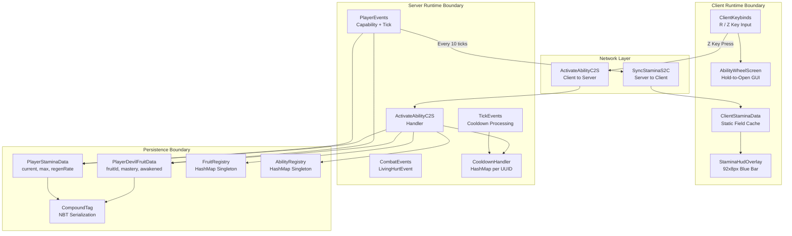

---

## 4.2 CORE BUSINESS PROCESS FLOWS

### 4.2.1 Ability Activation Workflow

The ability activation workflow represents the most complex and complete end-to-end process in the current GrandLineApex codebase. It spans client input capture, network packet transmission, multi-step server-side validation, mastery-scaled cost computation, and conditional execution. This flow directly implements requirements F-002-RQ-002 through F-002-RQ-007 from Section 2.2.2.

The process begins when a player presses the Z key (mapped to `CAST_T1` in `ClientKeybinds.java`), which triggers `TickEvents.onClientTick()` to create and dispatch an `ActivateAbilityC2S` packet containing the fruit identifier (`grandlineapex:testfruit`) and the requested ability tier (`AbilityTier.T1`). On the server, `ActivateAbilityC2S.handle()` performs a six-stage validation chain before executing the ability logic and applying a cooldown.

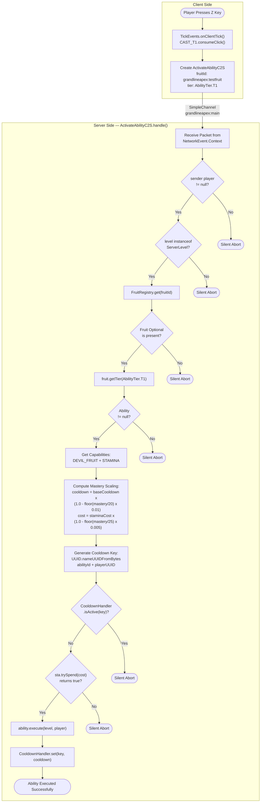

#### Decision Points and Validation Gates

| Gate | Check | Failure Action | Requirement |
|---|---|---|---|
| **V1** | Sender player is not null | Silent abort — no player context available | F-014-RQ-003 |
| **V2** | Level is a `ServerLevel` instance | Silent abort — prevents client-side execution | F-002-RQ-007 |
| **V3** | `FruitRegistry.get(fruitId)` returns present Optional | Silent abort — unknown or invalid fruit ID | F-001-RQ-003 |
| **V4** | `fruit.getTier(tier)` returns non-null ability | Silent abort — no ability registered at requested tier | F-002-RQ-004 |
| **V5** | `CooldownHandler.isActive(key)` returns false | Silent abort — ability still on cooldown | F-002-RQ-003 |
| **V6** | `sta.trySpend(cost)` returns true | Silent abort — insufficient stamina to activate | F-002-RQ-002 |

#### Mastery Scaling Formulas

The mastery scaling system applies two reduction formulas to reward progression. Both formulas enforce minimum thresholds to prevent zero-cost or zero-cooldown exploitation:

- **Cooldown Reduction**: `effectiveCooldown = baseCooldown × (1.0 - floor(mastery / 20) × 0.01)`, minimum 5 ticks
- **Stamina Reduction**: `effectiveCost = staminaCost × (1.0 - floor(mastery / 25) × 0.005)`, minimum 1.0

These formulas are defined in the `Ability.java` interface methods `cooldownWithMastery(int mastery)` and `staminaWithMastery(int mastery)`.

---

### 4.2.2 Ability Execution Detail — T1_Jab

The `T1_Jab` class in `devilfruit/abilities/impl/T1_Jab.java` provides the concrete implementation of a Tier 1 ability. It demonstrates the ray-cast-based targeting model and area-of-effect damage pattern used by the ability system. T1_Jab operates with a base cooldown of 40 ticks (2 seconds), a stamina cost of 8 points, and deals 4.0f damage to all attackable entities within a 0.75-block radius of the hit point.

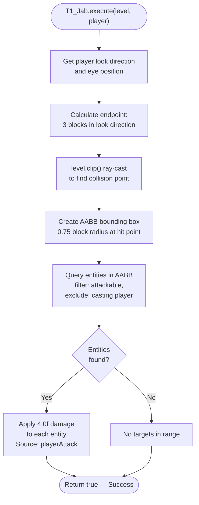

#### T1_Jab Parameters

| Parameter | Value | Description |
|---|---|---|
| **Tier** | `AbilityTier.T1` (order 1) | First active ability tier |
| **Range** | 3 blocks | Maximum ray-cast distance from player eye position |
| **AoE Radius** | 0.75 blocks | Bounding box radius around hit point |
| **Damage** | 4.0f | Applied via `playerAttack` damage source |
| **Base Cooldown** | 40 ticks (2 seconds) | Before mastery scaling |
| **Stamina Cost** | 8 points | Before mastery scaling |

---

### 4.2.3 Stamina Management Lifecycle

The stamina management lifecycle encompasses server-side regeneration, ability-driven deduction, periodic client synchronization, and HUD rendering. The system is fully server-authoritative: clients never modify stamina values directly; they receive updates exclusively through `SyncStaminaS2C` packets dispatched every 10 server ticks (500ms). This satisfies requirements F-003-RQ-001 through F-003-RQ-006 from Section 2.2.3.

The `PlayerStaminaData` model initializes at 100 points (current and max) with a regeneration rate of 5 points per second (0.25 per tick). The `trySpend(float amount)` method serves as the atomic deduction gate: it returns `true` and deducts the amount only if `current >= amount`, otherwise returns `false` and leaves stamina unchanged.

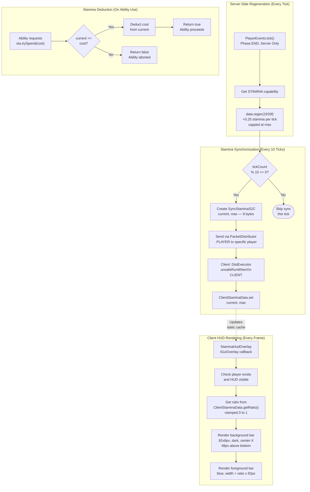

#### Timing Constraints

| Metric | Value | Rationale |
|---|---|---|
| Regen rate | 5f/sec (0.25f/tick) | Balances ability usage frequency with recovery time |
| Sync interval | 10 ticks (500ms) | Balances network overhead vs. HUD responsiveness (Section 2.4.1) |
| Packet size | 8 bytes (2 floats) | Minimizes network bandwidth per player (F-003-RQ-004) |
| HUD render budget | < 1ms/frame | Prevents frame rate degradation (Section 2.4.2) |
| Serialization overhead | < 1ms/player/save | NBT CompoundTag `{current, max}` (Section 2.4.2) |

---

### 4.2.4 Player Capability Lifecycle

The player capability lifecycle governs how per-player state (Devil Fruit data and Stamina data) is attached to player entities, persisted through world saves, and preserved across death and respawn events. This lifecycle is managed by `PlayerEvents.java` on the FORGE event bus and backed by `PlayerDevilFruitProvider.java` and `PlayerStaminaProvider.java` for NBT serialization.

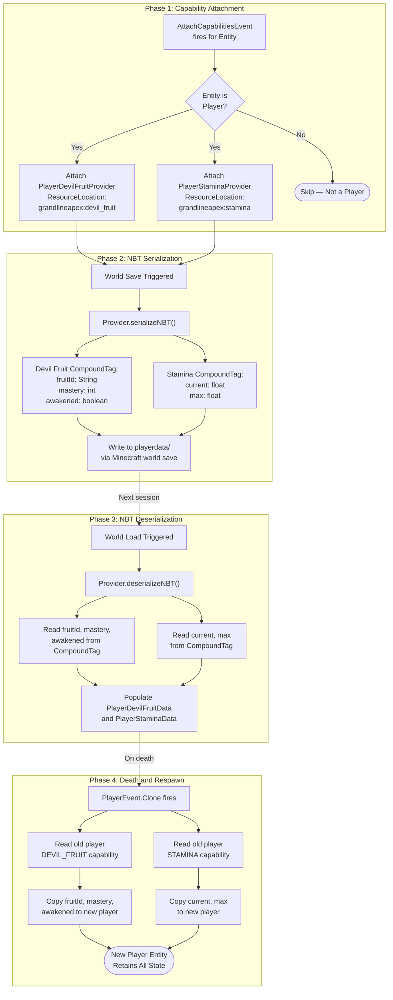

#### Data Integrity Safeguards

Per Section 2.4.4, NBT serialization uses typed keys with default-safe values for missing entries. If a CompoundTag is missing expected keys during deserialization, `PlayerDevilFruitData` defaults to `fruitId = ""`, `mastery = 0`, `awakened = false`, while `PlayerStaminaData` defaults to `current = 100f`, `max = 100f`. This prevents data persistence corruption from partial saves or version migration.

---

## 4.3 INTEGRATION WORKFLOWS

### 4.3.1 Client-Server Networking Sequence

The following sequence diagram illustrates the bidirectional packet flow between the client and server across all implemented networking operations. The `SimpleChannel` registered in `NetworkHandler.java` on `grandlineapex:main` carries all packet traffic, with `SyncStaminaS2C` flowing server-to-client and `ActivateAbilityC2S` flowing client-to-server.

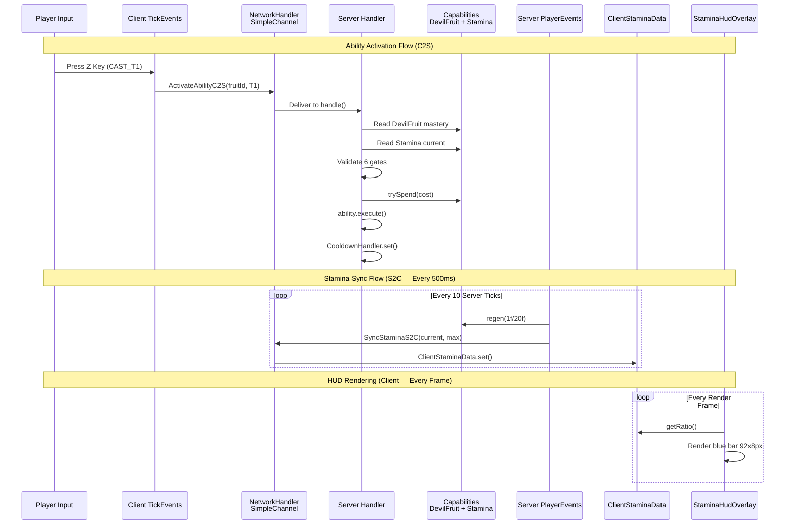

#### Packet Specifications

| Packet | Direction | Payload | Size | Frequency | Source File |
|---|---|---|---|---|---|
| `SyncStaminaS2C` | Server → Client | `current` (float), `max` (float) | 8 bytes | Every 10 ticks (500ms) | `SyncStaminaS2C.java` |
| `ActivateAbilityC2S` | Client → Server | `fruitId` (ResourceLocation), `tier` (AbilityTier) | Variable | On player input (Z key) | `ActivateAbilityC2S.java` |
| `SyncFruitPacket` | Server → Client | fruitId, mastery, awakened | Variable | On state change (scaffolded) | `SyncFruitPacket.java` |
| `SyncHakiPacket` | Server → Client | Haki type, mastery, active | Variable | On state change (scaffolded) | `SyncHakiPacket.java` |

---

### 4.3.2 Server Tick Processing Pipeline

Server tick processing drives two critical recurring operations: cooldown decrement via `CooldownHandler.tick()` on every server tick, and player-specific stamina regeneration plus synchronization via `PlayerEvents.tick()` on every player tick. Both fire at `Phase.END` to ensure they process after all other tick logic.

```mermaid
flowchart TD
    subgraph GlobalTick["Server Tick — TickEvent.ServerTickEvent Phase.END"]
        GT1["CooldownHandler.tick()"]
        GT2["Iterate all entries in<br/>HashMap of UUID to Integer"]
        GT3["Decrement each value by 1"]
        GT4{"Value<br/>reaches 0?"}
        GT5["Remove entry<br/>from HashMap"]
        GT6["Keep entry<br/>for next tick"]
        GT1 --> GT2 --> GT3 --> GT4
        GT4 -->|Yes| GT5
        GT4 -->|No| GT6
    end

    subgraph PerPlayerTick["Player Tick — PlayerTickEvent Phase.END, Server Only"]
        PP1["For each online<br/>server player"]
        PP2["Get STAMINA capability"]
        PP3["data.regen(1f/20f)<br/>+0.25f stamina"]
        PP4{"Internal tick<br/>counter % 10?"}
        PP5["Create SyncStaminaS2C<br/>packet with current, max"]
        PP6["Send to player via<br/>PacketDistributor.PLAYER"]
        PP7["Get DEVIL_FRUIT capability"]
        PP8{"Player has<br/>no fruit?"}
        PP9["Assign testfruit<br/>(dev-only logic)"]
        PP10(["Player Tick Complete"])
        PP1 --> PP2 --> PP3 --> PP4
        PP4 -->|"Yes — every 500ms"| PP5 --> PP6 --> PP7
        PP4 -->|No| PP7
        PP7 --> PP8
        PP8 -->|Yes| PP9 --> PP10
        PP8 -->|No| PP10
    end
```

#### Tick Budget Impact

| Operation | Frequency | Estimated Cost | Budget Source |
|---|---|---|---|
| `CooldownHandler.tick()` | 20 Hz (every server tick) | O(n) per active cooldown entry | Section 2.4.2: ≥ 18 TPS for 4–6 players |
| Stamina `regen()` | 20 Hz per player | O(1) per player | Section 2.4.2: minimal per-tick overhead |
| Stamina sync packet | 2 Hz per player (every 10 ticks) | 8 bytes per dispatch | Section 2.4.2: packet size ≤ 8 bytes |
| Fruit assignment (dev) | 20 Hz per player | Temporary — will be removed | N/A |

---

### 4.3.3 Client Rendering and Input Pipeline

The client-side pipeline handles two primary user-facing workflows: the Ability Wheel screen (hold-to-open GUI triggered by R key) and the stamina HUD overlay (continuous rendering fueled by periodic S2C sync packets). Both operate through the Forge client event system and Minecraft's rendering pipeline.

```mermaid
flowchart TD
    subgraph AbilityWheel["Ability Wheel Workflow"]
        AW1["Player holds R Key<br/>OPEN_WHEEL.isDown()"]
        AW2{"Screen currently<br/>open?"}
        AW3["Open AbilityWheelScreen<br/>non-pausing overlay"]
        AW4["Each tick: check<br/>if R still held"]
        AW5{"R Key<br/>released?"}
        AW6["Close screen via<br/>setScreen null"]
        AW7(["Wheel Closed"])
        AW1 --> AW2
        AW2 -->|No| AW3 --> AW4 --> AW5
        AW2 -->|Yes| AW8(["Do Nothing"])
        AW5 -->|Yes| AW6 --> AW7
        AW5 -->|No| AW4
    end

    subgraph StaminaDisplay["Stamina HUD Pipeline"]
        SD1["SyncStaminaS2C<br/>received from server"]
        SD2["DistExecutor.unsafeRunWhenOn<br/>Dist.CLIENT"]
        SD3["ClientStaminaData.set<br/>current, max"]
        SD4["StaminaHudOverlay<br/>IGuiOverlay callback"]
        SD5{"Player exists<br/>and visible?"}
        SD6["ratio = getRatio()<br/>clamped 0 to 1"]
        SD7["Render background<br/>92x8px dark bar<br/>center-X, 48px above bottom"]
        SD8["Render foreground<br/>blue bar, width = ratio x 92"]
        SD1 --> SD2 --> SD3
        SD4 --> SD5
        SD5 -->|Yes| SD6 --> SD7 --> SD8
        SD5 -->|No| SD9(["Skip render"])
    end

    SD3 -.->|"Updates static cache<br/>read by overlay"| SD4
```

---

### 4.3.4 Cross-System Data Flow

The following table documents all integration points between subsystems, specifying the data flow mechanism, current implementation status, and the source/target feature identifiers. This extends the integration points defined in Section 2.3.2 with process-level detail.

| Source System | Target System | Data Flow Mechanism | Process Trigger | Status |
|---|---|---|---|---|
| Devil Fruit (F-001) | Ability (F-002) | `DevilFruit.abilities()` returns ability list; `getTier(tier)` resolves specific ability | Ability activation packet received | **Implemented** |
| Ability (F-002) | Stamina (F-003) | `PlayerStaminaData.trySpend(cost)` atomic deduction | Server-side validation in `handle()` | **Implemented** |
| Ability (F-002) | Cooldown (F-002) | `CooldownHandler.set(key, ticks)` after successful execution | Post-execution in `handle()` | **Implemented** |
| Ability (F-002) | Networking (F-014) | `ActivateAbilityC2S` packet carries fruitId + tier | Client key press (Z) | **Implemented** |
| Stamina (F-003) | Networking (F-014) | `SyncStaminaS2C(current, max)` dispatched to player | Every 10 server ticks | **Implemented** |
| Stamina (F-003) | Client HUD (F-013) | `ClientStaminaData` static cache feeds `StaminaHudOverlay` | Every render frame | **Implemented** |
| Cooldown (F-002) | Tick Events | `CooldownHandler.tick()` decrements all active cooldowns | Every server tick | **Implemented** |
| Bounty (F-005) | Haki (F-004) | Bounty tier thresholds gate Haki type unlocks | On bounty tier transition | **Scaffolded** |
| Bounty (F-005) | Raids (F-006) | `RaidDifficultyScaler` reads player bounty + mastery | On raid trigger | **Scaffolded** |
| Bounty (F-005) | Styles (F-008) | Bounty progression unlocks fighting style access | On bounty tier transition | **Scaffolded** |
| Haki (F-004) | Networking (F-014) | `SyncHakiPacket` for Haki state synchronization | On Haki state change | **Scaffolded** |
| Raids (F-006) | Structures (F-007) | Raids target world structure locations | On raid location selection | **Scaffolded** |
| Registry (F-015) | All Features | `DeferredRegister` for items, entities, effects, structures | Mod initialization | **Scaffolded** |

---

## 4.4 STATE TRANSITION DIAGRAMS

### 4.4.1 Devil Fruit State Machine

The Devil Fruit system tracks four distinct states per player, managed through `PlayerDevilFruitData.java` and persisted via NBT serialization in `PlayerDevilFruitProvider.java`. The one-fruit-per-player constraint (Section 2.2.1 business rules) means a player's fruit state transitions are irreversible once a fruit is consumed. The awakening threshold at mastery >= 200 represents the terminal progression gate that unlocks the `AWAKENING` ability tier.

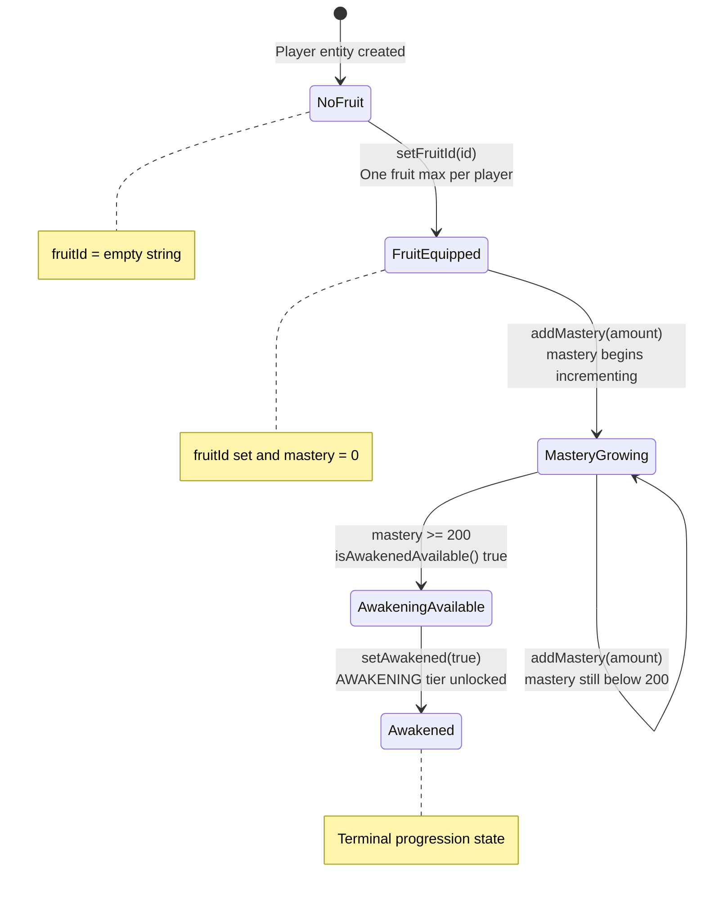

#### State Data Model

| State | `fruitId` | `mastery` | `awakened` | Available Tiers |
|---|---|---|---|---|
| **NoFruit** | `""` (empty) | 0 | false | None |
| **FruitEquipped** | Valid ResourceLocation | 0 | false | PASSIVE, T1 |
| **MasteryGrowing** | Valid ResourceLocation | 1–199 | false | PASSIVE, T1, T2, T3 (mastery-gated) |
| **AwakeningAvailable** | Valid ResourceLocation | >= 200 | false | PASSIVE, T1, T2, T3 |
| **Awakened** | Valid ResourceLocation | >= 200 | true | PASSIVE, T1, T2, T3, AWAKENING |

---

### 4.4.2 Stamina State Cycle

The stamina system operates as a continuous resource cycle between three logical states: Full, Active (partially depleted and regenerating), and Blocked (insufficient for the requested ability cost). The `trySpend()` method acts as the state gate, returning `false` when current stamina falls below the requested cost. Regeneration runs continuously at 5f/sec (0.25f/tick) whenever current is below max.

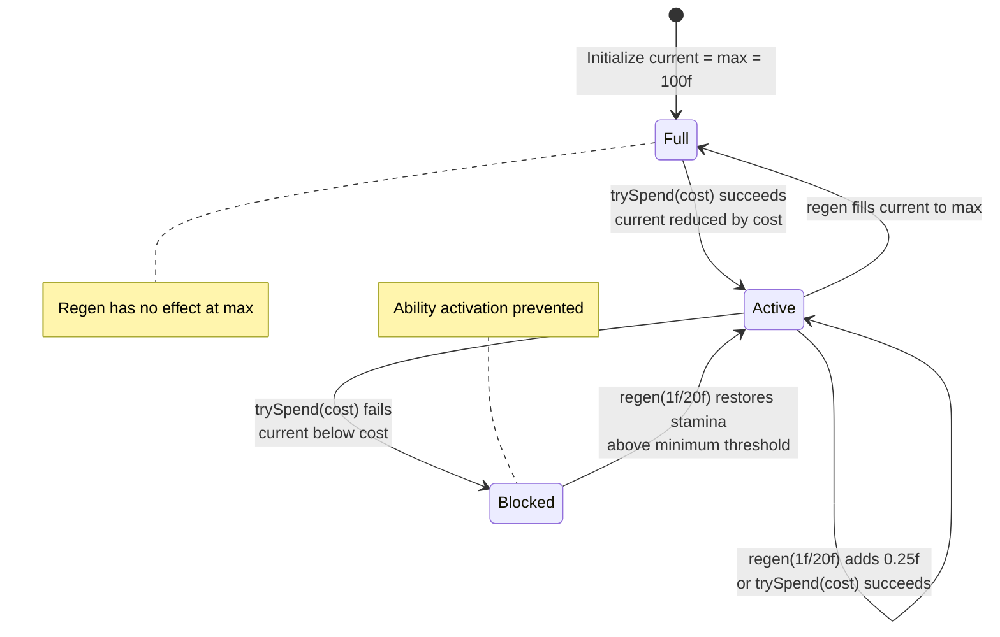

---

### 4.4.3 Cooldown State Machine

Each ability instance maintains an independent cooldown state per player, tracked via `CooldownHandler.java` using a `HashMap<UUID, Integer>` keyed by a deterministic UUID derived from the ability ID and player UUID combination. The server tick event drives decrement processing, and cooldown entries are automatically removed from the HashMap when they reach zero.

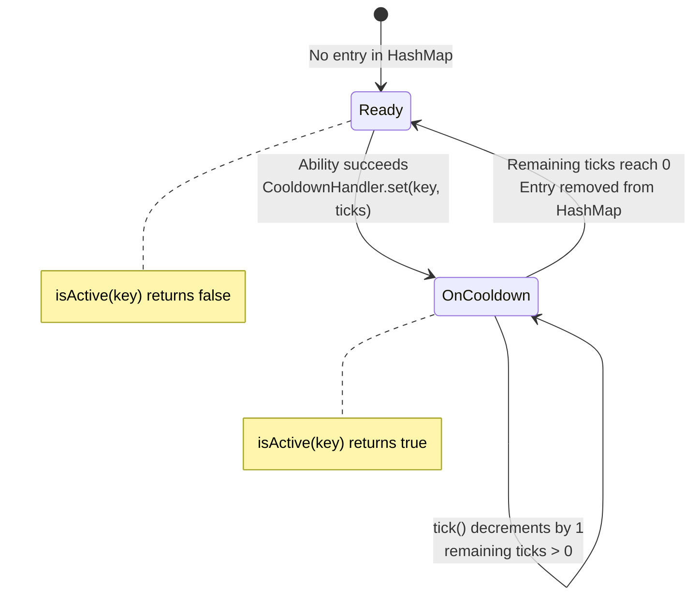

#### Cooldown Key Generation

The cooldown key for each player-ability combination is generated deterministically: `UUID.nameUUIDFromBytes((abilityId + "|" + playerUUID).getBytes())`. This produces a unique, reproducible UUID that isolates cooldown tracking per player and per ability without requiring a composite key data structure.

---

### 4.4.4 Ability Tier Progression

The `AbilityTier` enum in `AbilityTier.java` defines five progression tiers, each with an associated order value. Players progress upward through tiers as their mastery increases, with the `AWAKENING` tier (order 99) representing a significant mastery gap from `T3` (order 3) to enforce the awakening threshold.

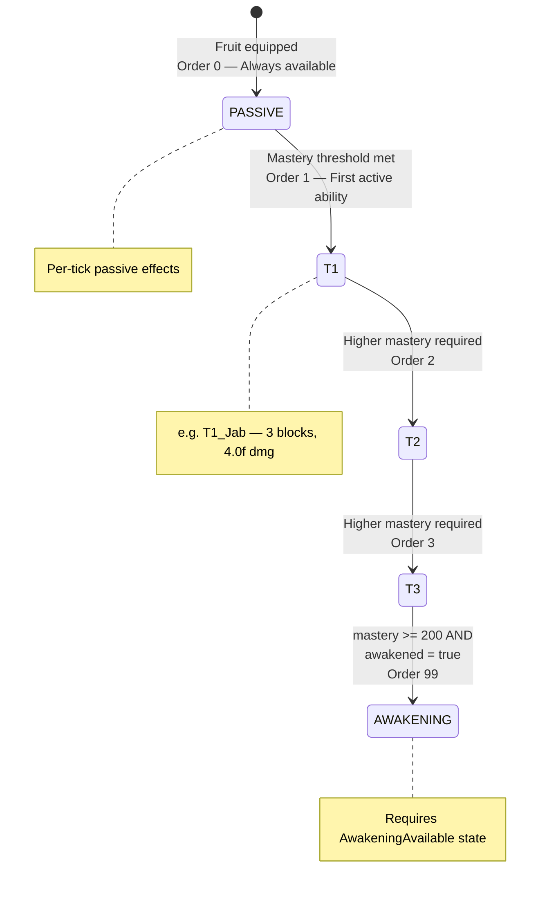

---

## 4.5 ERROR HANDLING FLOWCHARTS

### 4.5.1 Ability Activation Validation Chain

The ability activation process implements a defense-in-depth validation model with six sequential gates. Each gate performs a specific check, and failure at any gate results in a silent abort — the server discards the request without sending an error response to the client. This silent-abort pattern is a deliberate design choice that prevents information leakage about server state to potentially malicious clients.

The validation chain in `ActivateAbilityC2S.handle()` follows a strict order, proceeding from context validation (player existence, server level) through data resolution (fruit lookup, ability lookup) to state validation (cooldown check, stamina check). This ordering minimizes processing cost by performing the cheapest checks first.

```mermaid
flowchart TD
    PKT_IN(["C2S Packet Received"])

    PKT_IN --> G1{"Gate 1:<br/>sender != null?"}
    G1 -->|Fail| E1["ERROR: No player context<br/>Silent Abort"]
    G1 -->|Pass| G2{"Gate 2:<br/>ServerLevel<br/>instance?"}

    G2 -->|Fail| E2["ERROR: Wrong execution side<br/>Silent Abort"]
    G2 -->|Pass| G3{"Gate 3:<br/>FruitRegistry.get()<br/>is present?"}

    G3 -->|Fail| E3["ERROR: Unknown fruit ID<br/>Silent Abort"]
    G3 -->|Pass| G4{"Gate 4:<br/>getTier() returns<br/>non-null?"}

    G4 -->|Fail| E4["ERROR: No ability at tier<br/>Silent Abort"]
    G4 -->|Pass| G5{"Gate 5:<br/>CooldownHandler<br/>isActive == false?"}

    G5 -->|Fail| E5["ERROR: Ability on cooldown<br/>Silent Abort"]
    G5 -->|Pass| G6{"Gate 6:<br/>trySpend(cost)<br/>returns true?"}

    G6 -->|Fail| E6["ERROR: Insufficient stamina<br/>Silent Abort"]
    G6 -->|Pass| EXEC["EXECUTE: ability.execute()<br/>Then set cooldown"]

    EXEC --> OK(["SUCCESS: Ability activated"])
```

#### Error Classification

| Gate | Error Category | Recovery Path | Client Feedback |
|---|---|---|---|
| G1 | Context Error | None — indicates network anomaly | None (silent) |
| G2 | Side Error | None — indicates incorrect execution context | None (silent) |
| G3 | Data Error | Player must equip valid fruit | None (silent) |
| G4 | Data Error | Player must meet mastery requirements | None (silent) |
| G5 | State Error | Wait for cooldown expiration | None (silent) |
| G6 | Resource Error | Wait for stamina regeneration | None (silent) |

---

### 4.5.2 Registration Error Handling

Both `FruitRegistry.register()` and `AbilityRegistry.register()` implement fail-fast duplicate detection using `putIfAbsent()` on their internal `HashMap<ResourceLocation, T>` structures. Unlike the silent-abort pattern used at runtime, registration errors during mod initialization throw explicit `IllegalStateException` exceptions to halt mod loading and surface the configuration error immediately.

```mermaid
flowchart TD
    REG_START(["Registration Request<br/>ResourceLocation + Instance"])

    REG_START --> CHECK{"putIfAbsent<br/>returns null?"}

    CHECK -->|"Yes — Key is new"| SUCCESS["Entry added to HashMap<br/>Registration successful"]
    CHECK -->|"No — Key exists"| THROW["Throw IllegalStateException<br/>Duplicate fruit/ability id: + id"]

    SUCCESS --> DONE(["Registry updated"])
    THROW --> CRASH(["Mod loading halted<br/>Error logged to console"])
```

---

### 4.5.3 Recovery and Persistence Integrity

GrandLineApex implements several recovery mechanisms to maintain data integrity across failure scenarios:

#### NBT Deserialization Defaults

When loading player data from NBT `CompoundTag`, missing or corrupted keys resolve to safe default values rather than throwing exceptions:

| Capability | Key | Default Value | Impact |
|---|---|---|---|
| `PlayerDevilFruitData` | `fruitId` | `""` (empty string) | Player treated as having no fruit |
| `PlayerDevilFruitData` | `mastery` | `0` | Mastery resets to baseline |
| `PlayerDevilFruitData` | `awakened` | `false` | Awakening state not preserved |
| `PlayerStaminaData` | `current` | `100f` | Stamina resets to full |
| `PlayerStaminaData` | `max` | `100f` | Max stamina at default |

#### Death and Respawn Recovery

The `PlayerEvents.clone()` handler ensures complete capability data transfer from the old player entity to the new player entity on death. This copy is field-by-field (fruitId, mastery, awakened for Devil Fruit; current, max for Stamina), preserving all progression state across death events. Without this handler, Forge would create a fresh player entity with default capability values.

#### Cooldown Reset on Restart

Cooldown state stored in `CooldownHandler`'s `HashMap<UUID, Integer>` is transient — it is not persisted to NBT. On server restart, all active cooldowns are cleared, effectively granting a fresh-start on all ability cooldowns. This is a conscious trade-off: the simplicity of in-memory cooldown management outweighs the edge case of cooldown loss on restart for a 4–6 player environment.

---

## 4.6 PLANNED SYSTEM WORKFLOWS

The following workflows document architecturally scaffolded systems that have stub classes in the codebase but contain no functional logic. These flows represent the intended design based on the feature requirements in Section 2.2 and the project's design philosophy of unified progression across all subsystems.

### 4.6.1 Bounty Progression Flow

The Bounty System (F-005) is designed to serve as the primary cross-system progression driver, gating access to Haki (F-004), fighting styles (F-008), and stat increases. All referenced classes (`BountyManager.java`, `BountyTier.java`, `BountyRewardHandler.java`, `QuestGenerator.java`, `BountyQuest.java`, `PlayerBountyData.java`) exist as empty stubs in the `com.grandlineapex.bounty` package.

```mermaid
flowchart TD
    subgraph BountyCore["Bounty Progression (Scaffolded)"]
        B1["Player defeats entity"]
        B2["BountyManager calculates<br/>bounty increment"]
        B3["Update PlayerBountyData<br/>via Capability API"]
        B4{"Bounty meets<br/>next tier<br/>threshold?"}
        B5["BountyRewardHandler<br/>distributes tier rewards"]
        B6["Continue accumulating<br/>toward next tier"]
        B1 --> B2 --> B3 --> B4
        B4 -->|Yes| B5
        B4 -->|No| B6
    end

    subgraph UnlockGates["Progression Unlock Gates"]
        UG1["Unlock Haki type<br/>via F-004 HakiManager"]
        UG2["Unlock Fighting Style<br/>via F-008 selection"]
        UG3["Increase base stats"]
        UG4["Generate optional quest<br/>via QuestGenerator"]
    end

    B5 --> UG1
    B5 --> UG2
    B5 --> UG3
    B5 --> UG4
```

---

### 4.6.2 Dynamic Raid Orchestration

The Dynamic Raid System (F-006) is intended to deliver periodic, escalating PvE encounters whose difficulty scales with player progression. The `RaidDifficultyScaler.java` reads both player bounty and mastery values to compute a difficulty multiplier, directly linking raid intensity to the player's advancement through the bounty and mastery systems. All classes exist as stubs in `com.grandlineapex.raid`.

```mermaid
flowchart TD
    subgraph RaidTrigger["Raid Trigger (Scaffolded)"]
        RT1["Periodic timer or<br/>event trigger"]
        RT2["RaidManager evaluates<br/>raid conditions"]
        RT3{"Raid<br/>conditions<br/>met?"}
        RT4["Select RaidType based on<br/>sea region progression<br/>East Blue to New World"]
        RT5(["No raid this cycle"])
        RT1 --> RT2 --> RT3
        RT3 -->|Yes| RT4
        RT3 -->|No| RT5
    end

    subgraph DifficultyCalc["Difficulty Scaling (Scaffolded)"]
        DC1["RaidDifficultyScaler reads<br/>player bounty + mastery"]
        DC2["Compute difficulty<br/>multiplier"]
        DC3["Adjust enemy count,<br/>HP, and damage"]
    end

    subgraph RaidExec["Raid Execution (Scaffolded)"]
        RE1["RaidSpawner spawns<br/>enemy waves at<br/>structure location"]
        RE2["Escalate waves<br/>over time"]
        RE3{"All waves<br/>defeated?"}
        RE4["Distribute raid rewards<br/>and bounty gains"]
        RE5["Raid failure —<br/>partial rewards"]
        RE1 --> RE2 --> RE3
        RE3 -->|Yes| RE4
        RE3 -->|No — timeout| RE5
    end

    RT4 --> DC1
    DC1 --> DC2 --> DC3
    DC3 --> RE1
```

---

### 4.6.3 Haki Combat Integration

The Haki System (F-004) integrates with combat through the `LivingHurtEvent` hook in `CombatEvents.java`, which is currently wired to the FORGE event bus but contains an empty handler body. The intended flow involves bounty-gated Haki unlocking, activation-driven damage modification, and mastery-scaled combat effects across three Haki types: Armament (defense/attack boost), Observation (evasion/perception), and Conqueror (AoE suppression).

```mermaid
flowchart TD
    subgraph HakiUnlock["Haki Unlock (Scaffolded)"]
        HU1["Player reaches bounty<br/>tier threshold"]
        HU2["HakiManager checks<br/>unlock eligibility"]
        HU3["Activate Haki type<br/>in PlayerHakiData"]
        HU4["SyncHakiPacket sent<br/>to client"]
        HU1 --> HU2 --> HU3 --> HU4
    end

    subgraph HakiCombat["Haki in Combat (Scaffolded)"]
        HC1["LivingHurtEvent fires<br/>in CombatEvents"]
        HC2["Check if attacker or<br/>defender has active Haki"]
        HC3{"Haki<br/>active?"}
        HC4["ArmamentLogic: modify<br/>damage dealt/received"]
        HC5["ObservationLogic: modify<br/>dodge/perception chance"]
        HC6["ConquerorLogic: apply<br/>AoE suppression effect"]
        HC7["Apply modified damage"]
        HC8["Pass through<br/>unmodified"]
        HC1 --> HC2 --> HC3
        HC3 -->|Yes| HC4
        HC3 -->|Yes| HC5
        HC3 -->|Yes| HC6
        HC4 --> HC7
        HC5 --> HC7
        HC6 --> HC7
        HC3 -->|No| HC8
    end

    HU4 -.->|"Haki now available<br/>in combat"| HC1
```

---

## 4.7 VALIDATION RULES AND PERFORMANCE CHECKPOINTS

### 4.7.1 Business Rules by Process Step

The following table maps each critical business rule to its enforcement point within the process workflows documented above:

| Business Rule | Enforcement Point | Process Step | Validation Mechanism | Source Requirement |
|---|---|---|---|---|
| One Devil Fruit per player | Fruit consumption | `setFruitId()` in `PlayerDevilFruitData` | Capability state check (single fruitId field) | F-001-RQ-001 |
| Server-authoritative ability execution | Ability activation | `ActivateAbilityC2S.handle()` Gate 2 | `ServerLevel` instance check | F-002-RQ-007 |
| Sufficient stamina for activation | Ability activation | `ActivateAbilityC2S.handle()` Gate 6 | `trySpend(cost)` atomic check | F-002-RQ-002 |
| Cooldown must be expired | Ability activation | `ActivateAbilityC2S.handle()` Gate 5 | `CooldownHandler.isActive()` check | F-002-RQ-003 |
| Mastery gates ability tiers | Ability tier access | `fruit.getTier(tier)` | Tier mastery requirement check | F-002-RQ-004 |
| Awakening requires mastery >= 200 | Devil Fruit progression | `isAwakenedAvailable()` | Mastery threshold comparison | F-001-RQ-005 |
| Fruit ID must be registered | Ability activation | `ActivateAbilityC2S.handle()` Gate 3 | `FruitRegistry.get()` Optional check | F-001-RQ-003 |
| No duplicate registry entries | Mod initialization | `FruitRegistry.register()` / `AbilityRegistry.register()` | `putIfAbsent()` with `IllegalStateException` | F-001-RQ-003, F-002-RQ-006 |
| Capability data survives death | Death/respawn | `PlayerEvents.clone()` | Field-by-field copy to new entity | F-003-RQ-005 |
| Haki unlock gated by bounty | Haki progression (scaffolded) | `HakiManager` bounty tier check | `PlayerBountyData` tier comparison | F-004-RQ-001 |

---

### 4.7.2 Authorization and Security Checkpoints

All state-modifying operations in GrandLineApex are server-authoritative, as specified in Section 2.4.4. The following security checkpoints are embedded within the process workflows:

| Security Checkpoint | Workflow Location | Authorization Model | Threat Mitigated |
|---|---|---|---|
| **C2S Packet Validation** | `ActivateAbilityC2S.handle()` Gates 1–2 | Server verifies sender context | Client spoofing / injection |
| **Capability State Gate** | `ActivateAbilityC2S.handle()` Gates 3–6 | Server reads authoritative state | Client-side state manipulation |
| **Cooldown Server-Side Only** | `CooldownHandler` in server tick | `HashMap` inaccessible to client | Cooldown bypass attempts |
| **Stamina Server-Side Only** | `PlayerStaminaData` modified in server tick | Client receives read-only sync | Stamina modification attacks |
| **Registration Immutability** | `FruitRegistry` / `AbilityRegistry` | `putIfAbsent()` at init; read-only at runtime | Runtime registry tampering |
| **NBT Typed Keys** | Capability serialization/deserialization | Typed `CompoundTag` accessors | Data corruption from malformed saves |
| **Protocol Version Lock** | `NetworkHandler` channel creation | Version `"1"` must match client and server | Version mismatch exploitation |

---

### 4.7.3 Timing and Performance Constraints

The following performance constraints apply across all process workflows, derived from the KPIs in Section 1.2.3 and the performance requirements in Section 2.4.2. These constraints are critical for maintaining the target of ≥ 18 TPS for the 4–6 player cooperative environment.

| Metric | Target Value | Process Workflow | Measurement Point |
|---|---|---|---|
| Server TPS | >= 18 TPS sustained | All server-side tick processing | Server tick duration across all workflows |
| Ability round-trip latency | < 100ms | Ability Activation (Section 4.2.1) | Time from C2S packet receipt to `execute()` return |
| Stamina sync packet size | <= 8 bytes | Stamina Sync (Section 4.3.2) | `SyncStaminaS2C` payload: 2 floats |
| Stamina sync interval | Every 10 ticks (500ms) | Stamina Management (Section 4.2.3) | `PlayerEvents.tick()` counter modulo check |
| Capability serialization | < 1ms per player per save | Capability Lifecycle (Section 4.2.4) | NBT `CompoundTag` read/write duration |
| HUD render overhead | < 1ms per frame | Client Pipeline (Section 4.3.3) | `StaminaHudOverlay` render callback duration |
| Registry memory | < 1MB total | Mod Initialization (Section 4.1.1) | Combined `FruitRegistry` + `AbilityRegistry` HashMap footprint |
| Cooldown tick processing | O(n) per tick | Server Tick Pipeline (Section 4.3.2) | `CooldownHandler.tick()` iteration over active entries |

---

#### References

- `GrandLineApex.java` — Mod entry point, constructor, event bus registration, initialization orchestration
- `network/NetworkHandler.java` — SimpleChannel creation, packet registration, bootstrap invocation
- `network/packets/ActivateAbilityC2S.java` — Complete C2S ability activation handler with six-gate validation chain
- `network/packets/SyncStaminaS2C.java` — S2C stamina synchronization packet with DistExecutor client handling
- `network/packets/SyncFruitPacket.java` — Scaffolded S2C fruit state synchronization packet (stub)
- `network/packets/SyncHakiPacket.java` — Scaffolded S2C Haki state synchronization packet (stub)
- `devilfruit/abilities/Ability.java` — Ability interface with mastery scaling formulas for cooldown and stamina
- `devilfruit/abilities/AbilityBootstrap.java` — Bootstrap registration of T1_Jab into AbilityRegistry
- `devilfruit/abilities/AbilityRegistry.java` — HashMap-based ability registry with duplicate prevention
- `devilfruit/abilities/AbilityTier.java` — Five-tier enum (PASSIVE, T1, T2, T3, AWAKENING)
- `devilfruit/abilities/impl/T1_Jab.java` — Concrete T1 ability: ray-cast targeting, 3-block range, 4.0f AoE damage
- `devilfruit/DevilFruit.java` — Fruit interface contract: type, abilities, weaknesses, awakening
- `devilfruit/FruitRegistry.java` — HashMap-based fruit registry with duplicate prevention
- `devilfruit/FruitType.java` — Four-type enum (PARAMECIA, ZOAN, LOGIA, MYTHICAL_ZOAN)
- `devilfruit/TestFruit.java` — Paramecia test fruit implementation with T1_Jab ability
- `capability/CapabilityRegistry.java` — MOD bus event subscriber for capability class registration
- `capability/devilfruit/PlayerDevilFruitData.java` — State model: fruitId, mastery, awakened
- `capability/devilfruit/PlayerDevilFruitProvider.java` — NBT serialization provider for Devil Fruit capability
- `systems/stamina/PlayerStaminaData.java` — State model: current, max, regenPerSecond, trySpend(), regen()
- `systems/stamina/PlayerStaminaProvider.java` — NBT serialization provider for Stamina capability
- `systems/stamina/StaminaCapability.java` — Stamina capability token
- `events/PlayerEvents.java` — Capability attachment, clone handler, player tick processing
- `events/CombatEvents.java` — LivingHurtEvent handler stub for Haki integration
- `core/hooks/TickEvents.java` — Server tick (cooldown) and client tick (keybind input) processing
- `combat/energy/CooldownHandler.java` — Per-player, per-ability cooldown HashMap management
- `client/ClientKeybinds.java` — R and Z key registration
- `client/ClientStaminaData.java` — Static field cache for client-side stamina display
- `client/hud/StaminaHudOverlay.java` — Blue bar HUD overlay rendering (92×8px)
- `client/hud/AbilityWheelScreen.java` — Hold-to-open ability wheel screen
- `client/ClientSetup.java` — Client-side MOD bus overlay and keybind registration
- `bounty/BountyManager.java` — Bounty progression orchestration (stub)
- `bounty/BountyTier.java` — Bounty tier definitions (stub)
- `bounty/BountyRewardHandler.java` — Tier reward distribution (stub)
- `bounty/quest/QuestGenerator.java` — Contextual quest generation (stub)
- `raid/RaidManager.java` — Raid event orchestration (stub)
- `raid/RaidSpawner.java` — Enemy wave spawning (stub)
- `raid/RaidDifficultyScaler.java` — Bounty/mastery-based difficulty scaling (stub)
- `raid/RaidType.java` — Sea region raid classification (stub)
- `haki/HakiManager.java` — Haki management orchestration (stub)
- `haki/armament/ArmamentLogic.java` — Armament Haki combat logic (stub)
- `haki/observation/ObservationLogic.java` — Observation Haki combat logic (stub)
- `haki/conqueror/ConquerorLogic.java` — Conqueror Haki combat logic (stub)

# 5. System Architecture

## 5.1 HIGH-LEVEL ARCHITECTURE

### 5.1.1 System Overview

GrandLineApex is architected as a **Forge mod plugin** — a self-contained, single-platform gameplay modification that executes entirely within the Minecraft Java Virtual Machine runtime. Unlike conventional web, cloud, or mobile application architectures, GrandLineApex has no external web servers, cloud infrastructure, databases, authentication services, or mobile components. Every architectural decision is governed by the Minecraft Forge modding ecosystem, the Java 17 runtime mandate, and the project's design goal of consolidating the best systems from three leading One Piece mods (MinePiece, Mine Mine no Mi, and True Prime Piece Two) into a single, performance-optimized experience for 4–6 concurrent players.

#### Architecture Style and Rationale

The system employs an **event-driven, server-authoritative, capability-based architecture** built atop MinecraftForge 47.4.10 for Minecraft 1.20.1. This style was selected for three principal reasons:

- **Event-Driven Execution**: Minecraft's tick-driven simulation loop (20 ticks per second) naturally lends itself to event-based processing. GrandLineApex leverages Forge's `@Mod.EventBusSubscriber` system to wire gameplay logic — combat events, player tick processing, capability attachment, and world generation — into the game loop without polling or blocking operations. Both the MOD event bus (for lifecycle events such as registration and client setup) and the FORGE event bus (for runtime gameplay events such as player ticks, combat, and capability management) are used, ensuring proper separation of initialization and runtime concerns.

- **Server-Authoritative State**: All state-modifying logic executes exclusively on the server side, as documented in `ActivateAbilityC2S.java` and enforced throughout the network layer. Clients submit action requests (C2S packets) and receive state updates (S2C packets), but never directly modify authoritative data. This pattern prevents client-side exploitation of abilities, cooldowns, and stamina — a critical concern for multiplayer environments even at the 4–6 player scale.

- **Capability-Based Persistence**: The Forge Capability API provides per-player, per-entity data attachment that automatically integrates with Minecraft's native world save system. Player state (Devil Fruit identity, mastery level, awakening status, stamina pool) is serialized to NBT `CompoundTag` structures and persisted within the standard `playerdata/` directory of the Minecraft world save. This eliminates all need for external databases or custom file I/O, satisfying constraint C-005 (no external database, analytics, or telemetry integration).

#### Key Architectural Principles

| Principle | Implementation |
|---|---|
| Interface-Driven Extensibility | `DevilFruit.java` and `Ability.java` interfaces enable registration of new content via `FruitRegistry.register()` and `AbilityRegistry.register()` without modifying core framework code |
| Registry-Based Content Management | `HashMap<ResourceLocation, T>` singletons with `putIfAbsent()` duplicate prevention provide O(1) content lookup and fail-fast registration integrity |
| Defense-in-Depth Validation | Six sequential validation gates in the ability activation C2S handler ensure progressive filtering from cheapest checks (null player, server level) to most expensive (cooldown, stamina) |
| Tiered Progression Architecture | `AbilityTier` enum with five levels (PASSIVE through AWAKENING) gates ability access by mastery, creating natural progression milestones across game phases |

#### System Boundaries

The architecture divides into four distinct runtime boundaries, as evidenced in `GrandLineApex.java`, `NetworkHandler.java`, and the `com.grandlineapex.capability` package:

1. **Client Runtime Boundary** — Handles player input (keybinds R and Z), HUD overlay rendering (`StaminaHudOverlay` at 92×8 pixels), GUI screens (`AbilityWheelScreen`), and a static stamina cache (`ClientStaminaData`) refreshed every 10 ticks via S2C packets. Initialized by `ClientSetup.java` on the MOD bus, restricted to `Dist.CLIENT`.

2. **Network Layer Boundary** — A single Forge `SimpleChannel` registered at `grandlineapex:main` with protocol version `"1"` multiplexes all packet types. Currently carries `SyncStaminaS2C` (8-byte S2C, packet index 0) and `ActivateAbilityC2S` (variable-size C2S, packet index 1), with `SyncFruitPacket` and `SyncHakiPacket` scaffolded for future state synchronization.

3. **Server Runtime Boundary** — Event handlers (`PlayerEvents`, `TickEvents`, `CombatEvents`) drive server-side processing including stamina regeneration, cooldown decrement, packet validation, ability execution, and capability management. All state-modifying logic resides here.

4. **Persistence Boundary** — `PlayerDevilFruitData` and `PlayerStaminaData` persist via `CompoundTag` NBT serialization through Forge Capability providers, storing to the Minecraft world save. In-memory `HashMap` registries (`FruitRegistry`, `AbilityRegistry`) are populated at initialization and remain immutable at runtime.

```mermaid
flowchart TB
    subgraph ClientBoundary["Client Runtime Boundary"]
        CK["ClientKeybinds<br/>R and Z Keys"]
        CST["AbilityWheelScreen<br/>Hold-to-Open GUI"]
        CH["StaminaHudOverlay<br/>92x8px Blue Bar"]
        CC["ClientStaminaData<br/>Static Field Cache"]
        CK --> CST
        CC --> CH
    end

    subgraph NetworkBoundary["Network Layer Boundary"]
        NHC["SimpleChannel<br/>grandlineapex:main<br/>Protocol v1"]
        C2SP["ActivateAbilityC2S<br/>Packet Index 1"]
        S2CP["SyncStaminaS2C<br/>Packet Index 0"]
    end

    subgraph ServerBoundary["Server Runtime Boundary"]
        EHNode["Event Handlers<br/>Player · Tick · Combat"]
        AHNode["C2S Handler<br/>6-Gate Validation"]
        CDH["CooldownHandler<br/>HashMap per UUID"]
    end

    subgraph DataBoundary["Persistence Boundary"]
        CAPS["Forge Capabilities<br/>DevilFruit + Stamina Data"]
        REGS["In-Memory Registries<br/>Fruit + Ability HashMaps"]
        NBTS["CompoundTag<br/>NBT Serialization"]
        WSV["Minecraft World Save<br/>playerdata/ Directory"]
    end

    CK -->|"Z Key Press"| C2SP
    C2SP --> NHC
    NHC --> AHNode
    AHNode --> CAPS
    AHNode --> CDH
    AHNode --> REGS

    EHNode -->|"Every 10 Ticks"| S2CP
    S2CP --> NHC
    NHC --> CC

    CAPS --> NBTS
    NBTS --> WSV
```

### 5.1.2 Core Components

The GrandLineApex codebase is organized into twelve packages under `com.grandlineapex`, each encapsulating a distinct domain concern. The following table catalogs all major architectural components, their responsibilities, and integration relationships.

| Component | Primary Responsibility | Key Dependencies |
|---|---|---|
| **GrandLineApex** (root) | Mod entry point; event bus acquisition; orchestrates initialization sequence | `NetworkHandler`, `MinecraftForge`, `FMLJavaModLoadingContext` |
| **Capability System** (`capability/`) | Per-player persistent data attachment, NBT serialization, and clone handling on death | Forge Capability API, `CompoundTag` |
| **Network Layer** (`network/`) | Bidirectional client-server packet communication via `SimpleChannel` | Forge `SimpleChannel`, `PacketDistributor` |
| **Devil Fruit Engine** (`devilfruit/`) | Fruit identity, type classification, mastery tracking, and awakening logic | `FruitRegistry`, `PlayerDevilFruitData` |
| **Ability System** (`devilfruit/abilities/`) | Tiered ability framework with cooldown, stamina cost, and mastery scaling | `AbilityRegistry`, `CooldownHandler`, `PlayerStaminaData` |
| **Combat & Energy** (`combat/`) | Cooldown tracking, energy management, fighting style archetypes | Forge tick events, `PlayerStaminaData` |
| **Client Systems** (`client/`) | HUD overlays, GUI screens, keybind management, and client-side data caching | Forge client overlay API, `ClientStaminaData` |
| **Event Handlers** (`event/`) | Forge event bus subscribers for player ticks, combat hooks, and world generation | Forge `@Mod.EventBusSubscriber`, FORGE event bus |

The following components are architecturally scaffolded with stub classes prepared for future implementation:

| Component | Planned Responsibility | Status |
|---|---|---|
| **Bounty System** (`bounty/`) | Defeat-based progression, tiered rewards, quest generation | Stubs only |
| **Haki System** (`haki/`) | Three Haki types with bounty-gated unlocking and combat integration | Stubs only |
| **Raid System** (`raid/`) | Periodic escalating PvE encounters with difficulty scaling | Stubs only |
| **World Structures** (`world/`) | Naturally spawning One Piece–themed locations and sea-based progression | Stubs only |
| **Forge Registries** (`registry/`) | Deferred registration for items, entities, effects, particles, sounds, structures | Stubs only |

### 5.1.3 Data Flow Architecture

GrandLineApex's data flow architecture centers on four primary pathways that connect the client, server, network, and persistence boundaries. All data transformations and state mutations occur server-side, with the client serving as a presentation and input layer only.

#### Ability Activation Flow (Client → Server)

The most complex data flow begins when a player presses the Z key, which triggers `TickEvents.onClientTick()` to construct an `ActivateAbilityC2S` packet containing the fruit identifier (`ResourceLocation`) and the requested `AbilityTier`. This packet traverses the `SimpleChannel` to the server, where `ActivateAbilityC2S.handle()` executes a six-gate validation chain: player null check, `ServerLevel` verification, `FruitRegistry` lookup, ability resolution, cooldown check via `CooldownHandler`, and atomic stamina deduction via `PlayerStaminaData.trySpend()`. On success, the ability's `execute()` method fires and a cooldown is set. On any validation failure, the request is silently aborted with no response to the client.

#### Stamina Synchronization Flow (Server → Client)

Every 10 server ticks (500 milliseconds), `PlayerEvents.tick()` invokes `PlayerStaminaData.regen()` to add 0.25 stamina per tick (5 per second, capped at max), then constructs a `SyncStaminaS2C` packet containing two floats (current and max stamina, totaling 8 bytes). This packet is dispatched via `PacketDistributor.PLAYER` to the specific player's client, where `ClientStaminaData.set()` updates the static cache. The `StaminaHudOverlay` reads this cache every render frame to draw the stamina bar.

#### Capability Persistence Flow (Server ↔ World Save)

Player capability data flows through Forge's automatic persistence mechanism. On world save, `PlayerDevilFruitProvider.serializeNBT()` and `PlayerStaminaProvider.serializeNBT()` write typed key-value pairs to `CompoundTag` structures, which Minecraft stores within the `playerdata/` directory using the Anvil world format. On world load, the reverse deserialization path restores state, with missing keys defaulting to safe values (`fruitId=""`, `mastery=0`, `awakened=false`, `current=100f`, `max=100f`).

#### Capability Clone Flow (Death → Respawn)

When a player dies, Minecraft creates a fresh player entity. The `PlayerEvent.Clone` handler in `PlayerEvents.java` intercepts this event and performs a field-by-field copy of all capability data from the old entity to the new entity, preserving Devil Fruit identity, mastery progress, awakening status, and stamina state across death events.

#### Key Data Stores

| Store | Type | Contents | Lifecycle |
|---|---|---|---|
| `PlayerDevilFruitData` | Forge Capability + NBT | `fruitId`, `mastery`, `awakened` | Persistent across sessions |
| `PlayerStaminaData` | Forge Capability + NBT | `current`, `max` (floats) | Persistent across sessions |
| `FruitRegistry` | In-memory `HashMap` singleton | All registered `DevilFruit` instances | Built at init; immutable at runtime |
| `AbilityRegistry` | In-memory `HashMap` singleton | All registered `Ability` instances | Built at init; immutable at runtime |
| `CooldownHandler` | In-memory `HashMap<UUID, Integer>` | Active per-player, per-ability cooldowns | Non-persistent; resets on restart |
| `ClientStaminaData` | Static Java fields | Client-side stamina mirror | Refreshed every 10 ticks via S2C |

### 5.1.4 External Integration Points

GrandLineApex currently operates with zero external runtime dependencies beyond the Minecraft/Forge platform itself. However, six external libraries are planned for integration to deliver the full feature vision. All libraries have confirmed Forge 1.20.1 compatibility through published releases.

| Library | Integration Type | Protocol / Format | Status |
|---|---|---|---|
| GeckoLib 4.8.3 | Compile-time API | Java method calls, JSON animation assets | Planned |
| Pehkui 3.8.2 | Compile-time API | Java method calls for entity scaling | Planned |
| PlayerAnimator 1.0.2-rc1 | Compile-time API | Java method calls, keyframe data | Planned |
| Kleiders Custom Renderer | Compile-time API | Render pipeline hooks | Planned |
| Valkyrien Skies v2.4.10 | Compile-time API | Physics engine integration | Planned |
| Eureka! v1.6.1 | Compile-time API | Ship building/sailing (requires Kotlin for Forge) | Planned |

Per constraint C-006, Cloth Config API and Curios API are explicitly excluded despite their use in the Mine Mine no Mi reference mod. Per constraint C-005, no external databases, analytics, telemetry, or cloud services are integrated or planned.

---

## 5.2 COMPONENT DETAILS

### 5.2.1 Mod Entry Point and Initialization

#### Purpose and Responsibilities

`GrandLineApex.java` serves as the single mod entry point, annotated with `@Mod("grandlineapex")`. Its constructor orchestrates the complete initialization sequence by acquiring the MOD event bus from `FMLJavaModLoadingContext`, invoking `NetworkHandler.register()` to establish the network channel, and registering itself to `MinecraftForge.EVENT_BUS` for runtime event processing.

#### Technologies and Frameworks

The entry point relies on Forge FML's `FMLJavaModLoadingContext` for mod event bus acquisition and `MinecraftForge` for the global FORGE event bus. The MODID constant `"grandlineapex"` is defined in this class and overrides the MDK template defaults (`examplemod`) still present in `gradle.properties`.

#### Initialization Sequence

The mod initializes across five distinct phases, each triggered by specific Forge lifecycle mechanisms:

| Phase | Trigger | Operations | Source |
|---|---|---|---|
| 1. Forge Bootstrap | `@Mod` annotation discovery | Constructor invocation, bus acquisition | `GrandLineApex.java` |
| 2. Network & Content | Constructor → `NetworkHandler.register()` | Channel creation, packet registration, `AbilityBootstrap.init()`, `TestFruit.register()` | `NetworkHandler.java` |
| 3. Capabilities | `RegisterCapabilitiesEvent` on MOD bus | Register `PlayerStaminaData.class`, `PlayerDevilFruitData.class` | `CapabilityRegistry.java` |
| 4. Client Setup | MOD bus events on `Dist.CLIENT` | HUD overlay registration, R/Z keybind mapping | `ClientSetup.java` |
| 5. Event Wiring | Constructor → FORGE bus | `PlayerEvents`, `TickEvents`, `CombatEvents` active | `GrandLineApex.java` |

#### Scaling Considerations

The initialization sequence is deterministic and executes once per game session launch. Registry population scales linearly with content count but targets sub-millisecond completion for the expected fruit and ability volumes. The `IllegalStateException` fail-fast on duplicate `ResourceLocation` keys ensures integrity is verified at startup rather than surfacing as runtime errors.

### 5.2.2 Capability and Persistence System

#### Purpose and Responsibilities

The capability system provides the foundational data model for all per-player persistent state. It handles capability class registration with Forge, entity-level data attachment via `AttachCapabilitiesEvent<Entity>`, NBT serialization and deserialization through `CompoundTag`, and field-by-field state preservation across death and respawn events via `PlayerEvent.Clone`.

#### Key Interfaces and Architecture

`CapabilityRegistry.java` subscribes to the MOD event bus and registers capability classes during `RegisterCapabilitiesEvent`. `CapabilityAttacher.java` listens for `AttachCapabilitiesEvent<Entity>`, filters to player entities, and attaches `PlayerDevilFruitProvider` and `PlayerStaminaProvider` under their respective `ResourceLocation` keys (`grandlineapex:devil_fruit_data` and `grandlineapex:stamina`). Each provider implements `ICapabilityProvider` and `INBTSerializable<CompoundTag>`, bridging the Forge capability contract with NBT persistence.

Five player data classes exist in the `capability.player` package, with two fully implemented and three scaffolded:

| Data Class | Fields | Default Values | Status |
|---|---|---|---|
| `PlayerDevilFruitData` | `fruitId` (String), `mastery` (int), `awakened` (boolean) | `""`, `0`, `false` | Implemented |
| `PlayerStaminaData` | `current` (float), `max` (float) | `100f`, `100f` | Implemented |
| `PlayerHakiData` | TBD | TBD | Stub |
| `PlayerBountyData` | TBD | TBD | Stub |
| `PlayerCombatData` | TBD | TBD | Stub |

#### Data Persistence Requirements

All capability data serializes to NBT `CompoundTag` using typed accessor methods (`putString`, `putInt`, `putBoolean`, `putFloat`). Deserialization uses corresponding getter methods with built-in default handling for missing keys, preventing data corruption from partial saves or version migrations. The serialization performance target is under 1 millisecond per player per save operation.

#### Capability Lifecycle State Transitions

The following state diagram illustrates the complete lifecycle of player capability data from entity creation through persistence, restoration, and death recovery:

```mermaid
stateDiagram-v2
    [*] --> Unattached: Player entity created

    Unattached --> Attached: AttachCapabilitiesEvent fires<br/>Providers attached with ResourceLocations

    Attached --> Active: Data initialized<br/>with default values

    Active --> Serializing: World save triggered<br/>serializeNBT to CompoundTag
    Serializing --> Active: Save complete

    Active --> Cloning: PlayerEvent.Clone fires<br/>on death or respawn
    Cloning --> Active: All fields copied<br/>to new entity

    Active --> Deserializing: World load triggered<br/>deserializeNBT from CompoundTag
    Deserializing --> Active: State restored with<br/>default-safe missing keys

    note right of Active: Runtime operational state
    note right of Cloning: Field-by-field transfer
    note left of Serializing: CompoundTag to playerdata/
```

### 5.2.3 Network Layer

#### Purpose and Responsibilities

The network layer provides all bidirectional client-server communication through a single Forge `SimpleChannel`. It handles packet registration with sequential indices, protocol version enforcement, payload serialization and deserialization, and side-aware dispatch using `PacketDistributor`. The channel identifier `grandlineapex:main` with protocol version `"1"` ensures client-server compatibility matching.

#### Packet Architecture

`NetworkHandler.java` is invoked from the mod constructor during Phase 2 of initialization. It creates the `SimpleChannel` and registers all packet types with sequential indices. Each packet class defines its own `encode()`, `decode()`, and `handle()` methods, encapsulating serialization logic within the packet definition.

| Packet Class | Index | Direction | Payload | Frequency |
|---|---|---|---|---|
| `SyncStaminaS2C` | 0 | Server → Client | 2 floats (8 bytes) | Every 10 ticks |
| `ActivateAbilityC2S` | 1 | Client → Server | `fruitId` + `tier` | On Z key press |
| `SyncFruitPacket` | — | Server → Client | Fruit state | Scaffolded |
| `SyncHakiPacket` | — | Server → Client | Haki state | Scaffolded |

#### Scaling Considerations

Network traffic scales linearly with player count: each of 4–6 players receives a `SyncStaminaS2C` packet every 500 milliseconds, producing 8–12 packets per second for stamina alone. Burst scenarios during simultaneous ability activation must remain within the server's TPS budget (≥ 18 TPS sustained). The 8-byte packet size for stamina sync was specifically chosen to minimize bandwidth overhead.

### 5.2.4 Devil Fruit and Ability Engine

#### Purpose and Responsibilities

The Devil Fruit engine provides the core identity mechanic — fruit discovery, consumption, mastery tracking, and awakening — while the ability system delivers the tiered combat power framework that gates player capabilities by progression investment. Together, they form the primary gameplay loop that spans early-game fruit acquisition through late-game awakening.

#### Devil Fruit Architecture

`DevilFruit.java` defines the interface contract for all fruit implementations, specifying methods for type classification, ability retrieval, mastery requirements, and water/seastone weakness defaults. `FruitType.java` enumerates four canonical types: `PARAMECIA`, `ZOAN`, `LOGIA`, and `MYTHICAL_ZOAN`. `FruitRegistry.java` manages a `HashMap<ResourceLocation, DevilFruit>` singleton, enforcing uniqueness via `putIfAbsent()` and throwing `IllegalStateException` on duplicate registration attempts. A `TestFruit.java` implementation demonstrates the Paramecia-type pattern.

The one-fruit-per-player constraint is enforced at the capability level through `PlayerDevilFruitData`, where `fruitId` stores a single `ResourceLocation` string. The awakening threshold is fixed at mastery ≥ 200, representing the terminal progression gate that unlocks the AWAKENING ability tier.

#### Ability Architecture

`Ability.java` defines the interface for all ability implementations, contracting tier assignment, base cooldown, stamina cost, mastery requirement, and an `execute(ServerLevel, Player)` method. `AbilityTier.java` provides the five-level enum:

| Tier | Order | Unlock Condition |
|---|---|---|
| `PASSIVE` | 0 | Available on fruit equip |
| `T1` | 1 | First mastery threshold |
| `T2` | 2 | Higher mastery required |
| `T3` | 3 | Higher mastery required |
| `AWAKENING` | 99 | Mastery ≥ 200 and `awakened = true` |

The concrete `T1_Jab` implementation demonstrates the ability pattern: 3-block range ray-cast targeting with 0.75-block AoE radius, 40-tick (2 second) base cooldown, 8 stamina cost, and 4.0f damage applied via `playerAttack` damage source. Mastery scaling formulas reduce costs over time:

- **Cooldown**: `baseCooldown × (1.0 - floor(mastery/20) × 0.01)`, minimum 5 ticks
- **Stamina**: `staminaCost × (1.0 - floor(mastery/25) × 0.005)`, minimum 1.0

### 5.2.5 Combat and Energy Management

#### Purpose and Responsibilities

The combat and energy package provides cooldown tracking infrastructure, energy pool management, and the architectural foundation for fighting style archetypes. `CooldownHandler.java` is the most architecturally significant component, providing the per-player, per-ability cooldown enforcement that prevents ability spam.

#### Cooldown Architecture

`CooldownHandler` maintains a static `HashMap<UUID, Integer>` where keys are deterministic UUIDs generated from the combination of ability ID and player UUID: `UUID.nameUUIDFromBytes((abilityId + "|" + playerUUID).getBytes())`. This approach produces unique, reproducible keys without requiring a composite key data structure. The handler exposes three operations: `set(key, ticks)` to start a cooldown, `isActive(key)` to check status, and `tick()` to decrement all active entries by one per server tick, with automatic removal when entries reach zero.

Cooldown state is deliberately non-persistent — it is not serialized to NBT and resets on server restart. This trade-off prioritizes implementation simplicity over the edge case of cooldown loss at restart, appropriate for the 4–6 player target scale.

#### Scaffolded Components

`CombatManager.java` and `FightingStyle.java` provide the base abstractions for combat archetypes, with `BrawlerStyle.java` and `SwordsmanStyle.java` as empty stubs in `combat.styles`. `EnergyHandler.java` defines `MAX_ENERGY = 100` with stub methods for energy get, spend, and regeneration operations.

### 5.2.6 Client Presentation Layer

#### Purpose and Responsibilities

The client layer handles all player-facing interface elements: real-time HUD overlays, GUI screens for ability management, keybind registration, and client-side data caching. It bridges the gap between server-authoritative state and the player's visual experience.

#### Key Components

- **ClientSetup.java** — Client-side initialization anchor registered on the MOD bus at `Dist.CLIENT`. Registers HUD overlays via `RegisterGuiOverlaysEvent` and triggers keybind initialization.
- **StaminaHudOverlay.java** — Renders a blue stamina bar (92×8 pixels) positioned above the hotbar (center-X, 48 pixels above bottom). Reads from `ClientStaminaData.getRatio()` clamped between 0 and 1, with the foreground bar width computed as `ratio × 92` pixels. Render budget target is under 1 millisecond per frame.
- **ClientStaminaData.java** — Static field cache for client-side stamina values. Updated exclusively by `SyncStaminaS2C` packet handler via `DistExecutor.unsafeRunWhenOn(Dist.CLIENT)`. Never writes back to the server.
- **ClientKeybinds.java** — Registers two key mappings: R key (OPEN_WHEEL for ability wheel) and Z key (CAST_T1 for tier-1 ability activation).
- **AbilityWheelScreen.java** — Hold-to-open, non-pausing GUI overlay triggered by R key hold. Closes when R is released (`setScreen(null)`).
- **HakiScreen.java** and **MasteryScreen.java** — Stub GUI screens for future Haki management and mastery progression displays.

### 5.2.7 Event Processing System

#### Purpose and Responsibilities

The event system wires gameplay logic into Forge's event bus infrastructure, with dedicated handler classes for each domain. All handlers use the `@Mod.EventBusSubscriber` annotation for declarative registration.

| Handler | Event Bus | Key Events | Domain |
|---|---|---|---|
| `PlayerEvents` | FORGE | `AttachCapabilitiesEvent`, `PlayerEvent.Clone`, `PlayerTickEvent` | Capability lifecycle, stamina regen, sync dispatch |
| `TickEvents` | FORGE | `TickEvent.ServerTickEvent`, `TickEvent.ClientTickEvent` | Cooldown decrement, client input processing |
| `CombatEvents` | FORGE | `LivingHurtEvent` | Damage modification (placeholder) |
| `DevilFruitEvents` | FORGE | (Scaffolded) | Future fruit event hooks |
| `HakiEvents` | FORGE | (Scaffolded) | Future Haki event hooks |
| `WorldEvents` | FORGE | (Scaffolded) | Future world generation hooks |

The server tick processing pipeline drives two recurring operations at `Phase.END`: global cooldown decrement via `CooldownHandler.tick()` on every server tick, and per-player stamina regeneration plus conditional synchronization via `PlayerEvents.tick()`. Client tick processing captures Z key presses and dispatches `ActivateAbilityC2S` packets.

### 5.2.8 Scaffolded Subsystems

The following subsystems have class structures and package hierarchies established but contain empty or minimal logic. They represent the architectural commitments for the complete GrandLineApex feature set.

| Subsystem | Package | Key Classes | Integration Target |
|---|---|---|---|
| Bounty & Quests | `bounty/` | `BountyManager`, `BountyRewardHandler`, `BountyTier`, `BountyQuest`, `QuestGenerator` | F-004 (Haki unlock gating), F-006 (Raid scaling), F-008 (Style unlocks) |
| Haki System | `haki/` | `HakiManager`, `HakiType`, `ArmamentLogic`, `ConquerorLogic`, `ObservationLogic` | F-003 (Stamina cost), F-005 (Bounty gating), `CombatEvents` hook |
| Dynamic Raids | `raid/` | `RaidManager`, `RaidSpawner`, `RaidDifficultyScaler`, `RaidType` | F-005 (Bounty scaling), F-007 (Structure locations) |
| World Structures | `world/structure/` | `MarineBaseStructure`, `PirateShipStructure`, `TempleStructure` | F-006 (Raid staging), Forge structure generation API |
| Forge Registries | `registry/` | `ModItems`, `ModEntities`, `ModEffects`, `ModParticles`, `ModSounds`, `ModStructures` | All gameplay features via `DeferredRegister` |

#### Component Interaction Diagram

The following diagram illustrates the interaction between all major implemented components, showing how the entry point orchestrates initialization and how runtime data flows between systems:

```mermaid
sequenceDiagram
    participant Player as Player Input
    participant Client as Client Layer<br/>(Keybinds / HUD)
    participant Network as NetworkHandler<br/>(SimpleChannel)
    participant Server as Server Handler<br/>(C2S Validation)
    participant Registry as Registries<br/>(Fruit / Ability)
    participant Caps as Capabilities<br/>(DevilFruit / Stamina)
    participant Cooldown as CooldownHandler

    Note over Player, Cooldown: Ability Activation Flow (C2S)
    Player->>Client: Press Z Key
    Client->>Network: ActivateAbilityC2S(fruitId, T1)
    Network->>Server: Deliver to handle()
    Server->>Server: Gate 1: sender != null
    Server->>Server: Gate 2: ServerLevel check
    Server->>Registry: Gate 3: FruitRegistry.get(fruitId)
    Registry-->>Server: DevilFruit instance
    Server->>Registry: Gate 4: fruit.getTier(T1)
    Registry-->>Server: Ability instance
    Server->>Cooldown: Gate 5: isActive(key)?
    Cooldown-->>Server: false (available)
    Server->>Caps: Gate 6: trySpend(cost)
    Caps-->>Server: true (stamina sufficient)
    Server->>Server: ability.execute(level, player)
    Server->>Cooldown: set(key, cooldownTicks)

    Note over Player, Cooldown: Stamina Sync Flow (S2C — every 500ms)
    loop Every 10 Server Ticks
        Caps->>Caps: regen(0.25f)
        Caps->>Network: SyncStaminaS2C(current, max)
        Network->>Client: Deliver to ClientStaminaData
        Client->>Client: StaminaHudOverlay renders
    end
```

---

## 5.3 TECHNICAL DECISIONS

### 5.3.1 Architecture Style Decisions

GrandLineApex's architecture emerges from the intersection of Minecraft Forge's modding paradigm, the One Piece gameplay vision, and the 4–6 player performance constraint. The following architecture decision records document and justify each key structural choice.

#### ADR-001: Forge Capability API for Player Persistence

| Attribute | Detail |
|---|---|
| **Decision** | Use Forge Capability API with NBT serialization for all per-player persistent state |
| **Context** | Player data (Devil Fruit identity, mastery, stamina) must persist across sessions and survive death/respawn events |
| **Alternatives Rejected** | External databases (violates C-005), custom file I/O (fragile, no Forge integration), Minecraft scoreboard system (limited data types) |
| **Consequences** | Zero external dependencies for storage; automatic integration with world saves; data co-located with Minecraft player data; limited to types expressible in NBT `CompoundTag` |

#### ADR-002: Server-Authoritative State Model

| Attribute | Detail |
|---|---|
| **Decision** | All state-modifying logic executes exclusively on the server; clients submit action requests only |
| **Context** | Multiplayer integrity requires preventing client-side exploitation of abilities, cooldowns, and stamina |
| **Alternatives Rejected** | Client-authoritative (exploitation risk), hybrid model (complexity, desync potential) |
| **Consequences** | Eliminates client-side cheating for all implemented systems; requires network round-trip for every state change; client HUD may lag up to 500ms behind actual state |

#### ADR-003: HashMap-Based Registry Singletons

| Attribute | Detail |
|---|---|
| **Decision** | Use `HashMap<ResourceLocation, T>` singletons with `putIfAbsent()` for content registries |
| **Context** | Devil Fruits and abilities need O(1) lookup at runtime with guaranteed uniqueness at registration |
| **Alternatives Rejected** | `ConcurrentHashMap` (overkill for single-threaded registration), Forge `DeferredRegister` (suited to vanilla content types, not custom domain objects), database-backed registry (violates C-005) |
| **Consequences** | Simple, fast, and sufficient for expected content volumes; fail-fast `IllegalStateException` on duplicates; linear memory scaling; not thread-safe for concurrent registration (acceptable given single-threaded init) |

#### ADR-004: Silent-Abort Error Handling for Runtime Packets

| Attribute | Detail |
|---|---|
| **Decision** | C2S packet validation failures result in silent abort with no error response to the client |
| **Context** | The 6-gate validation chain must handle invalid requests without leaking server state information |
| **Alternatives Rejected** | Error response packets (information leakage risk, additional network overhead), exception throwing (disrupts server tick processing) |
| **Consequences** | Prevents information leakage about server state; clients receive no feedback on why an ability failed; debugging requires server-side log inspection |

#### Architecture Decision Tree

```mermaid
flowchart TD
    ROOT(["Key Architecture<br/>Decisions"])

    ROOT --> D1{"Data<br/>Persistence?"}
    D1 -->|"External DB"| D1R1["Rejected: Violates C-005<br/>No external services"]
    D1 -->|"Forge Capabilities<br/>+ NBT"| D1R2["ADR-001 Selected<br/>Zero external deps"]

    ROOT --> D2{"State Authority<br/>Model?"}
    D2 -->|"Client<br/>Authoritative"| D2R1["Rejected: Exploitation<br/>risk in multiplayer"]
    D2 -->|"Server<br/>Authoritative"| D2R2["ADR-002 Selected<br/>Single source of truth"]

    ROOT --> D3{"Content<br/>Registries?"}
    D3 -->|"ConcurrentHashMap"| D3R1["Rejected: Overkill<br/>for 4-6 players"]
    D3 -->|"HashMap<br/>Singletons"| D3R2["ADR-003 Selected<br/>Simple and fast"]

    ROOT --> D4{"Communication<br/>Protocol?"}
    D4 -->|"Custom Sockets"| D4R1["Rejected: Bypasses<br/>Forge pipeline"]
    D4 -->|"Forge<br/>SimpleChannel"| D4R2["ADR-005 Selected<br/>Native integration"]

    ROOT --> D5{"Error Handling<br/>at Runtime?"}
    D5 -->|"Error Response<br/>Packets"| D5R1["Rejected: Information<br/>leakage risk"]
    D5 -->|"Silent Abort"| D5R2["ADR-004 Selected<br/>Defense in depth"]
```

### 5.3.2 Communication Pattern Choices

The network architecture uses a single Forge `SimpleChannel` on `grandlineapex:main` to multiplex all packet types, rather than creating separate channels per subsystem. This design keeps the channel management simple and leverages Forge's built-in protocol version matching (version `"1"`) to ensure client-server compatibility.

| Decision | Choice | Rationale |
|---|---|---|
| Channel Strategy | Single multiplexed `SimpleChannel` | Simplicity; Forge handles serialization, routing, and version matching natively |
| Packet Direction | S2C for state pushes, C2S for action requests | Enforces server-authoritative model; clients never push state |
| Sync Interval | 10-tick (500ms) for stamina | Balances network overhead against HUD responsiveness; 8 bytes per dispatch per player |
| Distribution Model | `PacketDistributor.PLAYER` (per-player targeting) | Only relevant player receives their stamina update; avoids broadcast overhead |

### 5.3.3 Data Storage Strategy

GrandLineApex employs a zero-external-database strategy, distributing all data across three storage tiers matched to their persistence requirements:

| Storage Tier | Mechanism | Use Cases | Rationale |
|---|---|---|---|
| **Persistent** | Forge Capability + NBT `CompoundTag` → Minecraft world save | Devil Fruit state, stamina pool, Haki, bounty, combat data | Automatic integration with world saves; survives session restarts |
| **Session-Immutable** | In-memory `HashMap` singletons | Fruit and ability registries | Populated once at initialization; read-only at runtime; rebuilt each launch |
| **Transient** | In-memory `HashMap` / static fields | Cooldown timers, client stamina cache | Acceptable loss on restart; simplicity outweighs persistence for 4–6 players |

This tiered approach ensures that gameplay-critical progression data (fruit identity, mastery, awakening) is always persisted, while operational state (cooldowns, client caches) is kept lightweight and disposable.

### 5.3.4 Caching Strategy

The only explicit caching layer in GrandLineApex is `ClientStaminaData`, a static field cache on the client side that holds the two most recent stamina values (current and max) received from `SyncStaminaS2C` packets. This cache exists because the client HUD renders every frame (60+ times per second) but stamina updates arrive only every 10 ticks (twice per second). Without the cache, the HUD would either need to query the server every frame (impossible due to latency) or have no data to render between sync packets.

| Cache | Location | Refresh Rate | Invalidation |
|---|---|---|---|
| `ClientStaminaData` | Client-side static fields | Every 10 ticks (500ms) | Overwritten on each S2C packet; no explicit invalidation needed |

No server-side caching layers exist, as the `HashMap`-based registries provide O(1) lookup natively and the total memory footprint target is under 1MB for all registries combined.

### 5.3.5 Security Mechanism Selection

In the context of a Minecraft Forge mod, "security" refers to preventing gameplay exploitation rather than traditional authentication or encryption. The server-authoritative model serves as the primary security mechanism, complemented by input validation and registration integrity checks.

| Threat | Mechanism | Implementation |
|---|---|---|
| Client state manipulation | Server-authoritative execution | All mutations in `ActivateAbilityC2S.handle()`, not client-side |
| Packet injection / replay | Capability state validation | C2S packets validated against live player capability state |
| Cooldown bypass | Server-side cooldown enforcement | `CooldownHandler` is server-only; clients cannot access or modify |
| Registry tampering | Fail-fast duplicate detection | `putIfAbsent()` + `IllegalStateException` on duplicate keys |
| Data corruption | Default-safe deserialization | Missing NBT keys resolve to safe defaults rather than throwing |
| Protocol mismatch | Version-locked `SimpleChannel` | Protocol version `"1"` must match between client and server |

---

## 5.4 CROSS-CUTTING CONCERNS

### 5.4.1 Error Handling Patterns

GrandLineApex implements three distinct error handling patterns, each tailored to its operational context: runtime silent-abort for C2S packet validation, fail-fast exception for initialization-time registration, and default-safe recovery for persistence deserialization.

#### Runtime Pattern: Defense-in-Depth Silent Abort

The `ActivateAbilityC2S.handle()` method implements six sequential validation gates, ordered from cheapest to most expensive check. Each gate evaluates a specific precondition, and failure at any gate causes the request to be silently discarded — no error packet is sent to the client, and no exception is thrown on the server. This prevents both information leakage (clients cannot probe server state by analyzing error responses) and server-side disruption (no exceptions in the tick processing pipeline).

#### Initialization Pattern: Fail-Fast Exception

Both `FruitRegistry.register()` and `AbilityRegistry.register()` use `putIfAbsent()` to detect duplicate `ResourceLocation` keys. A duplicate triggers an `IllegalStateException` with a descriptive message (`"Duplicate fruit/ability id: " + id`), immediately halting mod loading. This ensures configuration errors are surfaced during development and testing rather than manifesting as silent overwrites or runtime anomalies.

#### Persistence Pattern: Default-Safe Recovery

NBT deserialization in `PlayerDevilFruitProvider` and `PlayerStaminaProvider` handles missing or corrupted `CompoundTag` keys by falling back to safe default values. A player with a corrupted save is treated as having no fruit (`fruitId=""`, `mastery=0`, `awakened=false`) with full stamina (`current=100f`, `max=100f`), preventing crashes and allowing graceful recovery.

```mermaid
flowchart TD
    subgraph RuntimePattern["Runtime: Silent Abort Pattern"]
        RP1(["C2S Packet<br/>Received"])
        RP2{"Validation<br/>Gate Check"}
        RP3["Silent Abort<br/>No Client Response"]
        RP4["Pass to<br/>Next Gate"]
        RP5["All Gates Passed<br/>Execute Ability"]
        RP1 --> RP2
        RP2 -->|"Fail"| RP3
        RP2 -->|"Pass"| RP4
        RP4 -->|"Final Gate"| RP5
    end

    subgraph InitPattern["Initialization: Fail-Fast Pattern"]
        IP1(["Registration<br/>Request"])
        IP2{"Duplicate<br/>ResourceLocation?"}
        IP3["IllegalStateException<br/>Mod Loading Halted"]
        IP4["Entry Added<br/>to HashMap"]
        IP1 --> IP2
        IP2 -->|"Yes"| IP3
        IP2 -->|"No"| IP4
    end

    subgraph PersistPattern["Persistence: Default-Safe Pattern"]
        PP1(["Deserialize<br/>CompoundTag"])
        PP2{"NBT Key<br/>Missing?"}
        PP3["Use Safe Default<br/>Value"]
        PP4["Load Stored<br/>Value"]
        PP5(["Data Restored<br/>Successfully"])
        PP1 --> PP2
        PP2 -->|"Yes"| PP3
        PP2 -->|"No"| PP4
        PP3 --> PP5
        PP4 --> PP5
    end
```

### 5.4.2 Server-Authoritative Security Model

GrandLineApex's security posture is defined by its server-authoritative architecture. Traditional authentication and authorization (OAuth, JWT, role-based access control) are not applicable — the Minecraft server handles player authentication natively through Mojang's account system, and the mod operates within that authenticated context.

Within the mod's domain, the security boundary is enforced through the following layered approach:

1. **Network Layer** — The `SimpleChannel` protocol version lock ensures only compatible clients communicate with the server. Forge's netty pipeline handles transport-level integrity.

2. **Validation Layer** — Every C2S packet passes through the 6-gate validation chain before any state modification occurs. Each gate checks progressively more specific preconditions, ensuring that only fully valid requests reach the execution stage.

3. **State Layer** — Player capabilities are server-owned objects. The client's `ClientStaminaData` is a read-only cache that cannot influence server-side values. Cooldown enforcement via `CooldownHandler` is entirely server-managed.

4. **Registration Layer** — Content registries reject duplicate entries at initialization, preventing runtime conflicts from malformed mod configurations.

### 5.4.3 Performance Requirements and Targets

Performance targets are calibrated for the 4–6 player co-op deployment scenario, as established in the project's design philosophy. All targets derive from the constraint that the mod must not degrade Minecraft's standard 20 TPS tick rate below 18 TPS sustained.

| Metric | Target | Mechanism |
|---|---|---|
| Server TPS (4–6 players) | ≥ 18 TPS sustained | Efficient event handlers, lightweight per-tick operations |
| Stamina sync packet size | ≤ 8 bytes per dispatch | `SyncStaminaS2C` encodes two floats only |
| Ability activation round-trip | < 100ms (C2S → execute) | Sequential validation with early-abort on failure |
| Capability serialization | < 1ms per player per save | Minimal `CompoundTag` field count |
| Registry memory footprint | < 1MB total | `HashMap`-based registries with linear scaling |
| HUD render overhead | < 1ms per frame | Simple rectangle rendering from cached values |

#### Tick Budget Analysis

Each server tick (50ms budget at 20 TPS) must accommodate:

| Operation | Frequency | Cost Profile |
|---|---|---|
| `CooldownHandler.tick()` | Every tick (20 Hz) | O(n) where n = active cooldown entries |
| Stamina `regen()` per player | Every tick per player | O(1) — single float addition |
| Stamina sync packet creation | Every 10th tick per player | O(1) — 8-byte packet construction |
| C2S ability validation | On demand (player input) | O(1) per gate, 6 gates maximum |

For a 4–6 player environment with typical gameplay, the combined per-tick overhead of these operations is expected to consume well under 1ms of the 50ms tick budget, leaving ample headroom for vanilla Minecraft processing and future subsystem additions.

#### Scalability Boundaries

| Dimension | Design Limit | Rationale |
|---|---|---|
| Player count | 4–6 concurrent | Explicit scope constraint (A-004); >6 out of scope |
| Network packets | Linear with player count | Per-player S2C dispatch; no broadcast amplification |
| Registry size | Unbounded (target < 1MB) | HashMap with no enforced upper limit |
| Structure density | Tunable per biome | Must not degrade chunk loading performance |
| Concurrent raids | Single-instance (planned) | Co-op may need queuing or zone isolation |

### 5.4.4 Data Integrity and Recovery

Data integrity is maintained through a combination of typed serialization, default-safe deserialization, and explicit state preservation across player lifecycle events.

#### Persistence Integrity

All NBT serialization uses typed `CompoundTag` accessors (`putString`, `putInt`, `putBoolean`, `putFloat`) that enforce data type correctness at write time. At read time, missing keys default to safe values rather than throwing exceptions, ensuring that partial saves, version migrations, or data file corruption never result in runtime crashes. The complete default value map is:

| Capability | Field | Default | Impact |
|---|---|---|---|
| `PlayerDevilFruitData` | `fruitId` | `""` (empty) | Player treated as fruitless |
| `PlayerDevilFruitData` | `mastery` | `0` | Mastery resets to baseline |
| `PlayerDevilFruitData` | `awakened` | `false` | Awakening not preserved |
| `PlayerStaminaData` | `current` | `100f` | Full stamina restored |
| `PlayerStaminaData` | `max` | `100f` | Default max stamina |

#### Death Recovery

The `PlayerEvent.Clone` handler performs explicit, field-by-field capability data transfer from the dying player entity to the newly spawned entity. Without this handler, Forge would create a fresh entity with default capability values, effectively erasing all progression. The clone handler covers both Devil Fruit data (fruitId, mastery, awakened) and stamina data (current, max).

#### Transient State Acceptance

Cooldown state in `CooldownHandler` is deliberately non-persistent. On server restart, all active cooldowns reset to zero. This is documented as an accepted trade-off: the simplicity of in-memory cooldown management outweighs the minor edge case of cooldown loss for the target 4–6 player environment. Players may briefly exploit this on restart, but the impact is bounded by individual ability cooldown durations (typically 2–4 seconds).

---

## 5.5 ARCHITECTURAL ASSUMPTIONS

The following assumptions underpin the system architecture. If any assumption is invalidated, the referenced architectural components may require redesign.

| ID | Assumption | Architectural Impact |
|---|---|---|
| A-001 | MinecraftForge 47.4.10 remains stable for 1.20.1 | All Forge API usage (Capabilities, EventBus, SimpleChannel, DeferredRegister) depends on API stability |
| A-002 | GeckoLib, Pehkui, PlayerAnimator, Kleiders maintain 1.20.1 compatibility | Visual and animation subsystems (F-009, F-012) cannot be implemented without these libraries |
| A-003 | Valkyrien Skies + Eureka! provide stable 1.20.1 builds | Ship and naval travel system (F-010) is entirely dependent on external physics engine |
| A-004 | Player count remains within 4–6 | Performance targets, HashMap-based registries, and per-player packet scaling are all calibrated for this range |
| A-005 | Single Devil Fruit per player is sufficient | Multi-fruit support would require fundamental restructuring of the capability data model and awakening system |

---

## 5.6 FEATURE LAYER ARCHITECTURE

The complete GrandLineApex feature set organizes into seven architectural layers, with each layer depending on the layers below it. This layering ensures that foundational infrastructure is established before gameplay systems, and that progression mechanics gate access to advanced features.

```mermaid
flowchart TB
    subgraph Layer7["Layer 7: Multiplayer"]
        L7F["F-011 PvP and Crews"]
    end

    subgraph Layer6["Layer 6: Client Presentation"]
        L6A["F-013 Client HUD and GUI"]
        L6B["F-012 Visuals and Animations"]
    end

    subgraph Layer5["Layer 5: World Systems"]
        L5A["F-007 World Structures"]
        L5B["F-006 Dynamic Raids"]
        L5C["F-010 Ships and Naval"]
    end

    subgraph Layer4["Layer 4: Combat"]
        L4A["F-004 Haki System"]
        L4B["F-008 Fighting Styles"]
        L4C["F-009 Boss Encounters"]
    end

    subgraph Layer3["Layer 3: Progression"]
        L3F["F-005 Bounty and Quests"]
    end

    subgraph Layer2["Layer 2: Core Gameplay"]
        L2A["F-001 Devil Fruit"]
        L2B["F-002 Ability System"]
        L2C["F-003 Stamina and Energy"]
    end

    subgraph Layer1["Layer 1: Infrastructure"]
        L1A["F-015 Registry System"]
        L1B["F-014 Networking"]
    end

    Layer7 --> Layer4
    Layer7 --> Layer6
    Layer6 --> Layer2
    Layer5 --> Layer3
    Layer5 --> Layer2
    Layer4 --> Layer3
    Layer4 --> Layer2
    Layer3 --> Layer2
    Layer2 --> Layer1
```

#### Layer Descriptions

- **Layer 1 — Infrastructure**: Registry system (`ModItems`, `ModEntities`, `ModEffects`, `ModParticles`, `ModSounds`, `ModStructures`) and networking (`SimpleChannel`, packet classes) provide the foundational services upon which all gameplay features depend.
- **Layer 2 — Core Gameplay**: Devil Fruit system, ability framework, and stamina management form the essential gameplay loop. These systems are the first to be implemented and are currently in active development.
- **Layer 3 — Progression**: The bounty system serves as the primary cross-system progression driver, gating access to combat features and scaling world events.
- **Layer 4 — Combat**: Haki, fighting styles, and boss encounters build upon the core gameplay layer and are gated by bounty progression.
- **Layer 5 — World Systems**: Structures, raids, and naval travel populate the game world and provide exploration content tied to progression.
- **Layer 6 — Client Presentation**: HUD overlays, GUI screens, and visual effects render all gameplay systems to the player.
- **Layer 7 — Multiplayer**: PvP arenas and crew mechanics depend on combat systems, networking, and client presentation being fully operational.

---

## 5.7 REFERENCES

#### Source Files

- `forge-1.20.1-47.4.10-mdk/src/main/java/com/grandlineapex/GrandLineApex.java` — Mod entry point with `@Mod("grandlineapex")` annotation and initialization orchestration
- `forge-1.20.1-47.4.10-mdk/build.gradle` — Build configuration with ForgeGradle, Java 17 toolchain enforcement
- `forge-1.20.1-47.4.10-mdk/gradle.properties` — Version pinning for Minecraft 1.20.1, Forge 47.4.10, Gradle 8.8

#### Source Packages

- `com.grandlineapex` — Root package containing mod entry point
- `com.grandlineapex.capability/` — Capability registration, attachment, and player data classes
- `com.grandlineapex.capability.player/` — Five player data classes (DevilFruit, Stamina, Haki, Bounty, Combat)
- `com.grandlineapex.network/` — NetworkHandler and SimpleChannel configuration
- `com.grandlineapex.network.packets/` — Packet classes (SyncStaminaS2C, ActivateAbilityC2S, SyncFruitPacket, SyncHakiPacket, AbilityUsePacket)
- `com.grandlineapex.devilfruit/` — Devil Fruit interface, FruitRegistry, FruitType enum
- `com.grandlineapex.devilfruit.abilities/` — Ability interface, AbilityRegistry, AbilityTier, T1_Jab implementation
- `com.grandlineapex.combat/` — CombatManager, FightingStyle, CooldownHandler, EnergyHandler
- `com.grandlineapex.combat.energy/` — Cooldown and energy management
- `com.grandlineapex.combat.styles/` — BrawlerStyle, SwordsmanStyle stubs
- `com.grandlineapex.client/` — ClientSetup, keybinds, and stamina data cache
- `com.grandlineapex.client.gui/` — AbilityWheelScreen, HakiScreen, MasteryScreen, StaminaHudOverlay
- `com.grandlineapex.event/` — CombatEvents, PlayerTickEvents, DevilFruitEvents, HakiEvents, WorldEvents
- `com.grandlineapex.bounty/` — Bounty system stubs including quest sub-package
- `com.grandlineapex.haki/` — Haki system stubs including armament, conqueror, observation sub-packages
- `com.grandlineapex.raid/` — Raid system stubs
- `com.grandlineapex.world/` — World structure stubs
- `com.grandlineapex.registry/` — Forge deferred registry stubs

#### Technical Specification Cross-References

- §1.2 System Overview — Project context, success criteria, KPIs
- §2.1 Feature Catalog — All 15 features with priority and status
- §2.3 Feature Relationships — Dependency map, integration points, shared components
- §2.4 Implementation Considerations — Constraints, performance targets, scalability, security
- §2.6 Assumptions and Constraints — 5 assumptions (A-001 through A-005), 7 constraints (C-001 through C-007)
- §3.1 Technology Stack Overview — Full platform and build tool stack
- §3.3 Frameworks & Libraries — Detailed library specifications with versions and licenses
- §3.6 Databases & Storage — Persistence architecture, NBT serialization, transient state
- §3.8 Technology Constraints & Security Implications — Hard platform constraints and security mitigations
- §4.1 High-Level System Workflow — Initialization sequence, gameplay progression, system boundary map
- §4.2 Core Business Process Flows — Ability activation, T1_Jab detail, stamina lifecycle, capability lifecycle
- §4.3 Integration Workflows — Client-server networking sequence, server tick pipeline, cross-system data flow
- §4.4 State Transition Diagrams — Devil Fruit, stamina, cooldown, and ability tier state machines
- §4.5 Error Handling Flowcharts — Validation chain, registration errors, recovery mechanisms
- §4.6 Planned System Workflows — Bounty progression, raid orchestration, Haki combat integration

# 6. SYSTEM COMPONENTS DESIGN

## 6.1 Core Services Architecture

#### INFRASTRUCTURE & SERVICES

## 6.1 Core Services Architecture

### 6.1.1 Applicability Assessment

**Core Services Architecture is not applicable for this system.**

GrandLineApex is a Minecraft Forge mod plugin — a self-contained, single-platform gameplay modification that executes entirely within the Minecraft Java Virtual Machine (JVM) runtime. It is not a web application, cloud service, distributed system, or microservices-based platform. The system compiles into a single JAR artifact, deploys into a single Minecraft/Forge runtime process, and operates without external web servers, cloud infrastructure, databases, API gateways, authentication services, load balancers, or any form of service decomposition.

This section formally documents the non-applicability of every standard core services architecture concern and maps each to the monolithic, in-process architectural patterns that GrandLineApex employs instead.

#### Rationale for Non-Applicability

The following table summarizes the eight principal reasons why a services architecture does not apply to GrandLineApex, each grounded in explicit evidence from the codebase and constraints.

| # | Reason | Evidence |
|---|---|---|
| 1 | **Monolithic single-process deployment** | Entire mod is a single `@Mod`-annotated entry point (`GrandLineApex.java`) compiled to one JAR artifact via `build.gradle` |
| 2 | **No external service dependencies** | Constraint C-005: "No external database, analytics, or telemetry integration" (Section 2.6) |
| 3 | **Platform-locked execution environment** | Constraint C-001: "Platform locked to Minecraft Java Edition 1.20.1, MinecraftForge loader only" |
| 4 | **No cloud or container infrastructure** | No Docker, Kubernetes, Terraform, or cloud deployment scripts; single Gradle project with only Forge as a dependency |
| 5 | **In-process communication only** | All component interaction occurs through direct Java method calls and Forge event bus subscriptions within a single JVM |
| 6 | **No external databases** | All persistence uses Forge Capabilities with NBT serialization to the Minecraft world save (`playerdata/` directory) |
| 7 | **Fixed, minimal scale** | Designed for 4–6 concurrent players (Assumption A-004); no horizontal scaling, auto-scaling, or load balancing requirements |
| 8 | **No HTTP/REST/gRPC interfaces** | The only network communication is Minecraft's native client-server protocol via Forge's `SimpleChannel` |

```mermaid
flowchart TB
    subgraph NotApplicable["Service Architecture Concepts — NOT APPLICABLE"]
        SA1["Microservices"]
        SA2["Service Discovery"]
        SA3["Load Balancing"]
        SA4["Circuit Breakers"]
        SA5["API Gateways"]
        SA6["Container Orchestration"]
        SA7["Auto-Scaling"]
        SA8["Service Mesh"]
    end

    subgraph ActualArch["GrandLineApex Actual Architecture"]
        AA1["Single @Mod Entry Point<br/>GrandLineApex.java"]
        AA2["12 Java Packages<br/>In-Process Modules"]
        AA3["Forge Event Bus<br/>Component Communication"]
        AA4["SimpleChannel<br/>Game Client ↔ Server"]
        AA5["NBT/Capability<br/>World Save Persistence"]
        AA6["HashMap Singletons<br/>In-Memory Registries"]
    end

    SA1 -.->|"replaced by"| AA2
    SA2 -.->|"replaced by"| AA3
    SA3 -.->|"not needed"| AA1
    SA5 -.->|"replaced by"| AA4
    SA6 -.->|"not needed"| AA1

    style NotApplicable fill:#fee,stroke:#c00,stroke-width:2px
    style ActualArch fill:#efe,stroke:#0a0,stroke-width:2px
```

### 6.1.2 Architectural Classification

#### 6.1.2.1 System Type: Monolithic Forge Mod Plugin

GrandLineApex is classified as an **event-driven, server-authoritative, capability-based monolithic mod plugin** built atop MinecraftForge 47.4.10 for Minecraft 1.20.1. This classification was established through Architecture Decision Records ADR-001 through ADR-004 (documented in Section 5.3) and is confirmed by the following structural evidence:

- **Single entry point**: The `GrandLineApex.java` class, annotated with `@Mod(GrandLineApex.MODID)`, serves as the sole entry point for the entire system. Its constructor acquires the MOD event bus, invokes `NetworkHandler.register()`, and registers itself to the `MinecraftForge.EVENT_BUS`.
- **Single build artifact**: The `build.gradle` file defines a single Gradle project that produces one reobfuscated JAR (`reobfJar`) as the distributable artifact, with `net.minecraftforge:forge:1.20.1-47.4.10` as the only external dependency.
- **Single runtime environment**: The mod executes within the Minecraft server's tick loop (20 ticks per second / 50ms per tick), sharing the JVM with the Minecraft runtime. There is no separate process, container, or service host.

#### 6.1.2.2 Internal Component Organization

Rather than independent services, GrandLineApex organizes its functionality into twelve Java packages under `com.grandlineapex`, each encapsulating a distinct domain concern within the monolithic artifact.

| Package | Domain Responsibility | Status |
|---|---|---|
| `com.grandlineapex` | Mod entry point and initialization orchestration | Implemented |
| `com.grandlineapex.capability` | Per-player persistent data via Forge Capabilities | Implemented |
| `com.grandlineapex.network` | Client-server packet communication | Implemented |
| `com.grandlineapex.devilfruit` | Devil Fruit identity, mastery, awakening logic | Implemented |
| `com.grandlineapex.combat` | Cooldown tracking and energy management | Implemented |
| `com.grandlineapex.client` | HUD overlays, GUI screens, keybinds | Implemented |
| `com.grandlineapex.event` | Forge event bus subscribers | Implemented |
| `com.grandlineapex.bounty` | Bounty-driven progression system | Scaffolded |
| `com.grandlineapex.haki` | Armament, Observation, Conqueror Haki | Scaffolded |
| `com.grandlineapex.raid` | Periodic escalating PvE encounters | Scaffolded |
| `com.grandlineapex.world` | Structure generation and sea progression | Scaffolded |
| `com.grandlineapex.registry` | Deferred registries for game content | Scaffolded |

These packages compose into seven architectural feature layers (documented in Section 5.6), with dependency flowing downward from Multiplayer (Layer 7) through Client Presentation, World Systems, Combat, Progression, and Core Gameplay, to Infrastructure (Layer 1). All layers execute within a single JVM process.

```mermaid
flowchart TB
    subgraph SingleJAR["Single Deployable JAR Artifact"]
        subgraph L7["Layer 7 — Multiplayer"]
            PvP["PvP & Crews<br/>(scaffolded)"]
        end
        subgraph L6["Layer 6 — Client Presentation"]
            HUD["HUD Overlays"]
            GUI["GUI Screens"]
            Anim["Visuals & Animations<br/>(planned)"]
        end
        subgraph L5["Layer 5 — World Systems"]
            Struct["World Structures<br/>(scaffolded)"]
            Raids["Dynamic Raids<br/>(scaffolded)"]
            Ships["Naval Travel<br/>(scaffolded)"]
        end
        subgraph L4["Layer 4 — Combat"]
            Haki["Haki System<br/>(scaffolded)"]
            Fight["Fighting Styles<br/>(scaffolded)"]
            Boss["Boss Encounters<br/>(scaffolded)"]
        end
        subgraph L3["Layer 3 — Progression"]
            Bounty["Bounty & Quests<br/>(scaffolded)"]
        end
        subgraph L2["Layer 2 — Core Gameplay"]
            DF["Devil Fruit System"]
            Abilities["Ability Framework"]
            Stamina["Stamina Management"]
        end
        subgraph L1["Layer 1 — Infrastructure"]
            Registry["Registry System"]
            NetInfra["Networking"]
        end
    end

    L7 --> L4
    L7 --> L6
    L6 --> L2
    L5 --> L3
    L5 --> L2
    L4 --> L3
    L4 --> L2
    L3 --> L2
    L2 --> L1

    style SingleJAR fill:#f9f9ff,stroke:#336,stroke-width:2px
```

### 6.1.3 Service-Oriented Concepts Mapped to Monolithic Equivalents

Although GrandLineApex does not employ a services architecture, several service-oriented architectural concepts have analogous in-process implementations within the monolithic mod. This mapping clarifies how each standard concern is addressed — or explicitly not needed — in the context of a Forge mod plugin designed for 4–6 concurrent players.

#### 6.1.3.1 Component Communication (vs. Inter-Service Communication)

In a services architecture, components communicate via HTTP/REST, gRPC, or message queues. GrandLineApex instead uses three in-process communication mechanisms, none of which involve network calls between independent services:

| Mechanism | Scope | Description |
|---|---|---|
| **Direct Java method calls** | Intra-package | Components invoke methods on interfaces (e.g., `DevilFruit`, `Ability`) and singleton registries (e.g., `FruitRegistry.get()`) via standard Java calls |
| **Forge Event Bus** | Cross-package | The MOD event bus (lifecycle events) and FORGE event bus (runtime gameplay events) provide publish-subscribe decoupling between packages without network overhead |
| **Forge SimpleChannel** | Client ↔ Server | A single multiplexed `SimpleChannel` registered at `grandlineapex:main` with protocol version `"1"` carries game state synchronization — this is standard Minecraft client-server networking, not inter-service communication |

The `SimpleChannel` carries exactly two active packet types: `SyncStaminaS2C` (8-byte server-to-client stamina state, dispatched every 10 ticks) and `ActivateAbilityC2S` (variable-size client-to-server ability request), with `SyncFruitPacket` and `SyncHakiPacket` scaffolded for future use. Per the `PacketDistributor.PLAYER` distribution model, packets target individual players rather than broadcasting, preventing network amplification.

#### 6.1.3.2 State Management (vs. Distributed State)

Where services architectures employ distributed databases, caches, and event stores, GrandLineApex uses a tiered in-process storage model with zero external dependencies (per Constraint C-005):

| Storage Tier | Service Equivalent | GrandLineApex Implementation |
|---|---|---|
| Persistent store | External database | Forge Capability API + NBT `CompoundTag` → Minecraft world save (`playerdata/`) |
| Application cache | Redis / Memcached | `ClientStaminaData` static field cache (client-side, refreshed every 500ms) |
| Session-immutable | Configuration service | `FruitRegistry` and `AbilityRegistry` — `HashMap` singletons, populated at initialization, read-only at runtime |
| Transient state | In-memory store | `CooldownHandler` — `HashMap<UUID, Integer>` per player, deliberately non-persistent |

All persistent data uses typed `CompoundTag` accessors (`putString`, `putInt`, `putBoolean`, `putFloat`) with default-safe deserialization. Missing or corrupted NBT keys resolve to safe defaults (`fruitId=""`, `mastery=0`, `awakened=false`, `current=100f`, `max=100f`) rather than causing exceptions (ADR-001, Section 5.3.1).

#### 6.1.3.3 Resilience and Fault Tolerance (vs. Circuit Breakers and Failover)

GrandLineApex's resilience model addresses in-process fault scenarios rather than distributed system failures. The system implements three error handling patterns documented in Section 5.4.1:

| Service Pattern | Applicability | GrandLineApex Equivalent |
|---|---|---|
| Circuit breaker | Not applicable | **Silent-abort validation**: The 6-gate validation chain in `ActivateAbilityC2S.handle()` discards invalid C2S packets without response, preventing cascading failures in the tick loop |
| Service failover | Not applicable | **Default-safe recovery**: NBT deserialization falls back to safe defaults on missing/corrupted data, allowing graceful recovery from persistence issues |
| Retry mechanism | Not applicable | **Fail-fast initialization**: `FruitRegistry.register()` and `AbilityRegistry.register()` throw `IllegalStateException` on duplicate keys, surfacing configuration errors immediately |
| Data redundancy | Not applicable | **Death/respawn cloning**: `PlayerEvent.Clone` handler performs field-by-field capability transfer from dying to spawned entity, preserving all progression data |
| Service degradation | Not applicable | **Transient state acceptance**: Cooldown data is deliberately non-persistent; loss on server restart is accepted as a trade-off for architectural simplicity |

```mermaid
flowchart LR
    subgraph FaultScenarios["In-Process Fault Scenarios"]
        F1["Invalid C2S Packet"]
        F2["Corrupted NBT Save"]
        F3["Duplicate Registration"]
        F4["Player Death"]
        F5["Server Restart"]
    end

    subgraph Responses["Resilience Responses"]
        R1["Silent Abort<br/>6-Gate Validation"]
        R2["Default-Safe<br/>Recovery Values"]
        R3["Fail-Fast<br/>IllegalStateException"]
        R4["Capability Clone<br/>Field-by-Field Copy"]
        R5["Transient State Reset<br/>Cooldowns Cleared"]
    end

    F1 --> R1
    F2 --> R2
    F3 --> R3
    F4 --> R4
    F5 --> R5
```

#### 6.1.3.4 Scalability (vs. Horizontal/Vertical Scaling)

GrandLineApex's scalability model is bounded by the explicit design constraint of 4–6 concurrent players (Assumption A-004) and by the Minecraft server's single-threaded tick loop architecture. No horizontal scaling, vertical scaling, auto-scaling, or load balancing infrastructure is applicable or planned.

| Scalability Concern | Service Architecture Approach | GrandLineApex Approach |
|---|---|---|
| Horizontal scaling | Add service instances behind load balancer | Not applicable — single Minecraft server process |
| Vertical scaling | Increase compute resources per instance | Governed by Minecraft JVM allocation, not mod architecture |
| Auto-scaling | Trigger-based instance management | Not applicable — fixed 4–6 player capacity |
| Load balancing | Distribute requests across instances | Not applicable — single process handles all players |

The system's performance targets are calibrated for the fixed-scale deployment:

| Metric | Target | Mechanism |
|---|---|---|
| Server TPS | ≥ 18 TPS sustained (4–6 players) | Efficient per-tick operations within 50ms budget |
| Packet overhead | ≤ 8 bytes per stamina sync | `SyncStaminaS2C` encodes two floats only |
| Activation latency | < 100ms round-trip | Sequential validation with early-abort |
| Serialization cost | < 1ms per player per save | Minimal `CompoundTag` field count |
| Registry memory | < 1MB total | Linear `HashMap` scaling |

Per the tick budget analysis (Section 5.4.3), the combined per-tick overhead of cooldown processing, stamina regeneration, synchronization packets, and ability validation is expected to consume well under 1ms of the 50ms tick budget for 4–6 concurrent players, leaving the remaining budget for vanilla Minecraft processing and future subsystem additions.

#### 6.1.3.5 Security Boundary (vs. Service Authentication)

Traditional service-to-service authentication (mTLS, OAuth, JWT, API keys) is entirely inapplicable. Minecraft handles player authentication natively through Mojang's account system, and the mod operates within that authenticated context. Within the mod's domain, the server-authoritative model (ADR-002) serves as the sole security boundary — all state-modifying logic executes exclusively on the server, clients submit action requests only, and the 6-gate validation chain in `ActivateAbilityC2S.handle()` enforces progressive filtering from cheapest checks (null player, `ServerLevel` verification) to most expensive (cooldown check, atomic stamina deduction via `trySpend()`). The `SimpleChannel` protocol version lock ensures client-server compatibility at the transport level.

### 6.1.4 Deployment and Runtime Model

#### 6.1.4.1 Build Pipeline

The system builds as a single Gradle project defined in `build.gradle`, producing one distributable artifact:

| Build Property | Value | Source |
|---|---|---|
| Minecraft version | 1.20.1 | `gradle.properties` |
| Forge version | 47.4.10 | `gradle.properties` |
| Java version | 17 | `build.gradle` (toolchain) |
| Gradle version | 8.8 | `gradle.properties` |
| Build plugin | ForgeGradle [6.0, 6.2) | `build.gradle` |
| Output artifact | Reobfuscated JAR (`reobfJar`) | `build.gradle` task |
| Repository | Local Maven (`mcmodsrepo`) | `build.gradle` publishing block |

There are no Docker images, container registries, CI/CD service deployments, Terraform configurations, or cloud formation templates. The JAR is placed into the Minecraft `mods/` directory for execution.

#### 6.1.4.2 Runtime Boundaries

The mod operates within four runtime boundaries, all executing inside a single JVM process:

```mermaid
flowchart TB
    subgraph JVMProcess["Single JVM Process — Minecraft + Forge Runtime"]
        subgraph ClientBound["Client Runtime Boundary"]
            KB["Keybinds (R, Z)"]
            HUDEL["StaminaHudOverlay"]
            AWSL["AbilityWheelScreen"]
            CCache["ClientStaminaData Cache"]
        end

        subgraph NetworkBound["Network Layer Boundary"]
            SC["SimpleChannel<br/>grandlineapex:main v1"]
            S2CPacket["SyncStaminaS2C (8 bytes)"]
            C2SPacket["ActivateAbilityC2S"]
        end

        subgraph ServerBound["Server Runtime Boundary"]
            EH["Event Handlers<br/>(Player, Tick, Combat)"]
            VAL["6-Gate Validation"]
            CDH["CooldownHandler"]
        end

        subgraph PersistBound["Persistence Boundary"]
            CAPS["Forge Capabilities"]
            NBT["CompoundTag Serialization"]
            WS["World Save (playerdata/)"]
        end

        KB --> C2SPacket
        C2SPacket --> SC
        SC --> VAL
        VAL --> CAPS
        VAL --> CDH

        EH -->|"Every 10 ticks"| S2CPacket
        S2CPacket --> SC
        SC --> CCache
        CCache --> HUDEL

        CAPS --> NBT
        NBT --> WS
    end

    style JVMProcess fill:#f0f5ff,stroke:#336,stroke-width:2px
```

### 6.1.5 Summary

GrandLineApex is a monolithic Minecraft Forge mod plugin with no microservices, distributed services, external APIs, cloud infrastructure, or service decomposition of any kind. The entire system — comprising 12 Java packages organized across 7 feature layers — compiles to a single JAR artifact and executes within a single JVM process alongside the Minecraft runtime. All data persists through Forge Capabilities and NBT serialization to the native world save. All component communication occurs through direct Java method calls, Forge event bus subscriptions, and a single multiplexed `SimpleChannel` for standard Minecraft client-server packet exchange. The system is designed for a fixed scale of 4–6 concurrent players with no scaling infrastructure needed or planned.

The concepts of service boundaries, service discovery, load balancing, circuit breakers, auto-scaling, disaster recovery, and service mesh are architecturally irrelevant to this system type. The equivalent concerns — component organization, event-driven communication, error handling, performance budgeting, and data integrity — are addressed through the monolithic patterns documented in Sections 5.1 through 5.6 of this specification.

#### References

- `forge-1.20.1-47.4.10-mdk/src/main/java/com/grandlineapex/GrandLineApex.java` — Mod entry point; confirms single `@Mod`-annotated class and initialization sequence
- `forge-1.20.1-47.4.10-mdk/build.gradle` — Build configuration; confirms single JAR artifact with only Forge dependency
- `forge-1.20.1-47.4.10-mdk/gradle.properties` — Mod metadata; Minecraft 1.20.1, Forge 47.4.10, Java 17, Gradle 8.8
- `forge-1.20.1-47.4.10-mdk/src/main/java/com/grandlineapex/network/NetworkHandler.java` — Network implementation; confirms single `SimpleChannel` with two active packet types
- `forge-1.20.1-47.4.10-mdk/src/main/java/com/grandlineapex/` — All 12 mod packages comprising the monolithic internal architecture
- Section 1.2 (System Overview) — Project context, capabilities, and KPIs confirming single-mod-plugin design
- Section 2.6 (Assumptions and Constraints) — Constraints C-001 and C-005 confirming platform lock and no external services
- Section 3.1 (Technology Stack Overview) — Full stack confirming no web, cloud, or service technologies
- Section 3.6 (Databases & Storage) — Confirms no external databases; all persistence via NBT and Capabilities
- Section 5.1 (High-Level Architecture) — System boundaries, architecture style, and data flow pathways
- Section 5.3 (Technical Decisions) — ADR-001 through ADR-004 documenting architecture rationale
- Section 5.4 (Cross-Cutting Concerns) — Error handling, security model, performance targets, and data integrity
- Section 5.5 (Architectural Assumptions) — Assumptions A-001 through A-005 underpinning architecture
- Section 5.6 (Feature Layer Architecture) — Seven-layer monolithic organization confirming in-process structure

## 6.2 Database Design

### 6.2.1 Applicability Assessment

**Traditional database design is not applicable to this system.** GrandLineApex is a Minecraft Forge mod plugin that operates under an explicit architectural constraint — **C-005: "No external database, analytics, or telemetry integration"** — which categorically prohibits the use of SQL databases, NoSQL stores, or any external persistence infrastructure. This constraint, documented in Section 2.6 and enforced by Architecture Decision Record ADR-001 (Section 5.3), eliminates the applicability of conventional database design concerns including connection pooling, read/write splitting, database replication, sharding, partitioning, and database-level access control.

#### 6.2.1.1 Rationale for Non-Applicability

The following standard database design concepts have no applicability within GrandLineApex's architecture, each for an evidence-based reason:

| Database Concept | Applicability | Rationale |
|---|---|---|
| SQL/NoSQL Database | Not Applicable | Constraint C-005 prohibits all external data services |
| Connection Pooling | Not Applicable | No database connections exist to pool |
| Read/Write Splitting | Not Applicable | Single-process JVM with in-memory state |
| Database Replication | Not Applicable | No database to replicate; world save is singular |
| Sharding/Partitioning | Not Applicable | Data scale bounded by 4–6 players (A-004) |
| Database Migrations | Not Applicable | NBT default-safe deserialization handles version changes |
| ACID Transactions | Not Applicable | Minecraft's world save is atomic at the chunk/player level |
| Stored Procedures | Not Applicable | All logic executes as Java methods within the JVM |

#### 6.2.1.2 Actual Persistence Strategy

Despite the absence of a traditional database, GrandLineApex implements a comprehensive data persistence architecture through Minecraft's native systems. All player progression data persists via the **Forge Capability API with NBT (Named Binary Tag) serialization**, which automatically integrates with Minecraft's world save mechanism. This approach was selected in ADR-001 after explicitly rejecting external databases (violates C-005), custom file I/O (fragile, no Forge integration), and Minecraft's scoreboard system (limited data types), as documented in `CapabilityRegistry.java`, `PlayerDevilFruitProvider.java`, and `PlayerStaminaProvider.java`.

The remainder of this section documents the **data architecture, schema design, data management, performance optimization, and compliance posture** of this NBT-based persistence system, which serves as the functional equivalent of a database layer within the Forge modding paradigm.

---

### 6.2.2 Data Architecture Overview

GrandLineApex employs a **three-tiered data storage model**, each tier matched to its persistence requirements and performance characteristics. This tiered approach is documented in ADR-001 and ADR-003 (Section 5.3) and ensures that gameplay-critical progression data is always persisted while operational state remains lightweight and disposable.

```mermaid
flowchart TB
    subgraph Tier1["Tier 1 — Persistent Storage"]
        T1Desc["Forge Capability API + NBT CompoundTag"]
        DFData["PlayerDevilFruitData<br/>fruitId, mastery, awakened"]
        StData["PlayerStaminaData<br/>current, max"]
        HkData["PlayerHakiData (stub)"]
        BtData["PlayerBountyData (stub)"]
        CbData["PlayerCombatData (stub)"]
        StsData["PlayerStatsData (stub)"]
        T1Desc --- DFData
        T1Desc --- StData
        T1Desc --- HkData
        T1Desc --- BtData
        T1Desc --- CbData
        T1Desc --- StsData
    end

    subgraph Tier2["Tier 2 — Session-Immutable Storage"]
        T2Desc["In-Memory HashMap Singletons"]
        FrReg["FruitRegistry<br/>HashMap of ResourceLocation to DevilFruit"]
        AbReg["AbilityRegistry<br/>HashMap of ResourceLocation to Ability"]
        T2Desc --- FrReg
        T2Desc --- AbReg
    end

    subgraph Tier3["Tier 3 — Transient Runtime State"]
        T3Desc["In-Memory HashMap and Static Fields"]
        CDMap["CooldownHandler<br/>HashMap of UUID to Integer"]
        ClCache["ClientStaminaData<br/>Static float fields"]
        EnStub["EnergyHandler<br/>Static constants (stub)"]
        T3Desc --- CDMap
        T3Desc --- ClCache
        T3Desc --- EnStub
    end

    subgraph Persistence["Physical Storage"]
        WorldSave["Minecraft World Save<br/>playerdata/ Directory<br/>Anvil Format"]
    end

    Tier1 -->|"serializeNBT / deserializeNBT"| Persistence
    Tier2 -.->|"Rebuilt each session launch"| Tier2
    Tier3 -.->|"Lost on server restart"| Tier3

    style Tier1 fill:#e8f5e9,stroke:#2e7d32,stroke-width:2px
    style Tier2 fill:#e3f2fd,stroke:#1565c0,stroke-width:2px
    style Tier3 fill:#fff3e0,stroke:#e65100,stroke-width:2px
    style Persistence fill:#f3e5f5,stroke:#6a1b9a,stroke-width:2px
```

#### 6.2.2.1 Tier Classification Summary

| Tier | Mechanism | Persistence | Recovery | Evidence |
|---|---|---|---|---|
| **Persistent** | Forge Capability + NBT `CompoundTag` | Survives session restarts | Default-safe deserialization | `PlayerDevilFruitProvider.java`, `PlayerStaminaProvider.java` |
| **Session-Immutable** | `HashMap` singletons | Rebuilt each launch | Re-populated via bootstrap | `FruitRegistry.java`, `AbilityRegistry.java` |
| **Transient** | `HashMap` / static fields | Lost on restart | Accepted trade-off | `CooldownHandler.java`, `ClientStaminaData.java` |

---

### 6.2.3 Schema Design

Although GrandLineApex uses NBT key-value serialization rather than relational tables, the data model exhibits well-defined entity structures, relationships, and lookup mechanisms that are documented below using equivalent schema design terminology.

#### 6.2.3.1 Entity Relationships

The following entity-relationship diagram maps the logical data model across all three storage tiers, illustrating how player entities relate to capability data, registry content, and transient state.

```mermaid
erDiagram
    PLAYER ||--|| DEVIL_FRUIT_DATA : "has one"
    PLAYER ||--|| STAMINA_DATA : "has one"
    PLAYER ||--o| HAKI_DATA : "has one (stub)"
    PLAYER ||--o| BOUNTY_DATA : "has one (stub)"
    PLAYER ||--o| COMBAT_DATA : "has one (stub)"
    PLAYER ||--o| STATS_DATA : "has one (stub)"
    DEVIL_FRUIT_DATA }o--|| FRUIT_REGISTRY : "references"
    FRUIT_REGISTRY ||--|{ ABILITY_REGISTRY : "contains abilities"
    PLAYER ||--o{ COOLDOWN_ENTRY : "has active cooldowns"

    PLAYER {
        UUID playerUUID PK
        string playerName
    }

    DEVIL_FRUIT_DATA {
        string fruitId
        int mastery
        boolean awakened
    }

    STAMINA_DATA {
        float current
        float max
        float regenPerSecond
    }

    HAKI_DATA {
        string placeholder
    }

    BOUNTY_DATA {
        string placeholder
    }

    COMBAT_DATA {
        string placeholder
    }

    STATS_DATA {
        string placeholder
    }

    FRUIT_REGISTRY {
        ResourceLocation id PK
        FruitType type
        boolean waterWeakness
        boolean seastoneWeakness
    }

    ABILITY_REGISTRY {
        ResourceLocation id PK
        AbilityTier tier
        int baseCooldownTicks
        float staminaCost
        int masteryRequirement
    }

    COOLDOWN_ENTRY {
        UUID compositeKey PK
        int remainingTicks
    }
```

#### Relationship Constraints

| Relationship | Cardinality | Enforcement | Evidence |
|---|---|---|---|
| Player → Devil Fruit Data | 1:1 | Capability attachment per entity | `PlayerEvents.attachCapabilities()` |
| Player → Stamina Data | 1:1 | Capability attachment per entity | `PlayerEvents.attachCapabilities()` |
| Devil Fruit Data → Fruit Registry | N:1 (optional) | `fruitId` lookup via `FruitRegistry.get()` | `ActivateAbilityC2S.handle()` Gate 3 |
| Fruit Registry → Ability Registry | 1:N | `DevilFruit.abilities()` returns ordered list | `DevilFruit.java` interface |
| Player → Cooldown Entries | 1:N | Deterministic UUID keyed by player+ability | `CooldownHandler.java` |

#### 6.2.3.2 Data Models and Structures

#### Persistent Data Models (Tier 1)

**PlayerDevilFruitData** — Core identity and progression tracking for a player's Devil Fruit. Serialized by `PlayerDevilFruitProvider` under the resource location `grandlineapex:devil_fruit`.

| Field | NBT Type | Accessor | Default | Constraints |
|---|---|---|---|---|
| `fruitId` | String | `putString` / `getString` | `""` (empty) | Valid `ResourceLocation` or empty |
| `mastery` | Int | `putInt` / `getInt` | `0` | Non-negative integer |
| `awakened` | Boolean | `putBoolean` / `getBoolean` | `false` | Only `true` when mastery ≥ 200 |

**PlayerStaminaData** — Resource pool for ability usage. Serialized by `PlayerStaminaProvider` under the resource location `grandlineapex:stamina`.

| Field | NBT Type | Accessor | Default | Constraints |
|---|---|---|---|---|
| `current` | Float | `putFloat` / `getFloat` | `100f` | 0 ≤ current ≤ max |
| `max` | Float | `putFloat` / `getFloat` | `100f` | Positive float |
| `regenPerSecond` | — | **Not serialized** | `5f` (hardcoded) | Resets to 5f every session |

> **Design Note:** The `regenPerSecond` field in `PlayerStaminaData` is deliberately excluded from NBT serialization. It resets to its hardcoded default of `5f` on every world load, ensuring consistent regeneration behavior across sessions without versioning concerns.

**Scaffolded Data Models** — Four additional player data classes exist as empty stubs in the `capability/player/` package, architecturally reserved for future subsystems:

| Data Class | Planned Domain | File |
|---|---|---|
| `PlayerHakiData` | Armament, Observation, Conqueror Haki | `capability/player/PlayerHakiData.java` |
| `PlayerBountyData` | Defeat-based bounty progression | `capability/player/PlayerBountyData.java` |
| `PlayerCombatData` | Fighting styles and combat statistics | `capability/player/PlayerCombatData.java` |
| `PlayerStatsData` | General player statistics | `capability/player/PlayerStatsData.java` |

#### Session-Immutable Data Models (Tier 2)

**DevilFruit Interface** — Defines the contract for all Devil Fruit implementations, served from `FruitRegistry` as read-only data at runtime.

| Method | Return Type | Description |
|---|---|---|
| `id()` | `ResourceLocation` | Unique fruit identifier |
| `type()` | `FruitType` | One of PARAMECIA, ZOAN, LOGIA, MYTHICAL_ZOAN |
| `abilities()` | `List<Ability>` | Ordered by tier |
| `hasWaterWeakness()` | `boolean` | Default `true` |
| `hasSeastoneWeakness()` | `boolean` | Default `true` |
| `isAwakenedAvailable(int)` | `boolean` | Threshold: mastery ≥ 200 |
| `tickPassive(Player)` | `void` | Per-tick passive effects |

**Ability Interface** — Defines the contract for all ability implementations, served from `AbilityRegistry`.

| Method | Return Type | Description |
|---|---|---|
| `id()` | `ResourceLocation` | Unique ability identifier |
| `tier()` | `AbilityTier` | PASSIVE(0), T1(1), T2(2), T3(3), AWAKENING(99) |
| `baseCooldownTicks()` | `int` | Base cooldown before mastery scaling |
| `staminaCost()` | `float` | Base stamina cost before scaling |
| `masteryRequirement()` | `int` | Minimum mastery to unlock |
| `execute(ServerLevel, ServerPlayer)` | `boolean` | Server-side execution; returns success |

**Mastery Scaling Formulas** — Applied at runtime to registry data based on persistent mastery values:

| Scaled Metric | Formula | Floor |
|---|---|---|
| Effective Cooldown | `baseCooldown × (1.0 - floor(mastery/20) × 0.01)` | Minimum 5 ticks |
| Effective Stamina Cost | `staminaCost × (1.0 - floor(mastery/25) × 0.005)` | Minimum 1.0 |

#### Transient Data Models (Tier 3)

**CooldownHandler** — Server-side per-player, per-ability cooldown tracking.

| Attribute | Detail |
|---|---|
| Data Structure | `static final HashMap<UUID, Integer>` |
| Key Generation | `UUID.nameUUIDFromBytes((abilityId + "\|" + playerUUID).getBytes(UTF_8))` |
| Operations | `set(key, ticks)`, `isActive(key)`, `tick()` (decrements all by 1, removes at ≤ 0) |
| Tick Driver | `TickEvents.onServerTick()` at `Phase.END` |
| Persistence | Deliberately non-persistent (ADR-001 trade-off) |

**ClientStaminaData** — Client-side read-only cache for HUD rendering.

| Attribute | Detail |
|---|---|
| Data Structure | Static fields: `current` (float), `max` (float) |
| Update Source | `SyncStaminaS2C` packet every 10 ticks (500ms) |
| Consumer | `StaminaHudOverlay` reads every render frame |
| Write Direction | Server → Client only; never writes back |

#### 6.2.3.3 Indexing and Lookup Strategy

In the absence of a database query engine, GrandLineApex implements equivalent lookup mechanisms through HashMap-based O(1) access patterns and deterministic key generation.

| Lookup Operation | Key Type | Structure | Complexity | Evidence |
|---|---|---|---|---|
| Fruit by ID | `ResourceLocation` | `FruitRegistry.FRUITS` HashMap | O(1) average | `FruitRegistry.get()` |
| Ability by ID | `ResourceLocation` | `AbilityRegistry.ABILITIES` HashMap | O(1) average | `AbilityRegistry.get()` |
| Cooldown by player+ability | `UUID` (deterministic) | `CooldownHandler.COOLDOWNS` HashMap | O(1) average | `CooldownHandler.isActive()` |
| Player capability data | Entity attachment | Forge Capability lazy resolve | O(1) | `player.getCapability()` |

**Duplicate Prevention** — Both `FruitRegistry` and `AbilityRegistry` enforce key uniqueness at registration time through `putIfAbsent()` with `IllegalStateException` on duplicate `ResourceLocation` keys. This fail-fast pattern, documented in ADR-003, ensures data integrity is verified at startup rather than surfacing as silent overwrites at runtime.

---

### 6.2.4 Data Management

#### 6.2.4.1 Persistence Lifecycle

Player capability data follows a well-defined lifecycle from entity creation through serialization, restoration, and death recovery. This lifecycle is managed by the Forge Capability API and custom event handlers in `PlayerEvents.java`.

```mermaid
stateDiagram-v2
    [*] --> Unattached: Player entity created

    Unattached --> Attached: AttachCapabilitiesEvent fires
    note right of Attached: Providers attached under ResourceLocations

    Attached --> Initialized: Default values loaded
    note right of Initialized: fruitId empty, mastery 0, stamina 100f

    Initialized --> Active: Player enters gameplay

    Active --> Serializing: World save triggered
    Serializing --> Active: CompoundTag written to playerdata

    Active --> Deserializing: World load triggered
    Deserializing --> Active: State restored with default-safe fallbacks

    Active --> Cloning: PlayerEvent.Clone on death
    Cloning --> Active: Field-by-field copy to new entity

    Active --> [*]: Player disconnects
```

#### Lifecycle Phase Details

| Phase | Trigger | Handler | Operations |
|---|---|---|---|
| **Attachment** | `AttachCapabilitiesEvent<Entity>` | `PlayerEvents.attachCapabilities()` | Filters for `Player` instances; attaches `PlayerDevilFruitProvider` under `grandlineapex:devil_fruit` and `PlayerStaminaProvider` under `grandlineapex:stamina` |
| **Registration** | `RegisterCapabilitiesEvent` | `CapabilityRegistry` (MOD bus) | Registers `PlayerStaminaData.class` and `PlayerDevilFruitData.class` with Forge |
| **Serialization** | Minecraft world save | `serializeNBT()` on each Provider | Writes typed key-value pairs to `CompoundTag`; stored in `playerdata/` directory |
| **Deserialization** | Minecraft world load | `deserializeNBT(CompoundTag)` on each Provider | Reads typed values; missing keys default to safe values |
| **Clone/Recovery** | `PlayerEvent.Clone` (death/respawn) | `PlayerEvents.clone()` | Explicit field-by-field copy: `fruitId`, `mastery`, `awakened`, `current`, `max` |

#### 6.2.4.2 Versioning and Migration Strategy

GrandLineApex adopts a **schema-less versioning strategy** enabled by NBT's inherent flexibility. The `CompoundTag` format does not enforce a fixed schema; new fields can be added and old fields can be removed without a formal migration procedure.

**Forward Compatibility** — When new fields are added to a data class (e.g., adding a `combatStyle` field to `PlayerCombatData`), existing save files simply lack that NBT key. The default-safe deserialization pattern ensures the field resolves to its programmatic default, and the next world save writes the new key alongside existing data.

**Backward Compatibility** — When fields are removed from a data class, orphaned NBT keys in existing save files are silently ignored by the `CompoundTag` accessor methods. No cleanup or migration step is required.

| Scenario | Behavior | Impact |
|---|---|---|
| New field added to data class | Missing key returns type-safe default | Player receives default value; no data loss |
| Field removed from data class | Orphaned key ignored in save file | No runtime effect; save file slightly larger |
| Field type changed | Accessor mismatch returns default | Potential data loss for the changed field only |
| Corrupt save file | All keys return defaults | Player reset to baseline; progression lost |

> **Architectural Trade-off:** This approach eliminates the complexity of migration scripts and version tracking at the cost of silent data loss when field types change. Given the project's early development stage and 4–6 player deployment target (A-004), this trade-off is appropriate.

#### 6.2.4.3 Data Integrity and Recovery

GrandLineApex implements three complementary strategies for data integrity, each addressing a different failure mode.

#### Default-Safe Deserialization

All NBT read operations use typed `CompoundTag` accessors that return deterministic defaults for missing keys, as implemented in `PlayerDevilFruitProvider.deserializeNBT()` and `PlayerStaminaProvider.deserializeNBT()`.

| Capability | Field | Default on Missing | Recovery Impact |
|---|---|---|---|
| `PlayerDevilFruitData` | `fruitId` | `""` (empty) | Player treated as fruitless |
| `PlayerDevilFruitData` | `mastery` | `0` | Mastery resets to baseline |
| `PlayerDevilFruitData` | `awakened` | `false` | Awakening status not preserved |
| `PlayerStaminaData` | `current` | `100f` | Full stamina restored |
| `PlayerStaminaData` | `max` | `100f` | Default max stamina applied |

#### Death/Respawn Clone Handler

The `PlayerEvents.clone()` method in `PlayerEvents.java` intercepts `PlayerEvent.Clone` events and performs an explicit, field-by-field capability data transfer from the dying player entity to the newly spawned entity. Without this handler, Forge would create a fresh entity with default capability values, effectively erasing all progression on every death.

**Fields Preserved Across Death:**
- Devil Fruit: `fruitId`, `mastery`, `awakened`
- Stamina: `current`, `max`

#### Transient State Acceptance

Cooldown state in `CooldownHandler` is deliberately non-persistent per ADR-001. On server restart, all active cooldowns reset to zero. This is an accepted trade-off: architectural simplicity outweighs the minor edge case of cooldown loss for the 4–6 player target environment. The maximum exploitation window is bounded by individual ability cooldown durations (typically 2–4 seconds for T1 abilities).

#### 6.2.4.4 Archival and Backup

GrandLineApex does not implement custom archival or backup mechanisms. All persistent data resides within the standard Minecraft world save directory, which uses the **Anvil format** for chunk and player data storage. Backup responsibility falls to standard Minecraft server administration practices:

| Concern | Approach |
|---|---|
| **Backup** | Standard Minecraft world folder backup (file-system level copy of `world/playerdata/`) |
| **Archival** | No automated archival; world save files are the single source of truth |
| **Disaster Recovery** | Restore from file-system backup; all capability data regenerates with defaults if backup unavailable |
| **World-Level Data** | Structure placement and entity state persist through native Anvil format; no additional storage required |

---

### 6.2.5 Data Flow Architecture

#### 6.2.5.1 Persistence Data Flow

The following diagram illustrates the complete data flow between runtime state, serialization, and physical storage, including the synchronization pathway to the client presentation layer.

```mermaid
flowchart TB
    subgraph ServerRuntime["Server Runtime"]
        EvtHandler["PlayerEvents<br/>Tick + Clone Handlers"]
        DFCap["PlayerDevilFruitData<br/>fruitId, mastery, awakened"]
        StCap["PlayerStaminaData<br/>current, max, regen"]
        CDH["CooldownHandler<br/>HashMap of UUID to Integer"]
    end

    subgraph SerializationLayer["Serialization Layer"]
        DFProv["PlayerDevilFruitProvider<br/>serializeNBT / deserializeNBT"]
        StProv["PlayerStaminaProvider<br/>serializeNBT / deserializeNBT"]
        NBTTag["CompoundTag<br/>Typed Key-Value Pairs"]
    end

    subgraph PhysicalStorage["Physical Storage"]
        WorldSave["Minecraft World Save<br/>playerdata/ Directory"]
        AnvilFmt["Anvil Format<br/>Per-Player DAT Files"]
    end

    subgraph ClientSync["Client Synchronization"]
        SyncPkt["SyncStaminaS2C<br/>8 bytes every 500ms"]
        ClientCache["ClientStaminaData<br/>Static float cache"]
        HUD["StaminaHudOverlay<br/>92x8 px blue bar"]
    end

    EvtHandler -->|"regen + tick"| StCap
    EvtHandler -->|"clone on death"| DFCap
    DFCap --> DFProv
    StCap --> StProv
    DFProv --> NBTTag
    StProv --> NBTTag
    NBTTag -->|"save"| WorldSave
    WorldSave -->|"load"| NBTTag
    WorldSave --- AnvilFmt

    StCap -->|"every 10 ticks"| SyncPkt
    SyncPkt -->|"SimpleChannel"| ClientCache
    ClientCache -->|"every render frame"| HUD

    CDH -.->|"non-persistent"| CDH
```

#### 6.2.5.2 Registry Data Flow

Session-immutable registries follow a distinct initialization-time data flow pattern, populated once during mod startup and remaining read-only throughout the runtime session.

```mermaid
flowchart LR
    subgraph Init["Mod Initialization (Phase 2)"]
        NH["NetworkHandler.register()"]
        AB["AbilityBootstrap.init()"]
        TF["TestFruit.register()"]
    end

    subgraph Registries["In-Memory Registries"]
        FR["FruitRegistry<br/>HashMap with ResourceLocation keys"]
        AR["AbilityRegistry<br/>HashMap with ResourceLocation keys"]
    end

    subgraph RuntimeLookup["Runtime Consumers"]
        C2S["ActivateAbilityC2S<br/>Gate 3: Fruit lookup<br/>Gate 4: Ability resolution"]
        PassiveTick["DevilFruit.tickPassive()<br/>Per-tick processing"]
    end

    NH --> AB
    NH --> TF
    AB -->|"putIfAbsent"| AR
    TF -->|"putIfAbsent"| FR

    FR -->|"O(1) get()"| C2S
    AR -->|"O(1) get()"| C2S
    FR -->|"read-only"| PassiveTick
```

---

### 6.2.6 Performance Optimization

#### 6.2.6.1 Serialization Performance

The NBT serialization design targets sub-millisecond performance per player per save operation, achieved through minimal field counts and lightweight `CompoundTag` operations.

| Capability | Fields Serialized | Estimated Payload | Target Latency |
|---|---|---|---|
| `PlayerDevilFruitData` | 3 (string + int + boolean) | ~50–100 bytes | < 0.5 ms |
| `PlayerStaminaData` | 2 (float + float) | ~16 bytes | < 0.5 ms |
| **Combined per player** | **5 fields total** | **< 150 bytes** | **< 1 ms** |

**Design Principle:** Field count is minimized by excluding derived or resettable values from serialization. The `regenPerSecond` field in `PlayerStaminaData` is the primary example — it resets to `5f` every session and is never written to NBT, reducing both serialization cost and save file size.

#### 6.2.6.2 Caching Strategy

GrandLineApex implements a single explicit caching layer and leverages the inherent O(1) access characteristics of its HashMap registries as implicit caches.

| Cache Layer | Type | Refresh Rate | Invalidation |
|---|---|---|---|
| `ClientStaminaData` | Explicit static-field cache | Every 10 ticks (500ms) via `SyncStaminaS2C` | Overwritten on each packet; no explicit invalidation |
| `FruitRegistry` | Implicit O(1) lookup cache | Once at initialization | Never invalidated; immutable at runtime |
| `AbilityRegistry` | Implicit O(1) lookup cache | Once at initialization | Never invalidated; immutable at runtime |

The `ClientStaminaData` cache exists because the client HUD renders every frame (60+ FPS) while stamina updates arrive only twice per second. Without this cache, the HUD would either require a server query per frame (impossible due to latency) or have no data to render between sync packets.

**No server-side caching layers exist.** The HashMap registries provide O(1) native lookup, and the combined memory footprint target is under 1 MB for all registries, eliminating the need for an additional caching tier.

#### 6.2.6.3 Tick-Budget Efficiency

All data operations must execute within the Minecraft server's 50ms tick budget (20 TPS) while maintaining the ≥ 18 TPS sustained target for 4–6 concurrent players.

| Data Operation | Frequency | Complexity | Budget Impact |
|---|---|---|---|
| `CooldownHandler.tick()` | Every server tick (20 Hz) | O(n), n = active cooldowns | < 0.1 ms for typical load |
| `PlayerStaminaData.regen()` | Every tick per player | O(1) per player | < 0.01 ms × 6 players |
| `SyncStaminaS2C` dispatch | Every 10th tick per player | O(1) per player | 8 bytes per packet |
| `serializeNBT()` per player | On world save events | O(1) per capability | < 1 ms per player |
| Registry lookup (`get()`) | On ability activation | O(1) HashMap access | < 0.01 ms |

**Aggregate Budget Estimate:** For 6 concurrent players with typical gameplay patterns, the combined per-tick data overhead consumes well under 1 ms of the 50 ms tick budget, leaving over 98% of processing capacity for vanilla Minecraft operations and future subsystem additions.

#### 6.2.6.4 Network Data Optimization

Stamina synchronization is the only recurring data transfer between server and client. The packet design prioritizes minimal bandwidth consumption.

| Metric | Value | Rationale |
|---|---|---|
| Packet size | 8 bytes (2 floats) | Minimum viable payload for current + max stamina |
| Sync interval | Every 10 ticks (500ms) | Balances HUD responsiveness against bandwidth |
| Distribution | `PacketDistributor.PLAYER` | Targeted per-player; no broadcast overhead |
| Max throughput | 12 packets/sec (6 players × 2/sec) | 96 bytes/sec total for stamina sync |

---

### 6.2.7 Compliance and Access Controls

#### 6.2.7.1 Applicability Assessment

Traditional database compliance frameworks (GDPR, SOC 2, HIPAA, PCI DSS) are not applicable to GrandLineApex. The system is a Minecraft mod designed for single-player or small co-op gameplay (4–6 players) with no external services, no personal data collection beyond Minecraft's native player identity, and no analytics or telemetry integration (per constraint C-005).

#### 6.2.7.2 Data Retention

| Data Category | Retention Policy | Mechanism |
|---|---|---|
| Player capability data | Indefinite (lifetime of world save) | Persists in `playerdata/` until world deletion |
| Registry data | Session-scoped | Rebuilt from code on each launch |
| Cooldown state | Tick-scoped | Cleared on server restart |
| Client cache | Session-scoped | Refreshed every 500ms; cleared on disconnect |

#### 6.2.7.3 Access Control Model

GrandLineApex operates entirely within Minecraft's existing authentication and authorization boundaries. The mod does not implement custom access control, relying instead on the server-authoritative execution model (ADR-002) as its primary data protection mechanism.

| Layer | Control | Mechanism |
|---|---|---|
| **Authentication** | Minecraft/Mojang accounts | Native to the platform; not mod-controlled |
| **Authorization** | Server-authoritative model | All state mutations execute server-side only |
| **Data Isolation** | Per-player capability attachment | Each player's data is attached to their unique entity |
| **Input Validation** | 6-gate validation chain | `ActivateAbilityC2S.handle()` validates all C2S requests |
| **Registration Integrity** | Fail-fast duplicate detection | `putIfAbsent()` + `IllegalStateException` on duplicate keys |

#### 6.2.7.4 Audit Mechanisms

No formal audit logging is implemented. The system relies on Minecraft's native server logging for operational visibility. Invalid C2S packets are silently aborted per ADR-004 (silent-abort error handling), which prevents information leakage but also means that debugging exploitation attempts requires server-side log inspection and is not captured in mod-level audit trails.

---

### 6.2.8 World-Level Data Persistence

World-level data — including structure placement, entity state, and chunk-level data — persists through Minecraft's native **Anvil format** world save system. Three structure types are architecturally scaffolded for future implementation:

| Structure | Class | Status | Planned Content |
|---|---|---|---|
| Marine Base | `MarineBaseStructure.java` | Empty stub | Naturally spawning Marine locations |
| Pirate Ship | `PirateShipStructure.java` | Empty stub | Ocean-based pirate vessels |
| Temple | `TempleStructure.java` | Empty stub | Exploration-focused temple ruins |

These structures will use the Forge structure generation API upon implementation and will persist as standard Minecraft world data within the Anvil format, requiring no additional storage infrastructure or custom serialization beyond what Forge provides natively.

---

### 6.2.9 Replication Architecture

#### 6.2.9.1 Applicability

Database-level replication is not applicable. However, GrandLineApex implements a **logical replication pattern** for stamina state between the server and client, which serves as the functional equivalent of a read replica in the mod's architecture.

```mermaid
flowchart LR
    subgraph ServerAuthority["Server (Authoritative Source)"]
        SrvStamina["PlayerStaminaData<br/>Authoritative current + max"]
        SrvDF["PlayerDevilFruitData<br/>Authoritative fruitId + mastery + awakened"]
    end

    subgraph ReplicationChannel["Replication Channel"]
        SyncPkt["SyncStaminaS2C<br/>8 bytes every 500ms<br/>PacketDistributor.PLAYER"]
    end

    subgraph ClientReplica["Client (Read Replica)"]
        ClStamina["ClientStaminaData<br/>Read-only copy of current + max"]
        ClHUD["StaminaHudOverlay<br/>Consumer of replicated data"]
    end

    SrvStamina -->|"every 10 ticks"| SyncPkt
    SyncPkt -->|"targeted delivery"| ClStamina
    ClStamina -->|"every render frame"| ClHUD
    SrvDF -.->|"SyncFruitPacket (scaffolded)"| ClientReplica
```

| Replication Property | Implementation |
|---|---|
| **Direction** | Server → Client (unidirectional) |
| **Consistency Model** | Eventual consistency with ≤ 500ms lag |
| **Conflict Resolution** | Not applicable; server is sole writer |
| **Replica Scope** | Stamina only (fruit sync scaffolded) |
| **Staleness Window** | Maximum 500ms between sync packets |

---

#### References

#### Source Files

- `forge-1.20.1-47.4.10-mdk/src/main/java/com/grandlineapex/capability/CapabilityRegistry.java` — Capability registration for both implemented data types
- `forge-1.20.1-47.4.10-mdk/src/main/java/com/grandlineapex/capability/devilfruit/PlayerDevilFruitData.java` — Devil Fruit data model with three serialized fields
- `forge-1.20.1-47.4.10-mdk/src/main/java/com/grandlineapex/capability/devilfruit/PlayerDevilFruitProvider.java` — NBT serialization/deserialization for Devil Fruit capability
- `forge-1.20.1-47.4.10-mdk/src/main/java/com/grandlineapex/capability/devilfruit/DevilFruitCapability.java` — Capability token definition
- `forge-1.20.1-47.4.10-mdk/src/main/java/com/grandlineapex/systems/stamina/PlayerStaminaData.java` — Stamina data model with selective serialization
- `forge-1.20.1-47.4.10-mdk/src/main/java/com/grandlineapex/systems/stamina/PlayerStaminaProvider.java` — NBT serialization for stamina capability
- `forge-1.20.1-47.4.10-mdk/src/main/java/com/grandlineapex/systems/stamina/StaminaCapability.java` — Stamina capability token
- `forge-1.20.1-47.4.10-mdk/src/main/java/com/grandlineapex/capability/player/PlayerHakiData.java` — Scaffolded stub for Haki data
- `forge-1.20.1-47.4.10-mdk/src/main/java/com/grandlineapex/capability/player/PlayerBountyData.java` — Scaffolded stub for bounty data
- `forge-1.20.1-47.4.10-mdk/src/main/java/com/grandlineapex/capability/player/PlayerCombatData.java` — Scaffolded stub for combat data
- `forge-1.20.1-47.4.10-mdk/src/main/java/com/grandlineapex/capability/player/PlayerStatsData.java` — Scaffolded stub for player statistics
- `forge-1.20.1-47.4.10-mdk/src/main/java/com/grandlineapex/devilfruit/FruitRegistry.java` — Session-immutable HashMap registry for fruits
- `forge-1.20.1-47.4.10-mdk/src/main/java/com/grandlineapex/devilfruit/abilities/AbilityRegistry.java` — Session-immutable HashMap registry for abilities
- `forge-1.20.1-47.4.10-mdk/src/main/java/com/grandlineapex/devilfruit/DevilFruit.java` — Devil Fruit interface contract
- `forge-1.20.1-47.4.10-mdk/src/main/java/com/grandlineapex/devilfruit/abilities/Ability.java` — Ability interface contract
- `forge-1.20.1-47.4.10-mdk/src/main/java/com/grandlineapex/devilfruit/FruitType.java` — FruitType enumeration (PARAMECIA, ZOAN, LOGIA, MYTHICAL_ZOAN)
- `forge-1.20.1-47.4.10-mdk/src/main/java/com/grandlineapex/devilfruit/abilities/AbilityTier.java` — AbilityTier enumeration (PASSIVE through AWAKENING)
- `forge-1.20.1-47.4.10-mdk/src/main/java/com/grandlineapex/combat/energy/CooldownHandler.java` — Transient per-player, per-ability cooldown tracking
- `forge-1.20.1-47.4.10-mdk/src/main/java/com/grandlineapex/combat/energy/EnergyHandler.java` — Energy management stub
- `forge-1.20.1-47.4.10-mdk/src/main/java/com/grandlineapex/client/ClientStaminaData.java` — Client-side read-only stamina cache
- `forge-1.20.1-47.4.10-mdk/src/main/java/com/grandlineapex/events/PlayerEvents.java` — Capability attachment, clone handler, tick-driven sync
- `forge-1.20.1-47.4.10-mdk/src/main/java/com/grandlineapex/core/hooks/TickEvents.java` — Server/client tick processing for cooldown decrement
- `forge-1.20.1-47.4.10-mdk/src/main/java/com/grandlineapex/network/packets/SyncStaminaS2C.java` — Server-to-client stamina synchronization packet
- `forge-1.20.1-47.4.10-mdk/src/main/java/com/grandlineapex/network/packets/ActivateAbilityC2S.java` — Client-to-server ability activation with 6-gate validation
- `forge-1.20.1-47.4.10-mdk/src/main/java/com/grandlineapex/world/structure/MarineBaseStructure.java` — Scaffolded world structure stub
- `forge-1.20.1-47.4.10-mdk/build.gradle` — Build configuration confirming no external database dependencies

#### Cross-Referenced Specification Sections

- Section 2.4 (Implementation Considerations) — Performance requirements, scalability constraints, security and data integrity
- Section 2.6 (Assumptions and Constraints) — Constraint C-005 (no external database), Assumption A-004 (4–6 players)
- Section 3.6 (Databases & Storage) — Complete data persistence architecture documentation
- Section 4.4 (State Transition Diagrams) — Devil Fruit, stamina, and cooldown state machines
- Section 5.1 (High-Level Architecture) — System boundaries, data flow architecture, key data stores
- Section 5.2 (Component Details) — Capability system, network layer, and event processing implementation details
- Section 5.3 (Technical Decisions) — ADR-001 (Forge Capabilities), ADR-003 (HashMap registries), data storage strategy
- Section 5.4 (Cross-Cutting Concerns) — Error handling patterns, performance targets, data integrity and recovery
- Section 6.1 (Core Services Architecture) — Non-applicability of services; state management mapping to monolithic equivalents

## 6.3 Integration Architecture

### 6.3.1 Applicability Assessment

**Traditional Integration Architecture is not applicable to this system.** GrandLineApex is a self-contained, monolithic Minecraft Forge mod plugin that operates entirely within a single Java Virtual Machine (JVM) process. It has zero external APIs, zero external services, zero message queues, zero stream processing pipelines, zero external databases, and zero third-party cloud integrations. The system compiles into a single JAR artifact, deploys into a single Minecraft/Forge runtime process, and communicates only through in-process Java method calls, the Forge Event Bus, and a single Forge `SimpleChannel` for standard Minecraft client-server packet exchange.

This non-applicability is formally enforced by:

- **Constraint C-005:** "No external database, analytics, or telemetry integration" (Section 2.6.2)
- **Constraint C-001:** "Platform locked to Minecraft Java Edition 1.20.1, MinecraftForge loader only" (Section 2.6.2)
- **Constraint C-003:** "All Rights Reserved license; no third-party API exposure" (Section 2.6.2)
- **Section 3.5.1:** "No third-party services are used or required by GrandLineApex."
- **Section 1.3.2:** "No Cross-Mod Compatibility Layer" — no API is provided for third-party mods to extend GrandLineApex systems

This section formally documents the non-applicability of every standard integration architecture concern and maps each to the monolithic, in-process patterns that GrandLineApex employs instead — consistent with the approach established in Sections 6.1 (Core Services Architecture) and 6.2 (Database Design).

#### 6.3.1.1 Integration Concept Applicability Matrix

The following table provides a comprehensive assessment of all standard integration architecture concerns against GrandLineApex's monolithic Forge mod architecture.

| Integration Concept | Applicability | Evidence |
|---|---|---|
| REST/HTTP APIs | ❌ Not Applicable | No web server, no HTTP endpoints; Section 6.1 confirms "No HTTP/REST/gRPC interfaces" |
| API Gateways | ❌ Not Applicable | Single-process mod with no external API surface; `SimpleChannel` serves as the sole communication boundary |
| Message Queues | ❌ Not Applicable | All communication is in-process via Forge Event Bus and direct Java method calls within a single JVM |
| Stream Processing | ❌ Not Applicable | Single-threaded tick loop (20 TPS) processes all events sequentially; no streaming infrastructure |
| External Service Contracts | ❌ Not Applicable | Section 3.5.1 explicitly states "No third-party services are used or required" |
| Authentication Services | ❌ Not Applicable | Player authentication handled natively by Minecraft/Mojang account system |
| Rate Limiting | ❌ Not Applicable | No external API surface to rate-limit; fixed 4–6 player capacity (Assumption A-004) |
| API Versioning | ❌ Not Applicable | Only `SimpleChannel` protocol version `"1"` for internal client-server synchronization |
| Third-Party Cloud APIs | ❌ Not Applicable | Constraint C-005 prohibits external database, analytics, or telemetry integration |
| Service Bus / ESB | ❌ Not Applicable | Forge Event Bus is a local in-process publish-subscribe mechanism, not a distributed service bus |
| Batch Processing | ❌ Not Applicable | All data operations are tick-synchronous or event-driven within the server tick loop |
| Webhook Integrations | ❌ Not Applicable | No HTTP endpoints exist to receive or send webhook callbacks |

#### 6.3.1.2 Architectural Context

Despite the absence of traditional integration architecture, GrandLineApex implements several internal communication patterns that function as in-process equivalents to integration concepts. The remainder of this section maps each standard integration concern — API Design, Message Processing, and External Systems — to the monolithic Forge mod patterns that serve equivalent purposes within the single-JVM runtime.

```mermaid
flowchart TB
    subgraph NotApplicable["Traditional Integration Concepts — NOT APPLICABLE"]
        IC1["REST / HTTP APIs"]
        IC2["API Gateways"]
        IC3["Message Queues"]
        IC4["Stream Processing"]
        IC5["Service Contracts"]
        IC6["OAuth / JWT Auth"]
        IC7["Rate Limiting"]
        IC8["Webhooks"]
    end

    subgraph ActualPatterns["GrandLineApex In-Process Equivalents"]
        AP1["Forge SimpleChannel<br/>grandlineapex:main v1"]
        AP2["Forge Event Bus<br/>MOD + FORGE Buses"]
        AP3["Direct Java Method Calls<br/>Interface-Driven APIs"]
        AP4["Tick-Driven Processing<br/>20 TPS Sequential Loop"]
        AP5["Server-Authoritative Model<br/>6-Gate Validation (ADR-002)"]
        AP6["Mojang Native Auth<br/>Platform-Level Identity"]
    end

    IC1 -.->|"replaced by"| AP1
    IC2 -.->|"replaced by"| AP5
    IC3 -.->|"replaced by"| AP2
    IC4 -.->|"replaced by"| AP4
    IC5 -.->|"replaced by"| AP3
    IC6 -.->|"replaced by"| AP6
    IC7 -.->|"not needed"| AP4
    IC8 -.->|"not needed"| AP2

    style NotApplicable fill:#fee,stroke:#c00,stroke-width:2px
    style ActualPatterns fill:#efe,stroke:#0a0,stroke-width:2px
```

---

### 6.3.2 API Design Equivalents

While GrandLineApex exposes no external APIs, its internal component communication architecture serves the same structural purpose as an API layer within the monolithic Forge mod context. Three distinct "API surfaces" exist within the single-JVM process, each addressing a different communication scope.

#### 6.3.2.1 Protocol Specification — Forge SimpleChannel

The closest analog to an external API protocol in GrandLineApex is the Forge `SimpleChannel` registered in `NetworkHandler.java`. This is not an inter-service protocol — it is the standard Minecraft client-server networking layer used for game state synchronization between the Minecraft client and server processes within the same logical deployment.

| Protocol Attribute | Specification |
|---|---|
| **Channel Identifier** | `grandlineapex:main` |
| **Protocol Version** | `"1"` (version-locked) |
| **Transport Layer** | Minecraft Netty pipeline via Forge `SimpleChannel` |
| **Encoding Format** | `FriendlyByteBuf` binary serialization |
| **Distribution Model** | `PacketDistributor.PLAYER` (per-player targeting) |
| **Registration Method** | Auto-incrementing packet index in `NetworkHandler.register()` |

#### Active Packet Specifications

| Packet Class | Index | Direction | Payload | Wire Size | Frequency |
|---|---|---|---|---|---|
| `SyncStaminaS2C` | 0 | Server → Client | `current` (float), `max` (float) | 8 bytes | Every 10 ticks (500ms) |
| `ActivateAbilityC2S` | 1 | Client → Server | `fruitId` (ResourceLocation), `tier` (AbilityTier ordinal) | Variable | On player input (Z key) |

#### Scaffolded Packet Specifications

| Packet Class | Direction | Planned Payload | Status |
|---|---|---|---|
| `SyncFruitPacket` | Server → Client | fruitId, mastery, awakened | Scaffolded (empty class) |
| `SyncHakiPacket` | Server → Client | Haki type, mastery, active | Scaffolded (empty class) |
| `AbilityUsePacket` | — | — | Scaffolded (empty class) |

#### Packet Encode/Decode Contract

All active packets implement a three-method contract that serves as the equivalent of an API schema definition:

| Method | Purpose | `SyncStaminaS2C` Implementation | `ActivateAbilityC2S` Implementation |
|---|---|---|---|
| `encode(T, FriendlyByteBuf)` | Serialization to wire | `buf.writeFloat()` × 2 | `buf.writeResourceLocation()` + `buf.writeInt()` |
| `decode(FriendlyByteBuf)` | Deserialization from wire | `new SyncStaminaS2C(buf.readFloat(), buf.readFloat())` | `new ActivateAbilityC2S(buf.readResourceLocation(), buf.readInt())` |
| `handle(T, Supplier<Context>)` | Request processing | Updates `ClientStaminaData` cache via `DistExecutor` | Executes 6-gate validation chain |

#### 6.3.2.2 Authentication and Authorization Model

Traditional API authentication mechanisms (OAuth 2.0, JWT tokens, mTLS certificates, API keys) are entirely inapplicable. GrandLineApex operates within the authenticated context provided natively by the Minecraft/Mojang account system, as documented in ADR-002 (Section 5.3.1) and Section 5.4.2.

| Security Layer | Traditional API Equivalent | GrandLineApex Implementation |
|---|---|---|
| **Identity Verification** | OAuth 2.0 / JWT | Minecraft/Mojang account authentication (platform-native) |
| **Transport Security** | TLS/mTLS | Minecraft Netty pipeline encryption (platform-native) |
| **Request Validation** | API input schema validation | 6-gate validation chain in `ActivateAbilityC2S.handle()` |
| **Authorization** | Role-based access control | Server-authoritative execution model — clients cannot modify state |
| **Protocol Integrity** | API versioning headers | `SimpleChannel` protocol version lock (`"1"`) |

#### Server-Authoritative Validation Chain (ADR-002)

The 6-gate validation chain in `ActivateAbilityC2S.handle()` functions as the equivalent of API request validation, ordered from cheapest to most expensive check:

| Gate | Check | Failure Behavior | Equivalent API Concept |
|---|---|---|---|
| 1 | Player null check | Silent abort | Request authentication |
| 2 | `ServerLevel` verification | Silent abort | Context validation |
| 3 | `FruitRegistry` lookup | Silent abort | Resource existence check |
| 4 | Ability resolution by tier | Silent abort | Parameter validation |
| 5 | `CooldownHandler.isActive()` | Silent abort | Rate limiting |
| 6 | `PlayerStaminaData.trySpend()` | Silent abort | Resource quota enforcement |

Per ADR-004, all validation failures result in silent abort with no error response to the client. This prevents information leakage about server state and ensures the tick processing pipeline is never disrupted by exceptions.

#### 6.3.2.3 Rate Limiting, Versioning, and Documentation

| API Concern | Applicability | Rationale |
|---|---|---|
| **Rate Limiting** | Not applicable | No external API surface; fixed 4–6 player capacity (A-004); maximum network throughput is 12 packets/sec (6 players × 2 Hz stamina sync = 96 bytes/sec) |
| **API Versioning** | Not applicable | Single `SimpleChannel` protocol version `"1"` — version-locked between client and server; no multi-version support needed for 4–6 player co-op |
| **API Documentation** | Not applicable | No public API exists; Constraint C-003 (All Rights Reserved) and Section 1.3.2 explicitly prohibit cross-mod compatibility layers |
| **API Discovery** | Not applicable | All component contracts are Java interfaces (`DevilFruit.java`, `Ability.java`) resolvable at compile time |

---

### 6.3.3 Message Processing Equivalents

GrandLineApex replaces traditional message processing infrastructure (message queues, event streaming, batch processors) with three in-process communication mechanisms that operate within the single-threaded Minecraft tick loop.

#### 6.3.3.1 Event Processing Patterns

The Forge Event Bus system serves as GrandLineApex's in-process equivalent to a message broker, providing publish-subscribe decoupling between packages without network overhead or serialization costs.

| Event Bus | Scope | Registration | Pattern |
|---|---|---|---|
| **MOD Event Bus** | Lifecycle events (registration, client setup) | `FMLJavaModLoadingContext.get().getModEventBus()` in `GrandLineApex()` constructor | Initialization-time publish-subscribe |
| **FORGE Event Bus** | Runtime gameplay events (ticks, combat, capabilities) | `MinecraftForge.EVENT_BUS.register(this)` in `GrandLineApex()` constructor | Runtime publish-subscribe |

#### MOD Bus Event Flow (Initialization)

| Event | Handler | Purpose | Timing |
|---|---|---|---|
| `RegisterCapabilitiesEvent` | `CapabilityRegistry` | Registers `PlayerStaminaData` and `PlayerDevilFruitData` types | Mod loading |
| `FMLClientSetupEvent` | `ClientSetup` | Registers HUD overlays, keybinds, GUI screens | Client initialization |

#### FORGE Bus Event Flow (Runtime)

| Event | Handler | Purpose | Frequency |
|---|---|---|---|
| `TickEvent.ServerTickEvent` (Phase.END) | `CooldownHandler.tick()` | Decrements all active cooldowns by 1; removes expired entries | 20 Hz (every tick) |
| `TickEvent.PlayerTickEvent` (Phase.END) | `PlayerEvents.tick()` | Stamina regeneration + S2C sync dispatch | 20 Hz per player |
| `AttachCapabilitiesEvent<Entity>` | `PlayerEvents.attachCapabilities()` | Attaches Devil Fruit and Stamina providers to player entities | On entity creation |
| `PlayerEvent.Clone` | `PlayerEvents.clone()` | Field-by-field capability transfer on death/respawn | On player death |
| `LivingHurtEvent` | `CombatEvents` | Damage modification hooks for Haki and abilities | On entity damage |
| `TickEvent.ClientTickEvent` | `TickEvents.onClientTick()` | Keybind polling; sends `ActivateAbilityC2S` on Z key press | 20 Hz (client-side) |

```mermaid
sequenceDiagram
    participant ForgeEB as Forge Event Bus
    participant ModEB as MOD Event Bus
    participant Init as Initialization Handlers
    participant Runtime as Runtime Event Handlers
    participant Network as SimpleChannel
    participant Caps as Capability System

    Note over ModEB,Init: Initialization Phase (Mod Loading)
    ModEB->>Init: RegisterCapabilitiesEvent
    Init->>Caps: Register PlayerDevilFruitData
    Init->>Caps: Register PlayerStaminaData
    ModEB->>Init: FMLClientSetupEvent
    Init->>Init: Register HUD overlays and keybinds

    Note over ForgeEB,Caps: Runtime Phase (Gameplay)
    loop Every Server Tick (50ms)
        ForgeEB->>Runtime: ServerTickEvent Phase.END
        Runtime->>Runtime: CooldownHandler.tick()
    end
    loop Every Player Tick
        ForgeEB->>Runtime: PlayerTickEvent Phase.END
        Runtime->>Caps: regen(1f/20f)
        Runtime->>Network: SyncStaminaS2C (every 10th tick)
    end
    ForgeEB->>Runtime: AttachCapabilitiesEvent
    Runtime->>Caps: Attach providers to player entity
    ForgeEB->>Runtime: PlayerEvent.Clone
    Runtime->>Caps: Field-by-field copy to new entity
```

#### 6.3.3.2 Tick-Driven Processing Model

Where traditional integration architectures employ message queues with configurable consumers, GrandLineApex's processing is driven by Minecraft's deterministic 20 TPS tick loop. This eliminates the need for message queue infrastructure, consumer scaling, backpressure management, and dead-letter queues.

| Message Queue Concept | GrandLineApex Equivalent |
|---|---|
| **Message Producer** | Event source (player input, tick timer, combat hook) |
| **Message Queue** | Forge Event Bus dispatch queue (in-memory, synchronous) |
| **Message Consumer** | `@SubscribeEvent` annotated handler methods |
| **Consumer Groups** | Not applicable — single-threaded processing |
| **Backpressure** | Not applicable — synchronous dispatch within tick budget |
| **Dead Letter Queue** | Silent-abort pattern (ADR-004) — invalid packets discarded |
| **Message Ordering** | Guaranteed — single-threaded tick loop processes sequentially |
| **Exactly-Once Delivery** | Guaranteed — in-process synchronous method calls |

#### Tick Budget Allocation for Message Processing

| Processing Operation | Frequency | Cost Profile | Budget Impact |
|---|---|---|---|
| `CooldownHandler.tick()` | Every server tick (20 Hz) | O(n) per active cooldown entry | < 0.1 ms typical |
| Stamina `regen()` per player | Every tick per player | O(1) — single float addition | < 0.01 ms × 6 players |
| `SyncStaminaS2C` dispatch | Every 10th tick per player | O(1) — 8-byte packet construction | Negligible |
| C2S ability validation | On demand (player input) | O(1) per gate, 6 gates max | < 0.1 ms per request |
| **Aggregate (6 players)** | — | — | **< 1 ms of 50 ms tick budget** |

#### 6.3.3.3 Error Handling Strategy

GrandLineApex implements three error handling patterns that map to integration error handling concerns, as documented in Section 5.4.1 and ADR-004.

| Integration Error Pattern | GrandLineApex Equivalent | Implementation |
|---|---|---|
| **Circuit Breaker** | Silent-abort validation | 6-gate chain in `ActivateAbilityC2S.handle()` discards invalid packets without response |
| **Retry with Backoff** | Not applicable | No external service calls to retry; all operations are in-process |
| **Dead Letter Queue** | Not applicable | Invalid packets are silently dropped; no persistent error store |
| **Compensating Transaction** | Not applicable | Atomic `trySpend()` prevents partial state changes |
| **Poison Message Handling** | Default-safe deserialization | Missing/corrupted NBT keys resolve to safe defaults |
| **Idempotency** | Server-authoritative state | Cooldown gates prevent duplicate ability execution within cooldown windows |

```mermaid
flowchart TD
    subgraph ErrorScenarios["In-Process Error Scenarios"]
        E1["Invalid C2S Packet<br/>(malformed or unauthorized)"]
        E2["Corrupted NBT Save Data"]
        E3["Duplicate Registry Key"]
        E4["Player Death During Action"]
        E5["Server Restart Mid-Session"]
        E6["Protocol Version Mismatch"]
    end

    subgraph ErrorResponses["Resilience Responses"]
        R1["Silent Abort<br/>6-Gate Validation Chain<br/>(ADR-004)"]
        R2["Default-Safe Recovery<br/>fruitId='', mastery=0,<br/>current=100f, max=100f"]
        R3["Fail-Fast Exception<br/>IllegalStateException<br/>Halts Mod Loading"]
        R4["Capability Clone<br/>Field-by-Field Transfer<br/>via PlayerEvent.Clone"]
        R5["Transient State Reset<br/>All Cooldowns Cleared<br/>Accepted Trade-off"]
        R6["Connection Rejected<br/>Protocol v1 Mismatch<br/>Prevents Communication"]
    end

    E1 --> R1
    E2 --> R2
    E3 --> R3
    E4 --> R4
    E5 --> R5
    E6 --> R6
```

---

### 6.3.4 External Systems

#### 6.3.4.1 Third-Party Service Assessment

GrandLineApex has **zero external runtime service dependencies**, as formally established in Section 3.5.1 and enforced by the constraints documented in Section 2.6.2. The following table exhaustively catalogs every category of external service that is explicitly excluded.

| Service Category | Status | Enforcement |
|---|---|---|
| External REST/HTTP APIs | ❌ Excluded | C-005: No external services |
| Cloud Services (AWS, Azure, GCP) | ❌ Excluded | No cloud infrastructure; runs on local or self-hosted servers |
| Authentication Providers | ❌ Excluded | Minecraft/Mojang handles all identity natively |
| Monitoring / APM Services | ❌ Excluded | C-005: No analytics or telemetry |
| CDN / Content Delivery | ❌ Excluded | JAR distributed via standard mod channels |
| External Databases | ❌ Excluded | C-005: All persistence via NBT + Forge Capabilities |
| Message Broker Services | ❌ Excluded | In-process Forge Event Bus replaces all messaging needs |
| Third-Party Mod APIs | ❌ Excluded | C-003 and C-006: No Cloth Config, Curios, or cross-mod API |

#### 6.3.4.2 Planned Compile-Time Library Integrations

While GrandLineApex has no external runtime service dependencies, six external Forge-compatible libraries are planned for compile-time integration to deliver the full feature vision. These are **Java library dependencies that execute within the same JVM process** — they are not external service integrations. Their "integration" is via standard Java method calls and Forge mod interoperability within a single runtime, as documented in Sections 3.3.3 and 5.1.4.

| Library | Version | Integration Type | Purpose | License | Status |
|---|---|---|---|---|---|
| GeckoLib | 4.8.3 | Compile-time Java API | 3D keyframe animation for entities, abilities, boss encounters | MIT | Planned |
| Pehkui | 3.8.2+1.20.1 | Compile-time Java API | Entity scaling for Zoan transformations and visual effects | MIT | Planned |
| PlayerAnimator | 1.0.2-rc1+1.20 | Compile-time Java API | Custom player model animations for combat and abilities | MIT | Planned |
| Kleiders Custom Renderer | — | Compile-time Java API | Custom render pipeline hooks for Devil Fruit and Haki visuals | — | Planned |
| Valkyrien Skies | v2.4.10 | Compile-time Java API | Ship physics engine for naval travel | LGPLv3 | Planned |
| Eureka! | v1.6.1 | Compile-time Java API | Ship building and sailing mechanics | Apache 2.0 | Planned |

#### Explicitly Excluded Libraries

Per Constraint C-006 (Section 2.6.2), the following libraries used by reference mods are explicitly excluded from GrandLineApex:

| Library | Reference Mod | Exclusion Rationale |
|---|---|---|
| Cloth Config API | Mine Mine no Mi | No configuration GUI framework scoped |
| Curios API | Mine Mine no Mi | No accessory slot system scoped |

#### 6.3.4.3 Library Dependency Architecture

All planned library integrations follow a uniform compile-time dependency pattern: the library JAR is added to the Gradle `dependencies` block, its classes are available at compile time, and all interaction occurs through standard Java method calls within the shared JVM process. No network protocols, serialization formats, or service contracts are required.

```mermaid
flowchart TB
    subgraph BuildTime["Compile-Time Integration (build.gradle)"]
        GLA["GrandLineApex<br/>Mod Source Code"]
        ForgeAPI["MinecraftForge 47.4.10<br/>(Current Only Dependency)"]
    end

    subgraph PlannedDeps["Planned Library Dependencies"]
        GL["GeckoLib 4.8.3<br/>3D Animation Engine"]
        PA["PlayerAnimator 1.0.2-rc1<br/>Player Model Animations"]
        KCR["Kleiders Custom Renderer<br/>Render Pipeline Hooks"]
        PK["Pehkui 3.8.2<br/>Entity Scaling"]
        VS["Valkyrien Skies v2.4.10<br/>Ship Physics"]
        EU["Eureka! v1.6.1<br/>Ship Building/Sailing"]
        KF["Kotlin for Forge<br/>(VS Transitive Dependency)"]
    end

    subgraph Runtime["Single JVM Runtime"]
        RT["All Libraries Execute<br/>In-Process via Java Method Calls<br/>No Network Communication"]
    end

    GLA --> ForgeAPI
    GLA -.->|"planned"| GL
    GLA -.->|"planned"| PA
    GLA -.->|"planned"| KCR
    GLA -.->|"planned"| PK
    GLA -.->|"planned"| VS
    VS --> KF
    VS --> EU

    ForgeAPI --> RT
    GL -.-> RT
    PA -.-> RT
    KCR -.-> RT
    PK -.-> RT
    VS -.-> RT
    EU -.-> RT

    style BuildTime fill:#e3f2fd,stroke:#1565c0,stroke-width:2px
    style PlannedDeps fill:#fff3e0,stroke:#e65100,stroke-width:2px
    style Runtime fill:#e8f5e9,stroke:#2e7d32,stroke-width:2px
```

#### Integration Stability Assumptions

| Assumption | Description | Impact if Invalid |
|---|---|---|
| A-001 | MinecraftForge 47.4.10 remains stable for 1.20.1 | Potential build failures; version pinning or migration required |
| A-002 | GeckoLib, Pehkui, PlayerAnimator, Kleiders maintain 1.20.1 compatibility | F-009 (Boss Encounters) and F-012 (Visuals) cannot be implemented |
| A-003 | Valkyrien Skies + Eureka! provide stable 1.20.1 Forge builds | F-010 (Ships & Naval Travel) deferred or removed |

---

### 6.3.5 Internal Integration Flow Architecture

Although GrandLineApex has no external integrations, its internal subsystems communicate through well-defined integration pathways. Section 4.3.4 documents twelve cross-system data flows — all operating within the single JVM process. This subsection provides the integration architecture perspective on these flows, categorizing them by communication mechanism and implementation status.

#### 6.3.5.1 Cross-System Data Flow Classification

All internal integration flows use one of three communication mechanisms, none of which involve network calls between independent services:

| Mechanism | Scope | Latency | Serialization |
|---|---|---|---|
| **Direct Java Method Call** | Intra-package and cross-package | Sub-microsecond | None (in-process reference passing) |
| **Forge Event Bus** | Cross-package publish-subscribe | Sub-millisecond (synchronous dispatch) | None (in-process event objects) |
| **Forge SimpleChannel** | Client ↔ Server boundary | < 100ms round-trip target | `FriendlyByteBuf` binary encoding |

#### Implemented Cross-System Flows (7)

| Source → Target | Mechanism | Data Exchanged | Trigger |
|---|---|---|---|
| Devil Fruit → Ability | Direct method call: `DevilFruit.abilities()`, `getTier(tier)` | Ability list, specific ability resolution | C2S packet received |
| Ability → Stamina | Direct method call: `PlayerStaminaData.trySpend(cost)` | Atomic stamina deduction (boolean result) | Server validation Gate 6 |
| Ability → Cooldown | Direct method call: `CooldownHandler.set(key, ticks)` | Cooldown activation after execution | Post-execution in `handle()` |
| Ability → Network | `SimpleChannel`: `ActivateAbilityC2S` packet | fruitId + AbilityTier ordinal | Client Z key press |
| Stamina → Network | `SimpleChannel`: `SyncStaminaS2C` packet | current + max (8 bytes) | Every 10 server ticks |
| Stamina → Client HUD | Static field cache: `ClientStaminaData` → `StaminaHudOverlay` | Stamina ratio for bar rendering | Every render frame |
| Cooldown → Tick Events | Event Bus: `TickEvent.ServerTickEvent` | Decrement all active cooldowns | Every server tick |

#### Scaffolded Cross-System Flows (6)

| Source → Target | Planned Mechanism | Planned Data | Status |
|---|---|---|---|
| Bounty → Haki | Direct method call | Bounty tier thresholds for Haki unlocks | Scaffolded |
| Bounty → Raids | Direct method call | Player bounty + mastery for `RaidDifficultyScaler` | Scaffolded |
| Bounty → Fighting Styles | Direct method call | Bounty progression for style unlocks | Scaffolded |
| Haki → Network | `SimpleChannel`: `SyncHakiPacket` | Haki type, mastery, active status | Scaffolded |
| Raids → Structures | Direct method call | World structure locations for raid targeting | Scaffolded |
| Registry → All Features | Forge `DeferredRegister` | Items, entities, effects, structures | Scaffolded |

#### 6.3.5.2 Client-Server Packet Integration Flow

The following diagram illustrates the complete bidirectional packet integration flow between client and server, representing the only boundary-crossing communication in the system.

```mermaid
sequenceDiagram
    participant Input as Player Input<br/>(Z Key)
    participant ClientTick as TickEvents<br/>(Client Tick)
    participant Channel as SimpleChannel<br/>grandlineapex:main
    participant Handler as ActivateAbilityC2S<br/>.handle()
    participant Fruit as FruitRegistry<br/>.get()
    participant Ability as Ability<br/>.execute()
    participant Stamina as PlayerStaminaData
    participant Cooldown as CooldownHandler
    participant HUD as StaminaHudOverlay

    Note over Input,HUD: C2S Flow — Ability Activation
    Input->>ClientTick: Z key pressed
    ClientTick->>Channel: ActivateAbilityC2S(fruitId, T1)
    Channel->>Handler: Deliver to server thread
    Handler->>Handler: Gate 1: Player null check
    Handler->>Handler: Gate 2: ServerLevel verify
    Handler->>Fruit: Gate 3: FruitRegistry.get(fruitId)
    Fruit-->>Handler: DevilFruit instance
    Handler->>Handler: Gate 4: Resolve ability by tier
    Handler->>Cooldown: Gate 5: isActive(key)?
    Cooldown-->>Handler: false (not on cooldown)
    Handler->>Stamina: Gate 6: trySpend(cost)
    Stamina-->>Handler: true (sufficient stamina)
    Handler->>Ability: execute(level, player)
    Handler->>Cooldown: set(key, cooldownTicks)

    Note over Input,HUD: S2C Flow — Stamina Synchronization
    loop Every 10 Server Ticks (500ms)
        Stamina->>Stamina: regen(1f/20f)
        Stamina->>Channel: SyncStaminaS2C(current, max)
        Channel->>HUD: ClientStaminaData.set(current, max)
    end

    Note over Input,HUD: Client Render Loop
    loop Every Render Frame
        HUD->>HUD: getRatio() → Render 92×8px bar
    end
```

---

### 6.3.6 Integration Performance Characteristics

All integration operations occur within the single-JVM process and are bounded by the Minecraft server's 50ms tick budget (20 TPS). The system's integration performance is fundamentally constrained by the 4–6 player deployment target (Assumption A-004), which eliminates the need for scaling infrastructure.

#### 6.3.6.1 Network Integration Metrics

| Metric | Target | Measured Basis |
|---|---|---|
| Maximum network throughput | 12 packets/sec | 6 players × 2 Hz stamina sync |
| Total bandwidth consumption | 96 bytes/sec | 12 packets × 8 bytes each |
| Ability activation round-trip | < 100ms | Sequential 6-gate validation with early-abort |
| Stamina sync staleness | ≤ 500ms | 10-tick dispatch interval |
| Packet overhead per stamina sync | 8 bytes | Two `float` values: `current` + `max` |

#### 6.3.6.2 In-Process Integration Metrics

| Metric | Target | Mechanism |
|---|---|---|
| Registry lookup latency | < 0.01 ms | O(1) `HashMap.get()` via `ResourceLocation` key |
| Capability resolution latency | < 0.01 ms | Forge `player.getCapability()` lazy resolve |
| Event bus dispatch overhead | < 0.1 ms per event | Synchronous in-process method invocation |
| Combined per-tick integration cost (6 players) | < 1 ms of 50 ms budget | All operations execute within single thread |
| Tick budget utilization | < 2% | Over 98% available for Minecraft vanilla processing |

#### 6.3.6.3 Scalability Boundaries

| Dimension | Design Limit | Rationale |
|---|---|---|
| **Player count** | 4–6 concurrent | Assumption A-004; architecture not designed for >6 |
| **Horizontal scaling** | Not applicable | Single Minecraft server process |
| **Vertical scaling** | Governed by JVM allocation | Not controlled by mod architecture |
| **Network packet scaling** | Linear with player count | Per-player `PacketDistributor.PLAYER` targeting |
| **Load balancing** | Not applicable | Single process handles all players |
| **Auto-scaling** | Not applicable | Fixed deployment capacity |

---

### 6.3.7 Summary

GrandLineApex's Integration Architecture is formally non-applicable in the traditional sense. The system is a self-contained, monolithic Minecraft Forge mod plugin with zero external APIs, zero external service dependencies, zero message queues, zero stream processing, and zero third-party cloud integrations. This non-applicability is enforced by Constraints C-001 (platform lock), C-003 (no API exposure), and C-005 (no external services), and confirmed by the sole runtime dependency on `net.minecraftforge:forge:1.20.1-47.4.10` in `build.gradle`.

The equivalent integration concerns within the monolithic architecture are addressed through three in-process communication mechanisms:

1. **Direct Java method calls** for intra-package and cross-package component interaction (e.g., `FruitRegistry.get()`, `PlayerStaminaData.trySpend()`, `CooldownHandler.set()`)
2. **Forge Event Bus** (MOD and FORGE buses) for decoupled publish-subscribe event processing across packages
3. **Forge SimpleChannel** (`grandlineapex:main`, protocol version `"1"`) for standard Minecraft client-server state synchronization, carrying two active packet types (`SyncStaminaS2C` and `ActivateAbilityC2S`) and three scaffolded packet types

Six planned compile-time library integrations (GeckoLib, Pehkui, PlayerAnimator, Kleiders, Valkyrien Skies, Eureka!) will extend the system's capabilities through standard Java API calls within the same JVM — not through external service contracts.

The system's security boundary is defined by the server-authoritative execution model (ADR-002), the 6-gate validation chain, and the Minecraft/Mojang native authentication system. All twelve internal cross-system data flows operate within the single-JVM process with a combined per-tick cost of less than 1 ms against the 50 ms tick budget, leaving over 98% of processing capacity for vanilla Minecraft operations.

---

#### References

#### Source Files

- `forge-1.20.1-47.4.10-mdk/src/main/java/com/grandlineapex/GrandLineApex.java` — Mod entry point; confirms single `@Mod`-annotated class with MOD and FORGE event bus registration
- `forge-1.20.1-47.4.10-mdk/src/main/java/com/grandlineapex/network/NetworkHandler.java` — `SimpleChannel` registration at `grandlineapex:main` with protocol version `"1"` and all packet type registrations
- `forge-1.20.1-47.4.10-mdk/src/main/java/com/grandlineapex/network/packets/SyncStaminaS2C.java` — Server-to-client stamina synchronization packet (8 bytes: 2 floats)
- `forge-1.20.1-47.4.10-mdk/src/main/java/com/grandlineapex/network/packets/ActivateAbilityC2S.java` — Client-to-server ability activation with 6-gate validation chain
- `forge-1.20.1-47.4.10-mdk/src/main/java/com/grandlineapex/network/packets/SyncFruitPacket.java` — Scaffolded fruit synchronization packet (empty class)
- `forge-1.20.1-47.4.10-mdk/src/main/java/com/grandlineapex/network/packets/SyncHakiPacket.java` — Scaffolded Haki synchronization packet (empty class)
- `forge-1.20.1-47.4.10-mdk/src/main/java/com/grandlineapex/network/packets/AbilityUsePacket.java` — Scaffolded ability use packet (empty class)
- `forge-1.20.1-47.4.10-mdk/build.gradle` — Build configuration confirming sole Forge dependency; no web frameworks, HTTP clients, or message broker clients
- `forge-1.20.1-47.4.10-mdk/gradle.properties` — Platform lock confirmation: Minecraft 1.20.1, Forge 47.4.10, Java 17

#### Cross-Referenced Specification Sections

- Section 1.3 (Scope) — In-scope and out-of-scope definitions; excluded integrations including cross-mod compatibility layer
- Section 2.3 (Feature Relationships) — Integration points, shared components, and common services between features
- Section 2.6 (Assumptions and Constraints) — Constraints C-001, C-003, C-005, C-006; Assumptions A-001 through A-004
- Section 3.3 (Frameworks & Libraries) — Core platform framework, planned external libraries with version details
- Section 3.5 (Third-Party Services) — Formal "no third-party services" declaration
- Section 4.3 (Integration Workflows) — Client-server networking sequence, tick processing pipeline, cross-system data flows
- Section 5.1 (High-Level Architecture) — System boundaries, data flow architecture, external integration points
- Section 5.3 (Technical Decisions) — ADR-001 through ADR-005 documenting architecture rationale and communication patterns
- Section 5.4 (Cross-Cutting Concerns) — Error handling patterns, server-authoritative security model, performance targets
- Section 6.1 (Core Services Architecture) — Non-applicability pattern; monolithic equivalent mapping for services concepts
- Section 6.2 (Database Design) — Non-applicability pattern; NBT-based persistence architecture

## 6.4 Security Architecture

### 6.4.1 Applicability Assessment

**Detailed Security Architecture is not applicable for this system** in the traditional enterprise sense. GrandLineApex is a self-contained, monolithic Minecraft Forge mod plugin that executes entirely within a single Java Virtual Machine (JVM) process. Traditional security architecture concepts — OAuth 2.0, JWT tokens, mTLS certificates, role-based access control (RBAC), API keys, database encryption, cloud identity management, and compliance frameworks (SOC 2, GDPR) — are architecturally irrelevant to this system type. The mod has zero external services, zero external APIs, zero databases, and zero cloud integrations, as formally enforced by Constraint C-005 ("No external database, analytics, or telemetry integration").

However, within the Minecraft modding domain, "security" refers to **preventing gameplay exploitation** rather than traditional authentication or encryption (Section 5.3.5). GrandLineApex implements a notable **server-authoritative security model** with multiple defense-in-depth patterns that warrant comprehensive documentation. This section formally maps every standard security concern to the system's actual posture, documents the implemented security mechanisms, and defines the threat model addressed by the architecture.

#### 6.4.1.1 Security Concept Applicability Matrix

The following matrix provides a definitive assessment of all standard security architecture concerns against GrandLineApex's monolithic Forge mod architecture.

| Security Concept | Status | Rationale |
|---|---|---|
| OAuth 2.0 / JWT | ❌ Not Applicable | No web endpoints; Mojang handles identity |
| TLS / mTLS Certificates | ❌ Not Applicable | Minecraft Netty pipeline handles transport |
| API Keys | ❌ Not Applicable | No external APIs (C-005) |
| Database Encryption | ❌ Not Applicable | No databases; NBT in world save |
| RBAC / ABAC | ❌ Not Applicable | Server-authoritative model instead |
| Rate Limiting | ❌ Not Applicable | Fixed 4–6 player capacity; cooldown gates |
| Audit Logging | ❌ Not Applicable | Server-side debug logs only |
| GDPR / SOC 2 / PCI-DSS | ❌ Not Applicable | No PII collection or external services |
| Password Policies | ❌ Not Applicable | Mojang account system (platform) |
| Multi-Factor Authentication | ❌ Not Applicable | Mojang account system (platform) |
| Session Management | ❌ Not Applicable | Minecraft runtime manages sessions |
| Cloud IAM | ❌ Not Applicable | No cloud infrastructure |

#### 6.4.1.2 Standard Practices Followed

In lieu of a traditional security architecture, GrandLineApex follows these standard security practices native to the Minecraft Forge modding ecosystem:

| Practice | Implementation |
|---|---|
| Platform-delegated identity | Mojang account authentication for all player identity |
| Server-authoritative execution | All state mutations occur exclusively server-side (ADR-002) |
| Defense-in-depth validation | 6-gate sequential validation on every C2S request |
| Information leakage prevention | Silent-abort error handling with no client error responses (ADR-004) |
| Typed data serialization | NBT `CompoundTag` with typed accessors prevents type confusion |
| Default-safe recovery | Missing or corrupted persistence data resolves to safe defaults |
| Registry integrity | Fail-fast duplicate detection prevents content tampering at initialization |
| Transport-level integrity | Forge's Netty pipeline with protocol version locking |

#### 6.4.1.3 Constraints Enforcing Security Posture

The system's security posture is structurally enforced by project-level constraints documented in Section 2.6.2, which eliminate entire categories of attack surface by design.

| Constraint | Security Impact |
|---|---|
| C-001: Minecraft 1.20.1, Forge only | Attack surface limited to Minecraft modding context |
| C-003: All Rights Reserved license | No third-party API exposure; no open-source contribution model |
| C-005: No external services | Zero external attack surface; no database, analytics, or telemetry |
| A-004: 4–6 player target | Bounded capacity eliminates DDoS and scaling attack vectors |

---

### 6.4.2 Authentication Framework

#### 6.4.2.1 Platform-Delegated Identity Management

GrandLineApex does not implement its own authentication framework. All player identity verification is delegated entirely to the **Minecraft/Mojang account authentication system**, which operates at the platform level below the mod's execution context. This delegation is formally documented in Section 5.4.2 ("Traditional authentication and authorization — OAuth, JWT, role-based access control — are not applicable") and confirmed in the Integration Architecture (Section 6.3.2.2), where Authentication Services are marked as "❌ Not Applicable."

| Authentication Concern | Responsibility | Evidence |
|---|---|---|
| Identity verification | Mojang account system | Platform-native; no auth code in `GrandLineApex.java` |
| Multi-factor authentication | Mojang account system | Microsoft account MFA at platform level |
| Session management | Minecraft server runtime | Server tracks authenticated player sessions natively |
| Token handling | Not applicable | No JWT, OAuth, or API tokens in the codebase |
| Password policies | Mojang/Microsoft accounts | Managed by Microsoft identity infrastructure |

#### 6.4.2.2 Mod-Level Identity Context

Within the mod's domain, player identity is accessed through the Forge-provided `ServerPlayer` reference available in the C2S packet handler's `NetworkEvent.Context`. The first gate of the 6-gate validation chain (`player == null` check in `ActivateAbilityC2S.handle()`) verifies that a valid authenticated player context exists before any further processing occurs. This check confirms that the request originated from an authenticated Minecraft session — no additional mod-level identity verification is needed or implemented.

```mermaid
flowchart TD
    subgraph PlatformAuth["Platform Authentication Layer (Mojang/Microsoft)"]
        PA1["Microsoft Account<br/>Authentication"]
        PA2["Mojang Session<br/>Token Validation"]
        PA3["Minecraft Server<br/>Session Establishment"]
    end

    subgraph ModContext["GrandLineApex Mod Context"]
        MC1["NetworkEvent.Context<br/>provides ServerPlayer"]
        MC2{"Gate 1:<br/>player != null?"}
        MC3["Authenticated Player<br/>Context Available"]
        MC4["Silent Abort<br/>No Player Context"]
    end

    PA1 --> PA2
    PA2 --> PA3
    PA3 --> MC1
    MC1 --> MC2
    MC2 -->|"Pass"| MC3
    MC2 -->|"Fail"| MC4

    style PlatformAuth fill:#e3f2fd,stroke:#1565c0,stroke-width:2px
    style ModContext fill:#e8f5e9,stroke:#2e7d32,stroke-width:2px
```

---

### 6.4.3 Authorization System

#### 6.4.3.1 Server-Authoritative Execution Model

Instead of traditional role-based access control (RBAC) or attribute-based access control (ABAC), GrandLineApex employs a **server-authoritative execution model** established by Architecture Decision Record ADR-002 (Section 5.3.1). Under this model, all state-modifying logic executes exclusively on the server; clients submit action requests only and cannot directly modify any authoritative data. This architecture eliminates client-side cheating for all implemented systems by ensuring the server is the single source of truth.

| ADR-002 Attribute | Detail |
|---|---|
| **Decision** | All state-modifying logic executes exclusively on the server |
| **Context** | Multiplayer integrity requires preventing client-side exploitation |
| **Alternatives Rejected** | Client-authoritative (exploitation risk), hybrid model (complexity, desync) |
| **Consequence** | Eliminates client-side cheating; requires network round-trip for every state change |

#### 6.4.3.2 Six-Gate Validation Chain

The 6-gate validation chain in `ActivateAbilityC2S.handle()` functions as the authorization equivalent for every client-to-server action request. Each gate evaluates a specific precondition, ordered from cheapest to most expensive check, and failure at any gate causes the request to be **silently discarded** — no error packet is sent to the client (ADR-004), and no exception is thrown on the server.

| Gate | Validation Check | Security Purpose | API Equivalent |
|---|---|---|---|
| 1 | `player == null` | Identity verification | Request authentication |
| 2 | `ServerLevel` instance check | Execution context validation | Context authorization |
| 3 | `FruitRegistry.get(fruitId)` | Resource existence verification | Resource authorization |
| 4 | `fruit.getTier(tier)` | Parameter legitimacy validation | Parameter authorization |
| 5 | `CooldownHandler.isActive(key)` | Temporal rate enforcement | Rate limiting |
| 6 | `stamina.trySpend(cost)` | Resource quota enforcement | Quota authorization |

#### Authorization Flow Diagram

```mermaid
flowchart TD
    REQ(["C2S Packet<br/>Received from Client"])

    REQ --> G1{"Gate 1: Identity<br/>player != null?"}
    G1 -->|"Fail"| SA1["Silent Abort<br/>No Player Context"]
    G1 -->|"Pass"| G2{"Gate 2: Context<br/>ServerLevel?"}

    G2 -->|"Fail"| SA2["Silent Abort<br/>Wrong Execution Side"]
    G2 -->|"Pass"| G3{"Gate 3: Resource<br/>FruitRegistry.get()?"}

    G3 -->|"Fail"| SA3["Silent Abort<br/>Unknown Fruit ID"]
    G3 -->|"Pass"| G4{"Gate 4: Parameter<br/>getTier() valid?"}

    G4 -->|"Fail"| SA4["Silent Abort<br/>Invalid Ability Tier"]
    G4 -->|"Pass"| G5{"Gate 5: Rate<br/>Cooldown inactive?"}

    G5 -->|"Fail"| SA5["Silent Abort<br/>On Cooldown"]
    G5 -->|"Pass"| G6{"Gate 6: Quota<br/>trySpend(cost)?"}

    G6 -->|"Fail"| SA6["Silent Abort<br/>Insufficient Stamina"]
    G6 -->|"Pass"| EXEC["AUTHORIZED<br/>ability.execute(level, player)"]

    EXEC --> CD["Set Cooldown<br/>CooldownHandler.set(key, ticks)"]

    style SA1 fill:#fee,stroke:#c00
    style SA2 fill:#fee,stroke:#c00
    style SA3 fill:#fee,stroke:#c00
    style SA4 fill:#fee,stroke:#c00
    style SA5 fill:#fee,stroke:#c00
    style SA6 fill:#fee,stroke:#c00
    style EXEC fill:#e8f5e9,stroke:#2e7d32,stroke-width:2px
```

#### 6.4.3.3 Silent-Abort Error Handling (ADR-004)

The silent-abort pattern is a deliberate security decision that prevents information leakage about server state. When a validation gate fails, the server discards the request without sending any error response to the client. This means a malicious client cannot probe server state by analyzing error codes, timing differences in error responses, or error message contents.

| ADR-004 Attribute | Detail |
|---|---|
| **Decision** | Validation failures result in silent abort with no error response |
| **Context** | Prevent information leakage about server state |
| **Alternatives Rejected** | Error response packets (information leakage risk, additional network overhead) |
| **Consequence** | Clients receive no feedback on failure cause; debugging requires server-side log inspection |

---

### 6.4.4 Data Protection

#### 6.4.4.1 Persistence Security

All player data persists through the Forge Capability API with NBT `CompoundTag` serialization, stored within Minecraft's native `playerdata/` directory in the world save. No encryption is implemented by the mod — data protection relies on Minecraft's native file I/O and the operating system's file-level access controls for the server host.

#### Typed Serialization Enforcement

NBT serialization uses typed `CompoundTag` accessors that enforce data type correctness at write time, preventing type confusion attacks or data injection through malformed persistence entries.

| Accessor Method | Data Type | Used By |
|---|---|---|
| `putString()` / `getString()` | String | `PlayerDevilFruitProvider` — `fruitId` |
| `putInt()` / `getInt()` | Integer | `PlayerDevilFruitProvider` — `mastery` |
| `putBoolean()` / `getBoolean()` | Boolean | `PlayerDevilFruitProvider` — `awakened` |
| `putFloat()` / `getFloat()` | Float | `PlayerStaminaProvider` — `current`, `max` |

#### Default-Safe Deserialization

At read time, missing or corrupted NBT keys default to safe values rather than throwing exceptions. This ensures that partial saves, version migrations, or file corruption never result in runtime crashes or exploitable undefined states.

| Capability | Field | Default Value | Security Impact |
|---|---|---|---|
| `PlayerDevilFruitData` | `fruitId` | `""` (empty) | Player treated as fruitless; no abilities granted |
| `PlayerDevilFruitData` | `mastery` | `0` | Mastery resets to baseline; no tier unlocks |
| `PlayerDevilFruitData` | `awakened` | `false` | Awakening not active; no power escalation |
| `PlayerStaminaData` | `current` | `100f` | Full stamina restored; safe starting state |
| `PlayerStaminaData` | `max` | `100f` | Default capacity; no capacity exploits |

#### 6.4.4.2 Transport Security

Transport-level security is handled entirely by the Minecraft/Forge platform through its Netty networking pipeline. The mod's `SimpleChannel` operates within this existing secure transport layer.

| Transport Concern | Implementation | Scope |
|---|---|---|
| Wire-level integrity | Minecraft Netty pipeline | Platform-native |
| Protocol version lock | `SimpleChannel` version `"1"` | Prevents client-server mismatch |
| Packet encoding | `FriendlyByteBuf` binary serialization | Type-safe encode/decode contracts |
| Distribution targeting | `PacketDistributor.PLAYER` | Per-player targeting; no broadcast amplification |

The `SimpleChannel` registered in `NetworkHandler.java` at `grandlineapex:main` enforces a protocol version lock of `"1"`, ensuring that only clients running the exact matching mod version can communicate with the server. A version mismatch results in connection rejection at the Forge transport layer, preventing incompatible or tampered clients from interacting with the server.

#### 6.4.4.3 Client-Side Data Isolation

The `ClientStaminaData` class implements a **read-only static cache pattern** that enforces a strict unidirectional data flow. The client maintains only two static float fields (`current` and `max`) that are refreshed exclusively via incoming `SyncStaminaS2C` packets from the server. The client has no capability to send modified stamina data back to the server — it can only submit action requests through the `ActivateAbilityC2S` packet, which are then fully validated by the server-side 6-gate chain.

```mermaid
flowchart LR
    subgraph ServerSide["Server-Side (Authoritative)"]
        SSD["PlayerStaminaData<br/>Forge Capability<br/>(Read/Write)"]
        SSV["6-Gate Validation<br/>trySpend() Gate 6"]
        SSC["CooldownHandler<br/>(Server-Only)"]
    end

    subgraph NetworkLayer["Network Boundary"]
        S2C["SyncStaminaS2C<br/>8 bytes (2 floats)<br/>Every 500ms"]
        C2S["ActivateAbilityC2S<br/>Action Request Only"]
    end

    subgraph ClientSide["Client-Side (Read-Only Cache)"]
        CSD["ClientStaminaData<br/>Static Fields<br/>(Read-Only)"]
        HUD["StaminaHudOverlay<br/>Renders Bar from Cache"]
        INP["Player Input<br/>(Z Key Press)"]
    end

    SSD -->|"Push State"| S2C
    S2C --> CSD
    CSD --> HUD
    INP --> C2S
    C2S --> SSV
    SSV --> SSD
    SSV --> SSC

    style ServerSide fill:#e8f5e9,stroke:#2e7d32,stroke-width:2px
    style ClientSide fill:#fff3e0,stroke:#e65100,stroke-width:2px
    style NetworkLayer fill:#e3f2fd,stroke:#1565c0,stroke-width:2px
```

---

### 6.4.5 Security Zone Architecture

#### 6.4.5.1 Four-Layer Security Boundary Model

GrandLineApex's security posture is defined by four distinct security layers, each enforcing a specific category of protection within the monolithic Forge mod architecture. These layers operate in concert as a defense-in-depth strategy, as established in Section 5.4.2.

```mermaid
flowchart TB
    subgraph L1["Layer 1 — Network Security Zone"]
        N1["SimpleChannel Protocol<br/>Version Lock v1"]
        N2["Forge Netty Pipeline<br/>Transport Integrity"]
        N3["FriendlyByteBuf<br/>Typed Binary Encoding"]
    end

    subgraph L2["Layer 2 — Validation Security Zone"]
        V1["Gate 1: Player Identity"]
        V2["Gate 2: Execution Context"]
        V3["Gate 3: Resource Existence"]
        V4["Gate 4: Parameter Validity"]
        V5["Gate 5: Rate Enforcement"]
        V6["Gate 6: Quota Enforcement"]
    end

    subgraph L3["Layer 3 — State Security Zone"]
        S1["Server-Owned Capabilities<br/>PlayerDevilFruitData<br/>PlayerStaminaData"]
        S2["Server-Only Cooldowns<br/>CooldownHandler"]
        S3["Read-Only Client Cache<br/>ClientStaminaData"]
    end

    subgraph L4["Layer 4 — Registration Security Zone"]
        R1["FruitRegistry<br/>putIfAbsent + IllegalStateException"]
        R2["AbilityRegistry<br/>putIfAbsent + IllegalStateException"]
        R3["Unmodifiable Collections<br/>External Read Access"]
    end

    L1 --> L2
    L2 --> L3
    L3 --> L4

    style L1 fill:#e3f2fd,stroke:#1565c0,stroke-width:2px
    style L2 fill:#fff3e0,stroke:#e65100,stroke-width:2px
    style L3 fill:#e8f5e9,stroke:#2e7d32,stroke-width:2px
    style L4 fill:#f3e5f5,stroke:#7b1fa2,stroke-width:2px
```

#### 6.4.5.2 Security Layer Specifications

#### Layer 1 — Network Security Zone

The network layer establishes the outermost security perimeter. The `SimpleChannel` registered in `NetworkHandler.java` enforces a protocol version lock of `"1"`, which ensures only compatible clients communicate with the server. Forge's underlying Netty pipeline provides transport-level integrity. All packet data is encoded and decoded through `FriendlyByteBuf` typed binary serialization, which prevents malformed data from bypassing type expectations.

| Control | Mechanism | File |
|---|---|---|
| Protocol version enforcement | Version `"1"` lock on `SimpleChannel` | `NetworkHandler.java` |
| Transport integrity | Minecraft Netty pipeline | Platform-native |
| Typed wire encoding | `FriendlyByteBuf` encode/decode contract | `SyncStaminaS2C.java`, `ActivateAbilityC2S.java` |
| Per-player packet targeting | `PacketDistributor.PLAYER` | `NetworkHandler.java` |

#### Layer 2 — Validation Security Zone

The validation layer implements the 6-gate sequential validation chain within `ActivateAbilityC2S.handle()`. Every client-to-server action request must pass all six gates before any state modification occurs. Gates are ordered from cheapest to most expensive check to minimize computational cost for invalid requests. All failures result in silent abort per ADR-004.

| Control | Gate | Cost Profile |
|---|---|---|
| Identity verification | Gate 1 — player null check | O(1), negligible |
| Context validation | Gate 2 — `ServerLevel` instance check | O(1), negligible |
| Resource authorization | Gate 3 — `FruitRegistry.get()` lookup | O(1), `HashMap` access |
| Parameter validation | Gate 4 — `getTier()` resolution | O(1), list lookup |
| Rate enforcement | Gate 5 — `CooldownHandler.isActive()` | O(1), `HashMap` access |
| Quota enforcement | Gate 6 — `trySpend(cost)` | O(1), float comparison |

#### Layer 3 — State Security Zone

The state layer ensures that all authoritative game state is owned and managed exclusively by the server. Player capabilities (`PlayerDevilFruitData` and `PlayerStaminaData`) are server-side objects attached via Forge's Capability API. The `CooldownHandler` maintains its `HashMap<UUID, Integer>` exclusively on the server — clients have no access to read or modify cooldown state. The client's `ClientStaminaData` is a read-only static cache that can only be updated by incoming `SyncStaminaS2C` packets.

| State Component | Authority | Client Access | Modification Path |
|---|---|---|---|
| `PlayerDevilFruitData` | Server-only | None (no sync yet) | Server-side capability methods |
| `PlayerStaminaData` | Server-only | Read-only cache via S2C | `trySpend()` via validated C2S |
| `CooldownHandler` | Server-only | None | `set()` / `tick()` server-side |
| `ClientStaminaData` | Client cache | Read-only | Updated by `SyncStaminaS2C` only |

#### Layer 4 — Registration Security Zone

The registration layer protects content integrity at initialization time. Both `FruitRegistry.register()` and `AbilityRegistry.register()` use `putIfAbsent()` to detect duplicate `ResourceLocation` keys. A duplicate triggers an `IllegalStateException` that immediately halts mod loading, preventing silent overwrites or runtime configuration conflicts. Collections returned via `Collections.unmodifiableCollection()` prevent external modification of registry contents at runtime.

| Control | Mechanism | File |
|---|---|---|
| Duplicate prevention | `putIfAbsent()` + `IllegalStateException` | `FruitRegistry.java`, `AbilityRegistry.java` |
| Runtime immutability | `Collections.unmodifiableCollection()` | `FruitRegistry.java`, `AbilityRegistry.java` |
| Safe lookup returns | `Optional.ofNullable()` | `FruitRegistry.java`, `AbilityRegistry.java` |

---

### 6.4.6 Threat Model and Mitigations

#### 6.4.6.1 Threat Assessment

The threat model for GrandLineApex is scoped to the Minecraft multiplayer modding context, as defined in Section 3.8.2 and Section 5.3.5. Traditional enterprise threats (SQL injection, XSS, CSRF, privilege escalation via IAM) are inapplicable due to the absence of web interfaces, databases, and external services.

#### 6.4.6.2 Security Control Matrix

| Threat | Severity | Mitigation | Implementation | Status |
|---|---|---|---|---|
| Client state manipulation | High | Server-authoritative execution model (ADR-002) | `ActivateAbilityC2S.handle()` | ✅ Implemented |
| Packet injection / replay | High | Capability state validation via 6-gate chain | `ActivateAbilityC2S.handle()` | ✅ Implemented |
| Information leakage | Medium | Silent-abort error handling (ADR-004) | All C2S validation failures | ✅ Implemented |
| Cooldown bypass | High | Server-side-only cooldown enforcement | `CooldownHandler.java` | ✅ Implemented |
| Data persistence corruption | Medium | Typed NBT with default-safe deserialization | `PlayerDevilFruitProvider.java`, `PlayerStaminaProvider.java` | ✅ Implemented |
| Duplicate registration attacks | Low | Fail-fast `IllegalStateException` on duplicates | `FruitRegistry.java`, `AbilityRegistry.java` | ✅ Implemented |
| Network protocol mismatch | Medium | `SimpleChannel` protocol version `"1"` lock | `NetworkHandler.java` | ✅ Implemented |
| Registry tampering at runtime | Low | Unmodifiable collection wrappers | `FruitRegistry.java`, `AbilityRegistry.java` | ✅ Implemented |

#### 6.4.6.3 Threat Mitigation Flow

```mermaid
flowchart TD
    subgraph Threats["Identified Threat Scenarios"]
        T1["Client State<br/>Manipulation"]
        T2["Packet Injection<br/>or Replay"]
        T3["Information<br/>Probing"]
        T4["Cooldown<br/>Bypass Attempt"]
        T5["Persistence<br/>Corruption"]
        T6["Duplicate<br/>Registration"]
        T7["Protocol<br/>Mismatch"]
    end

    subgraph Mitigations["Defense-in-Depth Mitigations"]
        M1["Server-Authoritative<br/>Execution Model<br/>(ADR-002)"]
        M2["6-Gate Validation<br/>Chain in<br/>ActivateAbilityC2S"]
        M3["Silent-Abort<br/>Error Handling<br/>(ADR-004)"]
        M4["Server-Only<br/>CooldownHandler"]
        M5["Typed NBT +<br/>Default-Safe<br/>Deserialization"]
        M6["putIfAbsent() +<br/>IllegalStateException"]
        M7["SimpleChannel<br/>Version Lock v1"]
    end

    T1 --> M1
    T2 --> M2
    T3 --> M3
    T4 --> M4
    T5 --> M5
    T6 --> M6
    T7 --> M7

    style Threats fill:#fee,stroke:#c00,stroke-width:2px
    style Mitigations fill:#e8f5e9,stroke:#2e7d32,stroke-width:2px
```

#### 6.4.6.4 Accepted Security Trade-offs

The following trade-offs are consciously accepted within the system's 4–6 player co-op target environment, as documented across Sections 5.3 and 5.4:

| Trade-off | Risk Accepted | Rationale |
|---|---|---|
| Cooldown loss on server restart | Players may briefly exploit abilities without cooldown after restart | Simplicity of in-memory management outweighs minor exploit window; cooldown durations are typically 2–4 seconds |
| No client-side error feedback | Players receive no indication of why an ability activation failed | Prevents information leakage (ADR-004); acceptable for co-op environment |
| No data encryption at rest | World save data is stored in plaintext NBT | Standard Minecraft practice; server host controls file access; no PII stored |
| 500ms stamina sync latency | Client HUD may display stale stamina values for up to 500ms | Acceptable visual lag for 4–6 player co-op; reduces network overhead |

---

### 6.4.7 Security Architecture Summary

#### 6.4.7.1 Complete Security Posture Overview

GrandLineApex's security architecture is purpose-built for the Minecraft Forge modding context, replacing traditional enterprise security patterns with domain-appropriate equivalents that address the specific threat landscape of multiplayer game modification.

```mermaid
flowchart TB
    subgraph ExternalAuth["External: Platform Authentication"]
        EA1["Mojang/Microsoft<br/>Account System"]
        EA2["Minecraft Server<br/>Session Management"]
    end

    subgraph Layer1Net["Layer 1: Network Security"]
        L1A["SimpleChannel v1<br/>Protocol Lock"]
        L1B["Forge Netty<br/>Pipeline"]
    end

    subgraph Layer2Val["Layer 2: Validation Security"]
        L2A["6-Gate Sequential<br/>Validation Chain"]
        L2B["Silent-Abort on<br/>Any Failure (ADR-004)"]
    end

    subgraph Layer3State["Layer 3: State Security"]
        L3A["Server-Owned<br/>Capabilities"]
        L3B["Server-Only<br/>CooldownHandler"]
        L3C["Read-Only<br/>Client Cache"]
    end

    subgraph Layer4Reg["Layer 4: Registration Security"]
        L4A["Duplicate Detection<br/>putIfAbsent()"]
        L4B["Unmodifiable<br/>Collections"]
    end

    subgraph DataProt["Data Protection"]
        DP1["Typed NBT<br/>Serialization"]
        DP2["Default-Safe<br/>Recovery Values"]
        DP3["Death Clone<br/>Handler"]
    end

    EA1 --> EA2
    EA2 --> L1A
    L1A --> L1B
    L1B --> L2A
    L2A --> L2B
    L2B --> L3A
    L3A --> L3B
    L3B --> L3C
    L3A --> DP1
    DP1 --> DP2
    DP2 --> DP3
    L4A --> L4B

    style ExternalAuth fill:#e3f2fd,stroke:#1565c0,stroke-width:2px
    style Layer1Net fill:#bbdefb,stroke:#1565c0,stroke-width:2px
    style Layer2Val fill:#fff3e0,stroke:#e65100,stroke-width:2px
    style Layer3State fill:#e8f5e9,stroke:#2e7d32,stroke-width:2px
    style Layer4Reg fill:#f3e5f5,stroke:#7b1fa2,stroke-width:2px
    style DataProt fill:#fce4ec,stroke:#c62828,stroke-width:2px
```

#### 6.4.7.2 Key Architecture Decisions Governing Security

| ADR | Decision | Security Impact |
|---|---|---|
| ADR-001 | Forge Capability API + NBT for persistence | Zero external database dependencies; eliminates SQL injection and database breach vectors |
| ADR-002 | Server-authoritative state model | Eliminates client-side cheating; server is single source of truth |
| ADR-003 | HashMap singletons with `putIfAbsent()` | Fail-fast integrity enforcement at initialization |
| ADR-004 | Silent-abort for runtime validation failures | Prevents information leakage; no error response packets |
| ADR-005 | Single multiplexed `SimpleChannel` | Simplified transport security boundary; single protocol version lock |

---

#### References

#### Source Files

- `forge-1.20.1-47.4.10-mdk/src/main/java/com/grandlineapex/GrandLineApex.java` — Mod entry point; confirms no authentication or authorization code exists within the mod
- `forge-1.20.1-47.4.10-mdk/src/main/java/com/grandlineapex/network/NetworkHandler.java` — `SimpleChannel` registration with protocol version `"1"` lock; sole network boundary definition
- `forge-1.20.1-47.4.10-mdk/src/main/java/com/grandlineapex/network/packets/ActivateAbilityC2S.java` — Primary security file; 6-gate validation chain implementing defense-in-depth authorization
- `forge-1.20.1-47.4.10-mdk/src/main/java/com/grandlineapex/network/packets/SyncStaminaS2C.java` — S2C packet with `DistExecutor` client-side safety; demonstrates unidirectional state push
- `forge-1.20.1-47.4.10-mdk/src/main/java/com/grandlineapex/devilfruit/FruitRegistry.java` — Registry integrity via `putIfAbsent()` duplicate detection and `Collections.unmodifiableCollection()`
- `forge-1.20.1-47.4.10-mdk/src/main/java/com/grandlineapex/devilfruit/abilities/AbilityRegistry.java` — Registry integrity via `putIfAbsent()` duplicate detection and `Optional.ofNullable()` safe lookups
- `forge-1.20.1-47.4.10-mdk/src/main/java/com/grandlineapex/combat/energy/CooldownHandler.java` — Server-side-only cooldown enforcement; transient `HashMap` state
- `forge-1.20.1-47.4.10-mdk/src/main/java/com/grandlineapex/systems/stamina/PlayerStaminaData.java` — Atomic `trySpend()` for stamina deduction; server-owned authoritative state
- `forge-1.20.1-47.4.10-mdk/src/main/java/com/grandlineapex/systems/stamina/PlayerStaminaProvider.java` — Typed NBT serialization with default-safe deserialization for stamina data
- `forge-1.20.1-47.4.10-mdk/src/main/java/com/grandlineapex/capability/devilfruit/PlayerDevilFruitProvider.java` — Typed NBT serialization with default-safe deserialization for devil fruit data
- `forge-1.20.1-47.4.10-mdk/src/main/java/com/grandlineapex/client/ClientStaminaData.java` — Read-only static cache pattern; demonstrates client-side data isolation
- `forge-1.20.1-47.4.10-mdk/src/main/java/com/grandlineapex/events/PlayerEvents.java` — Capability attachment, clone handler for death recovery preserving progression data
- `forge-1.20.1-47.4.10-mdk/src/main/java/com/grandlineapex/capability/player/PlayerDevilFruitData.java` — Safe default field initialization for devil fruit capability data
- `forge-1.20.1-47.4.10-mdk/gradle.properties` — License (All Rights Reserved), platform version constraints confirming C-001 and C-003

#### Cross-Referenced Specification Sections

- Section 2.6 (Assumptions and Constraints) — Constraints C-001, C-003, C-005 and Assumption A-004 enforcing security posture boundaries
- Section 3.8 (Technology Constraints & Security Implications) — Security implications table with technology-specific threat mitigations
- Section 4.5 (Error Handling Flowcharts) — 6-gate validation chain flowchart, registration error handling, and recovery mechanisms
- Section 5.1 (High-Level Architecture) — System boundaries, server-authoritative model, and four runtime boundary definitions
- Section 5.3 (Technical Decisions) — ADR-001 through ADR-005 establishing security-relevant architecture decisions
- Section 5.4 (Cross-Cutting Concerns) — Server-authoritative security model (5.4.2), error handling patterns (5.4.1), data integrity (5.4.4)
- Section 6.1 (Core Services Architecture) — Security boundary mapping (6.1.3.5), resilience model (6.1.3.3)
- Section 6.3 (Integration Architecture) — Authentication/authorization model mapping (6.3.2.2), validation chain documentation (6.3.2.2)

## 6.5 Monitoring and Observability

### 6.5.1 Applicability Assessment

**Detailed Monitoring Architecture is not applicable for this system.** GrandLineApex is a self-contained, monolithic Minecraft Forge mod plugin that executes entirely within a single Java Virtual Machine (JVM) process. Traditional monitoring and observability infrastructure — Prometheus, Grafana, Datadog, ELK Stack, Jaeger, PagerDuty, APM agents, health check endpoints, SLA dashboards, and capacity planning tools — is architecturally irrelevant to this system type. The mod has zero external services, zero external APIs, zero databases, zero cloud infrastructure, and zero telemetry collection, as formally enforced by Constraint C-005: *"No external database, analytics, or telemetry integration"* (Section 2.6.2).

Comprehensive automated searches across all 65 Java source files in the repository confirm the total absence of monitoring, logging, or observability code. Grep searches for `Logger`, `LOGGER`, `LogManager`, `getLogger`, `System.out`, `System.err`, `.info(`, `.warn(`, `.error(`, and `.debug(` returned zero matches. No logging framework is imported, instantiated, or invoked anywhere in the GrandLineApex codebase.

Instead of a traditional monitoring architecture, GrandLineApex relies on **platform-native Minecraft/Forge diagnostics** and **built-in error handling patterns** that surface faults at appropriate lifecycle stages. This section formally documents the non-applicability of every standard monitoring and observability concern, maps each to the monolithic Forge mod context, and defines the basic monitoring practices followed by the system.

#### 6.5.1.1 Monitoring Concept Applicability Matrix

The following matrix provides a definitive assessment of all standard monitoring and observability concerns against GrandLineApex's monolithic Forge mod architecture.

| Monitoring Concept | Status | Rationale |
|---|---|---|
| Prometheus / Grafana / Datadog | ❌ Not Applicable | No external services (C-005) |
| ELK Stack / Log Aggregation | ❌ Not Applicable | No centralized logging infrastructure |
| Distributed Tracing (Jaeger, Zipkin) | ❌ Not Applicable | Single-process execution; no distributed system |
| APM (Application Performance Monitoring) | ❌ Not Applicable | C-005: No analytics or telemetry |
| Health Check Endpoints | ❌ Not Applicable | No HTTP endpoints; no REST API |
| SLA / SLO Monitoring | ❌ Not Applicable | No external service commitments |
| Alerting Systems (PagerDuty, Opsgenie) | ❌ Not Applicable | No cloud infrastructure; 4–6 player co-op |
| Dashboard Systems | ❌ Not Applicable | Minecraft F3 screen is the only "dashboard" |
| Capacity Tracking | ❌ Not Applicable | Fixed 4–6 player capacity by design (A-004) |
| Incident Response Procedures | ❌ Not Applicable | Co-op game; server restart is the primary recovery path |
| Runbooks / Playbooks | ❌ Not Applicable | No operational infrastructure to document |
| Custom Metrics Collection | ❌ Not Applicable | Zero metrics instrumentation in codebase |

#### 6.5.1.2 Architectural Reasons for Non-Applicability

The following table details the eight principal reasons why a monitoring and observability architecture does not apply to GrandLineApex, each grounded in explicit evidence from the codebase and project constraints.

| # | Reason | Evidence |
|---|---|---|
| 1 | Monolithic single-process deployment | Single `@Mod` entry point (`GrandLineApex.java`); one JAR artifact via `build.gradle` |
| 2 | No external service dependencies | Constraint C-005 prohibits external database, analytics, and telemetry |
| 3 | Platform-locked execution | Constraint C-001: Minecraft Java 1.20.1, Forge only |
| 4 | No cloud or container infrastructure | No Docker, Kubernetes, Terraform, or cloud deployment scripts |
| 5 | In-process communication only | Direct Java calls + Forge Event Bus + single `SimpleChannel` |
| 6 | No external databases | All persistence via Forge Capabilities + NBT serialization |
| 7 | Fixed, minimal scale | 4–6 concurrent players (Assumption A-004) |
| 8 | No HTTP/REST/gRPC interfaces | Only Minecraft native client-server protocol |

#### 6.5.1.3 Constraints Enforcing Non-Applicability

The system's monitoring posture is structurally enforced by the following project-level constraints, which collectively eliminate all categories of traditional observability infrastructure.

| Constraint | Monitoring Impact |
|---|---|
| C-001: Minecraft 1.20.1, Forge only | Execution context limited to Minecraft modding domain; no external monitoring hooks |
| C-003: All Rights Reserved license | No third-party API exposure; no public telemetry interfaces |
| C-005: No external services | Zero external monitoring, analytics, APM, or telemetry integration permitted |
| A-004: 4–6 player target | Bounded capacity eliminates capacity tracking and auto-scaling observability needs |

This non-applicability finding is fully consistent with the documentation pattern established across the specification:
- **Section 6.1** (Core Services Architecture): "Core Services Architecture is not applicable for this system"
- **Section 6.3** (Integration Architecture): "Traditional Integration Architecture is not applicable to this system"
- **Section 6.4** (Security Architecture): "Detailed Security Architecture is not applicable for this system in the traditional enterprise sense"

```mermaid
flowchart TB
    subgraph NotApplicable["Monitoring & Observability Concepts — NOT APPLICABLE"]
        MO1["Prometheus /<br/>Grafana"]
        MO2["ELK Stack /<br/>Log Aggregation"]
        MO3["Distributed Tracing<br/>(Jaeger / Zipkin)"]
        MO4["APM Agents<br/>(Datadog / New Relic)"]
        MO5["Health Check<br/>Endpoints"]
        MO6["SLA / SLO<br/>Dashboards"]
        MO7["Alerting<br/>(PagerDuty)"]
        MO8["Capacity<br/>Planning Tools"]
    end

    subgraph ActualPractices["GrandLineApex Monitoring Equivalents"]
        AP1["Minecraft F3<br/>Debug Screen"]
        AP2["Forge REGISTRIES<br/>Marker Logging"]
        AP3["Fail-Fast<br/>IllegalStateException"]
        AP4["Silent-Abort<br/>Validation (ADR-004)"]
        AP5["Default-Safe<br/>NBT Recovery"]
        AP6["Server Console<br/>Output"]
    end

    MO1 -.->|"replaced by"| AP1
    MO2 -.->|"replaced by"| AP6
    MO3 -.->|"not needed"| AP4
    MO4 -.->|"replaced by"| AP2
    MO5 -.->|"replaced by"| AP3
    MO6 -.->|"not needed"| AP1
    MO7 -.->|"replaced by"| AP3
    MO8 -.->|"not needed"| AP1

    style NotApplicable fill:#fee,stroke:#c00,stroke-width:2px
    style ActualPractices fill:#efe,stroke:#0a0,stroke-width:2px
```

---

### 6.5.2 Basic Monitoring Practices

Despite the absence of dedicated monitoring infrastructure, GrandLineApex follows basic monitoring and diagnostic practices native to the Minecraft Forge ecosystem. These practices provide sufficient visibility for a self-contained mod operating within the 4–6 player co-op target environment.

#### 6.5.2.1 Forge Platform-Native Diagnostics

GrandLineApex inherits two development-time diagnostic configurations from its Forge build environment, as defined in `build.gradle` and documented in Section 3.7.5.

| Diagnostic | Configuration | Scope | Evidence |
|---|---|---|---|
| `REGISTRIES` marker | `property 'forge.logging.markers', 'REGISTRIES'` | Registry events during mod initialization | `build.gradle` lines 65–75 |
| Debug console level | `property 'forge.logging.console.level', 'debug'` | Debug-level console output during development | `build.gradle` lines 65–75 |

These logging markers apply exclusively to **Forge's own logging system** (Log4j2) during development run configurations (`runClient`, `runServer`, `runGameTestServer`, `runData`). They produce output that confirms:

- Successful registration of Forge capabilities (`PlayerDevilFruitData`, `PlayerStaminaData`) via `CapabilityRegistry`
- Successful registration of the `SimpleChannel` at `grandlineapex:main` with protocol version `"1"` via `NetworkHandler.register()`
- Detection of any registration anomalies during the MOD bus lifecycle events

Critically, the GrandLineApex mod code itself does not invoke any logging API. The `REGISTRIES` marker and `debug` console level are the **only two diagnostic signals** produced by the mod's configuration, and both are Forge platform behaviors rather than custom mod instrumentation.

#### 6.5.2.2 Minecraft Built-In Monitoring Tools

Minecraft provides several built-in diagnostic tools that function as the primary monitoring interface for operators running GrandLineApex. These tools are available without any mod-level configuration.

| Tool | Access Method | Metrics Provided |
|---|---|---|
| F3 Debug Screen | Press `F3` key (client) | FPS, TPS, memory usage, entity counts, chunk loading, network stats |
| `/debug` command | Server console command | Server profiling report (tick timing, entity processing) |
| Server console log | `logs/latest.log` | Forge startup events, mod loading sequence, runtime exceptions |
| Crash reports | `crash-reports/` directory | Full stack traces with mod identification on fatal errors |

The F3 Debug Screen is the closest equivalent to a monitoring dashboard for GrandLineApex. It provides real-time visibility into server TPS (the primary performance indicator), memory consumption, entity counts, and network statistics — all without requiring any instrumentation from the mod.

#### 6.5.2.3 Development-Time Run Configurations

ForgeGradle provides four run configurations (documented in Section 3.7.3) that serve as the development-time observability environment:

| Run Configuration | Diagnostic Purpose |
|---|---|
| `runClient` | Client-side visual verification: HUD rendering, keybind responsiveness, ability wheel display |
| `runServer` | Server-side logic verification: tick processing, capability attachment, validation chain behavior |
| `runGameTestServer` | Automated Forge GameTest execution for regression detection |
| `runData` | Data generation validation for datapacks, recipes, and loot tables |

All configurations share the `REGISTRIES` marker and `debug` console level, ensuring that Forge's initialization sequence is fully visible during development.

```mermaid
flowchart LR
    subgraph DevTime["Development-Time Diagnostics"]
        RC1["runClient"]
        RC2["runServer"]
        RC3["runGameTestServer"]
        RC4["runData"]
    end

    subgraph ForgeLogging["Forge Logging System (Log4j2)"]
        FL1["REGISTRIES Marker<br/>Registry event monitoring"]
        FL2["Console Level: debug<br/>Full diagnostic output"]
    end

    subgraph PlatformTools["Minecraft Platform Tools"]
        PT1["F3 Debug Screen<br/>FPS / TPS / Memory"]
        PT2["/debug Command<br/>Server Profiling"]
        PT3["Server Console Log<br/>logs/latest.log"]
        PT4["Crash Reports<br/>crash-reports/"]
    end

    RC1 --> FL1
    RC1 --> FL2
    RC2 --> FL1
    RC2 --> FL2
    RC3 --> FL1
    RC4 --> FL1

    RC1 --> PT1
    RC2 --> PT2
    RC2 --> PT3
    RC2 --> PT4

    style DevTime fill:#e3f2fd,stroke:#1565c0,stroke-width:2px
    style ForgeLogging fill:#fff3e0,stroke:#e65100,stroke-width:2px
    style PlatformTools fill:#e8f5e9,stroke:#2e7d32,stroke-width:2px
```

---

### 6.5.3 Observability Equivalents

While GrandLineApex does not implement formal observability infrastructure, several architectural patterns serve as in-process equivalents to standard observability concerns. This subsection maps each standard concept to the monolithic Forge mod pattern that addresses the equivalent need.

#### 6.5.3.1 Health Detection Mechanisms

GrandLineApex has no HTTP health check endpoints. Instead, system health is verified through three error handling patterns that surface faults at the appropriate lifecycle stage, as documented in Section 5.4.1.

| Health Concern | Standard Approach | GrandLineApex Equivalent |
|---|---|---|
| Service availability | HTTP `/health` endpoint | Minecraft server presence on network; Forge mod list confirmation |
| Initialization integrity | Startup probe | Fail-fast `IllegalStateException` on duplicate registry entries (`FruitRegistry.java`, `AbilityRegistry.java`) |
| Runtime correctness | Liveness probe | Silent-abort validation chain ensures invalid requests are harmlessly discarded (ADR-004) |
| Data integrity | Database health check | Default-safe NBT deserialization recovers gracefully from corrupted persistence (`PlayerDevilFruitProvider.java`, `PlayerStaminaProvider.java`) |

#### Fail-Fast Health Check at Initialization

Both `FruitRegistry.register()` and `AbilityRegistry.register()` use `putIfAbsent()` with `IllegalStateException` on duplicate `ResourceLocation` keys. This pattern functions as a **startup health check**: any configuration conflict is detected immediately during mod loading, preventing the system from entering a corrupt runtime state. Errors surface as Forge load failures visible in the server console log and crash report.

#### Silent-Abort Runtime Health

During runtime, the 6-gate validation chain in `ActivateAbilityC2S.handle()` ensures that all invalid client-to-server requests are silently discarded without disrupting the server tick loop. This pattern prevents cascading failures and maintains server stability — functioning as the equivalent of a liveness check that ensures the server remains responsive to valid requests at all times.

#### Default-Safe Persistence Recovery

Missing or corrupted NBT data in `PlayerDevilFruitProvider` and `PlayerStaminaProvider` resolves to safe default values rather than throwing exceptions. This ensures the system degrades gracefully rather than crashing, providing an implicit "health" guarantee for the persistence layer.

| Capability | Field | Default Value | Health Impact |
|---|---|---|---|
| `PlayerDevilFruitData` | `fruitId` | `""` (empty) | Player treated as fruitless; no abilities granted |
| `PlayerDevilFruitData` | `mastery` | `0` | Mastery resets to baseline; no tier unlocks |
| `PlayerDevilFruitData` | `awakened` | `false` | Awakening not active; no power escalation |
| `PlayerStaminaData` | `current` | `100f` | Full stamina restored; safe starting state |
| `PlayerStaminaData` | `max` | `100f` | Default capacity; no capacity exploits |

#### 6.5.3.2 Performance Reference Targets

Although no monitoring infrastructure actively collects these metrics, the specification defines clear performance targets (Sections 5.4.3 and 4.7.3) that establish the expected operating envelope for GrandLineApex. These targets can be verified manually using Minecraft's built-in F3 debug screen and `/debug` profiling command.

| Metric | Target | Verification Method |
|---|---|---|
| Server TPS (4–6 players) | ≥ 18 TPS sustained | F3 debug screen TPS readout |
| Stamina sync packet size | ≤ 8 bytes per dispatch | Code-level verification (`SyncStaminaS2C`: 2 floats) |
| Ability activation round-trip | < 100 ms (C2S → execute) | Gameplay feel test; no automated measurement |
| Capability serialization | < 1 ms per player per save | `/debug` profiling report |
| Registry memory footprint | < 1 MB total | F3 memory readout; heap analysis |
| HUD render overhead | < 1 ms per frame | F3 FPS counter stability |

#### Tick Budget Allocation

The combined per-tick overhead of all mod operations is designed to remain within strict bounds relative to Minecraft's 50 ms tick budget.

| Operation | Frequency | Cost Profile |
|---|---|---|
| `CooldownHandler.tick()` | Every server tick (20 Hz) | O(n) where n = active cooldown entries |
| Stamina `regen()` per player | Every tick per player | O(1) — single float addition |
| Stamina sync packet creation | Every 10th tick per player | O(1) — 8-byte packet construction |
| C2S ability validation | On demand (player input) | O(1) per gate, 6 gates maximum |
| **Aggregate (6 players)** | — | **< 1 ms of 50 ms tick budget (< 2% utilization)** |

#### Network Throughput Envelope

| Metric | Value | Derivation |
|---|---|---|
| Maximum packet rate | 12 packets/sec | 6 players × 2 Hz stamina sync |
| Total bandwidth consumption | 96 bytes/sec | 12 packets × 8 bytes each |
| Packet distribution model | Per-player targeting | `PacketDistributor.PLAYER` — no broadcast amplification |
| Maximum staleness | 500 ms | 10-tick `SyncStaminaS2C` dispatch interval |

#### 6.5.3.3 Business Metrics Equivalent

Traditional business metrics (conversion rates, user engagement, revenue tracking) are inapplicable to a Minecraft gameplay mod. The closest equivalent to business metrics in GrandLineApex's context is the **KPI framework** established in Section 1.2.3, which defines success criteria for the mod's core gameplay systems.

| KPI | Target | Measurement Approach |
|---|---|---|
| Devil Fruit ability activation success rate | Validated requests execute without errors | Manual gameplay testing |
| Progression data persistence | 100% survival across death/respawn | `PlayerEvent.Clone` handler testing |
| Server stability under co-op load | ≥ 18 TPS for 4–6 concurrent players | F3 debug screen during co-op sessions |
| HUD responsiveness | Stamina bar updates within 500 ms of server state change | Visual verification during gameplay |

---

### 6.5.4 Alert and Incident Model

GrandLineApex has no alerting infrastructure, escalation procedures, or formal incident response processes. The system operates as a cooperative Minecraft gameplay mod for 4–6 players, where the primary recovery mechanism is server restart. This subsection documents the fault scenarios, detection methods, and recovery paths that serve as the incident model for the system.

#### 6.5.4.1 Fault Detection and Recovery Matrix

The following matrix maps each identified fault scenario to its detection method, automatic response, and operator recovery action.

| Fault Scenario | Detection Method | Automatic Response | Operator Recovery |
|---|---|---|---|
| Duplicate registry entry | Forge load error in console | `IllegalStateException` halts mod loading | Fix duplicate `ResourceLocation` in code; restart server |
| Invalid C2S packet | None (silent abort) | 6-gate validation discards request (ADR-004) | Inspect server console for patterns; no action usually needed |
| Corrupted NBT save data | None (transparent recovery) | Default-safe deserialization applies safe values | Player progression resets; re-earn abilities |
| Player death during action | Forge event system | `PlayerEvent.Clone` copies capabilities to new entity | No action needed; handled automatically |
| Server restart mid-session | Transient state loss (cooldowns) | All `CooldownHandler` entries cleared | Players may briefly exploit expired cooldowns; self-correcting |
| Protocol version mismatch | Forge connection rejection | Client cannot join server | Ensure matching mod JAR version on client and server |
| TPS degradation | F3 debug screen | None (no auto-scaling) | Reduce player count; check for conflicting mods |

#### 6.5.4.2 Alert Flow Equivalent

While no automated alerting system exists, the following diagram illustrates how faults propagate through the system and reach the operator's awareness.

```mermaid
flowchart TD
    subgraph FaultSources["Fault Sources"]
        FS1["Duplicate Registry<br/>Key at Init"]
        FS2["Invalid C2S Packet<br/>at Runtime"]
        FS3["Corrupted NBT<br/>Save Data"]
        FS4["Protocol Version<br/>Mismatch"]
        FS5["TPS Degradation<br/>Under Load"]
    end

    subgraph AutoResponse["Automatic Response Layer"]
        AR1["IllegalStateException<br/>Mod Load Halted"]
        AR2["Silent Abort<br/>Packet Discarded"]
        AR3["Default-Safe Recovery<br/>Safe Values Applied"]
        AR4["Connection Rejected<br/>Client Cannot Join"]
        AR5["No Auto-Response<br/>Manual Detection Required"]
    end

    subgraph OperatorVisibility["Operator Visibility"]
        OV1["Server Console Log<br/>logs/latest.log"]
        OV2["Crash Report<br/>crash-reports/"]
        OV3["F3 Debug Screen<br/>TPS / Memory"]
        OV4["Client Disconnect<br/>Error Message"]
    end

    subgraph Recovery["Recovery Actions"]
        REC1["Fix Code and<br/>Restart Server"]
        REC2["No Action Needed<br/>Self-Healing"]
        REC3["Ensure Matching<br/>Mod Versions"]
        REC4["Reduce Load or<br/>Remove Conflicting Mods"]
    end

    FS1 --> AR1
    FS2 --> AR2
    FS3 --> AR3
    FS4 --> AR4
    FS5 --> AR5

    AR1 --> OV1
    AR1 --> OV2
    AR2 --> OV1
    AR3 --> OV1
    AR4 --> OV4
    AR5 --> OV3

    OV1 --> REC1
    OV2 --> REC1
    OV1 --> REC2
    OV4 --> REC3
    OV3 --> REC4

    style FaultSources fill:#fee,stroke:#c00,stroke-width:2px
    style AutoResponse fill:#fff3e0,stroke:#e65100,stroke-width:2px
    style OperatorVisibility fill:#e3f2fd,stroke:#1565c0,stroke-width:2px
    style Recovery fill:#e8f5e9,stroke:#2e7d32,stroke-width:2px
```

#### 6.5.4.3 Operator Diagnostic Toolkit

The following table summarizes all diagnostic tools available to a server operator running GrandLineApex, representing the complete monitoring toolkit for the system.

| Tool | Type | Access | Information Provided |
|---|---|---|---|
| F3 Debug Screen | Real-time display | `F3` key press (client-side) | TPS, FPS, memory, entities, chunks, network |
| Server Console | Log stream | Terminal / `logs/latest.log` | Forge startup, mod loading, runtime exceptions |
| Crash Reports | Post-mortem file | `crash-reports/` directory | Full stack trace with mod identification |
| `/debug` Command | Profiling report | Server console | Tick timing breakdown by subsystem |
| Forge Mod List | Configuration check | In-game mods menu or `mods.toml` | Installed mod versions, dependency status |

---

### 6.5.5 SLA and Capacity Framework

#### 6.5.5.1 SLA Requirements

GrandLineApex has **no formal Service Level Agreements (SLAs)**, Service Level Objectives (SLOs), or Service Level Indicators (SLIs). The system is a locally deployed Minecraft mod with no external service commitments, no uptime guarantees, and no contractual obligations. Availability is governed entirely by the Minecraft server host's operational practices.

| SLA Concept | Status | Rationale |
|---|---|---|
| Uptime SLA (e.g., 99.9%) | ❌ Not Applicable | No hosted service; runs on local or self-hosted servers |
| Response Time SLO | ❌ Not Applicable | No external API endpoints to measure |
| Error Rate SLI | ❌ Not Applicable | No metrics collection infrastructure |
| Data Durability SLA | ❌ Not Applicable | Persistence delegated to Minecraft world save |
| Support SLA | ❌ Not Applicable | No formal support infrastructure |

#### 6.5.5.2 Informal Performance Expectations

In lieu of formal SLAs, the specification defines **informal performance expectations** that serve as the operational quality bar for GrandLineApex.

| Expectation | Target | Enforcement |
|---|---|---|
| Server stability | ≥ 18 TPS sustained under 4–6 player load | Efficient per-tick operations; < 2% tick budget utilization |
| Data persistence | All progression data survives death/respawn | `PlayerEvent.Clone` handler with field-by-field copy |
| Client responsiveness | HUD updates within 500 ms of state change | 10-tick `SyncStaminaS2C` dispatch interval |
| Graceful degradation | Corrupted saves recover to safe defaults | Default-safe NBT deserialization pattern |
| Protocol compatibility | Client-server version match enforced | `SimpleChannel` protocol version lock `"1"` |

#### 6.5.5.3 Capacity Boundaries

Capacity is fixed by design and does not require monitoring or tracking infrastructure.

| Dimension | Design Limit | Rationale |
|---|---|---|
| Player count | 4–6 concurrent | Assumption A-004; architecture not designed for >6 |
| Network throughput | 96 bytes/sec maximum | 6 players × 2 Hz × 8 bytes per stamina sync |
| Horizontal scaling | Not applicable | Single Minecraft server process |
| Auto-scaling | Not applicable | Fixed deployment capacity |

---

### 6.5.6 Monitoring Architecture Summary

#### 6.5.6.1 Complete Observability Posture Overview

GrandLineApex's monitoring and observability posture is purpose-built for the Minecraft Forge modding context. Rather than deploying external monitoring infrastructure, the system relies on platform-native diagnostics, defensive error handling patterns, and the inherent simplicity of a single-process monolithic architecture to maintain operational visibility.

```mermaid
flowchart TB
    subgraph PlatformLayer["Platform-Native Monitoring (Minecraft / Forge)"]
        PL1["F3 Debug Screen<br/>TPS / FPS / Memory / Entities"]
        PL2["Server Console Log<br/>logs/latest.log"]
        PL3["/debug Profiling<br/>Tick Breakdown"]
        PL4["Crash Reports<br/>crash-reports/"]
    end

    subgraph DevLayer["Development-Time Diagnostics (build.gradle)"]
        DL1["REGISTRIES Marker<br/>Registry Event Monitoring"]
        DL2["Console Level: debug<br/>Full Diagnostic Output"]
        DL3["runClient / runServer<br/>Run Configurations"]
        DL4["runGameTestServer<br/>Automated Testing"]
    end

    subgraph ErrorLayer["Error Handling Patterns (In-Process)"]
        EL1["Fail-Fast Init<br/>IllegalStateException<br/>(FruitRegistry, AbilityRegistry)"]
        EL2["Silent-Abort Runtime<br/>6-Gate Validation Chain<br/>(ActivateAbilityC2S)"]
        EL3["Default-Safe Persistence<br/>NBT Recovery to Defaults<br/>(Capability Providers)"]
        EL4["Death Recovery<br/>PlayerEvent.Clone Handler<br/>(PlayerEvents)"]
    end

    subgraph PerformanceLayer["Performance Envelope (Design Targets)"]
        PERF1["TPS ≥ 18 Sustained<br/>(4–6 Players)"]
        PERF2["Tick Budget < 2%<br/>(< 1ms of 50ms)"]
        PERF3["Network ≤ 96 bytes/sec<br/>(12 packets × 8 bytes)"]
        PERF4["Sync Staleness ≤ 500ms<br/>(10-tick interval)"]
    end

    PlatformLayer --> ErrorLayer
    DevLayer --> ErrorLayer
    ErrorLayer --> PerformanceLayer

    style PlatformLayer fill:#e3f2fd,stroke:#1565c0,stroke-width:2px
    style DevLayer fill:#fff3e0,stroke:#e65100,stroke-width:2px
    style ErrorLayer fill:#e8f5e9,stroke:#2e7d32,stroke-width:2px
    style PerformanceLayer fill:#f3e5f5,stroke:#7b1fa2,stroke-width:2px
```

#### 6.5.6.2 Key Architecture Decisions Governing Observability

The following Architecture Decision Records (documented in Section 5.3) directly shape GrandLineApex's monitoring and observability posture.

| ADR | Decision | Observability Impact |
|---|---|---|
| ADR-001 | Forge Capability API + NBT for persistence | Default-safe deserialization provides implicit health; no database monitoring needed |
| ADR-002 | Server-authoritative state model | All state mutations observable on a single server process; no distributed tracing required |
| ADR-003 | HashMap singletons with `putIfAbsent()` | Fail-fast initialization surfaces errors immediately; no startup health check endpoint needed |
| ADR-004 | Silent-abort for runtime validation failures | Invalid requests discarded silently; debugging requires server console inspection; no error metrics emitted |
| ADR-005 | Single multiplexed `SimpleChannel` | All network communication flows through a single observable channel with fixed protocol version |

#### 6.5.6.3 Accepted Observability Trade-Offs

The following trade-offs are consciously accepted within the system's 4–6 player co-op target environment.

| Trade-Off | Impact | Rationale |
|---|---|---|
| No custom logging in mod code | Debugging requires Forge/Minecraft platform logs only | Simplicity; no logging framework overhead; mod code is concise and auditable |
| Silent-abort hides failure details | Operators cannot distinguish failure causes without code inspection | Prevents information leakage (ADR-004); acceptable for cooperative gameplay |
| No automated performance monitoring | TPS degradation requires manual F3 screen observation | Fixed 4–6 player scale; no auto-scaling or alerting needed |
| Cooldown loss on restart is invisible | No log entry records cooldown state loss | Transient state by design; self-correcting within seconds |
| No crash analytics collection | Crash data exists only in local files | Constraint C-005 prohibits telemetry; crash-reports/ directory is sufficient |

---

#### References

#### Source Files

- `forge-1.20.1-47.4.10-mdk/src/main/java/com/grandlineapex/GrandLineApex.java` — Mod entry point; confirms no logging or monitoring code in initialization sequence
- `forge-1.20.1-47.4.10-mdk/build.gradle` — Build configuration; defines `REGISTRIES` marker and `debug` console level as the only diagnostic configuration; confirms sole Forge dependency with no monitoring libraries
- `forge-1.20.1-47.4.10-mdk/gradle.properties` — Mod metadata; Minecraft 1.20.1, Forge 47.4.10, Java 17; Constraint C-005 enforcement via license and platform lock
- `forge-1.20.1-47.4.10-mdk/src/main/java/com/grandlineapex/core/hooks/TickEvents.java` — Server and client tick handlers; confirmed zero logging or monitoring instrumentation
- `forge-1.20.1-47.4.10-mdk/src/main/java/com/grandlineapex/events/PlayerEvents.java` — Capability attach, clone, and tick handlers; confirmed zero logging
- `forge-1.20.1-47.4.10-mdk/src/main/java/com/grandlineapex/combat/energy/CooldownHandler.java` — Cooldown management; confirmed zero metrics collection
- `forge-1.20.1-47.4.10-mdk/src/main/java/com/grandlineapex/network/NetworkHandler.java` — Network registration; confirmed zero diagnostics or monitoring hooks
- `forge-1.20.1-47.4.10-mdk/src/main/java/com/grandlineapex/devilfruit/FruitRegistry.java` — Fail-fast duplicate detection via `putIfAbsent()` serving as initialization health check
- `forge-1.20.1-47.4.10-mdk/src/main/java/com/grandlineapex/devilfruit/abilities/AbilityRegistry.java` — Fail-fast duplicate detection via `putIfAbsent()` serving as initialization health check
- `forge-1.20.1-47.4.10-mdk/src/main/java/com/grandlineapex/network/packets/ActivateAbilityC2S.java` — 6-gate validation chain implementing silent-abort runtime health pattern
- `forge-1.20.1-47.4.10-mdk/src/main/java/com/grandlineapex/capability/devilfruit/PlayerDevilFruitProvider.java` — Default-safe NBT deserialization for persistence health
- `forge-1.20.1-47.4.10-mdk/src/main/java/com/grandlineapex/systems/stamina/PlayerStaminaProvider.java` — Default-safe NBT deserialization for persistence health
- `forge-1.20.1-47.4.10-mdk/src/main/resources/META-INF/mods.toml` — Mod metadata; no monitoring configuration entries

#### Folders Explored

- `forge-1.20.1-47.4.10-mdk/src/main/java/com/grandlineapex/` — All 12 mod packages comprising the monolithic internal architecture; all 65 Java source files confirmed zero logging via automated grep

#### Cross-Referenced Specification Sections

- Section 1.2 (System Overview) — KPIs and success criteria defining informal performance expectations
- Section 2.6 (Assumptions and Constraints) — Constraints C-001, C-003, C-005 and Assumption A-004 enforcing monitoring posture
- Section 3.5 (Third-Party Services) — Explicit "no third-party services" declaration with Monitoring/Analytics marked not applicable
- Section 3.7 (Development & Deployment) — Logging & Diagnostics subsection (Section 3.7.5): only `REGISTRIES` marker and `debug` console level
- Section 4.7 (Validation Rules and Performance Checkpoints) — Performance constraints and timing targets for all process workflows
- Section 5.4 (Cross-Cutting Concerns) — Error handling patterns (5.4.1), performance targets (5.4.3), data integrity (5.4.4)
- Section 6.1 (Core Services Architecture) — Non-applicability pattern; monolithic architecture classification
- Section 6.3 (Integration Architecture) — External systems exclusion matrix (6.3.4.1): Monitoring/APM Services explicitly excluded
- Section 6.4 (Security Architecture) — Audit logging marked not applicable (6.4.1.1); silent-abort error handling documentation

## 6.6 Testing Strategy

### 6.6.1 Applicability Assessment

**Comprehensive enterprise-grade testing infrastructure (E2E browser testing, API testing, database integration testing, cross-browser testing, load testing at scale) is not applicable for this system.** GrandLineApex is a self-contained, monolithic Minecraft Forge mod (Java 17, Forge 47.4.10, Minecraft 1.20.1) that executes entirely within a single JVM process. It has zero web endpoints, zero databases, zero external APIs, zero cloud infrastructure, and zero browser-based user interfaces. The mod compiles into a single reobfuscated JAR deployed to a Minecraft `mods/` directory, serving 4–6 concurrent players in a cooperative gameplay environment.

However, within the Minecraft modding domain, GrandLineApex implements significant testable logic — a server-authoritative security model with a 6-gate validation chain, multiple registry and capability systems, and mathematical formulas governing gameplay progression. This section defines a domain-appropriate testing strategy across three tiers: JUnit 5 unit testing for pure logic classes, Forge GameTest framework integration testing for in-world server-side behavior, and structured manual gameplay testing for client-side visual and interaction verification.

#### 6.6.1.1 Current Test Infrastructure Status

The repository currently contains **no test infrastructure**. A comprehensive assessment of the codebase confirms the following:

| Infrastructure Element | Status | Evidence |
|---|---|---|
| `src/test` directory | ❌ Absent | `find` across entire repository returns no test directories |
| JUnit / TestNG / Mockito | ❌ Absent | No test dependencies in `build.gradle` lines 125–147 |
| CI/CD pipelines | ❌ Absent | No `.github/workflows`, `Jenkinsfile`, or pipeline configs |
| Test source sets | ❌ Absent | Only `sourceSets.main` configured in `build.gradle` line 112 |
| GameTest implementations | ❌ Absent | `runGameTestServer` config exists but no `@GameTest` classes |
| Code coverage tools | ❌ Absent | No JaCoCo or coverage plugin configuration |

The sole pre-existing test-related artifact is the `runGameTestServer` run configuration in `build.gradle` (lines 97–99), which launches Mojang's `GameTestServer` to execute all registered `@GameTest` annotated methods and then exits. Additionally, `TestFruit.java` in the `devilfruit/` package serves as a developmental aid for manually verifying the Devil Fruit system, but is not an automated test.

#### 6.6.1.2 Testing Concept Applicability Matrix

The following matrix provides a definitive mapping of standard testing concepts against GrandLineApex's monolithic Forge mod architecture.

| Testing Concept | Status | Rationale |
|---|---|---|
| JUnit 5 Unit Testing | ✅ Applicable | Pure logic classes testable without Minecraft runtime |
| Forge GameTest Framework | ✅ Applicable | Pre-configured; tests in-world server behavior |
| Manual Gameplay Testing | ✅ Applicable | Required for client-side visuals and UX |
| Performance Profiling | ✅ Applicable | F3 debug screen and `/debug` command |
| Data Generation Validation | ✅ Applicable | `runData` configuration verifies datapacks |
| E2E Browser Testing | ❌ Not Applicable | No web interface (C-005) |
| REST API Testing | ❌ Not Applicable | No HTTP endpoints |
| Database Integration Testing | ❌ Not Applicable | No databases; NBT-only persistence |
| Cross-Browser Testing | ❌ Not Applicable | No browser-based UI |
| Load Testing at Scale | ❌ Not Applicable | Fixed 4–6 player capacity (A-004) |
| Service Integration Testing | ❌ Not Applicable | Monolithic single-process architecture |
| Contract Testing | ❌ Not Applicable | No external service contracts |

This non-applicability finding is consistent with the documentation pattern established across the specification in Section 6.1 (Core Services Architecture), Section 6.3 (Integration Architecture), Section 6.4 (Security Architecture), and Section 6.5 (Monitoring and Observability).

#### 6.6.1.3 Constraints Shaping Testing Strategy

| Constraint | Testing Impact |
|---|---|
| C-001: Minecraft 1.20.1, Forge only | Tests must execute within the Forge modding ecosystem; standard JUnit requires class-loading workarounds for Minecraft-dependent code |
| C-002: Java 17 required | JUnit 5 and modern testing features fully supported |
| C-005: No external services | Eliminates external service mocking, API testing, database testing |
| A-004: 4–6 player target | Performance testing bounded to small-scale co-op scenarios |

---

### 6.6.2 Testing Approach

GrandLineApex's testing strategy employs a three-tier model adapted to the unique constraints of Minecraft Forge mod development. Each tier targets a specific category of testable logic with the appropriate tooling.

```mermaid
flowchart TB
    subgraph Tier1[" Tier 1: Unit Testing — JUnit 5 "]
        U1["PlayerStaminaData<br/>Pure POJO Logic"]
        U2["CooldownHandler<br/>HashMap Operations"]
        U3["Mastery Scaling<br/>Formulas"]
        U4["Registry Patterns<br/>Duplicate Prevention"]
        U5["DevilFruit Defaults<br/>Interface Methods"]
    end

    subgraph Tier2[" Tier 2: Integration Testing — Forge GameTest "]
        I1["6-Gate Validation<br/>Chain"]
        I2["NBT Serialization<br/>Round-Trips"]
        I3["Capability Lifecycle<br/>Attach / Clone"]
        I4["Ability Execution<br/>In-World Effects"]
        I5["Network Packet<br/>Encode / Decode"]
    end

    subgraph Tier3[" Tier 3: Manual Gameplay Testing "]
        M1["StaminaHudOverlay<br/>Visual Rendering"]
        M2["AbilityWheelScreen<br/>Hold-to-Open UX"]
        M3["Keybind Mapping<br/>R and Z Keys"]
        M4["Performance<br/>TPS Monitoring"]
        M5["Multiplayer<br/>Co-op Behavior"]
    end

    Tier1 -->|"Forge-dependent<br/>classes"| Tier2
    Tier2 -->|"Client-side<br/>visuals"| Tier3

    style Tier1 fill:#e8f5e9,stroke:#2e7d32,stroke-width:2px
    style Tier2 fill:#e3f2fd,stroke:#1565c0,stroke-width:2px
    style Tier3 fill:#fff3e0,stroke:#e65100,stroke-width:2px
```

#### 6.6.2.1 Unit Testing

#### Testing Framework and Tools

Unit testing targets pure Java logic classes that have no dependency on the Minecraft runtime or Forge event system. These classes can be tested with standard JUnit 5 without requiring a running Minecraft server instance.

| Tool | Purpose | Version |
|---|---|---|
| JUnit 5 (Jupiter) | Test framework and assertions | 5.10.x |
| Gradle `test` task | Test execution via `useJUnitPlatform()` | Gradle 8.8 |
| JaCoCo | Code coverage reporting | Latest compatible |

**Required `build.gradle` additions** to enable unit testing:

The `dependencies` block (currently containing only the Forge dependency at line 131) must be augmented with `testImplementation 'org.junit.jupiter:junit-jupiter:5.10.x'` and `testRuntimeOnly 'org.junit.platform:junit-platform-launcher'`. The `test` task must be configured with `useJUnitPlatform()` to enable JUnit 5 discovery.

#### Test Organization Structure

Tests follow the standard Maven/Gradle convention of mirroring the main source package structure within a dedicated `src/test/java` source root.

| Source Path | Test Path | Test Scope |
|---|---|---|
| `systems/stamina/PlayerStaminaData.java` | `systems/stamina/PlayerStaminaDataTest.java` | Stamina arithmetic, boundary conditions |
| `combat/energy/CooldownHandler.java` | `combat/energy/CooldownHandlerTest.java` | Cooldown lifecycle, tick decrement |
| `devilfruit/abilities/Ability.java` | `devilfruit/abilities/AbilityScalingTest.java` | Mastery formula calculations |
| `devilfruit/FruitRegistry.java` | `devilfruit/FruitRegistryTest.java` | Registration, duplicate prevention |
| `devilfruit/abilities/AbilityRegistry.java` | `devilfruit/abilities/AbilityRegistryTest.java` | Registration, safe lookup |
| `devilfruit/DevilFruit.java` | `devilfruit/DevilFruitDefaultsTest.java` | Interface default methods |

#### Test Naming Conventions

All test methods follow the pattern `methodUnderTest_condition_expectedResult` to ensure readability and traceability:

- `trySpend_sufficientStamina_returnsTrueAndDeducts`
- `trySpend_insufficientStamina_returnsFalseNoChange`
- `register_duplicateKey_throwsIllegalStateException`
- `cooldownWithMastery_atMaxMastery_returnsMinimumFiveTicks`

#### Testable Components: Pure Logic Classes

**`PlayerStaminaData`** — The most unit-testable class in the codebase. Located in `systems/stamina/`, it maintains `current` (100f), `max` (100f), and `regenPerSecond` (5f) fields with the following testable behaviors:

| Method | Test Scenarios |
|---|---|
| `trySpend(float)` | Sufficient stamina (returns true, deducts); insufficient stamina (returns false, no change); exact boundary (spend equals current); zero spend; negative values |
| `regen(float)` | Normal regeneration; clamping at max; regeneration from zero; regeneration when already at max |
| `set(float)` | Normal set; clamping between 0 and max; boundary values |
| `setMax(float)` | Increase max; decrease max below current (verify current adjusts) |

**`CooldownHandler`** — Static `HashMap<UUID, Integer>` with pure Java operations. Located in `combat/energy/`:

| Method | Test Scenarios |
|---|---|
| `set(UUID, int)` | New cooldown entry; overwrite existing entry |
| `isActive(UUID)` | Active cooldown returns true; expired/absent returns false |
| `tick()` | Decrement all entries by 1; remove entries reaching zero; empty map handling; multiple concurrent cooldowns |

**Mastery Scaling Formulas** — Default interface methods in `Ability.java` with deterministic mathematical output:

| Formula | Test Scenarios |
|---|---|
| `cooldownWithMastery(int)` | Mastery 0 (no reduction); mastery 20 (first step); mastery 200+ (verify minimum 5 ticks); boundary at each 20-mastery increment |
| `staminaWithMastery(int)` | Mastery 0 (no reduction); mastery 25 (first step); verify minimum 1.0f floor; boundary at each 25-mastery increment |

**`FruitRegistry` and `AbilityRegistry`** — HashMap singleton registries with `putIfAbsent()` duplicate detection:

| Behavior | Test Scenarios |
|---|---|
| `register()` | Successful registration; duplicate `ResourceLocation` throws `IllegalStateException` |
| `get()` | Existing key returns `Optional` with value; missing key returns `Optional.empty()` |
| `all()` | Returns `Collections.unmodifiableCollection`; modification attempt throws exception |

**`DevilFruit` Interface Defaults** — Testable via a minimal concrete implementation:

| Default Method | Expected Result |
|---|---|
| `hasWaterWeakness()` | Returns `true` |
| `hasSeastoneWeakness()` | Returns `true` |
| `isAwakenedAvailable(199)` | Returns `false` |
| `isAwakenedAvailable(200)` | Returns `true` |

#### Mocking Strategy

For Tier 1 unit tests, minimal mocking is required because the target classes are primarily pure Java POJOs. The only exception is `FruitRegistry` and `AbilityRegistry`, which require `ResourceLocation` instances from the Minecraft API. Two strategies address this:

1. **Direct Instantiation**: `ResourceLocation` can be instantiated with `new ResourceLocation("grandlineapex", "test_fruit")` in a standard JVM if the Minecraft classes are on the classpath (provided by the Forge dependency).
2. **Abstraction Layer**: If class-loading issues arise, a thin wrapper can be used to abstract the `ResourceLocation` dependency, allowing pure unit tests with no Minecraft dependency.

For classes that reference Minecraft types, no external mocking framework (e.g., Mockito) is required at Tier 1 — the target methods operate on primitive types (`float`, `int`, `boolean`, `UUID`) and standard Java collections.

#### Test Data Management

Unit test data is managed entirely through inline test fixtures and parameterized test inputs. No external test data files, databases, or seed data is required.

| Data Category | Management Approach |
|---|---|
| Stamina values | Inline constants and `@ParameterizedTest` with `@ValueSource` |
| UUID keys | `UUID.randomUUID()` or deterministic `UUID.nameUUIDFromBytes()` |
| ResourceLocation IDs | Inline string literals (`"grandlineapex:test_fruit"`) |
| Mastery levels | `@ParameterizedTest` with `@CsvSource` for formula verification |

#### 6.6.2.2 Integration Testing — Forge GameTest Framework

#### Framework Overview

The Forge GameTest Framework, based on Mojang's built-in testing system available since Minecraft 1.17, provides in-world automated testing capabilities that execute within a running Minecraft server instance. Tests interact with the full mod lifecycle — capabilities, events, packets, and entity logic — making it the appropriate tool for testing Forge-dependent components.

GrandLineApex's `build.gradle` already pre-configures the `runGameTestServer` run configuration (lines 97–99). The `GameTestServer` is a special server implementation that runs all registered `@GameTest` annotated methods and then exits. The `forge.enabledGameTestNamespaces` property is applied to `client`, `server`, and `gameTestServer` run configurations (lines 85–99), enabling the GameTest system via the `/test` command in development environments.

#### GameTest Architecture

| Component | Role | Configuration |
|---|---|---|
| `@GameTestHolder(MODID)` | Class-level annotation declaring test holder | Registers all `@GameTest` methods in class |
| `@GameTest` | Method-level annotation configuring test parameters | `timeoutTicks`, `setupTicks`, `required`, `template` |
| `GameTestHelper` | Test utility providing assertions and world interaction | Entity spawning, block checks, tick scheduling |
| `GameTestServer` | Headless server executing all tests | `runGameTestServer` Gradle task |
| Structure Templates | NBT structure files defining test scene geometry | `src/main/resources/data/grandlineapex/structures/` |

#### Test Scenarios by Component

**Validation Chain Testing** — The 6-gate validation chain in `ActivateAbilityC2S.handle()` requires full server-side context for testing. Each gate must be verified to silently discard invalid requests per ADR-004:

| Gate | GameTest Scenario | Expected Outcome |
|---|---|---|
| Gate 1: `player == null` | Packet without valid sender context | Silent discard; no state change |
| Gate 2: `ServerLevel` check | Verify execution context | Valid ServerLevel passes |
| Gate 3: `FruitRegistry.get()` | Unregistered fruit ID | Silent discard |
| Gate 4: `fruit.getTier()` | Invalid ability tier | Silent discard |
| Gate 5: `CooldownHandler.isActive()` | Ability on cooldown | Silent discard |
| Gate 6: `trySpend(cost)` | Insufficient stamina | Silent discard |

**Capability Lifecycle Testing** — NBT serialization round-trips and death recovery via `PlayerEvent.Clone`:

| Scenario | Verification |
|---|---|
| Serialize → Deserialize round-trip | All fields preserved: `fruitId`, `mastery`, `awakened`, `current`, `max` |
| Missing NBT keys | Default-safe recovery: `fruitId=""`, `mastery=0`, `awakened=false`, `current=100f`, `max=100f` |
| Corrupted CompoundTag | Graceful fallback to defaults; no crash |
| Death → Clone transfer | Field-by-field copy to new entity verified against original |
| Capability attachment | `AttachCapabilitiesEvent<Entity>` attaches both providers to Player |

**Ability Execution Testing** — Concrete ability behavior in a live server world (e.g., `T1_Jab`):

| Scenario | Verification |
|---|---|
| Valid activation | 3-block ray-cast, 4.0f damage applied to target, 40-tick cooldown set, 8f stamina deducted |
| Cooldown enforcement | Second activation within 40 ticks is silently discarded |
| Stamina depletion | Activation at <8f stamina is silently discarded |
| Mastery scaling | Verify `cooldownWithMastery()` and `staminaWithMastery()` reduce costs at correct mastery levels |

**Network Packet Testing** — Encode/decode integrity:

| Packet | Verification |
|---|---|
| `SyncStaminaS2C` | Two floats (8 bytes) encode/decode round-trip; `ClientStaminaData` cache updated |
| `ActivateAbilityC2S` | `fruitId` string and `tier` enum encode/decode round-trip; handler invocation |

#### GameTest Execution Model

```mermaid
flowchart TD
    START(["Gradle: runGameTestServer"])

    START --> BOOT["Forge Bootstrap<br/>Mod Loading + Registry Init"]
    BOOT --> DISCOVER["GameTest Discovery<br/>Scan @GameTestHolder classes"]
    DISCOVER --> BATCH["Batch Grouping<br/>Group tests by batch name"]

    BATCH --> EXEC["Execute Test Batch"]

    subgraph TestExec["Per-Test Execution"]
        LOAD["Load Structure Template<br/>NBT scene file"]
        SETUP["Setup Phase<br/>setupTicks delay"]
        RUN["Execute Test Logic<br/>GameTestHelper methods"]
        ASSERT{"Assertion<br/>Check?"}
        PASS["Test Passes<br/>succeed() called"]
        FAIL["Test Fails<br/>GameTestAssertException<br/>or timeout"]

        LOAD --> SETUP
        SETUP --> RUN
        RUN --> ASSERT
        ASSERT -->|"Pass"| PASS
        ASSERT -->|"Fail / Timeout"| FAIL
    end

    EXEC --> TestExec
    PASS --> REPORT
    FAIL --> REPORT

    REPORT["Generate Report<br/>JUnitLikeTestReporter"]
    REPORT --> EXIT["Exit with Code<br/>0 = all pass<br/>N = N failures"]

    style TestExec fill:#e3f2fd,stroke:#1565c0,stroke-width:2px
    style PASS fill:#e8f5e9,stroke:#2e7d32
    style FAIL fill:#fee,stroke:#c00
```

#### External Service Mocking

GrandLineApex has zero external service dependencies (enforced by Constraint C-005). No external service mocking infrastructure is required. All integration tests execute within the self-contained Minecraft server process with full mod state available.

#### Test Environment Management

| Environment | Purpose | Launch Method |
|---|---|---|
| GameTestServer | Headless automated test execution | `./gradlew runGameTestServer` |
| Development Server | Interactive test verification | `./gradlew runServer` with `/test` command |
| Development Client | Client-side verification | `./gradlew runClient` |
| Data Generation | Datapack validation | `./gradlew runData` |

All environments share the `REGISTRIES` marker and `debug` console level for diagnostic output, as configured in the `runs.configureEach` block of `build.gradle`.

#### 6.6.2.3 Manual Gameplay Testing

Client-side rendering, GUI interaction, and user experience elements cannot be automated through the Forge GameTest Framework (which operates server-side only) and require structured manual testing.

#### Client-Side Test Matrix

| Component | Test Procedure | Pass Criteria |
|---|---|---|
| `StaminaHudOverlay` | Consume stamina via ability; observe HUD | Blue bar (92×8px) decreases proportionally above hotbar |
| `StaminaHudOverlay` sync | Wait after stamina use; observe refill | Bar updates within 500ms (10-tick sync interval) |
| `AbilityWheelScreen` | Hold R key; release R key | Screen opens on hold, closes on release; non-pausing |
| `ClientKeybinds` (Z key) | Press Z with fruit equipped | Ability activation triggers; cooldown feedback |
| `ClientKeybinds` (R key) | Press R without fruit | Ability wheel displays empty/default state |
| HUD render performance | Play with F3 screen active | FPS remains stable; no visible stutter (<1ms render) |

#### Performance Verification Procedures

Performance targets (defined in Sections 4.7.3 and 5.4.3) are verified through Minecraft's built-in diagnostic tools during structured gameplay sessions with 4–6 concurrent players.

| Metric | Target | Verification Tool |
|---|---|---|
| Server TPS | ≥ 18 TPS sustained | F3 debug screen TPS readout |
| Ability round-trip latency | < 100ms | Gameplay feel test |
| HUD render overhead | < 1ms per frame | F3 FPS counter stability |
| Capability serialization | < 1ms per player | `/debug` profiling report |
| Registry memory | < 1MB total | F3 memory readout |
| Network throughput | ≤ 96 bytes/sec (6 players) | Network statistics panel |

#### 6.6.2.4 Security Testing

Security testing validates the server-authoritative model documented in Section 6.4, focusing on the defense-in-depth patterns that prevent gameplay exploitation.

| Security Threat | Test Approach | Tier |
|---|---|---|
| Client state manipulation | GameTest: Verify `trySpend()` validates server-side; client cache is read-only | Tier 2 |
| Packet injection / replay | GameTest: Submit invalid `ActivateAbilityC2S` packets through each gate | Tier 2 |
| Cooldown bypass attempt | GameTest: Activate ability, immediately re-activate; verify silent discard | Tier 2 |
| Data persistence corruption | GameTest: Deserialize partial/corrupted NBT; verify default-safe recovery | Tier 2 |
| Duplicate registration | Unit Test: Call `register()` twice with same `ResourceLocation`; verify `IllegalStateException` | Tier 1 |
| Protocol version mismatch | Manual: Connect client with mismatched mod version; verify connection rejection | Tier 3 |
| Information leakage | GameTest: Verify no error packets sent on any gate failure (ADR-004) | Tier 2 |

---

### 6.6.3 Non-Applicable Testing Patterns

The following enterprise testing patterns are formally documented as non-applicable to GrandLineApex, each grounded in explicit architectural evidence.

#### 6.6.3.1 Non-Applicability Matrix

| Testing Pattern | Status | Architectural Reason |
|---|---|---|
| E2E Browser Testing (Selenium, Cypress, Playwright) | ❌ Not Applicable | No web interface; Minecraft client is the only UI surface |
| REST API Testing (Postman, RestAssured) | ❌ Not Applicable | No HTTP endpoints; all communication via Forge `SimpleChannel` |
| Database Integration Testing | ❌ Not Applicable | No databases (C-005); persistence via NBT `CompoundTag` in world save |
| Cross-Browser Testing (BrowserStack, Sauce Labs) | ❌ Not Applicable | No browser-based UI |
| Load Testing at Scale (JMeter, k6, Locust) | ❌ Not Applicable | Fixed 4–6 player capacity (A-004); no horizontal scaling |
| Service Integration Testing | ❌ Not Applicable | Monolithic single-process; no microservices (Section 6.1) |
| Contract Testing (Pact) | ❌ Not Applicable | No external service contracts or APIs |
| Mobile Testing | ❌ Not Applicable | Java Edition only (C-001); no Bedrock or mobile support |
| Accessibility Testing (axe, WAVE) | ❌ Not Applicable | No web content; Minecraft UI paradigm |
| Chaos Engineering (Litmus, Gremlin) | ❌ Not Applicable | No distributed infrastructure to disrupt |

#### 6.6.3.2 Database Integration Testing Equivalent

Traditional database integration testing is replaced by **NBT serialization round-trip testing** within the Forge GameTest Framework. All player data persists through Forge Capabilities using typed `CompoundTag` accessors (`putString`, `putInt`, `putBoolean`, `putFloat`), with deserialization defaulting to safe values on missing keys.

| Traditional DB Test | GrandLineApex Equivalent |
|---|---|
| INSERT → SELECT verification | `serializeNBT()` → `deserializeNBT()` round-trip |
| Schema migration testing | Missing NBT key → default-safe recovery |
| Connection pooling tests | Not applicable (in-process `CompoundTag`) |
| Transaction rollback tests | Not applicable (no ACID transactions) |

---

### 6.6.4 Test Automation

#### 6.6.4.1 Automation Architecture

GrandLineApex's test automation strategy leverages Gradle as the build orchestrator and the Forge GameTest exit code for CI integration. No CI/CD pipeline currently exists, but the architecture supports future implementation.

```mermaid
flowchart LR
    subgraph DeveloperWorkflow["Developer Workflow"]
        DEV["Developer<br/>Workstation"]
        IDE["IntelliJ IDEA<br/>Run Configuration"]
    end

    subgraph GradlePipeline["Gradle 8.8 Build Pipeline"]
        COMPILE["compileJava<br/>Java 17 Toolchain"]
        UNIT["test Task<br/>JUnit 5 Unit Tests"]
        GAME["runGameTestServer<br/>Forge GameTests"]
        DATA["runData<br/>Datapack Validation"]
        BUILD["reobfJar<br/>Production JAR"]
    end

    subgraph Results["Test Results"]
        JREPORT["JUnit XML Reports<br/>build/test-results/"]
        GREPORT["GameTest Exit Code<br/>0 = pass, N = failures"]
        DREPORT["Data Generation<br/>Output Validation"]
    end

    DEV --> IDE
    IDE --> COMPILE
    COMPILE --> UNIT
    UNIT --> GAME
    GAME --> DATA
    DATA --> BUILD
    UNIT --> JREPORT
    GAME --> GREPORT
    DATA --> DREPORT

    style DeveloperWorkflow fill:#f3e5f5,stroke:#7b1fa2,stroke-width:2px
    style GradlePipeline fill:#e3f2fd,stroke:#1565c0,stroke-width:2px
    style Results fill:#e8f5e9,stroke:#2e7d32,stroke-width:2px
```

#### 6.6.4.2 CI/CD Integration Strategy

While no CI/CD pipeline currently exists in the repository, the testing infrastructure is designed to support future GitHub Actions integration. The `GameTestServer` exit code represents the count of failed required tests, making it directly usable as a CI quality gate.

| Pipeline Stage | Command | Quality Gate |
|---|---|---|
| Compilation | `./gradlew compileJava` | Zero compilation errors |
| Unit Tests | `./gradlew test` | All JUnit 5 tests pass |
| Integration Tests | `./gradlew runGameTestServer` | Exit code 0 (zero failures) |
| Data Validation | `./gradlew runData` | Datapack generation succeeds |
| Build Artifact | `./gradlew reobfJar` | Reobfuscated JAR produced |

#### Recommended CI Pipeline Configuration

A future GitHub Actions workflow would execute the following stages in sequence. The `GameTestServer` requires accepting the Minecraft EULA and allocating 3GB of JVM heap memory (matching the existing `gradle.properties` configuration of `-Xmx3G`).

| Stage | Trigger | Timeout |
|---|---|---|
| Unit Tests | Every push / pull request | 5 minutes |
| GameTest Server | After unit tests pass | 10 minutes (includes server boot) |
| Data Generation | After GameTests pass | 5 minutes |
| Build | After all tests pass | 5 minutes |

#### 6.6.4.3 Automated Test Triggers

| Trigger | Tests Executed | Environment |
|---|---|---|
| `./gradlew test` | All JUnit 5 unit tests | Standard JVM (no Minecraft runtime) |
| `./gradlew runGameTestServer` | All `@GameTest` annotated methods | Full Minecraft server instance |
| `./gradlew runData` | Datapack generation and validation | Forge data generation context |
| `/test` in-game command | GameTests within running server | Development `runClient` or `runServer` |
| Future: Git push event | Full pipeline (unit + GameTest + data + build) | CI runner (GitHub Actions) |

#### 6.6.4.4 Parallel Test Execution

| Test Tier | Parallelism | Rationale |
|---|---|---|
| Unit Tests (JUnit 5) | Full parallel via Gradle `maxParallelForks` | Pure logic; no shared mutable state between test classes |
| Forge GameTests | Sequential within batch; parallel across batches | `GameTestServer` manages batch scheduling; tests share world state within batch |
| Manual Tests | Not applicable | Human-driven sequential verification |

**Consideration**: `CooldownHandler` uses a static `HashMap`, requiring test isolation through explicit cleanup (`HashMap.clear()`) in `@AfterEach` methods for unit tests. GameTests operate within the server's natural tick lifecycle and do not require manual cleanup.

#### 6.6.4.5 Flaky Test Management

| Risk Factor | Mitigation |
|---|---|
| Tick timing sensitivity in GameTests | Use `succeedWhen()` (retry each tick until timeout) instead of `succeedOnTickWhen()` (exact tick matching) |
| Static state in `CooldownHandler` | Explicit `@AfterEach` cleanup; deterministic UUID generation |
| Non-deterministic UUID generation | Use `UUID.nameUUIDFromBytes()` for reproducible test keys |
| Server boot time variance | Configure adequate `timeoutTicks` for GameTests (default: 100 ticks / 5 seconds) |
| GameTest `required` flag | Mark experimental tests as `required = false` to prevent blocking CI |

---

### 6.6.5 Quality Metrics

#### 6.6.5.1 Code Coverage Targets

Code coverage is measured by JaCoCo for Tier 1 unit tests. Coverage targets apply only to implemented classes, not scaffolded stubs.

| Package | Coverage Target | Rationale |
|---|---|---|
| `systems/stamina/` | ≥ 90% line coverage | Critical gameplay system; pure testable logic |
| `combat/energy/` | ≥ 90% line coverage | Cooldown enforcement; security-relevant |
| `devilfruit/` (registries) | ≥ 85% line coverage | Registry integrity; fail-fast paths |
| `devilfruit/abilities/` (formulas) | ≥ 95% branch coverage | Mathematical formulas; every branch matters |
| `capability/` (providers) | ≥ 80% line coverage | NBT round-trip and default-safe recovery |
| Overall (implemented classes) | ≥ 80% line coverage | Aggregate quality threshold |

**Excluded from coverage**: Client-side classes (`client/` package), scaffolded stubs (`bounty/`, `haki/`, `raid/`, `world/`, `registry/` packages), and the mod entry point (`GrandLineApex.java`).

#### 6.6.5.2 Test Success Rate Requirements

| Metric | Target | Enforcement |
|---|---|---|
| Unit test pass rate | 100% | CI pipeline blocks on any failure |
| GameTest required pass rate | 100% | `GameTestServer` exit code must be 0 |
| GameTest optional pass rate | ≥ 90% | Logged but does not block CI |
| Manual test pass rate | 100% of defined scenarios | Pre-release sign-off checklist |

#### 6.6.5.3 Performance Test Thresholds

Performance thresholds are derived from the specification's KPIs (Section 1.2.3) and timing constraints (Section 4.7.3). These are verified during manual gameplay sessions and automated via GameTest where feasible.

| Metric | Threshold | Test Method |
|---|---|---|
| Server TPS (4–6 players) | ≥ 18 TPS sustained | Manual: F3 debug screen |
| Ability activation round-trip | < 100ms | Manual: Gameplay feel |
| Stamina sync packet size | ≤ 8 bytes | Automated: Packet size assertion |
| Capability serialization | < 1ms per player | Manual: `/debug` profiling |
| Aggregate tick overhead (6 players) | < 1ms of 50ms budget (< 2%) | Manual: Server profiling |
| Maximum packet rate | 12 packets/sec | Automated: Network calculation verification |
| Stamina sync staleness | ≤ 500ms | Automated: 10-tick dispatch interval |

#### 6.6.5.4 Quality Gates

```mermaid
flowchart TD
    CODE(["Code Change<br/>Submitted"])

    CODE --> QG1{"Quality Gate 1<br/>Compilation?"}
    QG1 -->|"Fail"| REJECT1["Reject:<br/>Fix Compilation Errors"]
    QG1 -->|"Pass"| QG2{"Quality Gate 2<br/>Unit Tests?"}

    QG2 -->|"Fail"| REJECT2["Reject:<br/>Fix Failing Unit Tests"]
    QG2 -->|"Pass"| QG3{"Quality Gate 3<br/>Coverage ≥ 80%?"}

    QG3 -->|"Fail"| REJECT3["Reject:<br/>Add Missing Tests"]
    QG3 -->|"Pass"| QG4{"Quality Gate 4<br/>GameTests?"}

    QG4 -->|"Fail"| REJECT4["Reject:<br/>Fix Integration Failures"]
    QG4 -->|"Pass"| QG5{"Quality Gate 5<br/>Data Generation?"}

    QG5 -->|"Fail"| REJECT5["Reject:<br/>Fix Datapack Errors"]
    QG5 -->|"Pass"| ACCEPT(["Accepted:<br/>Merge and Build JAR"])

    style REJECT1 fill:#fee,stroke:#c00
    style REJECT2 fill:#fee,stroke:#c00
    style REJECT3 fill:#fee,stroke:#c00
    style REJECT4 fill:#fee,stroke:#c00
    style REJECT5 fill:#fee,stroke:#c00
    style ACCEPT fill:#e8f5e9,stroke:#2e7d32,stroke-width:2px
```

| Gate | Criterion | Enforcement |
|---|---|---|
| Gate 1 | Zero compilation errors | `compileJava` task success |
| Gate 2 | 100% unit test pass rate | `test` task success |
| Gate 3 | ≥ 80% line coverage on implemented classes | JaCoCo verification task |
| Gate 4 | Zero required GameTest failures | `runGameTestServer` exit code 0 |
| Gate 5 | Data generation completes without errors | `runData` task success |

#### 6.6.5.5 Test Priority Matrix

Testing resources are allocated based on the risk and implementation status of each package. Critical gameplay systems receive the highest test investment.

| Priority | Package | Test Tier | Risk Level |
|---|---|---|---|
| Critical | `devilfruit/` + `abilities/` | Tier 1 + Tier 2 | High (core gameplay loop) |
| Critical | `systems/stamina/` | Tier 1 + Tier 2 | High (energy gating) |
| High | `network/packets/` | Tier 2 | High (validation chain) |
| High | `capability/` | Tier 2 | High (data persistence) |
| High | `combat/energy/` | Tier 1 + Tier 2 | High (cooldown enforcement) |
| Medium | `events/` | Tier 2 | Medium (lifecycle wiring) |
| Medium | `client/` | Tier 3 | Medium (visual correctness) |
| Medium | Root (`GrandLineApex.java`) | Tier 2 | Medium (initialization) |
| Low | `bounty/`, `quest/` | Deferred | Low (stubs only) |
| Low | `haki/` + subtypes | Deferred | Low (stubs only) |
| Low | `raid/` | Deferred | Low (stubs only) |
| Low | `world/structure/` | Deferred | Low (stubs only) |
| Low | `registry/` | Deferred | Low (stubs only) |

---

### 6.6.6 Test Environment Architecture

#### 6.6.6.1 Environment Topology

GrandLineApex's test environments are entirely local, requiring no external infrastructure, cloud services, or container orchestration. All environments execute on the developer's workstation or CI runner within a standard Java 17 JVM.

```mermaid
flowchart TB
    subgraph DevMachine["Developer Workstation / CI Runner"]
        subgraph JVMStandard["Standard JVM (No Minecraft)"]
            UT["JUnit 5<br/>Unit Tests"]
            JACOCO["JaCoCo<br/>Coverage Reports"]
        end

        subgraph JVMForge["Minecraft JVM (Forge Runtime)"]
            GTS["GameTestServer<br/>Headless Automated Tests"]
            DS["Development Server<br/>Interactive + /test Command"]
            DC["Development Client<br/>Visual Verification"]
            DG["Data Generator<br/>Datapack Validation"]
        end

        subgraph Outputs["Test Artifacts"]
            XMLR["JUnit XML<br/>build/test-results/"]
            COVR["Coverage HTML<br/>build/reports/jacoco/"]
            LOGR["Server Logs<br/>run/logs/latest.log"]
            EXITC["GameTest Exit Code"]
        end
    end

    UT --> XMLR
    UT --> JACOCO
    JACOCO --> COVR
    GTS --> LOGR
    GTS --> EXITC
    DS --> LOGR
    DC --> LOGR
    DG --> LOGR

    style JVMStandard fill:#e8f5e9,stroke:#2e7d32,stroke-width:2px
    style JVMForge fill:#e3f2fd,stroke:#1565c0,stroke-width:2px
    style Outputs fill:#fff3e0,stroke:#e65100,stroke-width:2px
```

#### 6.6.6.2 Resource Requirements

| Resource | Unit Tests | GameTest Server | Manual Testing |
|---|---|---|---|
| JVM Heap Memory | Default (256MB) | 3GB (`-Xmx3G`) | 3GB (`-Xmx3G`) |
| Java Version | 17 (toolchain) | 17 (toolchain) | 17 (toolchain) |
| Minecraft Runtime | Not required | Required (full server) | Required (client + server) |
| Disk Space | Minimal (~50MB) | ~500MB (world + libraries) | ~1GB (client assets) |
| Network | Not required | Localhost only | LAN for multiplayer |
| Display | Not required | Not required (headless) | Required (GUI rendering) |
| Estimated Duration | < 30 seconds | 1–3 minutes (boot + tests) | 15–30 minutes per scenario |

#### 6.6.6.3 Test Data Flow

```mermaid
flowchart TD
    subgraph InputData["Test Input Data"]
        TF["Test Fixtures<br/>Inline Constants"]
        ST["Structure Templates<br/>NBT Scene Files"]
        TP["Test Parameters<br/>@ParameterizedTest"]
    end

    subgraph TestExecution["Test Execution"]
        UT["Unit Tests<br/>Pure Logic Verification"]
        GT["GameTests<br/>In-World Verification"]
        MT["Manual Tests<br/>Visual Verification"]
    end

    subgraph Verification["Verification Points"]
        ASSERT["JUnit Assertions<br/>assertEquals, assertTrue"]
        GTASSERT["GameTest Assertions<br/>assertEntityPresent,<br/>succeedWhen"]
        HUMAN["Human Observation<br/>F3 Screen, Visual Check"]
    end

    subgraph OutputData["Test Output / Reports"]
        RESULTS["JUnit XML Reports"]
        GTEXIT["GameTest Exit Code"]
        CHECKLIST["Manual Test Checklist"]
    end

    TF --> UT
    TP --> UT
    ST --> GT
    TF --> GT

    UT --> ASSERT
    GT --> GTASSERT
    MT --> HUMAN

    ASSERT --> RESULTS
    GTASSERT --> GTEXIT
    HUMAN --> CHECKLIST

    style InputData fill:#f3e5f5,stroke:#7b1fa2,stroke-width:2px
    style TestExecution fill:#e3f2fd,stroke:#1565c0,stroke-width:2px
    style Verification fill:#e8f5e9,stroke:#2e7d32,stroke-width:2px
    style OutputData fill:#fff3e0,stroke:#e65100,stroke-width:2px
```

---

### 6.6.7 Testing Strategy Summary

#### 6.6.7.1 Testing Tools and Frameworks

| Tool / Framework | Version | Tier | Purpose |
|---|---|---|---|
| JUnit 5 (Jupiter) | 5.10.x | Tier 1 | Unit test framework and assertions |
| JaCoCo | Latest | Tier 1 | Code coverage measurement and reporting |
| Forge GameTest Framework | Bundled with Forge 47.4.10 | Tier 2 | In-world server-side integration testing |
| Minecraft F3 Debug Screen | Built-in | Tier 3 | Real-time TPS, FPS, memory monitoring |
| `/debug` Profiling Command | Built-in | Tier 3 | Server tick timing breakdown |
| Gradle 8.8 | 8.8 | All | Test execution orchestration |
| IntelliJ IDEA | Workspace | All | IDE-integrated test execution |

#### 6.6.7.2 Key Architecture Decisions Governing Testing

| ADR | Decision | Testing Impact |
|---|---|---|
| ADR-001 | Forge Capability API + NBT for persistence | NBT round-trip testing replaces database integration tests |
| ADR-002 | Server-authoritative state model | All state-mutation tests must be server-side (GameTest Tier 2) |
| ADR-003 | HashMap singletons with `putIfAbsent()` | Unit-testable duplicate prevention; requires test isolation for static state |
| ADR-004 | Silent-abort for runtime validation failures | Negative tests verify absence of error response (no exception, no packet); difficult to assert |
| ADR-005 | Single multiplexed `SimpleChannel` | Protocol version mismatch testing via manual connection attempt |

#### 6.6.7.3 Accepted Testing Trade-offs

| Trade-off | Impact | Rationale |
|---|---|---|
| No CI/CD pipeline currently | Tests must be run manually by developer | Repository has no pipeline configuration; recommended for future addition |
| Client-side code not automatable | HUD rendering and keybind UX require manual testing | GameTest framework is server-only; no client-side automation in Forge |
| GameTest requires full server boot | Integration test startup takes 1–3 minutes | Minecraft runtime must fully initialize before GameTests execute |
| No Mockito/mocking framework | Forge-dependent classes cannot be easily mocked in isolation | Class-loading constraints in Minecraft modding make traditional mocking complex |
| Scaffolded classes untested | 34 stub files across 7 packages have no test coverage | Stubs contain no logic to test; tests added when implementation begins |

---

#### References

#### Source Files

- `forge-1.20.1-47.4.10-mdk/build.gradle` — Build configuration containing `runGameTestServer` configuration (lines 97–99), `forge.enabledGameTestNamespaces` property (lines 85–99), dependency block (lines 125–147), and `reobfJar` task (line 183)
- `forge-1.20.1-47.4.10-mdk/gradle.properties` — JVM memory allocation (`-Xmx3G`), Gradle daemon disabled, mod version pins (Minecraft 1.20.1, Forge 47.4.10)
- `forge-1.20.1-47.4.10-mdk/settings.gradle` — Foojay resolver plugin (0.7.0) for Java toolchain management
- `forge-1.20.1-47.4.10-mdk/src/main/java/com/grandlineapex/systems/stamina/PlayerStaminaData.java` — Pure POJO stamina logic with `trySpend()`, `regen()`, `set()`, `setMax()` methods
- `forge-1.20.1-47.4.10-mdk/src/main/java/com/grandlineapex/combat/energy/CooldownHandler.java` — Static `HashMap<UUID, Integer>` cooldown management with `tick()`, `set()`, `isActive()`
- `forge-1.20.1-47.4.10-mdk/src/main/java/com/grandlineapex/devilfruit/FruitRegistry.java` — HashMap singleton with `putIfAbsent()` duplicate prevention and `IllegalStateException`
- `forge-1.20.1-47.4.10-mdk/src/main/java/com/grandlineapex/devilfruit/abilities/AbilityRegistry.java` — Same registration pattern as FruitRegistry
- `forge-1.20.1-47.4.10-mdk/src/main/java/com/grandlineapex/devilfruit/abilities/Ability.java` — Mastery scaling formulas: `cooldownWithMastery()` and `staminaWithMastery()`
- `forge-1.20.1-47.4.10-mdk/src/main/java/com/grandlineapex/devilfruit/DevilFruit.java` — Interface with testable default methods (`hasWaterWeakness`, `isAwakenedAvailable`)
- `forge-1.20.1-47.4.10-mdk/src/main/java/com/grandlineapex/devilfruit/abilities/impl/T1_Jab.java` — Concrete ability: 3-block range, 4.0f damage, 40-tick cooldown, 8f stamina cost
- `forge-1.20.1-47.4.10-mdk/src/main/java/com/grandlineapex/devilfruit/TestFruit.java` — Development test fruit implementation (not a unit test)
- `forge-1.20.1-47.4.10-mdk/src/main/java/com/grandlineapex/network/packets/ActivateAbilityC2S.java` — 6-gate validation chain requiring GameTest-level integration testing
- `forge-1.20.1-47.4.10-mdk/src/main/java/com/grandlineapex/network/packets/SyncStaminaS2C.java` — S2C packet: 2 floats (8 bytes) requiring encode/decode verification
- `forge-1.20.1-47.4.10-mdk/src/main/java/com/grandlineapex/capability/devilfruit/PlayerDevilFruitProvider.java` — NBT serialization with default-safe recovery
- `forge-1.20.1-47.4.10-mdk/src/main/java/com/grandlineapex/systems/stamina/PlayerStaminaProvider.java` — NBT serialization with default-safe recovery
- `forge-1.20.1-47.4.10-mdk/src/main/java/com/grandlineapex/events/PlayerEvents.java` — `AttachCapabilitiesEvent`, `PlayerEvent.Clone`, `PlayerTickEvent` handlers
- `forge-1.20.1-47.4.10-mdk/src/main/java/com/grandlineapex/GrandLineApex.java` — Mod entry point and initialization sequence
- `forge-1.20.1-47.4.10-mdk/src/main/java/com/grandlineapex/client/hud/StaminaHudOverlay.java` — Blue bar HUD overlay (92×8px) requiring manual visual testing
- `forge-1.20.1-47.4.10-mdk/src/main/java/com/grandlineapex/client/hud/AbilityWheelScreen.java` — Hold-to-open ability wheel requiring manual UX testing
- `forge-1.20.1-47.4.10-mdk/src/main/java/com/grandlineapex/client/ClientKeybinds.java` — R and Z key bindings requiring manual input testing

#### Folders Explored

- `forge-1.20.1-47.4.10-mdk/src/main/java/com/grandlineapex/` — All 12 packages with 65 Java source files; confirmed zero test infrastructure across entire codebase

#### Cross-Referenced Specification Sections

- Section 1.2 (System Overview) — KPIs and success criteria establishing testable performance targets
- Section 2.6 (Assumptions and Constraints) — C-001, C-002, C-005, A-004 constraining the testing approach
- Section 3.3 (Frameworks & Libraries) — Forge 47.4.10, ForgeGradle [6.0, 6.2), Gradle 8.8 build toolchain
- Section 3.7 (Development & Deployment) — Run configurations, build pipeline, logging diagnostics
- Section 4.7 (Validation Rules and Performance Checkpoints) — Business rules, timing constraints, security checkpoints
- Section 5.2 (Component Details) — Complete component inventory with implementation status
- Section 5.3 (Technical Decisions) — ADR-001 through ADR-005 governing testability decisions
- Section 5.4 (Cross-Cutting Concerns) — Error handling patterns (5.4.1), performance targets (5.4.3), data integrity (5.4.4)
- Section 6.1 (Core Services Architecture) — Monolithic architecture classification
- Section 6.4 (Security Architecture) — Threat model, validation chain, security controls requiring verification
- Section 6.5 (Monitoring and Observability) — Diagnostic tools available for test verification

#### External References

- Forge GameTest Framework Documentation — `https://docs.minecraftforge.net/en/1.18.x/misc/gametest/`
- How to Use Game Test Framework on Forge (SizableShrimp) — `https://gist.github.com/SizableShrimp/60ad4109e3d0a23107a546b3bc0d9752`
- Minecraft Wiki: GameTest Framework — `https://minecraft.wiki/w/GameTest`

# 7. User Interface Design

## 7.1 CORE UI TECHNOLOGIES

### 7.1.1 Platform and Rendering Framework

GrandLineApex's user interface is built upon the Minecraft Forge modding framework targeting Minecraft Java Edition 1.20.1 with MinecraftForge 47.4.10. The UI rendering layer relies entirely on Forge's client-side APIs and Minecraft's built-in GUI toolkit. No external UI frameworks (such as web views or Swing) are employed; all interface elements are rendered within the Minecraft OpenGL rendering pipeline.

| Technology | Version | Role | Evidence |
|---|---|---|---|
| Minecraft Java Edition | 1.20.1 | Base rendering engine, GUI framework, `Screen` superclass | `gradle.properties` line 10 |
| MinecraftForge | 47.4.10 | Client overlay registration, event bus, `IGuiOverlay` API | `gradle.properties` line 16 |
| Java | 17 | Language runtime (required by Minecraft 1.20.1+) | `build.gradle` |
| Mojang Mappings | `official` channel | API naming convention for all GUI/rendering classes | `gradle.properties` lines 35–38 |

The core rendering APIs consumed by GrandLineApex include:

- **`net.minecraft.client.gui.GuiGraphics`** — Primary rendering context for all HUD overlay and screen drawing operations, providing `fill()`, `drawString()`, and texture rendering methods.
- **`net.minecraft.client.gui.screens.Screen`** — Base class for all interactive GUI panels (Ability Wheel, Haki Screen, Mastery Screen), managing lifecycle methods (`init()`, `render()`, `keyReleased()`, `isPauseScreen()`).
- **`net.minecraftforge.client.gui.overlay.IGuiOverlay`** — Forge-specific interface for non-interactive HUD elements that render every frame atop the game world, used by `StaminaHudOverlay`.
- **`net.minecraftforge.client.event.RegisterGuiOverlaysEvent`** — Forge event for declarative HUD overlay registration during client setup phase.

### 7.1.2 Client Initialization Pipeline

The client-side UI subsystem initializes through a deterministic two-phase startup sequence orchestrated by `ClientSetup.java`, which is annotated with `@Mod.EventBusSubscriber(modid = "grandlineapex", bus = Mod.EventBusSubscriber.Bus.MOD, value = Dist.CLIENT)`.

| Phase | Forge Event | Operations | Source File |
|---|---|---|---|
| Phase 1: HUD Registration | `RegisterGuiOverlaysEvent` | Registers `StaminaHudOverlay` as `"stamina_hud"` via `event.registerAboveAll()` | `ClientSetup.java` |
| Phase 2: Keybind Registration | `RegisterKeyMappingsEvent` | Registers R (`openWheel`) and Z (`castT1`) key mappings | `ClientKeybinds.java` |

This initialization is triggered during Forge's mod loading lifecycle (Phase 4 of the five-phase mod initialization sequence described in §5.2.1), ensuring that HUD overlays and keybinds are registered before the player can interact with the game.

### 7.1.3 Planned Visual Enhancement Libraries

Four external libraries are planned for future UI and visual integration to achieve the visual fidelity demonstrated by the reference mods (Mine Mine no Mi, MinePiece, True Prime Piece Two). These libraries will augment the rendering pipeline for ability effects, transformations, and combat animations visible in the UI context.

| Library | Version (Forge 1.20.1) | UI Relevance | Status |
|---|---|---|---|
| GeckoLib | 4.8.3 | 3D keyframe animations for ability effects, boss encounters, and Haki visual overlays | Planned |
| PlayerAnimator | 1.0.2-rc1+1.20 | Custom player model animations for combat stances and ability casts visible in GUI previews | Planned |
| Pehkui | 3.8.2+1.20.1-forge | Entity scaling for Zoan Devil Fruit transformation states, reflected in HUD indicators | Planned |
| Kleiders Custom Renderer | TBD | Custom player model rendering for fruit-transformed states and Haki armor overlays | Planned |

---

## 7.2 UI USE CASES

### 7.2.1 Use Case Overview

The GrandLineApex UI system addresses six primary use cases derived from feature requirement F-013 (Client HUD & GUI System, Priority: Critical, Status: In Development) and its cross-feature dependencies with F-001 (Devil Fruit), F-002 (Ability System), F-003 (Stamina), and F-004 (Haki).

```mermaid
flowchart LR
    subgraph Player["Player Actions"]
        P1["Monitor Stamina"]
        P2["Select Ability"]
        P3["Cast Ability"]
        P4["Review Haki Progress"]
        P5["Review Mastery Progress"]
        P6["Configure Keybinds"]
    end

    subgraph UILayer["UI Components"]
        U1["StaminaHudOverlay"]
        U2["AbilityWheelScreen"]
        U3["Keybind Z Handler"]
        U4["HakiScreen"]
        U5["MasteryScreen"]
        U6["Minecraft Settings"]
    end

    subgraph ServerLayer["Server Systems"]
        S1["PlayerStaminaData"]
        S2["FruitRegistry / AbilityRegistry"]
        S3["ActivateAbilityC2S Handler"]
        S4["PlayerHakiData"]
        S5["PlayerDevilFruitData"]
    end

    P1 --> U1
    P2 --> U2
    P3 --> U3
    P4 --> U4
    P5 --> U5
    P6 --> U6

    U1 -.->|"SyncStaminaS2C"| S1
    U2 -.->|"Reads client cache"| S2
    U3 -.->|"ActivateAbilityC2S"| S3
    U4 -.->|"SyncHakiPacket"| S4
    U5 -.->|"SyncFruitPacket"| S5
```

### 7.2.2 Detailed Use Cases

#### UC-01: Real-Time Stamina Monitoring

| Attribute | Detail |
|---|---|
| **Requirement** | F-013-RQ-001 |
| **Actor** | Player (passive — always visible) |
| **Precondition** | Player is in-game; `StaminaHudOverlay` registered |
| **Trigger** | Every render frame |
| **Flow** | `StaminaHudOverlay` reads `ClientStaminaData` static cache → computes fill ratio → renders 92×8px blue bar above hotbar |
| **Data Source** | `SyncStaminaS2C` packet, received every 10 server ticks (500ms) |
| **Status** | **Implemented** |

#### UC-02: Ability Selection via Wheel

| Attribute | Detail |
|---|---|
| **Requirement** | F-013-RQ-002 |
| **Actor** | Player (active — hold R key) |
| **Precondition** | Player has a Devil Fruit equipped; ability tiers unlocked |
| **Trigger** | `ClientKeybinds.openWheel.consumeClick()` → R key press |
| **Flow** | `TickEvents.onClientTick()` detects R press → `Minecraft.setScreen(new AbilityWheelScreen())` → screen opens → player selects ability → releases R → `keyReleased()` calls `onClose()` |
| **Data Source** | Will require client-side fruit/ability data from `SyncFruitPacket` |
| **Status** | **Placeholder** (displays centered text only) |

#### UC-03: Tier 1 Ability Activation

| Attribute | Detail |
|---|---|
| **Requirement** | F-013-RQ-005, F-002-RQ-007 |
| **Actor** | Player (active — press Z key) |
| **Precondition** | Player has fruit with T1 ability; sufficient stamina; not on cooldown |
| **Trigger** | `ClientKeybinds.castT1.consumeClick()` → Z key press |
| **Flow** | `TickEvents.onClientTick()` creates `ActivateAbilityC2S(fruitId, "T1")` → packet sent to server → 6-gate validation → ability executed → stamina synced back |
| **Data Source** | `ClientStaminaData` for fruit ID; server validates all other state |
| **Status** | **Implemented** |

#### UC-04: Haki Progression Review

| Attribute | Detail |
|---|---|
| **Requirement** | F-013-RQ-003 |
| **Actor** | Player (active — open via keybind or menu) |
| **Precondition** | Player has unlocked at least one Haki type via bounty progression |
| **Flow** | Opens `HakiScreen` → displays Armament, Observation, and Conqueror branches → shows mastery levels and available Haki abilities |
| **Data Source** | Will require `SyncHakiPacket` and client-side Haki data cache |
| **Status** | **Empty stub** (class exists with no implementation) |

#### UC-05: Devil Fruit Mastery Review

| Attribute | Detail |
|---|---|
| **Requirement** | F-013-RQ-004 |
| **Actor** | Player (active — open via keybind or menu) |
| **Precondition** | Player has consumed a Devil Fruit |
| **Flow** | Opens `MasteryScreen` → displays current mastery level (0–200+) → shows tier unlock thresholds → indicates awakening progress/status |
| **Data Source** | Will require `SyncFruitPacket` and client-side fruit data cache |
| **Status** | **Empty stub** (class exists with no implementation) |

#### UC-06: Keybind-Driven Interaction

| Attribute | Detail |
|---|---|
| **Requirement** | F-013-RQ-005 |
| **Actor** | Player |
| **Flow** | Player presses registered keybinds → `TickEvents` processes input on client tick → dispatches screen opens or network packets |
| **Status** | **Implemented** (R and Z keys registered and functional) |

---

## 7.3 UI / BACKEND INTERACTION BOUNDARIES

### 7.3.1 Server-Authoritative Model

GrandLineApex enforces a strict server-authoritative architecture for all UI-relevant data. The client presentation layer operates as a **read-only display surface** — it receives state updates from the server and presents them visually, but never modifies authoritative game state. This design prevents client-side exploitation in the target 4–6 player multiplayer environment.

```mermaid
flowchart TB
    subgraph ClientPresentation["Client Presentation Layer (Read-Only)"]
        CSD["ClientStaminaData\n(Static Field Cache)"]
        SHO["StaminaHudOverlay\n(IGuiOverlay)"]
        AWS["AbilityWheelScreen\n(Screen)"]
        CKB["ClientKeybinds\n(R key, Z key)"]
        CSD --> SHO
    end

    subgraph NetworkLayer["Network Boundary (SimpleChannel)"]
        S2C_STA["SyncStaminaS2C\nID: 0 | 8 bytes\nEvery 10 ticks"]
        S2C_FRT["SyncFruitPacket\n(Scaffolded)"]
        S2C_HKI["SyncHakiPacket\n(Scaffolded)"]
        C2S_ACT["ActivateAbilityC2S\nID: 1 | Variable"]
    end

    subgraph ServerAuthority["Server Authority (State Owner)"]
        PSD["PlayerStaminaData\ncurrent, max (floats)"]
        PDF["PlayerDevilFruitData\nfruitId, mastery, awakened"]
        PHD["PlayerHakiData\n(Stub)"]
        CDH["CooldownHandler\nHashMap UUID → ticks"]
        FR["FruitRegistry\nAbilityRegistry"]
    end

    PSD -->|"Every 500ms"| S2C_STA --> CSD
    PDF -->|"On change"| S2C_FRT -.->|"Planned"| ClientPresentation
    PHD -->|"On change"| S2C_HKI -.->|"Planned"| ClientPresentation

    CKB -->|"Z Key Press"| C2S_ACT --> ServerAuthority
    C2S_ACT --> CDH
    C2S_ACT --> FR
```

### 7.3.2 Data Synchronization Contracts

The UI layer depends on network packets for all displayed data. The following table documents the complete set of synchronization contracts between the server-side data stores and client-side UI components.

| Packet Class | Direction | Payload | Size | Frequency | Client Target | Status |
|---|---|---|---|---|---|---|
| `SyncStaminaS2C` | Server → Client | `float stamina`, `float maxStamina` | 8 bytes | Every 10 ticks (500ms) | `ClientStaminaData.set()` | **Implemented** |
| `ActivateAbilityC2S` | Client → Server | `String fruitId`, `String tier` | Variable | On Z key press | `ActivateAbilityC2S.handle()` | **Implemented** |
| `SyncFruitPacket` | Server → Client | Fruit ID, mastery, awakened state | TBD | On state change | Client fruit cache (planned) | **Stub** |
| `SyncHakiPacket` | Server → Client | Haki type, mastery, active state | TBD | On state change | Client Haki cache (planned) | **Stub** |
| `AbilityUsePacket` | TBD | TBD | TBD | TBD | TBD | **Stub** |

### 7.3.3 Validation Boundary (C2S Security)

All client-to-server UI actions pass through a defense-in-depth validation chain before any server state is modified. The `ActivateAbilityC2S.handle()` method implements six sequential validation gates, ordered from cheapest to most expensive check. Failure at any gate results in silent request discarding — no error response is sent to the client, preventing information leakage.

| Gate | Validation Check | Failure Behavior | Performance Profile |
|---|---|---|---|
| Gate 1 | Sender player is not null | Silent abort | O(1) — null check |
| Gate 2 | Level is `ServerLevel` instance | Silent abort | O(1) — instanceof check |
| Gate 3 | `FruitRegistry.get(fruitId)` returns present Optional | Silent abort | O(1) — HashMap lookup |
| Gate 4 | `fruit.getTier(tier)` returns non-null ability | Silent abort | O(1) — method call |
| Gate 5 | `CooldownHandler.isActive(key)` returns false | Silent abort | O(1) — HashMap lookup |
| Gate 6 | `PlayerStaminaData.trySpend(cost)` returns true | Silent abort | O(1) — float comparison |

### 7.3.4 Performance Contracts at the UI Boundary

Performance targets that directly impact the UI experience are calibrated for the 4–6 player co-op deployment scenario, ensuring the mod does not degrade Minecraft's standard 20 TPS tick rate below 18 TPS sustained.

| Metric | Target | Rationale |
|---|---|---|
| HUD render overhead | < 1ms per frame | Prevents frame rate degradation; achievable via simple `guiGraphics.fill()` calls |
| Stamina sync interval | 10 ticks (500ms) | Balances network bandwidth against HUD responsiveness |
| Stamina packet size | ≤ 8 bytes per dispatch | Two `float` values minimize per-player bandwidth |
| Ability activation round-trip | < 100ms (C2S → execute) | Ensures responsive combat feel for keybind-driven abilities |
| Server TPS | ≥ 18 TPS sustained (4–6 players) | Combined per-tick overhead well under 1ms of 50ms tick budget |

---

## 7.4 UI SCHEMAS AND DATA MODELS

### 7.4.1 Client-Side Data Cache Architecture

The client UI layer maintains a single implemented data cache and four planned caches, each serving as a read-only mirror of server-authoritative state. These caches are updated exclusively through S2C network packet handlers and never written back to the server.

#### Implemented Cache: `ClientStaminaData.java`

The stamina cache in `ClientStaminaData.java` uses static Java fields for zero-allocation access from the render thread. This design ensures the `StaminaHudOverlay` can read stamina values every frame without object creation or synchronization overhead.

| Field | Type | Default | Updated By | Read By |
|---|---|---|---|---|
| `playerStamina` | `float` (static) | `100f` | `SyncStaminaS2C` handler via `set()` | `StaminaHudOverlay.render()` |
| `playerMaxStamina` | `float` (static) | `100f` | `SyncStaminaS2C` handler via `set()` | `StaminaHudOverlay.render()` |

**Methods:**
- `set(float stamina, float maxStamina)` — Called from the `SyncStaminaS2C` packet handler on the main thread via `context.enqueueWork()`
- `getPlayerStamina()` — Returns current stamina for HUD rendering
- `getPlayerMaxStamina()` — Returns max stamina for fill ratio computation

#### Planned Caches (Required for Full UI)

| Cache Class | Fields (Projected) | Source Packet | UI Consumer |
|---|---|---|---|
| `ClientFruitData` | `String fruitId`, `int mastery`, `boolean awakened` | `SyncFruitPacket` | `MasteryScreen`, `AbilityWheelScreen` |
| `ClientHakiData` | `HakiType type`, `int mastery`, `boolean active` | `SyncHakiPacket` | `HakiScreen` |
| `ClientBountyData` | `int bountyValue`, `BountyTier tier` | Planned bounty sync | Bounty display overlay |
| `ClientCooldownData` | `Map<String, Integer> cooldowns` | Planned cooldown sync | `AbilityWheelScreen` cooldown indicators |

### 7.4.2 Server-Side Data Models Feeding the UI

The following server-side capability data classes represent the authoritative source for all UI-displayed information. Each class persists via NBT `CompoundTag` serialization.

| Data Class | Fields | Default Values | Serialization Keys | UI Feature Target | Status |
|---|---|---|---|---|---|
| `PlayerStaminaData` | `stamina` (float), `maxStamina` (float) | `100f`, `100f` | `"stamina"`, `"maxStamina"` | Stamina HUD bar | **Implemented** |
| `PlayerDevilFruitData` | `fruitId` (String), `mastery` (int), `awakened` (boolean) | `""`, `0`, `false` | `"fruitId"`, `"mastery"`, `"awakened"` | Mastery Screen, Ability Wheel | **Implemented** |
| `PlayerHakiData` | TBD | TBD | TBD | Haki Screen | **Stub** |
| `PlayerBountyData` | TBD | TBD | TBD | Bounty Display | **Stub** |
| `PlayerCombatData` | TBD | TBD | TBD | Combat Style Display | **Stub** |
| `PlayerStatsData` | TBD | TBD | TBD | General Stats Display | **Stub** |

### 7.4.3 State Transitions Driving UI Updates

The UI must visually reflect three core state machines defined in the game logic. Each state change triggers UI update cycles through the S2C synchronization pathway.

**Stamina States** (`Full → Active → Blocked → Active → Full`):
- `Full` — Bar rendered at 100% width (92 pixels); regen has no visual effect
- `Active` — Bar width decreases proportionally as stamina is spent; regeneration gradually refills
- `Blocked` — Bar at critically low fill; ability activation prevented (no visual cue implemented yet)

**Ability Cooldown States** (`Ready → OnCooldown → Ready`):
- `Ready` — Ability slot enabled in Ability Wheel (planned); `CooldownHandler.isActive()` returns false
- `OnCooldown` — Ability slot shows timer or greyed-out indicator (planned); decrements by 1 per server tick

**Devil Fruit Mastery States** (`NoFruit → FruitEquipped → MasteryGrowing → AwakeningAvailable → Awakened`):
- Each state transition changes the content displayed in the Mastery Screen
- Tier unlock thresholds (PASSIVE → T1 → T2 → T3 → AWAKENING at mastery ≥ 200) determine which ability slots appear in the Ability Wheel

---

## 7.5 SCREENS AND OVERLAYS

### 7.5.1 Implemented Components

#### Stamina HUD Overlay — `StaminaHudOverlay.java`

**Path:** `forge-1.20.1-47.4.10-mdk/src/main/java/com/grandlineapex/client/hud/StaminaHudOverlay.java`

The Stamina HUD Overlay is the primary implemented UI component, rendering a real-time stamina bar as a persistent in-game overlay. It is registered via `ClientSetup.java` using `event.registerAboveAll("stamina_hud", StaminaHudOverlay.HUD_STAMINA)`, ensuring it renders above all other Forge-registered overlays.

| Attribute | Detail |
|---|---|
| **Interface** | `IGuiOverlay` (Forge) |
| **Registration Name** | `"stamina_hud"` |
| **Rendering Method** | `guiGraphics.fill()` — code-drawn rectangles, no texture binding |
| **Background Color** | `0xFF333333` (dark gray) |
| **Foreground Color** | `0xFF3333FF` (blue) |
| **Dimensions** | 92 × 8 pixels |
| **Position** | Centered horizontally: `(screenWidth/2 - 46, screenHeight - 52)` — above the hotbar |
| **Fill Calculation** | `width = (int)(92 * (currentStamina / maxStamina))` |
| **Data Source** | `ClientStaminaData.getPlayerStamina()` / `getPlayerMaxStamina()` |
| **Visibility** | Always rendered when in-game (no conditional toggling) |
| **Performance** | Two `fill()` calls per frame — well within the < 1ms render budget |

```mermaid
flowchart LR
    subgraph RenderPipeline["Render Frame Pipeline"]
        RF1["Minecraft Render Loop"]
        RF2["Forge IGuiOverlay Dispatch"]
        RF3["StaminaHudOverlay.render()"]
    end

    subgraph Computation["Bar Computation"]
        C1["Read ClientStaminaData\ncurrent & max"]
        C2["Compute ratio\ncurrent / max"]
        C3["Compute fill width\nratio × 92 pixels"]
    end

    subgraph Drawing["Drawing Operations"]
        D1["guiGraphics.fill()\nBackground: 92×8 dark gray"]
        D2["guiGraphics.fill()\nForeground: fillWidth×8 blue"]
    end

    RF1 --> RF2 --> RF3
    RF3 --> C1 --> C2 --> C3
    C3 --> D1 --> D2
```

**Layout Specification:**

The stamina bar is positioned using screen-relative coordinates to adapt to any resolution. Its placement above the hotbar follows Minecraft's standard HUD positioning convention, consistent with how vanilla experience and hunger bars are placed.

```
┌─────────────────────────────────────────────────┐
│                  Game Viewport                   │
│                                                  │
│                                                  │
│                                                  │
│                                                  │
│                                                  │
│            ┌──────────────────────┐              │
│            │ ████████████░░░░░░░░ │ ← Stamina Bar│
│            │  92×8px, blue fill   │   (y = h-52) │
│            └──────────────────────┘              │
│                                                  │
│         ┌─────────────────────────────┐          │
│         │       HOTBAR (9 slots)      │          │
│         └─────────────────────────────┘          │
└─────────────────────────────────────────────────┘
```

#### Ability Wheel Screen — `AbilityWheelScreen.java`

**Path:** `forge-1.20.1-47.4.10-mdk/src/main/java/com/grandlineapex/client/hud/AbilityWheelScreen.java`

The Ability Wheel Screen is a hold-to-open GUI overlay designed for rapid ability selection during gameplay. It extends `Screen` with `isPauseScreen()` returning `false`, allowing the game world to continue simulating while the wheel is open.

| Attribute | Detail |
|---|---|
| **Superclass** | `net.minecraft.client.gui.screens.Screen` |
| **Title** | `"Ability Wheel"` |
| **Trigger** | R key held → `TickEvents.onClientTick()` → `Minecraft.setScreen(new AbilityWheelScreen())` |
| **Close Trigger** | R key released → `keyReleased()` checks for `OPEN_WHEEL` key → calls `onClose()` |
| **Pauses Game** | `false` — gameplay continues |
| **Current Rendering** | Centered text `"Ability Wheel (placeholder)"` at `(width/2, height/2)` in white (0xFFFFFF) |
| **Planned Rendering** | Radial selector with ability slots organized by tier |
| **Status** | **Placeholder** — no wheel rendering, no ability slots, no mouse selection |

**Planned Design (from requirements and reference analysis):**
The completed Ability Wheel will display the player's available abilities arranged in a radial layout, organized by tier (PASSIVE, T1, T2, T3, AWAKENING). Each slot will show the ability name, cooldown status, and stamina cost. Mouse position relative to the wheel center will determine slot selection, with the selected ability highlighted for activation. This design follows the pattern established by Mine Mine no Mi's combat bar system (3 bars × 8 slots with drag-and-drop) and MinePiece's `SelectTechniqueScreen`.

### 7.5.2 Planned Screens (Stubbed)

#### Haki Screen — `HakiScreen.java`

**Path:** `forge-1.20.1-47.4.10-mdk/src/main/java/com/grandlineapex/client/hud/HakiScreen.java`

| Attribute | Detail |
|---|---|
| **Requirement** | F-013-RQ-003 |
| **Status** | Empty class stub (package declaration only) |
| **Data Dependencies** | `PlayerHakiData` capability (stub), `SyncHakiPacket` (stub), client-side Haki cache (not yet created) |
| **Planned Content** | Display three Haki branches (Armament, Observation, Conqueror) with mastery levels, active/inactive state, and available Haki abilities |
| **Reference Pattern** | True Prime Piece Two implements per-type skill trees (e.g., `gomuskilltree`, `meraskilltree`); Mine Mine no Mi provides Haki source icons (`hardening.png`, `imbuing.png`, `special.png`) |

#### Mastery Screen — `MasteryScreen.java`

**Path:** `forge-1.20.1-47.4.10-mdk/src/main/java/com/grandlineapex/client/hud/MasteryScreen.java`

| Attribute | Detail |
|---|---|
| **Requirement** | F-013-RQ-004 |
| **Status** | Empty class stub (package declaration only) |
| **Data Dependencies** | `PlayerDevilFruitData` capability (implemented), `SyncFruitPacket` (stub), client-side fruit cache (not yet created) |
| **Planned Content** | Show Devil Fruit mastery progress (0–200+), tier unlock thresholds, awakening status, and available abilities per tier |
| **Reference Pattern** | True Prime Piece Two provides 17+ skill tree screens per fruit type; Mine Mine no Mi's `healthgui` implements mastery point systems |

### 7.5.3 Complete Screen Inventory

The following table consolidates all implemented, stubbed, and planned UI screens with their current status and data dependencies.

| Screen | Type | File | Status | Data Source | Requirements |
|---|---|---|---|---|---|
| Stamina HUD Overlay | `IGuiOverlay` | `StaminaHudOverlay.java` | **Implemented** | `ClientStaminaData` ← `SyncStaminaS2C` | F-013-RQ-001, F-003-RQ-006 |
| Ability Wheel | `Screen` | `AbilityWheelScreen.java` | **Placeholder** | Planned client fruit/ability cache | F-013-RQ-002 |
| Haki Screen | `Screen` | `HakiScreen.java` | **Empty Stub** | `SyncHakiPacket` (stub) | F-013-RQ-003 |
| Mastery Screen | `Screen` | `MasteryScreen.java` | **Empty Stub** | `SyncFruitPacket` (stub) | F-013-RQ-004 |
| Bounty Display | Overlay/Screen | Not created | **Not Started** | `PlayerBountyData` (stub) | F-005 |
| Quest Overlay | Overlay | Not created | **Not Started** | `QuestGenerator` (stub) | F-005 |
| Crew/Team Screen | `Screen` | Not created | **Not Started** | Planned crew data | F-011 |
| Combat Style Screen | `Screen` | Not created | **Not Started** | `PlayerCombatData` (stub) | F-008 |
| Skill Selection Book | `Screen` | Not created | **Not Started** | Fighting style data | F-008-RQ-003 |

---

## 7.6 USER INTERACTIONS

### 7.6.1 Keybind System

Player input is captured through Minecraft's `KeyMapping` system, registered via `ClientKeybinds.java`. Each keybind is associated with the custom category `"key.category.grandlineapex"` and processed during the `TickEvent.ClientTickEvent` phase.

| Keybind | Default Key | GLFW Code | Category | Action | Processing Location |
|---|---|---|---|---|---|
| `openWheel` | R | `GLFW_KEY_R` (82) | `key.category.grandlineapex` | Opens Ability Wheel Screen | `TickEvents.onClientTick()` |
| `castT1` | Z | `GLFW_KEY_Z` (90) | `key.category.grandlineapex` | Sends `ActivateAbilityC2S` packet for T1 ability | `TickEvents.onClientTick()` |

**Planned Keybinds (from reference mod analysis):**

Based on the comprehensive keybind systems of the reference mods, GrandLineApex will likely require additional keybinds as features mature:

| Planned Keybind | Purpose | Reference Source |
|---|---|---|
| Combat Mode Toggle | Switch between exploration and combat mode | MinePiece `key_battle_mode`, True Prime Piece Two `combatmode` |
| Haki Toggle/Switch | Activate Haki overlay or switch Haki type | True Prime Piece Two `hakiswitch`, `haki` |
| Crew Settings | Open crew management screen | MinePiece `key_p` |
| Dash/Burst | Movement ability keybind | True Prime Piece Two `dash` |
| Fighting Style Special | Execute fighting style special ability | True Prime Piece Two `fighting_style_special` |
| Technique Switch | Cycle through equipped techniques | MinePiece `key_switch_technique` |

### 7.6.2 Input Processing Pipeline

Client-side input processing follows a deterministic pipeline within the `TickEvents.onClientTick()` handler, which subscribes to `TickEvent.ClientTickEvent` on the FORGE event bus.

```mermaid
flowchart TD
    subgraph InputCapture["Input Capture (Every Client Tick)"]
        IC1["TickEvent.ClientTickEvent fires"]
        IC2{"ClientKeybinds\n.openWheel\n.consumeClick()?"}
        IC3{"ClientKeybinds\n.castT1\n.consumeClick()?"}
    end

    subgraph WheelAction["Ability Wheel Action"]
        WA1["Minecraft.getInstance()\n.setScreen()"]
        WA2["new AbilityWheelScreen()"]
        WA3["Screen displays\n(non-pausing)"]
    end

    subgraph CastAction["Ability Cast Action"]
        CA1["Read fruitId from\nClientStaminaData"]
        CA2["Create ActivateAbilityC2S\n(fruitId, 'T1')"]
        CA3["NetworkHandler.INSTANCE\n.sendToServer(packet)"]
    end

    IC1 --> IC2
    IC2 -->|"Yes"| WA1 --> WA2 --> WA3
    IC2 -->|"No"| IC3
    IC3 -->|"Yes"| CA1 --> CA2 --> CA3
    IC3 -->|"No"| IC4(["No action\nthis tick"])
```

### 7.6.3 Ability Wheel Interaction Model

The Ability Wheel employs a **hold-to-open** interaction pattern where the screen remains visible only while the R key is held. This design ensures rapid, non-disruptive ability access during combat — the game world continues running (`isPauseScreen()` returns `false`), and releasing the key immediately closes the wheel.

**Current Lifecycle:**
1. **Open**: Player presses R → `consumeClick()` returns true → `AbilityWheelScreen` constructed and set as active screen
2. **Display**: `render()` called every frame — currently shows placeholder text
3. **Interact**: No interaction implemented (planned: mouse position selects ability slot)
4. **Close**: Player releases R → `keyReleased()` detects `OPEN_WHEEL` key code → `onClose()` invoked → screen removed

**Planned Interaction Flow (from F-013-RQ-002):**
When fully implemented, the wheel will detect mouse cursor position relative to the screen center, highlight the ability slot nearest to the cursor angle, display tooltip information (ability name, stamina cost, cooldown remaining), and execute the selected ability on close via an `ActivateAbilityC2S` packet.

---

## 7.7 VISUAL DESIGN CONSIDERATIONS

### 7.7.1 Current Visual Design Language

The current UI implementation uses a minimalist, code-drawn approach with no custom texture assets. All visual elements are rendered programmatically using `GuiGraphics.fill()` for rectangular shapes and `GuiGraphics.drawString()` for text.

| Element | Visual Treatment | Color | Dimensions |
|---|---|---|---|
| Stamina bar background | Solid filled rectangle | `0xFF333333` (dark gray) | 92 × 8 px |
| Stamina bar foreground | Solid filled rectangle, width proportional to stamina ratio | `0xFF3333FF` (blue) | Variable × 8 px |
| Ability Wheel placeholder | Centered text string | `0xFFFFFF` (white) | Auto-sized |

### 7.7.2 Texture and Asset Requirements

The current GrandLineApex resource structure contains no GUI texture assets. The `assets/grandlineapex/` directory lacks both a `textures/gui/` folder and a `lang/en_us.json` localization file. Full UI implementation will require the following asset categories, informed by the reference mod asset libraries.

| Asset Category | Description | Reference Example | Priority |
|---|---|---|---|
| **HUD Textures** | Stamina bar frame, icons, status indicators | Mine Mine no Mi's custom hearts bar; MinePiece's `icon_health.png`, `icon_magic.png` | Critical |
| **Ability Icons** | Per-fruit, per-tier ability slot icons | Mine Mine no Mi's element icons (`fire.png`, `ice.png`, `lightning.png`); MinePiece's `icon_devil_fruit.png`, `icon_cooldown.png` | Critical |
| **Screen Backgrounds** | Layout backgrounds for Wheel, Haki, Mastery screens | Mine Mine no Mi's `blank.png`, `board.png`, `book.png`; MinePiece's `select_technique.png` | High |
| **Haki Icons** | Icons for Armament, Observation, and Conqueror branches | Mine Mine no Mi's `icons/source_haki/hardening.png`, `imbuing.png`, `special.png` | High |
| **Bounty Assets** | Bounty poster backgrounds, belly currency icon | Mine Mine no Mi's `bounty_poster_large.png`; MinePiece's `icon_belly.png` | Medium |
| **Button/Navigation** | Interactive button sprites, arrows, navigation elements | Mine Mine no Mi's `button.png`, `arrows.png`, `big_left_button.png`, `big_right_button.png` | Medium |
| **Faction Icons** | Pirate, Marine, race, and style icons | Mine Mine no Mi's `icons/pirate.png`, `icons/marine.png`, `icons/human.png`, `icons/fishman.png` | Medium |
| **Combat UI** | Guard indicators, combo counters, damage type icons | MinePiece's `guard.png`, `guard_just.png`, `icon_combo.png`, `icon_punch.png` | Medium |
| **Screen Effects** | Overlay effects for Haki activation, special states | True Prime Piece Two's `conqscreen.png`, `redscreen.png`, `screen_shake_effect.png` | Low |
| **Localization** | `en_us.json` with all UI string translations | All reference mods maintain comprehensive localization files with key, GUI, config, and help text entries | Critical |

### 7.7.3 Reference Mod Visual Benchmarks

Analysis of the three reference mods reveals the visual complexity and asset volume expected for a complete One Piece Minecraft mod UI. These benchmarks inform the planned asset development scope for GrandLineApex.

#### Mine Mine no Mi (1.16.5-0.10.10)

- **38 GUI texture files** in `textures/gui/`
- **Configurable UI system** with options for ability bar count (default 2), visible bars (default 1), compactness (SPACIOUS), selection mode (DRAG_AND_DROP), slot number display (TICKS vs SECONDS), and accessibility modes (`simple_displays`)
- **Combat bar system**: 3 ability bars × 8 slots = 24 ability slots, organized in 10 switchable combat bar sets
- **Extensive icon library**: Element types, damage types, Haki variants, faction icons, and race icons
- **Help/tutorial system**: Formatted help text sections for drag-and-drop ability selection

#### MinePiece (ver13-forge-1.20.1)

- **38 screen texture files** in `textures/screens/`
- **6 dedicated Screen classes**: `SelectTechniqueScreen`, `GUINameScreen`, `GUIPirateRecruitScreen`, `GUIPiratesSettingScreen`, `GUIPiratesSetting2Screen`, `DisbandReconfirmationScreen`
- **15 icon textures** covering belly (currency), health, magic, cooldown, combo, Devil Fruit, double jump, fly, guard cooldown, passive, punch, transform, backstep, conquer, and flag indicators
- **13 registered keybinds** for battle mode, techniques, crew settings, and special abilities

#### True Prime Piece Two (1.20.1)

- **54 unique screen identifiers** from localization including skill trees per fruit type, class selection GUIs, crew management, quest overlays, and NPC interaction screens
- **17+ skill tree screens** — one per Devil Fruit type (Gomu, Mera, Pika, Goro, Magu, Doku, Ope, Zushi, Leopard, Nikyu, Tori, Flame, Mochi, Dragon, Gura, and sword styles)
- **14 registered keybinds** for combat mode, Haki, loadout switching, race skills, dashing, and emotes
- **Photon FX integration** for particle effects and screen overlays (conqueror screen, red screen, screen shake)

### 7.7.4 Design System Roadmap

Based on the feature requirements and reference mod analysis, the following visual design milestones align with the feature layer architecture where the Client Presentation Layer (Layer 6) depends on Core Gameplay systems (Layer 2).

```mermaid
flowchart TD
    subgraph Phase1["Phase 1: Foundation (Current)"]
        P1A["Code-drawn stamina bar\n92×8px, blue/gray"]
        P1B["Placeholder ability wheel\ntext-only screen"]
        P1C["R and Z keybinds\nfunctional input"]
    end

    subgraph Phase2["Phase 2: Core UI Assets"]
        P2A["Custom stamina bar texture\nwith frame and segmentation"]
        P2B["Ability slot icons\nper-fruit, per-tier"]
        P2C["Radial wheel renderer\nwith mouse selection"]
        P2D["Localization file\nen_us.json"]
    end

    subgraph Phase3["Phase 3: Management Screens"]
        P3A["HakiScreen implementation\nthree-branch display"]
        P3B["MasteryScreen implementation\nskill tree layout"]
        P3C["Cooldown overlay indicators"]
        P3D["Additional keybinds\ncombat, Haki, crew"]
    end

    subgraph Phase4["Phase 4: Polish and Effects"]
        P4A["Bounty poster display"]
        P4B["Crew management UI"]
        P4C["Screen visual effects\nHaki activation overlays"]
        P4D["Animation library integration\nGeckoLib, PlayerAnimator"]
    end

    Phase1 --> Phase2 --> Phase3 --> Phase4
```

### 7.7.5 Accessibility and Configuration Considerations

The reference mod Mine Mine no Mi provides a comprehensive UI configuration system that GrandLineApex should adopt as a design benchmark. Key accessibility and configurability patterns include:

| Configuration Option | Mine Mine no Mi Implementation | GrandLineApex Implication |
|---|---|---|
| `simple_displays` | Simplified UI mode for accessibility | Planned — reduce visual complexity for performance-sensitive setups |
| `ability_list_compactness` | SPACIOUS vs compact ability list layout | Ability Wheel should support density modes |
| `show_keybind` | Toggle keybind text display on ability slots | Ability slots should optionally show assigned keys |
| `slot_number_display` | TICKS vs SECONDS for cooldown display | Cooldown indicators should support both formats |
| `use_mod_hearts_ui` | Custom hearts bar with numeric HP display | Could extend to custom stamina bar styles |
| `hide_ability_stats` | SHIFT to reveal detailed ability stats | Ability tooltips should support progressive disclosure |

---

## 7.8 UI DATA FLOW ARCHITECTURE

### 7.8.1 End-to-End Data Flow Diagram

The following diagram illustrates the complete data flow from player input through network transmission, server-side processing, state synchronization, and final UI rendering. This represents the unified architecture connecting all UI components to their server-authoritative data sources.

```mermaid
flowchart TD
    subgraph PlayerInput["Player Input Layer"]
        PI1["R Key Press"]
        PI2["Z Key Press"]
        PI3["Mouse Movement\n(Planned)"]
    end

    subgraph ClientProcessing["Client Processing (TickEvents)"]
        CP1["consumeClick()\nopenWheel"]
        CP2["consumeClick()\ncastT1"]
    end

    subgraph ClientDisplay["Client Display Layer"]
        CD1["AbilityWheelScreen\n(hold-to-open)"]
        CD2["StaminaHudOverlay\n(every frame)"]
        CD3["HakiScreen\n(planned)"]
        CD4["MasteryScreen\n(planned)"]
    end

    subgraph ClientCache["Client Data Cache"]
        CC1["ClientStaminaData\ncurrent, max"]
        CC2["ClientFruitData\n(planned)"]
        CC3["ClientHakiData\n(planned)"]
    end

    subgraph Network["Network (SimpleChannel)"]
        N1["ActivateAbilityC2S"]
        N2["SyncStaminaS2C"]
        N3["SyncFruitPacket\n(stub)"]
        N4["SyncHakiPacket\n(stub)"]
    end

    subgraph ServerLogic["Server Authority"]
        SL1["6-Gate Validation"]
        SL2["Ability.execute()"]
        SL3["CooldownHandler.set()"]
        SL4["PlayerStaminaData\nregen + trySpend"]
        SL5["PlayerDevilFruitData"]
        SL6["PlayerHakiData\n(stub)"]
    end

    PI1 --> CP1 --> CD1
    PI2 --> CP2
    CP2 --> N1 --> SL1
    SL1 -->|"Pass all gates"| SL2
    SL2 --> SL3
    SL1 --> SL4
    SL4 -->|"Every 10 ticks"| N2 --> CC1
    SL5 --> N3 -.-> CC2
    SL6 --> N4 -.-> CC3
    CC1 --> CD2
    CC2 -.-> CD1
    CC2 -.-> CD4
    CC3 -.-> CD3
    PI3 -.-> CD1
```

### 7.8.2 Synchronization Timing Model

The UI refresh model operates on three distinct timing intervals, each balancing responsiveness against resource consumption:

| Timing Layer | Interval | Operations | Budget Impact |
|---|---|---|---|
| **Render Frame** (~60 Hz) | Every frame (~16.7ms) | `StaminaHudOverlay.render()` reads `ClientStaminaData` cache; `Screen.render()` for open screens | < 1ms per frame |
| **Client Tick** (20 Hz) | Every 50ms | `TickEvents.onClientTick()` processes keybind input, opens screens, sends C2S packets | Negligible (input checks only) |
| **Server Sync** (2 Hz) | Every 500ms (10 ticks) | `PlayerEvents.tick()` constructs and dispatches `SyncStaminaS2C` per player | ≤ 8 bytes per player per dispatch |

This three-tier timing model ensures that visual rendering remains smooth (frame-rate rendering from cached data), input handling is prompt (tick-rate processing), and network overhead is minimal (throttled sync interval).

---

#### References

- `forge-1.20.1-47.4.10-mdk/src/main/java/com/grandlineapex/client/ClientSetup.java` — Client initialization, HUD overlay registration via `RegisterGuiOverlaysEvent`
- `forge-1.20.1-47.4.10-mdk/src/main/java/com/grandlineapex/client/hud/StaminaHudOverlay.java` — Stamina bar rendering implementation (`IGuiOverlay`)
- `forge-1.20.1-47.4.10-mdk/src/main/java/com/grandlineapex/client/ClientStaminaData.java` — Client-side stamina static field cache
- `forge-1.20.1-47.4.10-mdk/src/main/java/com/grandlineapex/client/ClientKeybinds.java` — Keybind registration (R key, Z key)
- `forge-1.20.1-47.4.10-mdk/src/main/java/com/grandlineapex/client/hud/AbilityWheelScreen.java` — Ability wheel placeholder screen
- `forge-1.20.1-47.4.10-mdk/src/main/java/com/grandlineapex/client/hud/HakiScreen.java` — Empty Haki screen stub
- `forge-1.20.1-47.4.10-mdk/src/main/java/com/grandlineapex/client/hud/MasteryScreen.java` — Empty mastery screen stub
- `forge-1.20.1-47.4.10-mdk/src/main/java/com/grandlineapex/network/NetworkHandler.java` — SimpleChannel registration and packet index management
- `forge-1.20.1-47.4.10-mdk/src/main/java/com/grandlineapex/network/packets/SyncStaminaS2C.java` — Server-to-client stamina synchronization packet
- `forge-1.20.1-47.4.10-mdk/src/main/java/com/grandlineapex/network/packets/ActivateAbilityC2S.java` — Client-to-server ability activation packet with 6-gate validation
- `forge-1.20.1-47.4.10-mdk/src/main/java/com/grandlineapex/network/packets/SyncFruitPacket.java` — Planned fruit state sync (stub)
- `forge-1.20.1-47.4.10-mdk/src/main/java/com/grandlineapex/network/packets/SyncHakiPacket.java` — Planned Haki state sync (stub)
- `forge-1.20.1-47.4.10-mdk/src/main/java/com/grandlineapex/network/packets/AbilityUsePacket.java` — Planned ability use packet (stub)
- `forge-1.20.1-47.4.10-mdk/src/main/java/com/grandlineapex/GrandLineApex.java` — Main mod entry point, initialization orchestration
- `forge-1.20.1-47.4.10-mdk/src/main/java/com/grandlineapex/core/hooks/TickEvents.java` — Client tick input handling and keybind processing
- `forge-1.20.1-47.4.10-mdk/src/main/java/com/grandlineapex/events/PlayerEvents.java` — Capability attachment, stamina regen, sync dispatch
- `forge-1.20.1-47.4.10-mdk/src/main/java/com/grandlineapex/systems/stamina/PlayerStaminaData.java` — Server-authoritative stamina logic
- `forge-1.20.1-47.4.10-mdk/src/main/java/com/grandlineapex/capability/player/PlayerHakiData.java` — Haki data capability (stub)
- `forge-1.20.1-47.4.10-mdk/src/main/java/com/grandlineapex/capability/player/PlayerBountyData.java` — Bounty data capability (stub)
- `forge-1.20.1-47.4.10-mdk/src/main/java/com/grandlineapex/capability/player/PlayerCombatData.java` — Combat data capability (stub)
- `forge-1.20.1-47.4.10-mdk/src/main/java/com/grandlineapex/capability/player/PlayerStatsData.java` — Stats data capability (stub)
- `forge-1.20.1-47.4.10-mdk/gradle.properties` — Minecraft 1.20.1, Forge 47.4.10, Mojang official mappings
- `forge-1.20.1-47.4.10-mdk/build.gradle` — Build configuration and ForgeGradle plugin
- `references/mine-mine-no-mi-1.16.5-0.10.10/assets/mineminenomi/lang/en_us.json` — Reference UI localization, keybinds, config options, and screen identifiers
- `references/MinePiece-ver13-forge-1.20.1/assets/minepiece/lang/en_us.json` — Reference screen and keybind localization
- `references/trueprimepiecetwo-infusedrocknroll-1.20.1/assets/trueprimepiecetwo/lang/en_us.json` — Reference GUI, skill tree, and keybind localization
- Tech Spec §2.1 (Feature Catalog) — F-013 Client HUD & GUI identification and priority classification
- Tech Spec §2.2 (Functional Requirements) — F-013-RQ-001 through F-013-RQ-005 detailed UI requirements
- Tech Spec §3.3 (Frameworks & Libraries) — GeckoLib, PlayerAnimator, Pehkui, Kleiders planned integrations
- Tech Spec §4.2 (Core Business Process Flows) — Ability activation and stamina lifecycle workflows
- Tech Spec §4.4 (State Transition Diagrams) — Stamina, cooldown, and Devil Fruit state machines
- Tech Spec §5.1 (High-Level Architecture) — System boundaries and data flow architecture
- Tech Spec §5.2 (Component Details) — Client Presentation Layer component specifications
- Tech Spec §5.4 (Cross-Cutting Concerns) — Performance targets, security model, data integrity
- Tech Spec §5.6 (Feature Layer Architecture) — Layer 6 Client Presentation positioning

# 8. Infrastructure

## 8.1 Applicability Assessment

**Detailed Infrastructure Architecture is not applicable for this system.** GrandLineApex is a self-contained Minecraft Forge mod plugin — a monolithic, single-platform gameplay modification that compiles into a single reobfuscated JAR artifact and executes entirely within the Minecraft Java Virtual Machine (JVM) runtime. Traditional deployment infrastructure — cloud services, containerization, orchestration, infrastructure-as-code, CI/CD pipelines, and infrastructure monitoring dashboards — is architecturally irrelevant to this system type.

### 8.1.1 Non-Applicability Rationale

The following table summarizes the principal reasons why a traditional infrastructure architecture does not apply to GrandLineApex, each grounded in explicit evidence from the codebase and project constraints.

| # | Reason | Evidence |
|---|---|---|
| 1 | Monolithic single-process deployment | Single `@Mod` entry point (`GrandLineApex.java`) compiled to one JAR via `build.gradle` |
| 2 | No external service dependencies | Constraint C-005: "No external database, analytics, or telemetry integration" (Section 2.6) |
| 3 | Platform-locked execution | Constraint C-001: Minecraft Java 1.20.1, Forge only |
| 4 | No cloud or container infrastructure | No Docker, Kubernetes, Terraform, or cloud deployment scripts exist in the repository |
| 5 | No HTTP/REST/gRPC interfaces | Only Minecraft native client-server protocol via Forge `SimpleChannel` |
| 6 | No external databases | All persistence via Forge Capabilities + NBT serialization to Minecraft world save |
| 7 | Fixed, minimal scale | 4–6 concurrent players (Assumption A-004); no horizontal scaling infrastructure needed |
| 8 | No CI/CD pipeline files | No `.github/workflows`, `Jenkinsfile`, `Makefile`, or any pipeline configuration found |

### 8.1.2 Infrastructure Concept Applicability Matrix

The following matrix provides a definitive mapping of standard infrastructure concepts against GrandLineApex's monolithic Forge mod architecture, maintaining consistency with the non-applicability patterns established in Section 6.1 (Core Services Architecture), Section 6.3 (Integration Architecture), Section 6.4 (Security Architecture), and Section 6.5 (Monitoring and Observability).

| Infrastructure Concept | Status | Rationale |
|---|---|---|
| Cloud Provider (AWS, Azure, GCP) | ❌ Not Applicable | No cloud deployment; mod runs on local/self-hosted Minecraft servers |
| Docker / Container Runtime | ❌ Not Applicable | No containerization; JAR deployed directly to `mods/` directory |
| Kubernetes / Container Orchestration | ❌ Not Applicable | Single-process; no service decomposition or scaling |
| Terraform / Infrastructure as Code | ❌ Not Applicable | No infrastructure to provision |
| CI/CD Pipeline | ⚠️ Absent (Recommended) | No pipeline configuration exists; future GitHub Actions recommended |
| Load Balancer / CDN | ❌ Not Applicable | Single Minecraft server process; no traffic distribution |
| Service Mesh (Istio, Linkerd) | ❌ Not Applicable | No distributed services |
| Auto-Scaling | ❌ Not Applicable | Fixed 4–6 player capacity by design (A-004) |
| Secrets Management (Vault, KMS) | ❌ Not Applicable | No credentials or API keys; no external integrations |
| Infrastructure Monitoring (Prometheus, Grafana) | ❌ Not Applicable | C-005 prohibits telemetry; platform-native diagnostics suffice |
| Log Aggregation (ELK, Splunk) | ❌ Not Applicable | Single-process; `logs/latest.log` and `crash-reports/` are sufficient |
| Disaster Recovery / Backup Systems | ❌ Not Applicable | Minecraft world save is the sole persistence layer |

### 8.1.3 Constraints Enforcing Non-Applicability

| Constraint | Infrastructure Impact |
|---|---|
| C-001: Minecraft 1.20.1, Forge only | Execution context is the Minecraft modding domain; no independent infrastructure |
| C-002: Java 17 required | JVM runtime managed by Minecraft launcher, not by infrastructure tooling |
| C-003: All Rights Reserved license | No third-party API exposure; no public deployment endpoints |
| C-005: No external services | Zero external databases, monitoring, analytics, or telemetry permitted |
| A-004: 4–6 player target | Bounded capacity eliminates all scaling and capacity planning infrastructure |

```mermaid
flowchart TB
    subgraph NotApplicable["Infrastructure Concepts — NOT APPLICABLE"]
        IC1["Cloud Provider<br/>(AWS / Azure / GCP)"]
        IC2["Docker /<br/>Containers"]
        IC3["Kubernetes /<br/>Orchestration"]
        IC4["Terraform /<br/>IaC"]
        IC5["Load Balancer /<br/>CDN"]
        IC6["Prometheus /<br/>Grafana"]
        IC7["CI/CD Pipeline<br/>(Currently Absent)"]
        IC8["Auto-Scaling /<br/>Service Mesh"]
    end

    subgraph ActualInfra["GrandLineApex Actual Infrastructure"]
        AI1["Gradle 8.8<br/>Build System"]
        AI2["ForgeGradle<br/>[6.0, 6.2)"]
        AI3["Single Reobfuscated<br/>JAR Artifact"]
        AI4["mods/ Directory<br/>Deployment"]
        AI5["Minecraft World Save<br/>Persistence"]
        AI6["F3 Debug Screen<br/>Monitoring"]
    end

    IC1 -.->|"replaced by"| AI4
    IC2 -.->|"replaced by"| AI3
    IC3 -.->|"not needed"| AI4
    IC4 -.->|"replaced by"| AI1
    IC6 -.->|"replaced by"| AI6
    IC7 -.->|"replaced by"| AI1

    style NotApplicable fill:#fee,stroke:#c00,stroke-width:2px
    style ActualInfra fill:#efe,stroke:#0a0,stroke-width:2px
```

---

## 8.2 Build Infrastructure

The build system is the primary and most substantive infrastructure component for GrandLineApex. It centers on Gradle 8.8 with the ForgeGradle plugin, producing a reobfuscated mod JAR suitable for distribution and installation in Forge-based Minecraft environments.

### 8.2.1 Build Toolchain

#### Core Build Components

| Component | Version | Purpose | Evidence |
|---|---|---|---|
| **Gradle** | 8.8 | Build orchestration and task execution | `gradle/wrapper/gradle-wrapper.properties` |
| **ForgeGradle Plugin** | [6.0, 6.2) | Minecraft Forge build integration, mapping application, reobfuscation | `build.gradle` line 5 |
| **Foojay Resolver** | 0.7.0 | Java toolchain auto-provisioning | `settings.gradle` line 12 |
| **Java Toolchain** | Java 17 | Compilation target and runtime | `build.gradle` line 16 |

#### Build Configuration Parameters

| Parameter | Value | Evidence |
|---|---|---|
| JVM Build Memory | `-Xmx3G` | `gradle.properties` line 3 |
| Gradle Daemon | Disabled (`org.gradle.daemon=false`) | `gradle.properties` line 4 |
| Source Encoding | UTF-8 | `build.gradle` line 207 |
| Mapping Channel | Official Mojang Mappings (1.20.1) | `gradle.properties` lines 35–38 |
| Mod Version | `1.0.0` | `gradle.properties` |
| Mod Group | `com.grandlineapex` | `gradle.properties` |

#### Plugin Repositories

| Repository | URL | Purpose |
|---|---|---|
| Gradle Plugin Portal | `gradlePluginPortal()` | Standard Gradle plugin resolution |
| MinecraftForge Maven | `https://maven.minecraftforge.net/` | ForgeGradle plugin and Forge artifacts |

### 8.2.2 Build Pipeline Architecture

The Gradle build pipeline executes four sequential stages to transform Java 17 sources into a deployable mod JAR. Resource filtering expands property placeholders (such as `${mod_id}`, `${mod_name}`, and `${mod_version}`) defined in `gradle.properties` into the `mods.toml` and `pack.mcmeta` resource files. The final `reobfJar` task remaps compiled classes from development (Mojang) mappings to SRG obfuscated names required for runtime compatibility with the production Minecraft environment.

```mermaid
flowchart LR
    subgraph BuildInputs["Build Inputs"]
        SRC["Java 17 Sources<br/>com.grandlineapex.*"]
        RES["Resources<br/>mods.toml, assets, data"]
        PROPS["gradle.properties<br/>Version pins, metadata"]
    end

    subgraph GradlePipeline["Gradle 8.8 Build Pipeline"]
        COMPILE["compileJava<br/>UTF-8 Encoding<br/>Java 17 Toolchain"]
        PROCESS["processResources<br/>Property Expansion<br/>mod_id, mod_name, etc."]
        JAR["jar<br/>Assemble Mod JAR<br/>Manifest Attributes"]
        REOBF["reobfJar<br/>SRG Name Remapping<br/>Production Compatibility"]
    end

    subgraph BuildOutputs["Build Outputs"]
        MODJAR["grandlineapex-1.0.0.jar<br/>Reobfuscated Mod"]
        MAVEN["Local Maven<br/>mcmodsrepo/"]
    end

    SRC --> COMPILE
    RES --> PROCESS
    PROPS --> PROCESS
    COMPILE --> JAR
    PROCESS --> JAR
    JAR --> REOBF
    REOBF --> MODJAR
    MODJAR --> MAVEN

    style BuildInputs fill:#e3f2fd,stroke:#1565c0,stroke-width:2px
    style GradlePipeline fill:#fff3e0,stroke:#e65100,stroke-width:2px
    style BuildOutputs fill:#e8f5e9,stroke:#2e7d32,stroke-width:2px
```

#### Build Stage Details

| Stage | Gradle Task | Input | Output | Quality Gate |
|---|---|---|---|---|
| Compilation | `compileJava` | Java 17 sources under `com.grandlineapex` | `.class` files in development mappings | Zero compilation errors |
| Resource Processing | `processResources` | `mods.toml`, `pack.mcmeta` templates + `gradle.properties` | Expanded resource files with resolved metadata | All `${...}` placeholders resolved |
| JAR Assembly | `jar` | Compiled classes + processed resources | Unobfuscated mod JAR with manifest | Valid JAR with `Specification-Title`, `Implementation-Version`, `Implementation-Timestamp` |
| Reobfuscation | `reobfJar` | Development-mapped JAR | Production-ready SRG-mapped JAR | Successful SRG remapping |

### 8.2.3 Dependencies

GrandLineApex maintains an exceptionally minimal external dependency footprint. The build configuration declares exactly one external dependency.

| Dependency | Maven Coordinates | Scope | Evidence |
|---|---|---|---|
| Minecraft Forge | `net.minecraftforge:forge:1.20.1-47.4.10` | `minecraft` configuration | `build.gradle` line 131 |

Six additional libraries are planned for future integration to deliver the full One Piece feature vision, but none are yet declared in the `build.gradle` dependencies block.

| Planned Library | Version | Feature Area | Status |
|---|---|---|---|
| GeckoLib | 4.8.3 | Custom animations for Devil Fruits and abilities | Not yet in `build.gradle` |
| Pehkui | 3.8.2 | Entity scaling for fruit transformations | Not yet in `build.gradle` |
| PlayerAnimator | 1.0.2-rc1 | Player animation framework | Not yet in `build.gradle` |
| Kleiders Custom Renderer | Latest | Custom model rendering pipeline | Not yet in `build.gradle` |
| Valkyrien Skies | v2.4.10 | Ship physics engine for naval travel | Not yet in `build.gradle` |
| Eureka! | v1.6.1 | Ship building and sailing mechanics | Not yet in `build.gradle` |

### 8.2.4 Build Artifact and Distribution

| Attribute | Value | Evidence |
|---|---|---|
| Output Artifact | `grandlineapex-1.0.0.jar` (reobfuscated) | `build.gradle` line 183 |
| Local Maven Path | `file://${project.projectDir}/mcmodsrepo` | `build.gradle` lines 198–202 |
| Maven Publication | `mavenJava` with reobfuscated JAR | `build.gradle` lines 194–196 |
| License | All Rights Reserved (C-003) | `gradle.properties` |
| Distribution Model | Manual JAR placement into `mods/` directory | Standard Forge mod distribution |

The mod is published to a local Maven repository for development and testing. No automated distribution pipeline (GitHub Releases, CurseForge, Modrinth, or similar) is currently configured.

---

## 8.3 Deployment Architecture

### 8.3.1 Deployment Model

GrandLineApex follows the standard Minecraft Forge mod deployment model, which is fundamentally different from traditional application deployment. There is no server provisioning, container orchestration, or environment management — the mod runs wherever a compatible Minecraft installation exists.

```mermaid
flowchart TD
    subgraph BuildPhase["Build Phase (Developer Workstation)"]
        DEV["Developer<br/>Workstation"]
        GRADLE["Gradle 8.8<br/>+ ForgeGradle"]
        REOBF_TASK["reobfJar Task<br/>SRG Remapping"]
    end

    subgraph ArtifactPhase["Artifact Phase"]
        JAR_FILE["grandlineapex-1.0.0.jar<br/>Reobfuscated Mod JAR"]
        LOCAL_MAVEN["Local Maven<br/>mcmodsrepo/"]
    end

    subgraph DeployPhase["Deployment Phase (Target Server/Client)"]
        MODS_DIR["Minecraft mods/<br/>Directory"]
        FML["Forge Mod Loader<br/>FML Discovery"]
        MODS_TOML["mods.toml<br/>Metadata Parsing"]
        MOD_INIT["@Mod Initialization<br/>GrandLineApex Constructor"]
    end

    subgraph RuntimePhase["Runtime Phase (Single JVM)"]
        EVENT_BUS["Forge Event Bus<br/>Registration"]
        NETWORK_REG["SimpleChannel<br/>Registration"]
        GAME_LOOP["Minecraft Tick Loop<br/>20 TPS / 50ms per tick"]
    end

    DEV --> GRADLE
    GRADLE --> REOBF_TASK
    REOBF_TASK --> JAR_FILE
    JAR_FILE --> LOCAL_MAVEN
    JAR_FILE --> MODS_DIR
    MODS_DIR --> FML
    FML --> MODS_TOML
    MODS_TOML --> MOD_INIT
    MOD_INIT --> EVENT_BUS
    MOD_INIT --> NETWORK_REG
    EVENT_BUS --> GAME_LOOP
    NETWORK_REG --> GAME_LOOP

    style BuildPhase fill:#f3e5f5,stroke:#7b1fa2,stroke-width:2px
    style ArtifactPhase fill:#fff3e0,stroke:#e65100,stroke-width:2px
    style DeployPhase fill:#e3f2fd,stroke:#1565c0,stroke-width:2px
    style RuntimePhase fill:#e8f5e9,stroke:#2e7d32,stroke-width:2px
```

#### Deployment Steps

| Step | Action | Mechanism |
|---|---|---|
| 1. Build | Execute `./gradlew reobfJar` | Gradle 8.8 with ForgeGradle produces reobfuscated JAR |
| 2. Distribute | Copy JAR to target `mods/` directory | Manual file transfer; no automated distribution |
| 3. Discover | Forge Mod Loader scans `mods/` directory | FML reads `mods.toml` from JAR's `META-INF/` |
| 4. Initialize | `@Mod(grandlineapex)` constructor invoked | Event bus acquired; `NetworkHandler.register()` called |
| 5. Runtime | Mod operates within Minecraft tick loop | 20 TPS server-side; event-driven processing |

### 8.3.2 Target Runtime Environment

| Attribute | Value | Evidence |
|---|---|---|
| Minecraft Version | 1.20.1 | `gradle.properties` line 10 |
| Minecraft Version Range | [1.20.1, 1.21) | `gradle.properties` |
| Forge Version | 47.4.10 | `gradle.properties` line 16 |
| Forge Version Range | [47,) | `gradle.properties` |
| Loader | `javafml` (mandatory) | `mods.toml` |
| Loader Version Range | [47,) | `gradle.properties` |
| Java Version | 17 (mandatory) | `build.gradle` line 16 |
| Player Capacity | 4–6 concurrent | Assumption A-004 |
| Architecture | Single JVM process | `GrandLineApex.java`, Section 5.1 |
| Mod ID | `grandlineapex` | `GrandLineApex.java` (`MODID` constant) |

### 8.3.3 Mod Metadata Configuration

The `mods.toml` file located at `src/main/resources/META-INF/` defines the mod's identity and dependency declarations for the Forge Mod Loader. Property placeholders are expanded during the `processResources` build stage from values defined in `gradle.properties`.

| Metadata Field | Value | Source |
|---|---|---|
| Mod ID | `grandlineapex` (runtime) / `examplemod` (template placeholder) | `GrandLineApex.java` / `gradle.properties` |
| Mod Name | `Example Mod` (template placeholder) | `gradle.properties` |
| Mod Version | `1.0.0` | `gradle.properties` |
| License | All Rights Reserved | `gradle.properties` |
| Mod Group | `com.grandlineapex` (actual) / `com.example.examplemod` (template placeholder) | `GrandLineApex.java` / `gradle.properties` |

#### Runtime Dependencies (declared in `mods.toml`)

| Dependency | Mandatory | Side | Version Range |
|---|---|---|---|
| `forge` | Yes | BOTH (client + server) | [47,) |
| `minecraft` | Yes | BOTH (client + server) | [1.20.1, 1.21) |

### 8.3.4 Environment Types

GrandLineApex does not maintain separate deployment environments in the traditional sense (development, staging, production). Instead, the Forge ecosystem provides four development run configurations and a single production deployment model.

| Environment | Purpose | Launch Method | Infrastructure |
|---|---|---|---|
| Development Client | Client-side visual verification | `./gradlew runClient` | Developer workstation |
| Development Server | Server-side logic verification | `./gradlew runServer` | Developer workstation |
| GameTest Server | Automated Forge GameTest execution | `./gradlew runGameTestServer` | Developer workstation / CI runner |
| Data Generation | Datapack validation | `./gradlew runData` | Developer workstation |
| Production | Live gameplay for 4–6 players | JAR in `mods/` directory | Self-hosted Minecraft server |

All development run configurations share common properties defined in the `runs.configureEach` block of `build.gradle`, including the working directory (`project.file('run')`), logging markers (`REGISTRIES`), and console level (`debug`).

---

## 8.4 Cloud Services

### 8.4.1 Non-Applicability Statement

**Cloud services are not applicable for this system.** GrandLineApex operates as a fully self-contained Minecraft Forge mod with zero cloud dependencies, as formally enforced by Constraint C-005. All game logic executes within the Minecraft JVM process, player authentication is handled natively by Minecraft/Mojang's account system, and data persistence uses the Minecraft world save file system. The mod is distributed as a JAR file via standard mod distribution channels, requiring no content delivery networks, cloud storage, or hosted endpoints.

| Service Category | Status | Rationale |
|---|---|---|
| External APIs | ❌ Not Applicable | All logic within Minecraft JVM |
| Authentication Services | ❌ Not Applicable | Minecraft/Mojang native |
| Monitoring / Analytics | ❌ Not Applicable | C-005: No telemetry |
| Cloud Compute | ❌ Not Applicable | Runs on local/self-hosted servers |
| Cloud Storage | ❌ Not Applicable | Minecraft world save suffices |
| CDN / Content Delivery | ❌ Not Applicable | JAR distributed manually |

---

## 8.5 Containerization

### 8.5.1 Non-Applicability Statement

**Containerization is not applicable for this system.** No Dockerfile, `docker-compose.yml`, container registry configuration, or any container-related files exist in the repository. Automated searches for container-related artifacts across the entire codebase returned zero results. The mod deploys as a single JAR file placed into a Minecraft server's `mods/` directory — a deployment model fundamentally incompatible with containerized service architectures.

| Container Concept | Status | Rationale |
|---|---|---|
| Docker Images | ❌ Not Applicable | Single JAR deployment model |
| Container Registry | ❌ Not Applicable | No images to store |
| Base Image Strategy | ❌ Not Applicable | No container runtime |
| Image Versioning | ❌ Not Applicable | JAR versioned via `gradle.properties` |
| Security Scanning | ❌ Not Applicable | No container images to scan |

---

## 8.6 Orchestration

### 8.6.1 Non-Applicability Statement

**Orchestration is not applicable for this system.** GrandLineApex executes as a single process within the Minecraft JVM runtime. There is no service decomposition, no container fleet to manage, and no scaling requirements beyond the fixed 4–6 player capacity (Assumption A-004). No Kubernetes manifests, Helm charts, Docker Compose files, or orchestration configurations exist in the repository.

| Orchestration Concept | Status | Rationale |
|---|---|---|
| Kubernetes Clusters | ❌ Not Applicable | Single-process Minecraft mod |
| Service Discovery | ❌ Not Applicable | No distributed services |
| Auto-Scaling | ❌ Not Applicable | Fixed 4–6 player capacity |
| Load Balancing | ❌ Not Applicable | Single server process |
| Service Mesh | ❌ Not Applicable | In-process communication only |
| Health Probes | ❌ Not Applicable | No HTTP endpoints |

---

## 8.7 CI/CD Pipeline

### 8.7.1 Current State Assessment

**No CI/CD pipeline currently exists in the GrandLineApex repository.** Comprehensive automated searches confirm the total absence of pipeline configuration files.

| Configuration File | Status | Evidence |
|---|---|---|
| `.github/workflows/*.yml` | ❌ Absent | Directory does not exist |
| `Jenkinsfile` | ❌ Absent | File search returned empty |
| `Makefile` | ❌ Absent | File search returned empty |
| `.gitlab-ci.yml` | ❌ Absent | File search returned empty |
| `azure-pipelines.yml` | ❌ Absent | File search returned empty |
| Test source sets (`src/test/`) | ❌ Absent | Only `sourceSets.main` in `build.gradle` |
| Code coverage tools (JaCoCo) | ❌ Absent | No coverage plugin configured |

All builds are currently executed manually on the developer workstation via Gradle commands. The `runGameTestServer` configuration exists in `build.gradle` (lines 97–99) but no `@GameTest` annotated classes have been implemented to execute within it.

### 8.7.2 Recommended CI/CD Pipeline

While no pipeline exists, the Gradle build system and ForgeGradle plugin provide all necessary hooks for future CI/CD integration. The following pipeline is recommended based on the quality gates defined in Section 6.6 (Testing Strategy).

```mermaid
flowchart TD
    TRIGGER(["Git Push / Pull Request"])

    TRIGGER --> COMPILE_STAGE

    subgraph COMPILE_STAGE["Stage 1: Compilation (5 min timeout)"]
        COMPILE_NODE["./gradlew compileJava<br/>Java 17 Toolchain"]
        COMPILE_GATE{{"Zero Compilation<br/>Errors?"}}
        COMPILE_NODE --> COMPILE_GATE
    end

    COMPILE_GATE -->|"Fail"| REJECT1["❌ Reject:<br/>Fix Compilation Errors"]
    COMPILE_GATE -->|"Pass"| UNIT_STAGE

    subgraph UNIT_STAGE["Stage 2: Unit Tests (5 min timeout)"]
        UNIT_NODE["./gradlew test<br/>JUnit 5"]
        UNIT_GATE{{"100% Pass Rate<br/>≥ 80% Coverage?"}}
        UNIT_NODE --> UNIT_GATE
    end

    UNIT_GATE -->|"Fail"| REJECT2["❌ Reject:<br/>Fix Failing Tests"]
    UNIT_GATE -->|"Pass"| GAMETEST_STAGE

    subgraph GAMETEST_STAGE["Stage 3: Integration Tests (10 min timeout)"]
        GAMETEST_NODE["./gradlew runGameTestServer<br/>Forge GameTest Framework"]
        GAMETEST_GATE{{"Exit Code 0<br/>(Zero Failures)?"}}
        GAMETEST_NODE --> GAMETEST_GATE
    end

    GAMETEST_GATE -->|"Fail"| REJECT3["❌ Reject:<br/>Fix Integration Failures"]
    GAMETEST_GATE -->|"Pass"| DATA_STAGE

    subgraph DATA_STAGE["Stage 4: Data Validation (5 min timeout)"]
        DATA_NODE["./gradlew runData<br/>Datapack Generation"]
        DATA_GATE{{"Generation<br/>Succeeded?"}}
        DATA_NODE --> DATA_GATE
    end

    DATA_GATE -->|"Fail"| REJECT4["❌ Reject:<br/>Fix Datapack Errors"]
    DATA_GATE -->|"Pass"| BUILD_STAGE

    subgraph BUILD_STAGE["Stage 5: Build Artifact (5 min timeout)"]
        BUILD_NODE["./gradlew reobfJar<br/>Reobfuscated JAR"]
        BUILD_GATE{{"JAR<br/>Produced?"}}
        BUILD_NODE --> BUILD_GATE
    end

    BUILD_GATE -->|"Fail"| REJECT5["❌ Reject:<br/>Fix Build Errors"]
    BUILD_GATE -->|"Pass"| ACCEPT(["✅ Accepted:<br/>Artifact Ready for Distribution"])

    style REJECT1 fill:#fee,stroke:#c00
    style REJECT2 fill:#fee,stroke:#c00
    style REJECT3 fill:#fee,stroke:#c00
    style REJECT4 fill:#fee,stroke:#c00
    style REJECT5 fill:#fee,stroke:#c00
    style ACCEPT fill:#e8f5e9,stroke:#2e7d32,stroke-width:2px
```

#### Recommended Pipeline Stages

| Stage | Command | Quality Gate | Timeout |
|---|---|---|---|
| Compilation | `./gradlew compileJava` | Zero compilation errors | 5 minutes |
| Unit Tests | `./gradlew test` | 100% pass rate; ≥ 80% coverage | 5 minutes |
| Integration Tests | `./gradlew runGameTestServer` | Exit code 0 (zero failures) | 10 minutes |
| Data Validation | `./gradlew runData` | Datapack generation succeeds | 5 minutes |
| Build Artifact | `./gradlew reobfJar` | Reobfuscated JAR produced | 5 minutes |

#### CI Runner Requirements

The `GameTestServer` stage requires accepting the Minecraft EULA and allocating 3GB of JVM heap memory, matching the existing `gradle.properties` configuration of `-Xmx3G`. A future GitHub Actions workflow would need a runner with at least 4GB RAM to accommodate the full Minecraft server bootstrap during integration testing.

| Requirement | Value | Rationale |
|---|---|---|
| Java Version | 17 | Enforced by Gradle toolchain (`build.gradle` line 16) |
| JVM Heap | 3GB minimum | `gradle.properties`: `-Xmx3G` |
| Runner Memory | ≥ 4GB RAM | GameTest requires full Minecraft server boot |
| Runner Disk | ≥ 2GB free | Gradle cache + Minecraft libraries + world generation |
| Network Access | Maven Central + MinecraftForge Maven | Dependency resolution |

### 8.7.3 Environment Promotion Strategy

GrandLineApex does not follow traditional environment promotion (dev → staging → production). The deployment model is a single-artifact, single-target approach where the same reobfuscated JAR is tested locally and then manually placed into the production Minecraft server's `mods/` directory.

```mermaid
flowchart LR
    subgraph DevEnv["Development Environment"]
        RC["runClient<br/>Visual Testing"]
        RS["runServer<br/>Logic Testing"]
        GT["runGameTestServer<br/>Automated Tests"]
        RD["runData<br/>Data Validation"]
    end

    subgraph BuildEnv["Build Environment"]
        REOBF["reobfJar<br/>Reobfuscated JAR"]
        LMAVEN["Local Maven<br/>mcmodsrepo/"]
    end

    subgraph ProdEnv["Production Environment"]
        MODS["mods/ Directory<br/>Minecraft Server"]
        GAME["Live Gameplay<br/>4–6 Players"]
    end

    RC --> REOBF
    RS --> REOBF
    GT --> REOBF
    RD --> REOBF
    REOBF --> LMAVEN
    REOBF -->|"Manual Copy"| MODS
    MODS --> GAME

    style DevEnv fill:#e3f2fd,stroke:#1565c0,stroke-width:2px
    style BuildEnv fill:#fff3e0,stroke:#e65100,stroke-width:2px
    style ProdEnv fill:#e8f5e9,stroke:#2e7d32,stroke-width:2px
```

### 8.7.4 Rollback Procedure

Rollback in the Minecraft mod context is straightforward: replace the current JAR in the `mods/` directory with the previous version and restart the server. The Minecraft world save (`playerdata/` directory) contains all persistent player state, and the default-safe NBT deserialization pattern ensures that any fields absent in an older mod version will resolve to safe defaults rather than causing crashes.

| Rollback Step | Action | Risk |
|---|---|---|
| 1. Stop Server | Shut down Minecraft server process | Brief downtime for 4–6 players |
| 2. Replace JAR | Swap `grandlineapex-1.0.0.jar` with previous version | None — file system operation |
| 3. Restart Server | Launch Minecraft server | Forge re-discovers mod via `mods.toml` |
| 4. Verify | Check server console for successful load; confirm TPS via F3 | None — standard verification |

---

## 8.8 Infrastructure Monitoring

### 8.8.1 Non-Applicability Statement

**Traditional infrastructure monitoring is not applicable for this system**, as formally documented in Section 6.5 (Monitoring and Observability). GrandLineApex has zero custom logging or metrics instrumentation in its codebase — comprehensive grep searches across all 65 Java source files confirmed the total absence of `Logger`, `LOGGER`, `System.out`, or any logging framework invocations. Constraint C-005 explicitly prohibits analytics and telemetry integration.

### 8.8.2 Platform-Native Diagnostics

In lieu of infrastructure monitoring, GrandLineApex relies on Minecraft and Forge platform-native diagnostic tools that provide sufficient visibility for the 4–6 player co-op target environment.

| Diagnostic Tool | Type | Access Method | Metrics Provided |
|---|---|---|---|
| F3 Debug Screen | Real-time display | `F3` key (client) | TPS, FPS, memory, entity counts, chunks, network |
| `/debug` Command | Profiling report | Server console | Tick timing breakdown by subsystem |
| Server Console Log | Log stream | `logs/latest.log` | Forge startup, mod loading, runtime exceptions |
| Crash Reports | Post-mortem files | `crash-reports/` directory | Full stack traces with mod identification |
| `REGISTRIES` Marker | Dev-time logging | Console output (run configurations) | Forge registry event monitoring |

### 8.8.3 Performance Reference Targets

Although no automated monitoring collects these metrics, the specification defines clear performance targets that establish the expected operating envelope. These are verified manually using the platform-native tools described above.

| Metric | Target | Verification Tool |
|---|---|---|
| Server TPS (4–6 players) | ≥ 18 TPS sustained | F3 debug screen |
| Ability activation round-trip | < 100ms | Gameplay feel test |
| Capability serialization | < 1ms per player | `/debug` profiling |
| Registry memory footprint | < 1MB total | F3 memory readout |
| Network throughput | ≤ 96 bytes/sec (6 players) | Code-level verification |
| Tick budget utilization | < 2% (< 1ms of 50ms) | Server profiling |
| Stamina sync staleness | ≤ 500ms | 10-tick dispatch interval |

---

## 8.9 Resource Requirements

### 8.9.1 Development Environment Resources

The following table specifies resource requirements for each development and testing scenario, as determined by the build configuration and run configuration parameters.

| Resource | Unit Tests | GameTest Server | Manual Testing | Production |
|---|---|---|---|---|
| JVM Heap | 256MB (default) | 3GB (`-Xmx3G`) | 3GB (`-Xmx3G`) | 3GB (`-Xmx3G`) |
| Java Version | 17 (toolchain) | 17 (toolchain) | 17 (toolchain) | 17 |
| Minecraft Runtime | Not required | Required (full server) | Required (client + server) | Required |
| Disk Space | ~50MB | ~500MB | ~1GB | ~1GB |
| Network | Not required | Localhost only | LAN for multiplayer | LAN / Internet |
| Display | Not required | Not required (headless) | Required (GUI) | Server: Not required |
| Estimated Duration | < 30 seconds | 1–3 minutes | 15–30 min / scenario | Continuous |

### 8.9.2 Development Workstation Specification

| Component | Minimum | Recommended | Evidence |
|---|---|---|---|
| IDE | IntelliJ IDEA (any edition) | IntelliJ IDEA | `.idea/` folder, `OnePine.iml` |
| Java SDK | Microsoft JDK 17 | Microsoft JDK 17 (`ms-17`) | `.idea/misc.xml` |
| RAM | 4GB (build only) | 8GB (build + client + server) | `gradle.properties` (`-Xmx3G`) |
| Disk | 2GB free | 5GB free | Gradle cache + Minecraft assets |
| Version Control | Git | Git | `.idea/vcs.xml` |
| AI Assistance | N/A | GitHub Copilot | `.idea/copilot.data.migration.ask2agent.xml` |

### 8.9.3 Production Server Sizing

GrandLineApex targets a fixed scale of 4–6 concurrent players. No horizontal scaling, auto-scaling, or load balancing is required or planned. The following sizing guidelines reflect the minimal requirements for a self-hosted Minecraft server running the mod.

| Resource | Guideline | Rationale |
|---|---|---|
| CPU | 1 core minimum; 2 cores recommended | Minecraft tick loop is single-threaded; second core for OS and I/O |
| RAM | 3GB JVM heap + 1GB OS overhead | `-Xmx3G` in `gradle.properties`; Forge + mod overhead |
| Storage | 1GB minimum; 5GB recommended | World save grows with exploration; `playerdata/` grows per player |
| Network | Low-bandwidth LAN or Internet | ≤ 96 bytes/sec mod network overhead for 6 players |
| Java | JRE 17 (mandatory) | Enforced by Forge 47.4.10 and `build.gradle` toolchain |
| OS | Any Java 17–compatible (Windows, Linux, macOS) | Platform-agnostic JVM execution |

### 8.9.4 Infrastructure Cost Estimate

GrandLineApex requires zero infrastructure spending. All costs are limited to development tooling, which are either free or already part of standard development setups.

| Cost Category | Estimate | Notes |
|---|---|---|
| Cloud Services | $0 | Not applicable — no cloud dependencies |
| Container Registry | $0 | Not applicable — no containers |
| CI/CD Runners | $0 (currently) | No pipeline; future GitHub Actions free tier sufficient |
| Monitoring Services | $0 | Platform-native diagnostics only |
| Domain / DNS | $0 | No web presence required |
| CDN / Storage | $0 | No cloud storage or content delivery |
| Development IDE | $0 | IntelliJ IDEA Community Edition compatible |
| Java SDK | $0 | Microsoft JDK 17 is free and open-source |
| **Total** | **$0** | Self-hosted on existing hardware |

---

## 8.10 Backup and Data Integrity

### 8.10.1 Persistence Architecture

GrandLineApex delegates all data persistence to the Minecraft world save system. Player data is serialized through Forge Capabilities to NBT `CompoundTag` structures, which are stored within the `playerdata/` directory of the standard Minecraft world save using the Anvil file format. No external backup infrastructure is required.

| Data Category | Storage Mechanism | Location |
|---|---|---|
| Devil Fruit identity | `CompoundTag` via `PlayerDevilFruitProvider` | `world/playerdata/<uuid>.dat` |
| Mastery level | `CompoundTag` via `PlayerDevilFruitProvider` | `world/playerdata/<uuid>.dat` |
| Awakening status | `CompoundTag` via `PlayerDevilFruitProvider` | `world/playerdata/<uuid>.dat` |
| Stamina state | `CompoundTag` via `PlayerStaminaProvider` | `world/playerdata/<uuid>.dat` |
| Cooldown timers | In-memory `HashMap` (non-persistent) | `CooldownHandler` — lost on restart |
| Fruit registry | In-memory `HashMap` (session-immutable) | `FruitRegistry` — rebuilt at initialization |
| Ability registry | In-memory `HashMap` (session-immutable) | `AbilityRegistry` — rebuilt at initialization |

### 8.10.2 Backup Strategy

Backup for GrandLineApex follows the standard Minecraft server backup model. The operator creates periodic copies of the entire world save directory, which inherently includes all mod-specific player data persisted through Forge Capabilities.

| Backup Aspect | Approach |
|---|---|
| Backup Target | Entire Minecraft `world/` directory |
| Backup Method | File system copy (manual or scheduled) |
| Backup Frequency | Operator-defined; recommended before mod updates |
| Restore Procedure | Stop server; replace `world/` directory; restart server |
| Data Integrity | Default-safe NBT deserialization handles missing fields gracefully |

### 8.10.3 Disaster Recovery

| Failure Scenario | Recovery Action | Data Impact |
|---|---|---|
| Server hardware failure | Restore from world backup | Loss limited to time since last backup |
| Corrupted world save | Restore from backup; NBT defaults applied | Player state resets to defaults if NBT is unrecoverable |
| Mod JAR corruption | Replace with known-good JAR; restart | No data loss — persistence is in world save, not JAR |
| Player data corruption | Default-safe deserialization applies safe values | Affected player's progression resets to baseline |
| Server restart mid-session | Automatic; cooldowns cleared | Transient state loss only (cooldowns); self-correcting |

---

## 8.11 Infrastructure Architecture Summary

GrandLineApex's infrastructure posture is purpose-built for the Minecraft Forge modding context. The entire infrastructure consists of a Gradle-based build system producing a single JAR artifact, deployed by file placement into a Minecraft server's `mods/` directory. No cloud services, containers, orchestration, or monitoring infrastructure is required or planned.

```mermaid
flowchart TB
    subgraph BuildInfra["Build Infrastructure"]
        G["Gradle 8.8"]
        FG["ForgeGradle [6.0, 6.2)"]
        FJ["Foojay Resolver 0.7.0"]
        JDK["Java 17 Toolchain"]
    end

    subgraph BuildPipeline["Build Pipeline"]
        CJ["compileJava"]
        PR["processResources"]
        JR["jar"]
        RO["reobfJar"]
    end

    subgraph Artifact["Build Artifact"]
        MOD_JAR["grandlineapex-1.0.0.jar"]
    end

    subgraph DevConfigs["Development Run Configurations"]
        RUN_C["runClient"]
        RUN_S["runServer"]
        RUN_GT["runGameTestServer"]
        RUN_D["runData"]
    end

    subgraph Runtime["Production Runtime"]
        MC["Minecraft 1.20.1"]
        FORGE["Forge 47.4.10"]
        WORLD["World Save<br/>(playerdata/)"]
    end

    G --> FG
    FJ --> G
    JDK --> G
    FG --> CJ
    CJ --> PR
    PR --> JR
    JR --> RO
    RO --> MOD_JAR

    MOD_JAR --> RUN_C
    MOD_JAR --> RUN_S
    MOD_JAR --> RUN_GT
    MOD_JAR --> RUN_D
    MOD_JAR --> MC

    MC --> FORGE
    FORGE --> WORLD

    style BuildInfra fill:#f3e5f5,stroke:#7b1fa2,stroke-width:2px
    style BuildPipeline fill:#fff3e0,stroke:#e65100,stroke-width:2px
    style Artifact fill:#e8f5e9,stroke:#2e7d32,stroke-width:2px
    style DevConfigs fill:#e3f2fd,stroke:#1565c0,stroke-width:2px
    style Runtime fill:#fce4ec,stroke:#c62828,stroke-width:2px
```

### 8.11.1 External Dependencies Summary

| Dependency | Type | Version | Purpose |
|---|---|---|---|
| Minecraft Java Edition | Runtime platform | 1.20.1 | Host environment for mod execution |
| MinecraftForge | Mod loader and API | 47.4.10 | Event system, capabilities, networking |
| Gradle | Build tool | 8.8 | Compilation, task execution, publishing |
| ForgeGradle | Gradle plugin | [6.0, 6.2) | Forge-specific build integration |
| Foojay Resolver | Gradle plugin | 0.7.0 | Java toolchain auto-provisioning |
| Java Development Kit | Compiler and runtime | 17 | Language runtime and compilation target |

### 8.11.2 Key Architecture Decisions Governing Infrastructure

| ADR | Decision | Infrastructure Impact |
|---|---|---|
| ADR-001 | Forge Capability API + NBT for persistence | Eliminates all database infrastructure; world save is the sole persistence layer |
| ADR-002 | Server-authoritative state model | All state resides in single server process; no distributed state infrastructure |
| ADR-003 | HashMap singletons with `putIfAbsent()` | In-memory registries; no configuration service or cache infrastructure |
| ADR-004 | Silent-abort for validation failures | No error monitoring or alerting infrastructure required |
| ADR-005 | Single multiplexed `SimpleChannel` | No message broker or API gateway infrastructure |

### 8.11.3 Accepted Infrastructure Trade-Offs

| Trade-Off | Impact | Rationale |
|---|---|---|
| No CI/CD pipeline | Builds and tests run manually | Repository has no pipeline configuration; acceptable for small team; recommended for future |
| No automated distribution | JAR must be manually copied to servers | Standard for Minecraft mods; no hosted platform integration |
| No infrastructure monitoring | TPS degradation requires manual F3 observation | Fixed 4–6 player scale; platform-native diagnostics sufficient |
| No automated backups | World save backup is operator responsibility | Standard Minecraft server operation; no mod-specific backup needed |
| No version management system | Single JAR with manual version tracking | `mod_version` in `gradle.properties` is the sole version source |
| Cooldown data non-persistent | Loss on server restart | Deliberate design: transient state simplifies architecture |

---

#### References

#### Source Files

- `forge-1.20.1-47.4.10-mdk/build.gradle` — Core build configuration: Gradle plugins (ForgeGradle, Foojay), Java 17 toolchain, run configurations, Forge dependency, reobfuscation task, Maven publishing, resource filtering, and UTF-8 encoding
- `forge-1.20.1-47.4.10-mdk/gradle.properties` — Version pins (Minecraft 1.20.1, Forge 47.4.10), JVM arguments (`-Xmx3G`), Gradle daemon disabled, mod metadata placeholders, Mojang mapping configuration
- `forge-1.20.1-47.4.10-mdk/settings.gradle` — Plugin management repositories (Gradle Plugin Portal, MinecraftForge Maven), Foojay Resolver 0.7.0
- `forge-1.20.1-47.4.10-mdk/gradle/wrapper/gradle-wrapper.properties` — Gradle 8.8 distribution URL, wrapper cache configuration
- `forge-1.20.1-47.4.10-mdk/src/main/resources/META-INF/mods.toml` — Forge loader metadata template, dependency declarations for `forge` and `minecraft`
- `forge-1.20.1-47.4.10-mdk/src/main/java/com/grandlineapex/GrandLineApex.java` — Mod entry point, `MODID = "grandlineapex"` constant, event bus registration, `NetworkHandler.register()` initialization
- `forge-1.20.1-47.4.10-mdk/.gitattributes` — LF line ending enforcement for generated files
- `.idea/misc.xml` — JDK 17 (`ms-17`) configuration, project output path
- `.idea/vcs.xml` — Git VCS root mapping
- `.idea/copilot.data.migration.ask2agent.xml` — GitHub Copilot configuration evidence
- `OnePine.iml` — IntelliJ IDEA module definition, source folder mapping

#### Folders Explored

- `forge-1.20.1-47.4.10-mdk/` — Full MDK workspace containing all build and source files
- `forge-1.20.1-47.4.10-mdk/src/main/java/com/grandlineapex/` — All 12 mod packages with 65 Java source files
- `forge-1.20.1-47.4.10-mdk/src/main/resources/META-INF/` — Mod metadata directory containing `mods.toml`
- `forge-1.20.1-47.4.10-mdk/gradle/wrapper/` — Gradle wrapper distribution configuration

#### Cross-Referenced Specification Sections

- Section 2.6 (Assumptions and Constraints) — Constraints C-001 through C-007 and Assumptions A-001 through A-005 governing infrastructure posture
- Section 3.1 (Technology Stack Overview) — Complete stack diagram confirming no web, cloud, or service technologies
- Section 3.5 (Third-Party Services) — Explicit "no third-party services" declaration with all categories marked not applicable
- Section 3.7 (Development & Deployment) — Build system architecture, run configurations, publishing model, logging diagnostics, deployment model
- Section 5.1 (High-Level Architecture) — System boundaries, architecture style, data flow pathways, and external integration points
- Section 6.1 (Core Services Architecture) — Monolithic classification, non-applicability pattern, deployment and runtime model
- Section 6.5 (Monitoring and Observability) — Platform-native diagnostics, performance targets, fault detection, operator toolkit
- Section 6.6 (Testing Strategy) — Test infrastructure assessment, CI/CD integration strategy, resource requirements, quality gates

# 9. Appendices

This section consolidates supplementary reference material for the GrandLineApex Technical Specification, including quick-reference indices, a comprehensive glossary of terms, and an acronym directory. The content herein is compiled from all preceding sections of this document and serves as an authoritative cross-referencing resource for developers, content creators, and server operators.

---

## 9.1 ADDITIONAL TECHNICAL INFORMATION

### 9.1.1 Feature Identifier Reference Index

The following table provides a consolidated reference of all fifteen features tracked within the GrandLineApex project. Each feature is assigned a unique identifier used throughout this specification for traceability and cross-referencing.

| Feature ID | Feature Name | Priority | Implementation Status |
|---|---|---|---|
| F-001 | Devil Fruit System | Critical | In Development |
| F-002 | Ability System | Critical | In Development |
| F-003 | Stamina & Energy System | Critical | In Development |
| F-004 | Combat & Haki System | Critical | Approved |
| F-005 | Bounty System & Quests | High | Approved |
| F-006 | Dynamic Raid System | High | Approved |
| F-007 | World Structures & Generation | High | Approved |
| F-008 | Fighting Styles & Skills | Medium | Approved |
| F-009 | Boss Encounters | Medium | Proposed |
| F-010 | Ships & Naval Travel | Medium | Proposed |
| F-011 | PvP & Crews | Medium | Proposed |
| F-012 | Visuals & Animations | High | Proposed |
| F-013 | Client HUD & GUI System | Critical | In Development |
| F-014 | Client-Server Networking | Critical | In Development |
| F-015 | Forge Registry System | Critical | Approved |

#### Status Definitions

As established in Section 1.4, implementation statuses are defined as follows:

| Status | Definition | Codebase Evidence |
|---|---|---|
| **In Development** | Functional code exists with partial implementation | Executable logic present in source files |
| **Approved** | Class scaffolding exists with empty or minimal logic | Stub files with method signatures and package structure |
| **Proposed** | Design defined in specification, no dedicated code | Feature described in requirements only |

### 9.1.2 Architecture Decision Record Index

The following table indexes all formal Architecture Decision Records (ADRs) established in Section 5.3. Each ADR documents a significant architectural choice, the alternatives considered, and the consequences for the system.

| ADR ID | Decision Title | Key Consequence |
|---|---|---|
| ADR-001 | Forge Capability API for Player Persistence | Zero external database dependencies; all data persists via NBT CompoundTag within Minecraft world saves |
| ADR-002 | Server-Authoritative State Model | Eliminates client-side cheating; server is the single source of truth for all game state |
| ADR-003 | HashMap-Based Registry Singletons | O(1) lookup performance; fail-fast `IllegalStateException` on duplicate `ResourceLocation` keys |
| ADR-004 | Silent-Abort Error Handling for Runtime Packets | Prevents information leakage about server state; clients receive no feedback on validation failure |
| ADR-005 | Single Multiplexed SimpleChannel | Simplified transport security with a single protocol version lock at `grandlineapex:main` |

### 9.1.3 Assumptions and Constraints Registry

#### Assumptions

All architectural assumptions are established in Section 2.6 and further elaborated in Section 5.5. If any assumption is invalidated, the referenced architectural components may require redesign.

| ID | Assumption | Architectural Impact |
|---|---|---|
| A-001 | MinecraftForge 47.4.10 remains stable for 1.20.1 | All Forge API usage (Capabilities, EventBus, SimpleChannel, DeferredRegister) depends on API stability |
| A-002 | GeckoLib, Pehkui, PlayerAnimator, Kleiders maintain Forge 1.20.1 compatibility | Visual and animation subsystems (F-009, F-012) cannot be implemented without these libraries |
| A-003 | Valkyrien Skies + Eureka! provide stable 1.20.1 Forge builds | Ship and naval travel system (F-010) is entirely dependent on external physics engine |
| A-004 | Player count remains within 4–6 | Performance targets, HashMap-based registries, and per-player packet scaling are calibrated for this range |
| A-005 | Single Devil Fruit per player is sufficient for gameplay balance | Multi-fruit support would require fundamental restructuring of the capability data model and awakening system |

#### Constraints

| ID | Constraint | Enforcement |
|---|---|---|
| C-001 | Platform locked to Minecraft Java Edition 1.20.1, MinecraftForge loader only | `mods.toml` compatibility range `[1.20.1, 1.21)` |
| C-002 | Java 17 runtime required | `build.gradle` toolchain: `JavaLanguageVersion.of(17)` |
| C-003 | All Rights Reserved license; no third-party API exposure | `gradle.properties` license declaration |
| C-004 | No Fabric, NeoForge, or Bedrock support | Single-loader architecture decision |
| C-005 | No external database, analytics, or telemetry integration | ADR-001 persistence strategy |
| C-006 | No Cloth Config or Curios API integration | Exclusion from dependency graph |
| C-007 | No direct code port from Mine Mine no Mi 1.16.5 codebase | Clean-room implementation requirement |

### 9.1.4 Complete Version Pin Reference

The following table consolidates all exact version pins and build configuration values that define the GrandLineApex build and runtime environment. These values are sourced from `gradle.properties`, `build.gradle`, `settings.gradle`, `mods.toml`, and `NetworkHandler.java`.

| Component | Exact Version | Source File |
|---|---|---|
| Minecraft Java Edition | 1.20.1 | `gradle.properties` |
| MinecraftForge | 47.4.10 | `gradle.properties` |
| Forge Version Range | `[47,)` | `mods.toml` |
| MC Compatibility Range | `[1.20.1, 1.21)` | `mods.toml` |
| Java | 17 (LTS) | `build.gradle` toolchain |
| Gradle | 8.8 | `gradle-wrapper.properties` |
| ForgeGradle Plugin | `[6.0, 6.2)` | `build.gradle` |
| Foojay Resolver | 0.7.0 | `settings.gradle` |

| Component | Exact Version | Source File |
|---|---|---|
| Mod Version | 1.0.0 | `gradle.properties` |
| Mod Group | `com.grandlineapex` | `gradle.properties` |
| MODID | `grandlineapex` | `GrandLineApex.java` |
| Protocol Version | `"1"` | `NetworkHandler.java` |
| Mapping Channel | Official (Mojang 1.20.1) | `gradle.properties` |
| FML Loader ID | `javafml` | `mods.toml` |
| JVM Build Memory | `-Xmx3G` | `gradle.properties` |
| SpongePowered Mixin minVersion | 0.8+ | Reference mod configs |

#### Planned Library Integration Versions

These libraries are architecturally planned but not yet declared in the `build.gradle` dependencies block. They are required for full feature delivery as described in Sections 3.3 and 8.2.

| Library | Target Version | License | Feature Area |
|---|---|---|---|
| GeckoLib | 4.8.3 | MIT | F-009, F-012: Animations |
| Pehkui | 3.8.2+1.20.1-forge | MIT | F-012: Entity scaling |
| PlayerAnimator | 1.0.2-rc1+1.20 | MIT | F-012: Player animations |
| Kleiders Custom Renderer | TBD | TBD | F-012: Model rendering |
| Valkyrien Skies | v2.4.10 | LGPLv3 | F-010: Ship physics |
| Eureka! | v1.6.1 | Apache 2.0 | F-010: Ship building |

### 9.1.5 Key Gameplay Constants

All gameplay-tuning constants used in the implemented systems are consolidated below. These values are hardcoded in their respective source files and represent the baseline tuning parameters for the GrandLineApex gameplay loop.

#### Stamina System Constants

| Constant | Value | Source |
|---|---|---|
| Default Stamina Pool | `100f` | `PlayerStaminaData.java` |
| Default Max Stamina | `100f` | `PlayerStaminaData.java` |
| Stamina Regen Rate | 5f/sec (0.25f/tick) | `PlayerStaminaData.java` |
| Stamina Sync Interval | 10 ticks (500ms) | `PlayerEvents.java` |
| Stamina Packet Size | 8 bytes (2 floats) | `SyncStaminaS2C.java` |
| Stamina Bar Dimensions | 92 × 8 pixels (blue) | `StaminaHudOverlay.java` |

#### Devil Fruit & Ability Constants

| Constant | Value | Source |
|---|---|---|
| Awakening Mastery Threshold | ≥ 200 | `DevilFruit.isAwakenedAvailable()` |
| T1_Jab Cooldown | 40 ticks (2 seconds) | `T1_Jab.java` |
| T1_Jab Stamina Cost | `8f` | `T1_Jab.java` |
| T1_Jab Damage | `4.0f` | `T1_Jab.java` |
| T1_Jab Range | 3 blocks | `T1_Jab.java` |
| T1_Jab AoE Radius | 0.75 blocks | `T1_Jab.java` |

#### Energy & Combat Constants

| Constant | Value | Source |
|---|---|---|
| MAX_ENERGY | `100` | `EnergyHandler.java` |
| Server Tick Rate | 20 TPS (50ms/tick) | Minecraft standard |

#### Mastery Scaling Formulas

These formulas govern the runtime scaling of ability costs as a player's mastery increases, reducing both cooldown and stamina expenditure over time.

| Scaled Metric | Formula | Minimum Floor |
|---|---|---|
| Effective Cooldown | `baseCooldown × (1.0 - floor(mastery / 20) × 0.01)` | 5 ticks |
| Effective Stamina Cost | `staminaCost × (1.0 - floor(mastery / 25) × 0.005)` | 1.0 |

### 9.1.6 Performance KPI Reference

Performance Key Performance Indicators (KPIs) define the measurable targets for GrandLineApex system health. These targets are calibrated for the 4–6 player co-op deployment model established in Assumption A-004.

| KPI | Target | Measurement Method |
|---|---|---|
| Server TPS (4–6 players) | ≥ 18 TPS sustained | F3 debug screen |
| Stamina sync packet size | ≤ 8 bytes per dispatch | Packet size assertion |
| Ability activation round-trip | < 100ms (C2S → execute) | Gameplay feel test |
| Capability serialization | < 1ms per player per save | `/debug` profiling |
| Memory (all registries) | < 1 MB total | F3 memory readout |
| HUD render overhead | < 1ms per frame | FPS counter stability |
| Per-tick data overhead (6 players) | < 1ms of 50ms budget | Server tick profiling |
| Network throughput (stamina) | 96 bytes/sec max (6 players) | Bandwidth analysis |

### 9.1.7 Seven-Layer Feature Architecture Summary

GrandLineApex features are organized into seven architectural layers, where each layer depends on the layers below it. This layered approach ensures infrastructure is stable before gameplay systems are built, and that progression gates access to advanced features.

```mermaid
flowchart TB
    subgraph L7["Layer 7 — Multiplayer"]
        F011["F-011 PvP & Crews"]
    end

    subgraph L6["Layer 6 — Client Presentation"]
        F013["F-013 HUD & GUI"]
        F012["F-012 Visuals & Animations"]
    end

    subgraph L5["Layer 5 — World Systems"]
        F007["F-007 Structures"]
        F006["F-006 Raids"]
        F010["F-010 Ships"]
    end

    subgraph L4["Layer 4 — Combat"]
        F004["F-004 Haki"]
        F008["F-008 Fighting Styles"]
        F009["F-009 Bosses"]
    end

    subgraph L3["Layer 3 — Progression"]
        F005["F-005 Bounty & Quests"]
    end

    subgraph L2["Layer 2 — Core Gameplay"]
        F001["F-001 Devil Fruit"]
        F002["F-002 Abilities"]
        F003["F-003 Stamina"]
    end

    subgraph L1["Layer 1 — Infrastructure"]
        F015["F-015 Registry"]
        F014["F-014 Networking"]
    end

    L7 --> L4
    L7 --> L6
    L6 --> L2
    L5 --> L3
    L5 --> L2
    L4 --> L3
    L4 --> L2
    L3 --> L2
    L2 --> L1

    style L1 fill:#e3f2fd,stroke:#1565c0,stroke-width:2px
    style L2 fill:#e8f5e9,stroke:#2e7d32,stroke-width:2px
    style L3 fill:#fff3e0,stroke:#e65100,stroke-width:2px
    style L4 fill:#fce4ec,stroke:#c62828,stroke-width:2px
    style L5 fill:#f3e5f5,stroke:#7b1fa2,stroke-width:2px
    style L6 fill:#ede7f6,stroke:#4527a0,stroke-width:2px
    style L7 fill:#efebe9,stroke:#4e342e,stroke-width:2px
```

| Layer | Features | Role |
|---|---|---|
| Layer 1 — Infrastructure | F-015, F-014 | Forge deferred registries and SimpleChannel networking provide foundational services |
| Layer 2 — Core Gameplay | F-001, F-002, F-003 | Devil Fruit, ability framework, and stamina management form the essential gameplay loop |
| Layer 3 — Progression | F-005 | Bounty system serves as the primary cross-system progression driver |
| Layer 4 — Combat | F-004, F-008, F-009 | Haki, fighting styles, and boss encounters gated by bounty progression |
| Layer 5 — World Systems | F-007, F-006, F-010 | Structures, raids, and naval travel populate the world with exploration content |
| Layer 6 — Client Presentation | F-013, F-012 | HUD overlays, GUI screens, and visual effects render all systems to the player |
| Layer 7 — Multiplayer | F-011 | PvP arenas and crew mechanics depend on combat and client systems being operational |

### 9.1.8 Complete Package Organization

The `com.grandlineapex` root package is organized into sub-packages that align with the feature domain model. The mod entry point resides at the root, with each major subsystem occupying a dedicated package hierarchy.

```mermaid
flowchart TD
    subgraph Root["com.grandlineapex"]
        Entry["GrandLineApex.java<br/>Mod Entry Point"]
    end

    subgraph Core["Core Systems"]
        DF["devilfruit/<br/>DevilFruit, FruitType,<br/>FruitRegistry, TestFruit"]
        DFAB["devilfruit/abilities/<br/>Ability, AbilityTier,<br/>AbilityRegistry, AbilityBootstrap"]
        DFIMPL["devilfruit/abilities/impl/<br/>T1_Jab"]
        CAP["capability/<br/>CapabilityRegistry"]
        CAPDF["capability/devilfruit/<br/>DevilFruitCapability,<br/>PlayerDevilFruitData,<br/>PlayerDevilFruitProvider"]
        STAM["systems/stamina/<br/>PlayerStaminaData,<br/>StaminaCapability,<br/>PlayerStaminaProvider"]
    end

    subgraph Combat["Combat Domain"]
        CMB["combat/<br/>CombatManager, FightingStyle"]
        CMBE["combat/energy/<br/>CooldownHandler, EnergyHandler"]
        CMBS["combat/styles/<br/>BrawlerStyle, SwordsmanStyle"]
    end

    subgraph Net["Networking"]
        NW["network/<br/>NetworkHandler"]
        NWP["network/packets/<br/>SyncStaminaS2C,<br/>ActivateAbilityC2S,<br/>SyncFruitPacket,<br/>SyncHakiPacket"]
    end

    subgraph Client["Client Layer"]
        CL["client/<br/>ClientSetup, ClientKeybinds,<br/>ClientStaminaData"]
        CLHUD["client/hud/<br/>StaminaHudOverlay,<br/>AbilityWheelScreen"]
        CLGUI["client/gui/<br/>HakiScreen, MasteryScreen"]
    end

    subgraph Events["Event Handlers"]
        EV["events/<br/>PlayerEvents, CombatEvents"]
        HOOK["core/hooks/<br/>TickEvents"]
    end

    subgraph Scaffolded["Scaffolded Subsystems"]
        BNT["bounty/<br/>BountyManager, BountyRewardHandler,<br/>BountyTier"]
        BNTQ["bounty/quest/<br/>BountyQuest, QuestGenerator"]
        HK["haki/<br/>HakiManager, HakiType"]
        HKA["haki/armament/ | observation/ | conqueror/"]
        RD["raid/<br/>RaidManager, RaidSpawner,<br/>RaidDifficultyScaler, RaidType"]
        WLD["world/structure/<br/>MarineBaseStructure,<br/>PirateShipStructure, TempleStructure"]
        REG["registry/<br/>ModItems, ModEntities, ModEffects,<br/>ModParticles, ModSounds, ModStructures"]
    end

    Root --> Core
    Root --> Combat
    Root --> Net
    Root --> Client
    Root --> Events
    Root --> Scaffolded
```

### 9.1.9 Reference Mod Source Index

GrandLineApex draws design inspiration and architectural patterns from three community One Piece mods. Their source code is included in the repository under the `references/` directory for study purposes only — Constraint C-007 prohibits direct code porting from Mine Mine no Mi.

| Reference Mod | MC Version | Repository Folder |
|---|---|---|
| MinePiece ver13 | Forge 1.20.1 | `references/MinePiece-ver13-forge-1.20.1/` |
| Mine Mine no Mi 0.10.10 | MC 1.16.5 | `references/Mine-mine-no-mi-1.16.5-0.10.10/` |
| True Prime Piece Two 1.0.0 | Forge 1.20.1 | `references/trueprimepiecetwo-infusedrocknroll-1.20.1/` |

| Reference Mod | Contribution Areas |
|---|---|
| MinePiece | World-building, dynamic raids, bounty system, PvP, fighting styles, sea regions |
| Mine Mine no Mi | Comprehensive Devil Fruit roster and fruit system patterns |
| True Prime Piece Two | Mastery progression, combat, Haki system, boss encounters, GeckoLib animations |

### 9.1.10 Three-Tiered Data Storage Model

GrandLineApex employs a three-tiered data storage model as established by ADR-001 and ADR-003. Each tier is matched to its persistence requirements and performance characteristics, with no external database involvement per Constraint C-005.

| Tier | Mechanism | Persistence | Recovery Strategy |
|---|---|---|---|
| **Persistent** | Forge Capability + NBT `CompoundTag` | Survives session restarts | Default-safe deserialization |
| **Session-Immutable** | `HashMap` singletons | Rebuilt each launch | Re-populated via bootstrap code |
| **Transient** | `HashMap` / static fields | Lost on restart | Accepted trade-off per ADR-001 |

### 9.1.11 Initialization Phase Sequence

The mod initializes across five deterministic phases triggered by Forge lifecycle events. This sequence is defined in `GrandLineApex.java` and the Forge event bus system.

| Phase | Trigger | Operations |
|---|---|---|
| 1. Forge Bootstrap | `@Mod` annotation discovery | Constructor invocation, event bus acquisition |
| 2. Network & Content | Constructor → `NetworkHandler.register()` | Channel creation, packet registration, `AbilityBootstrap.init()`, `TestFruit.register()` |
| 3. Capabilities | `RegisterCapabilitiesEvent` on MOD bus | Register `PlayerStaminaData.class`, `PlayerDevilFruitData.class` |
| 4. Client Setup | MOD bus events on `Dist.CLIENT` | HUD overlay registration, R/Z keybind mapping |
| 5. Event Wiring | Constructor → FORGE bus | `PlayerEvents`, `TickEvents`, `CombatEvents` activated |

### 9.1.12 Security Control Summary Matrix

The four-layer security boundary model enforces defense-in-depth across the mod's monolithic architecture. All security controls are documented in detail in Section 6.4.

| Layer | Domain | Key Controls |
|---|---|---|
| Layer 1 — Network | Transport integrity | SimpleChannel protocol version lock, Forge Netty pipeline, `FriendlyByteBuf` typed encoding |
| Layer 2 — Validation | Request authorization | 6-gate sequential validation chain in `ActivateAbilityC2S.handle()`, silent-abort on failure (ADR-004) |
| Layer 3 — State | Data authority | Server-owned capabilities, server-only `CooldownHandler`, read-only client cache |
| Layer 4 — Registration | Content integrity | `putIfAbsent()` duplicate detection, `Collections.unmodifiableCollection()` runtime immutability |

---

## 9.2 GLOSSARY

### 9.2.1 One Piece Domain Terms

These terms originate from the One Piece anime/manga universe and are adapted into GrandLineApex's gameplay systems with specific technical implementations.

| Term | Definition |
|---|---|
| **Awakening** | Terminal Devil Fruit progression state triggered when `mastery ≥ 200`, unlocking the AWAKENING ability tier (`AbilityTier.AWAKENING`, order 99) |
| **Bounty** | Defeat-based numerical reputation metric tracked per player, driving progression unlocks for Haki, skills, and stats via `BountyManager` |
| **Brawler** | Fighting style archetype specializing in unarmed melee combat, implemented as `BrawlerStyle.java` (stub) |
| **Conqueror's Haki** | Rarest Haki type with intimidation powers; implemented as `ConquerorLogic.java` (stub), unlocked at the highest bounty tier |
| **Armament Haki** | Defensive Haki type providing damage modification in combat; implemented as `ArmamentLogic.java` (stub) |
| **Devil Fruit** | Supernatural power-granting items from the One Piece universe; in GrandLineApex, implemented as interface-based objects (`DevilFruit.java`) registered in `FruitRegistry` |
| **East Blue** | Early-game sea region in the One Piece world; the first progression zone with lowest difficulty raids |
| **Grand Line** | Mid-game sea region; intermediate progression zone with moderate difficulty |
| **Haki** | Spiritual power system with three types (Armament, Observation, Conqueror); managed by `HakiManager` and gated by bounty progression |
| **Logia** | Devil Fruit type enabling elemental transformation; one of four `FruitType` enum values |
| **Marine Base** | World structure; naturally spawning military base generated by `MarineBaseStructure.java` (stub) |
| **Mastery** | Integer progression value (0–200+) tracking player expertise with their Devil Fruit, stored in `PlayerDevilFruitData.mastery` |
| **Mythical Zoan** | Rarest Devil Fruit subtype enabling transformation into mythical creatures; `FruitType.MYTHICAL_ZOAN` |
| **New World** | Late-game sea region; highest difficulty progression zone with the strongest raids and bosses |
| **Observation Haki** | Perceptive Haki type enhancing awareness capabilities; implemented as `ObservationLogic.java` (stub) |
| **Paramecia** | Devil Fruit type granting superhuman physical abilities; `FruitType.PARAMECIA` — demonstrated by `TestFruit.java` |
| **Pirate Ship** | World structure; naturally spawning vessel generated by `PirateShipStructure.java` (stub) |
| **Seastone** | Material causing weakness in Devil Fruit users; `DevilFruit.hasSeastoneWeakness()` returns `true` by default |
| **Skill Selection Book** | Planned in-game item for choosing fighting styles; tied to bounty progression gating |
| **Swordsman** | Fighting style archetype specializing in blade-based combat; implemented as `SwordsmanStyle.java` (stub) |
| **Temple** | World structure; naturally spawning exploration location generated by `TempleStructure.java` (stub) |
| **Zoan** | Devil Fruit type enabling animal transformation; `FruitType.ZOAN` |

### 9.2.2 Minecraft Modding Terms

These terms are specific to the Minecraft Java Edition modding ecosystem and the MinecraftForge framework upon which GrandLineApex is built.

| Term | Definition |
|---|---|
| **Anvil Format** | Minecraft's world save file format for chunks and player data; used for physical storage in `playerdata/` directory |
| **CompoundTag** | Minecraft's NBT container for serializing key-value structured data; used by all `Provider` classes for capability persistence |
| **Deferred Registry** | Forge API (`DeferredRegister`) for registering game content (items, entities, effects) during mod initialization lifecycle |
| **DistExecutor** | Forge utility for safe execution of side-specific code (e.g., `unsafeRunWhenOn(Dist.CLIENT)` in packet handlers) |
| **Event Bus** | Forge publish-subscribe system for game events — MOD bus for lifecycle events, FORGE bus for runtime gameplay events |
| **Forge Capability** | API mechanism for attaching persistent, serializable data to game objects (players, entities, items) via `ICapabilityProvider` |
| **Forge Mod Loader (FML)** | Mod discovery, class loading, dependency resolution, and lifecycle management system within MinecraftForge |
| **ForgeGradle** | Gradle build plugin providing Minecraft decompilation, mapping application, and reobfuscation for mod development |
| **FriendlyByteBuf** | Minecraft's typed binary serialization buffer for encoding and decoding network packet payloads |
| **GameTest Framework** | Mojang's built-in automated testing system (since MC 1.17) for executing in-world test scenarios |
| **GuiGraphics** | Minecraft rendering context providing `fill()`, `drawString()`, and texture methods for HUD and GUI rendering |
| **IGuiOverlay** | Forge interface for non-interactive HUD overlay elements rendered atop the game world view |
| **MinecraftForge** | Open-source modding API and loader for Minecraft Java Edition; provides capabilities, events, registries, and networking |
| **Mixin** | SpongePowered bytecode modification framework for runtime class injection into Minecraft code (minVersion 0.8+) |
| **Mojang Mappings** | Official deobfuscation mappings from Mojang for Minecraft source code; used as the mapping channel for development |
| **Named Binary Tag (NBT)** | Minecraft's native hierarchical data serialization format used for world saves, player data, and entity state |
| **PacketDistributor** | Forge API for targeting network packet recipients (e.g., `PacketDistributor.PLAYER` for per-player dispatch) |
| **Reobfuscation** | Process of remapping compiled mod classes from development (Mojang) mappings to SRG names for production distribution |
| **ResourceLocation** | Minecraft's namespaced identifier format (e.g., `grandlineapex:test_fruit`) used for unique content identification |
| **Screen** | Minecraft base class for interactive GUI panels; extended by `AbilityWheelScreen`, `HakiScreen`, and `MasteryScreen` |
| **SimpleChannel** | Forge networking API for bidirectional client-server packet communication over a single multiplexed channel |
| **SRG Names** | Searge names; intermediate obfuscation mapping used by Forge runtime between Mojang names and fully obfuscated names |
| **Tick** | Basic time unit in Minecraft: 1 tick = 50ms; 20 ticks per second (20 TPS); all time-based game logic operates per tick |

### 9.2.3 GrandLineApex Architecture Terms

These terms describe architectural patterns, design decisions, and domain-specific concepts unique to the GrandLineApex system.

| Term | Definition |
|---|---|
| **6-Gate Validation Chain** | Sequential validation in `ActivateAbilityC2S.handle()`: identity → context → resource → parameter → rate → quota checks |
| **Capability-Based Persistence** | Data storage strategy using Forge Capability API with NBT CompoundTag serialization attached to player entities |
| **Default-Safe Recovery** | Deserialization pattern where missing or corrupt NBT keys fall back to safe default values (e.g., empty string, zero, false) |
| **Defense-in-Depth** | Security strategy implementing multiple sequential validation layers across four security zones |
| **Event-Driven Architecture** | System design where gameplay logic triggers in response to Forge events (ticks, combat, capabilities, lifecycle) |
| **Fail-Fast Exception** | Initialization pattern throwing `IllegalStateException` on duplicate registry entries to surface errors at startup |
| **Interface-Driven Design** | Extensibility pattern using `DevilFruit` and `Ability` Java interfaces to enable new content without core modification |
| **Registry Pattern** | Singleton `HashMap<ResourceLocation, T>` content management with `putIfAbsent()` duplicate prevention (ADR-003) |
| **Server-Authoritative** | Architecture model (ADR-002) where the server is the single source of truth for all game state; clients submit requests only |
| **Silent Abort** | Error handling pattern (ADR-004) where validation failures silently discard requests with no client response |
| **Tiered Progression** | Five-level ability hierarchy (PASSIVE → T1 → T2 → T3 → AWAKENING) gated by mastery thresholds |

### 9.2.4 External Libraries and Tools

| Term | Definition |
|---|---|
| **Eureka!** | Companion add-on for Valkyrien Skies providing ship building and sailing mechanics (Apache 2.0 license) |
| **Foojay Resolver** | Gradle plugin (v0.7.0) for automatic JDK toolchain provisioning during build |
| **GeckoLib** | 3D keyframe animation engine for Minecraft mods; supports 30+ easings and concurrent animations (MIT license) |
| **Kleiders Custom Renderer** | Player model rendering library for transformation and overlay visual effects |
| **Netty** | Network framework used internally by Minecraft for multiplayer transport-level communication |
| **Pehkui** | Entity scaling library modifying dimensions, hitboxes, reach, speed, and perspective (MIT license) |
| **PlayerAnimator** | Custom keyframe-based player model animation library for combat and ability animations (MIT license) |
| **Valkyrien Skies** | Physics engine adding ship mechanics to Minecraft; requires Kotlin for Forge runtime (LGPLv3 license) |

### 9.2.5 Reference Mods

| Term | Definition |
|---|---|
| **Mine Mine no Mi** | Reference mod (v0.10.10, MC 1.16.5) contributing comprehensive Devil Fruit roster patterns and fruit system design |
| **MinePiece** | Reference mod (ver13, Forge 1.20.1) contributing world-building, raid, bounty, PvP, and fighting style design patterns |
| **True Prime Piece Two** | Reference mod (v1.0.0, Forge 1.20.1) contributing mastery progression, combat, Haki, boss encounter, and GeckoLib animation patterns |

---

## 9.3 ACRONYMS

### 9.3.1 Project and Architecture Acronyms

| Acronym | Expansion |
|---|---|
| ADR | Architecture Decision Record |
| MODID | Mod Identifier — unique string identifying a Forge mod (e.g., `grandlineapex`) |

### 9.3.2 Communication and Networking Acronyms

| Acronym | Expansion |
|---|---|
| API | Application Programming Interface |
| C2S | Client-to-Server — packet direction from player client to game server |
| HTTP | Hypertext Transfer Protocol (not applicable; referenced in non-applicability declarations) |
| LAN | Local Area Network |
| S2C | Server-to-Client — packet direction from game server to player client |

### 9.3.3 Computing and Development Acronyms

| Acronym | Expansion |
|---|---|
| CI/CD | Continuous Integration / Continuous Deployment |
| FML | Forge Mod Loader |
| IDE | Integrated Development Environment |
| JAR | Java Archive — distribution format for compiled mod output |
| JDK | Java Development Kit |
| JVM | Java Virtual Machine |
| MDK | Mod Development Kit — Forge template project for mod creation |
| NBT | Named Binary Tag — Minecraft's native data serialization format |
| POJO | Plain Old Java Object |
| SRG | Searge — intermediate obfuscation mapping name scheme |
| UTF-8 | Unicode Transformation Format (8-bit) — source encoding used in `build.gradle` |
| UUID | Universally Unique Identifier |
| XML | Extensible Markup Language |

### 9.3.4 Performance and Display Acronyms

| Acronym | Expansion |
|---|---|
| FPS | Frames Per Second |
| GUI | Graphical User Interface |
| HUD | Heads-Up Display |
| KPI | Key Performance Indicator |
| TPS | Ticks Per Second — server performance metric (target ≥ 18 TPS) |
| UX | User Experience |

### 9.3.5 Gameplay Acronyms

| Acronym | Expansion |
|---|---|
| AoE | Area of Effect — ability targeting mode (e.g., T1_Jab 0.75-block radius) |
| NPC | Non-Player Character |
| PvE | Player versus Environment |
| PvP | Player versus Player |

### 9.3.6 Computational Complexity Notation

| Notation | Meaning |
|---|---|
| O(1) | Constant-time computational complexity — used for HashMap lookups in registries |
| O(n) | Linear-time computational complexity — used for `CooldownHandler.tick()` iteration |

### 9.3.7 Security, Compliance, and Licensing Acronyms

The following acronyms are referenced in the specification's non-applicability declarations (Section 6.4) or in library license descriptions. They are included for completeness.

| Acronym | Expansion |
|---|---|
| ABAC | Attribute-Based Access Control (not applicable) |
| ACID | Atomicity, Consistency, Isolation, Durability (not applicable) |
| CSRF | Cross-Site Request Forgery (not applicable) |
| DDoS | Distributed Denial of Service (not applicable) |
| E2E | End-to-End |
| EULA | End-User License Agreement |
| GDPR | General Data Protection Regulation (not applicable) |
| IAM | Identity and Access Management (not applicable) |
| JWT | JSON Web Token (not applicable) |
| LGPLv3 | GNU Lesser General Public License Version 3 — license for Valkyrien Skies |
| MIT | Massachusetts Institute of Technology — license type for GeckoLib, Pehkui, PlayerAnimator |
| mTLS | Mutual Transport Layer Security (not applicable) |
| OAuth | Open Authorization (not applicable) |
| PCI-DSS | Payment Card Industry Data Security Standard (not applicable) |
| PII | Personally Identifiable Information (not applicable) |
| RBAC | Role-Based Access Control (not applicable) |
| SOC 2 | Service Organization Control Type 2 (not applicable) |
| TLS | Transport Layer Security (not applicable) |
| XSS | Cross-Site Scripting (not applicable) |

---

## 9.4 DOCUMENT CROSS-REFERENCE INDEX

The following index maps key topics to their primary specification sections for rapid navigation.

| Topic | Primary Section | Supporting Sections |
|---|---|---|
| Devil Fruit System | 2.2.1, 5.2.4 | 4.4.1, 6.2.3 |
| Ability Framework | 2.2.2, 5.2.4 | 4.4.4, 5.2.5 |
| Stamina System | 2.2.3, 5.2.2 | 4.4.2, 7.5 |
| Haki System | 2.2.4 | 5.2.8, 4.6 |
| Bounty & Quests | 2.2.5 | 5.2.8, 5.6 |
| Network Architecture | 5.2.3, 6.4.5 | 3.1, 8.2 |
| Capability Persistence | 5.2.2, 6.2 | 3.6, 5.3 |
| Security Model | 6.4 | 5.3, 5.4, 3.8 |
| Build System | 8.2 | 3.4, 3.7 |
| Client Presentation | 7.1, 7.5 | 5.2.6, 2.2.13 |
| Error Handling | 4.5, 5.4.1 | 6.4.3 |
| Testing Strategy | 6.6 | 2.4, 5.4 |

---

## 9.5 REFERENCES

### 9.5.1 Source Files Referenced

- `forge-1.20.1-47.4.10-mdk/src/main/java/com/grandlineapex/GrandLineApex.java` — Mod entry point with MODID constant and initialization orchestration
- `forge-1.20.1-47.4.10-mdk/src/main/java/com/grandlineapex/devilfruit/DevilFruit.java` — Devil Fruit interface contract definition
- `forge-1.20.1-47.4.10-mdk/src/main/java/com/grandlineapex/devilfruit/FruitType.java` — FruitType enumeration (PARAMECIA, ZOAN, LOGIA, MYTHICAL_ZOAN)
- `forge-1.20.1-47.4.10-mdk/src/main/java/com/grandlineapex/devilfruit/FruitRegistry.java` — Session-immutable HashMap registry for Devil Fruits
- `forge-1.20.1-47.4.10-mdk/src/main/java/com/grandlineapex/devilfruit/TestFruit.java` — Paramecia-type demonstration fruit implementation
- `forge-1.20.1-47.4.10-mdk/src/main/java/com/grandlineapex/devilfruit/abilities/Ability.java` — Ability interface contract
- `forge-1.20.1-47.4.10-mdk/src/main/java/com/grandlineapex/devilfruit/abilities/AbilityTier.java` — Five-tier ability progression enum
- `forge-1.20.1-47.4.10-mdk/src/main/java/com/grandlineapex/devilfruit/abilities/AbilityRegistry.java` — Session-immutable HashMap registry for abilities
- `forge-1.20.1-47.4.10-mdk/src/main/java/com/grandlineapex/devilfruit/abilities/AbilityBootstrap.java` — Ability registration during initialization
- `forge-1.20.1-47.4.10-mdk/src/main/java/com/grandlineapex/devilfruit/abilities/impl/T1_Jab.java` — Concrete T1 ability implementation with combat parameters
- `forge-1.20.1-47.4.10-mdk/src/main/java/com/grandlineapex/capability/CapabilityRegistry.java` — Capability class registration with Forge
- `forge-1.20.1-47.4.10-mdk/src/main/java/com/grandlineapex/capability/devilfruit/PlayerDevilFruitData.java` — Devil Fruit data model (fruitId, mastery, awakened)
- `forge-1.20.1-47.4.10-mdk/src/main/java/com/grandlineapex/capability/devilfruit/PlayerDevilFruitProvider.java` — NBT serialization/deserialization provider
- `forge-1.20.1-47.4.10-mdk/src/main/java/com/grandlineapex/systems/stamina/PlayerStaminaData.java` — Stamina data model with selective serialization
- `forge-1.20.1-47.4.10-mdk/src/main/java/com/grandlineapex/systems/stamina/PlayerStaminaProvider.java` — NBT serialization for stamina capability
- `forge-1.20.1-47.4.10-mdk/src/main/java/com/grandlineapex/combat/energy/CooldownHandler.java` — Transient per-player, per-ability cooldown tracking
- `forge-1.20.1-47.4.10-mdk/src/main/java/com/grandlineapex/combat/energy/EnergyHandler.java` — Energy management stub with MAX_ENERGY constant
- `forge-1.20.1-47.4.10-mdk/src/main/java/com/grandlineapex/network/NetworkHandler.java` — SimpleChannel registration and packet infrastructure
- `forge-1.20.1-47.4.10-mdk/src/main/java/com/grandlineapex/network/packets/SyncStaminaS2C.java` — Server-to-client stamina synchronization packet
- `forge-1.20.1-47.4.10-mdk/src/main/java/com/grandlineapex/network/packets/ActivateAbilityC2S.java` — Client-to-server ability activation with 6-gate validation
- `forge-1.20.1-47.4.10-mdk/src/main/java/com/grandlineapex/client/ClientSetup.java` — Client-side initialization and overlay registration
- `forge-1.20.1-47.4.10-mdk/src/main/java/com/grandlineapex/client/ClientKeybinds.java` — R and Z key mapping registration
- `forge-1.20.1-47.4.10-mdk/src/main/java/com/grandlineapex/client/ClientStaminaData.java` — Read-only client-side stamina cache
- `forge-1.20.1-47.4.10-mdk/src/main/java/com/grandlineapex/client/hud/StaminaHudOverlay.java` — Blue stamina bar HUD overlay renderer
- `forge-1.20.1-47.4.10-mdk/src/main/java/com/grandlineapex/client/hud/AbilityWheelScreen.java` — Hold-to-open ability wheel GUI
- `forge-1.20.1-47.4.10-mdk/src/main/java/com/grandlineapex/events/PlayerEvents.java` — Capability attachment, clone handler, tick-driven sync
- `forge-1.20.1-47.4.10-mdk/src/main/java/com/grandlineapex/core/hooks/TickEvents.java` — Server/client tick processing for cooldown decrement
- `forge-1.20.1-47.4.10-mdk/build.gradle` — Build configuration, toolchain, and dependency declarations
- `forge-1.20.1-47.4.10-mdk/gradle.properties` — Version pins, MODID, JVM settings, and mapping configuration
- `forge-1.20.1-47.4.10-mdk/settings.gradle` — Plugin management and Foojay Resolver configuration
- `forge-1.20.1-47.4.10-mdk/src/main/resources/META-INF/mods.toml` — Mod metadata and Forge compatibility declarations

### 9.5.2 Repository Folders Referenced

- `forge-1.20.1-47.4.10-mdk/src/main/java/com/grandlineapex/` — Complete mod source tree
- `references/MinePiece-ver13-forge-1.20.1/` — MinePiece reference mod source
- `references/Mine-mine-no-mi-1.16.5-0.10.10/` — Mine Mine no Mi reference mod source
- `references/trueprimepiecetwo-infusedrocknroll-1.20.1/` — True Prime Piece Two reference mod source
- `forge-1.20.1-47.4.10-mdk/gradle/wrapper/` — Gradle wrapper configuration

### 9.5.3 Technical Specification Sections Cross-Referenced

- Section 1.1 (Executive Summary) — Mod identity, version pins, stakeholders
- Section 1.2 (System Overview) — System context, component diagram, success criteria
- Section 1.3 (Scope) — Feature table, in-scope/out-of-scope boundaries
- Section 1.4 (Document Conventions) — Status definitions, naming conventions
- Section 1.5 (References) — Complete file and folder inventory
- Section 2.1 (Feature Catalog) — All 15 features with detail cards (F-001 through F-015)
- Section 2.2 (Functional Requirements) — Detailed requirements per feature
- Section 2.4 (Implementation Considerations) — Performance, scalability, security constraints
- Section 2.5 (Traceability Matrix) — Requirement-to-feature mapping
- Section 2.6 (Assumptions and Constraints) — A-001 through A-005, C-001 through C-007
- Section 3.1 (Technology Stack Overview) — Complete stack diagram
- Section 3.2 (Programming Languages) — Java 17, Groovy, JSON, TOML, Properties
- Section 3.3 (Frameworks & Libraries) — All libraries with versions and licenses
- Section 3.4 (Open Source Dependencies) — Build dependencies and Maven repositories
- Section 3.6 (Databases & Storage) — Three-tier persistence architecture
- Section 3.8 (Technology Constraints) — Hard constraints and security mitigations
- Section 4.4 (State Transition Diagrams) — Devil Fruit, stamina, cooldown, ability tier state machines
- Section 5.1 (High-Level Architecture) — Architecture style, principles, boundaries
- Section 5.2 (Component Details) — All implemented and scaffolded component specifications
- Section 5.3 (Technical Decisions) — ADR-001 through ADR-005
- Section 5.4 (Cross-Cutting Concerns) — Error handling, security, performance, data integrity
- Section 5.5 (Architectural Assumptions) — Assumption impact analysis
- Section 5.6 (Feature Layer Architecture) — Seven-layer dependency model
- Section 6.2 (Database Design) — NBT persistence schema and data management
- Section 6.4 (Security Architecture) — Four-layer security boundary model and threat matrix
- Section 6.6 (Testing Strategy) — Three-tier testing approach
- Section 7.1 (Core UI Technologies) — Rendering framework and client initialization
- Section 8.2 (Build Infrastructure) — Gradle pipeline and artifact generation